# Capítulo II: Requirements Elicitation & Analysis
## 2.1. Competidores.
### 2.1.1. Análisis competitivo.
### 2.1.2. Estrategias y tácticas frente a competidores.
## 2.2. Entrevistas.
### 2.2.1. Diseño de entrevistas.

Las entrevistas fueron diseñadas con el objetivo de comprender las necesidades, problemas y expectativas de los distintos actores involucrados en la gestión del mantenimiento a través de herramientas digitales como TexCheck. Se utilizaron preguntas abiertas para obtener información detallada.

### Preguntas introductorias

Antes de comenzar, me gustaría conocer un poco más sobre ti para poder entender mejor tus respuestas dentro de tu contexto de trabajo.

- “¿Podrías indicarme tu nombre completo, edad y el distrito que resides?”
-  “¿Cuál es tu ocupación o cargo dentro de la empresa?”
- “¿Cuántos años de experiencia tienes en este rubro?”

### Segmento #1: Directores y Gerentes de Producción / Dueños (Los Decisores)

1. “¿Cómo gestionan actualmente el mantenimiento de su maquinaria?”
2. “¿Qué problemas enfrentan con las fallas inesperadas?”
3. “¿Cuánto impacto económico generan las paradas de máquina?”
4. “¿Qué herramientas o sistemas utilizan hoy para el mantenimiento?”
5. “¿Qué tan importante es para usted tener un historial de mantenimiento?”
6. “¿Ha considerado implementar un software de gestión? ¿Por qué?”
7. “¿Qué factores influyen más en su decisión de compra (precio, eficiencia y facilidad)?”
8. “¿Qué tan frecuente ocurren fallas que afectan la producción?”
9. “¿Qué nivel de control le gustaría tener sobre el mantenimiento?”
10. “¿Qué características considera indispensables en una solución como TexCheck?”

### Cierre de entrevista

- “Esto sería todo, gracias por tomarse el tiempo para esta entrevista.”

### Segmento 2: Jefes de Mantenimiento y Técnicos (Usuarios)

1. ¿Cómo registran actualmente el mantenimiento de las máquinas?
2. ¿Qué dificultades tienen al momento de hacer seguimiento a reparaciones?
3. ¿Han perdido información importante de mantenimiento?
4. ¿Qué tan fácil o difícil es coordinar tareas de mantenimiento?
5. ¿Qué herramientas usan en su trabajo diario (papel, Excel, apps)?
6. ¿Qué problemas tienen al detectar fallas a tiempo?
7. ¿Qué tan útil sería recibir alertas sobre mantenimiento?
8. ¿Qué funciones les gustaría tener en una herramienta digital?
9. ¿Qué tan cómodo se sienten usando software en su trabajo?
10. ¿Qué haría que realmente usen una herramienta como TexCheck todos los días?

### Finalización:
- “Esto sería todo, gracias por tomarte el tiempo para esta entrevista, ¡Hasta pronto! ”

### 2.2.2. Registro de entrevistas.

### Segmento #1: Directores y Gerentes de Producción / Dueños (Los Decisores)

  <!-- Encabezado -->
  

     Primera Entrevista
  

  <!-- Imagen de la captura de pantalla -->
  

    
  

  <!-- Datos en dos columnas -->
  <table style="width: 100%; border-collapse: collapse; font-size: 0.88em;">
    <tr>
      <td style="padding: 7px 14px; border: 1px solid #138dffa4; width: 50%;">
        <strong>Entrevistado:</strong> Carlos Antonio Geldres Cortés
      </td>
      <td style="padding: 7px 14px; border: 1px solid #138dffa4; width: 50%;">
        <strong>Género:</strong> Masculino
      </td>
    </tr>
    <tr>
      <td style="padding: 7px 14px; border: 1px solid #138dffa4;">
        <strong>Entrevistador(a):</strong> Sofia Diaz Yurivilca
      </td>
      <td style="padding: 7px 14px; border: 1px solid #138dffa4;">
        <strong>Edad:</strong> 30 años
      </td>
    </tr>
    <tr>
      <td style="padding: 7px 14px; border: 1px solid #138dffa4;">
        <strong>Duración:</strong> 5:21
      </td>
      <td style="padding: 7px 14px; border: 1px solid #138dffa4;">
        <strong>Lugar de Residencia:</strong> Callao
      </td>
    </tr>
  </table>

  <!-- Link -->
  <table style="width: 100%; border-collapse: collapse; font-size: 0.88em;">
    <tr>
      <td style="padding: 7px 14px; border: 1px solid #138dffa4;">
        <strong>Link de la entrevista:</strong>
        <a href="https://youtu.be/4l_g1qi_1jA" style="color: #138dffa4;">https://youtu.be/4l_g1qi_1jA</a>
      </td>
    </tr>
  </table>

  <!-- Descripción -->
  <table style="width: 100%; border-collapse: collapse; font-size: 0.88em;">
    <tr>
      <td style="padding: 10px 14px; line-height: 1.6;">
        El entrevistado, gerente con 5 años de experiencia en el rubro, señaló que actualmente la gestión del mantenimiento de maquinaria se realiza mediante mantenimiento preventivo programado y correctivo. Sin embargo, indicó que aún dependen en gran medida de la reacción ante fallas inesperadas, lo que genera interrupciones en la producción, desorganización y presión sobre el equipo técnico.
        Además, destacó que las fallas ocasionan un impacto económico significativo debido a la pérdida de producción, incremento de costos operativos e incumplimiento de plazos. Actualmente, utilizan herramientas básicas como hojas de cálculo y registros manuales, las cuales no ofrecen una visión integral ni información en tiempo real.
        El entrevistado considera muy importante contar con un historial de mantenimiento para analizar patrones de fallos y mejorar la toma de decisiones. También manifestó interés en implementar un software de gestión que permita automatizar procesos, reducir errores y optimizar el seguimiento.
        Finalmente, mencionó que busca una solución eficiente, fácil de usar y con buen valor, que incluya funcionalidades como alertas automatizadas, reportes personalizados, acceso remoto, integración con otros sistemas y monitoreo en tiempo real para anticiparse a problemas.
      </td>
    </tr>
  </table>

  <!-- Encabezado -->
  

     Segunda Entrevista
  

  <!-- Imagen de la captura de pantalla -->
  

    
  

  <!-- Datos en dos columnas -->
  <table style="width: 100%; border-collapse: collapse; font-size: 0.88em;">
    <tr>
      <td style="padding: 7px 14px; border: 1px solid #138dffa4; width: 50%;">
        <strong>Entrevistado:</strong> Claudia Sánchez
      </td>
      <td style="padding: 7px 14px; border: 1px solid #138dffa4; width: 50%;">
        <strong>Género:</strong> Femenino
      </td>
    </tr>
    <tr>
      <td style="padding: 7px 14px; border: 1px solid #138dffa4;">
        <strong>Entrevistador(a):</strong> Sofia Diaz Yurivilca
      </td>
      <td style="padding: 7px 14px; border: 1px solid #138dffa4;">
        <strong>Edad:</strong> 28 años
      </td>
    </tr>
    <tr>
      <td style="padding: 7px 14px; border: 1px solid #138dffa4;">
        <strong>Duración:</strong> 6:22
      </td>
      <td style="padding: 7px 14px; border: 1px solid #138dffa4;">
        <strong>Lugar de Residencia:</strong> San Miguel
      </td>
    </tr>
  </table>

  <!-- Link -->
  <table style="width: 100%; border-collapse: collapse; font-size: 0.88em;">
    <tr>
      <td style="padding: 7px 14px; border: 1px solid #138dffa4;">
        <strong>Link de la entrevista:</strong>
        <a href="https://youtu.be/EEKWHsld94o" style="color: #138dffa4;">https://youtu.be/EEKWHsld94o</a>
      </td>
    </tr>
  </table>

  <!-- Descripción -->
  <table style="width: 100%; border-collapse: collapse; font-size: 0.88em;">
    <tr>
      <td style="padding: 10px 14px; line-height: 1.6;">
       La entrevistada, directora y dueña con 5 años de experiencia en el rubro, indicó que actualmente la gestión del mantenimiento se realiza de forma mixta, combinando el uso de Excel para planificación básica con la experiencia del equipo técnico, quienes toman decisiones sobre las intervenciones necesarias. 
       Señaló que las fallas inesperadas generan interrupciones en toda la operación, afectando la cadena productiva, los tiempos de entrega y generando presión adicional. Además, estas paradas tienen un impacto económico significativo, ya que implican pérdida de producción, costos adicionales como horas extras y posibles incumplimientos con los clientes.
       Actualmente utilizan herramientas como Excel y coordinación directa con el equipo, pero no cuentan con un sistema centralizado especializado en mantenimiento. Destacó que contar con un historial de mantenimiento es muy importante, ya que permite tener trazabilidad, mejorar la toma de decisiones y anticiparse a problemas.
       La entrevistada ha considerado implementar un software de gestión, pero menciona que el principal reto es encontrar una solución que se adapte a su operación sin generar carga adicional. En su decisión de compra prioriza la eficiencia y la facilidad de uso sobre el precio.Finalmente, indicó que le gustaría contar con mayor control y visibilidad en tiempo real del estado de las máquinas, así como una herramienta intuitiva e interactiva que incluya alertas preventivas, reduzca la incertidumbre y permita mejorar el control y la calidad del mantenimiento.
      </td>
    </tr>
  </table>

  <!-- Encabezado -->
  

     Tercera Entrevista
  

  <!-- Imagen de la captura de pantalla -->
  

    
  

  <!-- Datos en dos columnas -->
  <table style="width: 100%; border-collapse: collapse; font-size: 0.88em;">
    <tr>
      <td style="padding: 7px 14px; border: 1px solid #138dffa4; width: 50%;">
        <strong>Entrevistado:</strong> Carolina Andrea Palma flores
      </td>
      <td style="padding: 7px 14px; border: 1px solid #138dffa4; width: 50%;">
        <strong>Género:</strong> Femenino
      </td>
    </tr>
    <tr>
      <td style="padding: 7px 14px; border: 1px solid #138dffa4;">
        <strong>Entrevistador(a):</strong> Sofia Diaz Yurivilca
      </td>
      <td style="padding: 7px 14px; border: 1px solid #138dffa4;">
        <strong>Edad:</strong> 27 años
      </td>
    </tr>
    <tr>
      <td style="padding: 7px 14px; border: 1px solid #138dffa4;">
        <strong>Duración:</strong> 5:29
      </td>
      <td style="padding: 7px 14px; border: 1px solid #138dffa4;">
        <strong>Lugar de Residencia:</strong> San Miguel
      </td>
    </tr>
  </table>

  <!-- Link -->
  <table style="width: 100%; border-collapse: collapse; font-size: 0.88em;">
    <tr>
      <td style="padding: 7px 14px; border: 1px solid #138dffa4;">
        <strong>Link de la entrevista:</strong>
        <a href="https://youtu.be/YHS-4NJCxK0" style="color: #138dffa4;">https://youtu.be/YHS-4NJCxK0</a>
      </td>
    </tr>
  </table>

  <!-- Descripción -->
  <table style="width: 100%; border-collapse: collapse; font-size: 0.88em;">
    <tr>
      <td style="padding: 10px 14px; line-height: 1.6;">
      La entrevista a una gerente de operaciones del sector textil evidencia que el mantenimiento de maquinaria se gestiona de forma manual mediante Excel y registros físicos, lo que genera desorden y dependencia del personal. Las fallas ocurren con frecuencia, aproximadamente una vez por semana, provocando paradas en la producción, retrasos en pedidos y pérdidas económicas.
Ante esta situación, la empresa considera necesario implementar un software de gestión que permita mejorar el control, prevenir fallas mediante alertas, programar mantenimientos y registrar el historial de las máquinas, priorizando que sea fácil de usar y eficiente.
      </td>
    </tr>
  </table>

### Segmento 2: Jefes de Mantenimiento y Técnicos (Usuarios)

  <!-- Encabezado -->
  

     Primera Entrevista
  

  <!-- Imagen de la captura de pantalla -->
  

    
  

  <!-- Datos en dos columnas -->
  <table style="width: 100%; border-collapse: collapse; font-size: 0.88em;">
    <tr>
      <td style="padding: 7px 14px; border: 1px solid #138dffa4; width: 50%;">
        <strong>Entrevistado:</strong> Sebastián Curay
      </td>
      <td style="padding: 7px 14px; border: 1px solid #138dffa4; width: 50%;">
        <strong>Género:</strong> Masculino
      </td>
    </tr>
    <tr>
      <td style="padding: 7px 14px; border: 1px solid #138dffa4;">
        <strong>Entrevistador(a):</strong> Sofia Diaz Yurivilca
      </td>
      <td style="padding: 7px 14px; border: 1px solid #138dffa4;">
        <strong>Edad:</strong> 27 años
      </td>
    </tr>
    <tr>
      <td style="padding: 7px 14px; border: 1px solid #138dffa4;">
        <strong>Duración:</strong> 6:35
      </td>
      <td style="padding: 7px 14px; border: 1px solid #138dffa4;">
        <strong>Lugar de Residencia:</strong> San Martín de Porres
      </td>
    </tr>
  </table>

  <!-- Link -->
  <table style="width: 100%; border-collapse: collapse; font-size: 0.88em;">
    <tr>
      <td style="padding: 7px 14px; border: 1px solid #138dffa4;">
        <strong>Link de la entrevista:</strong>
        <a href="https://youtu.be/vAGy0cUlMiA" style="color: #138dffa4;">https://youtu.be/vAGy0cUlMiA</a>
      </td>
    </tr>
  </table>

  <!-- Descripción -->
  <table style="width: 100%; border-collapse: collapse; font-size: 0.88em;">
    <tr>
      <td style="padding: 10px 14px; line-height: 1.6;">
        El entrevistado, jefe de mantenimiento con 7 años de experiencia, indicó que actuamente el registro del mantenimiento se realiza de forma manual mediante cuadernos y archivos en Excel, lo que genera que la información esté dispersa y poco organizada. 
        Señaló que una de las principales dificultades es la falta de un historial ordenado, lo que dificulta conocer intervenciones anteriores en las máquinas, generando retrasos y duplicación de trabajo. Asimismo, mencionó que en algunas ocasiones se ha perdido información importante debido a registros incompletos o mal gestionados.
        En cuanto a la coordinación de tareas, indicó que resulta complicada, ya que la comunicación se realiza de manera informal (verbal o mediante WhatsApp), sin una plataforma centralizada para asignar y monitorear actividades.
        También destacó que la detección de fallas no es oportuna, debido a la ausencia de monitoreo constante y alertas, lo que obliga a depender de revisiones manuales o de que ocurra una falla.
        El entrevistado considera que una herramienta digital sería muy útil si incluye funcionalidades como alertas automáticas, historial de mantenimiento por máquina, asignación de tareas, acceso desde distintos dispositivos y facilidad de uso. Finalmente, resaltó que para que una solución como TexCheck sea adoptada diariamente, debe ser intuitiva, rápida y capaz de ahorrar tiempo en lugar de complicar el trabajo.
      </td>
    </tr>
  </table>

  <!-- Encabezado -->
  

     Segunda Entrevista
  

  <!-- Imagen de la captura de pantalla -->
  

    
  

  <!-- Datos en dos columnas -->
  <table style="width: 100%; border-collapse: collapse; font-size: 0.88em;">
    <tr>
      <td style="padding: 7px 14px; border: 1px solid #138dffa4; width: 50%;">
        <strong>Entrevistado:</strong> Fernando Sebastian Villar Suarez
      </td>
      <td style="padding: 7px 14px; border: 1px solid #138dffa4; width: 50%;">
        <strong>Género:</strong> Masculino
      </td>
    </tr>
    <tr>
      <td style="padding: 7px 14px; border: 1px solid #138dffa4;">
        <strong>Entrevistador(a):</strong> Sofia Diaz Yurivilca
      </td>
      <td style="padding: 7px 14px; border: 1px solid #138dffa4;">
        <strong>Edad:</strong> 25 años
      </td>
    </tr>
    <tr>
      <td style="padding: 7px 14px; border: 1px solid #138dffa4;">
        <strong>Duración:</strong> 5:29
      </td>
      <td style="padding: 7px 14px; border: 1px solid #138dffa4;">
        <strong>Lugar de Residencia:</strong> San Miguel
      </td>
    </tr>
  </table>

  <!-- Link -->
  <table style="width: 100%; border-collapse: collapse; font-size: 0.88em;">
    <tr>
      <td style="padding: 7px 14px; border: 1px solid #138dffa4;">
        <strong>Link de la entrevista:</strong>
        <a href="https://youtu.be/F4Qqx1uudzY" style="color: #138dffa4;">https://youtu.be/F4Qqx1uudzY</a>
      </td>
    </tr>
  </table>

  <!-- Descripción -->
  <table style="width: 100%; border-collapse: collapse; font-size: 0.88em;">
    <tr>
      <td style="padding: 10px 14px; line-height: 1.6;">
La entrevista a Fernando Sebastián Villar Suárez, de 25 años, jefe de mantenimiento industrial con aproximadamente 5 a 6 años de experiencia, evidencia que la gestión del mantenimiento se realiza mediante Excel, registros en papel y comunicación por WhatsApp. Este método genera dispersión de la información, dificultades en el seguimiento de reparaciones y problemas de coordinación, especialmente en situaciones de urgencia o cambios de turno. 
Asimismo, se han presentado pérdidas de información importante, lo que incluso ha afectado la relación con clientes. Otro problema relevante es la falta de un enfoque preventivo, ya que no cuentan con alertas ni controles que permitan detectar fallas a tiempo. 
Frente a ello, el entrevistado considera necesaria la implementación de una herramienta digital que incluya alertas automáticas, historial de mantenimiento, reportes y gestión de tareas. Además, destaca que para garantizar su uso, el sistema debe ser sencillo, intuitivo, accesible desde distintos dispositivos y que permita ahorrar tiempo en las labores diarias, contribuyendo así a mejorar la productividad.
  
</td>
    </tr>
  </table>

  <!-- Encabezado -->
  

     Tercera Entrevista
  

  <!-- Imagen de la captura de pantalla -->
  

    
  

  <!-- Datos en dos columnas -->
  <table style="width: 100%; border-collapse: collapse; font-size: 0.88em;">
    <tr>
      <td style="padding: 7px 14px; border: 1px solid #138dffa4; width: 50%;">
        <strong>Entrevistado:</strong> Carlos Mendoza
      </td>
      <td style="padding: 7px 14px; border: 1px solid #138dffa4; width: 50%;">
        <strong>Género:</strong> Masculino
      </td>
    </tr>
    <tr>
      <td style="padding: 7px 14px; border: 1px solid #138dffa4;">
        <strong>Entrevistador(a):</strong> Sofia Diaz Yurivilca
      </td>
      <td style="padding: 7px 14px; border: 1px solid #138dffa4;">
        <strong>Edad:</strong> 26 años
      </td>
    </tr>
    <tr>
      <td style="padding: 7px 14px; border: 1px solid #138dffa4;">
        <strong>Duración:</strong> 5:35
      </td>
      <td style="padding: 7px 14px; border: 1px solid #138dffa4;">
        <strong>Lugar de Residencia:</strong> San Miguel
      </td>
    </tr>
  </table>

  <!-- Link -->
  <table style="width: 100%; border-collapse: collapse; font-size: 0.88em;">
    <tr>
      <td style="padding: 7px 14px; border: 1px solid #138dffa4;">
        <strong>Link de la entrevista:</strong>
        <a href="https://youtu.be/lcjoVHlBCKM" style="color: #138dffa4;">https://youtu.be/lcjoVHlBCKM</a>
      </td>
    </tr>
  </table>

  <!-- Descripción -->
  <table style="width: 100%; border-collapse: collapse; font-size: 0.88em;">
    <tr>
      <td style="padding: 10px 14px; line-height: 1.6;">
La entrevista a Carlos Mendoza, jefe de mantenimiento en una empresa textil con 6 años de experiencia, evidencia que la gestión del mantenimiento se realiza de forma descentralizada mediante Excel, registros en papel y comunicación por WhatsApp. Esta falta de centralización provoca dispersión de la información, dificultades en el seguimiento de reparaciones, problemas de coordinación y pérdida de datos importantes.
Asimismo, la empresa no cuenta con un enfoque preventivo, ya que las fallas se detectan únicamente cuando ocurren, lo que afecta la eficiencia del área. Frente a ello, el entrevistado considera necesaria la implementación de una herramienta digital que permita centralizar la información, gestionar el historial de las máquinas, asignar tareas y recibir alertas preventivas.
Finalmente, resalta que para garantizar su uso, el sistema debe ser sencillo, rápido y fácil de utilizar, especialmente considerando que algunos trabajadores presentan dificultades para adaptarse a nuevas tecnologías.
      </td>
    </tr>
  </table>

### 2.2.3. Análisis de entrevistas.

En esta fase se realizaron 6 entrevistas semiestructuradas a profesionales del sector textil, incluyendo Directores y Gerentes de Producción / Dueños (Los Decisores) y Jefes de Mantenimiento y Técnicos (Usuarios). El objetivo fue identificar dificultades en la gestión del mantenimiento y analizar el uso de herramientas en su entorno laboral.

El análisis permitió detectar patrones comunes como el uso de métodos manuales, la falta de sistemas centralizados y la ausencia de un enfoque preventivo. Asimismo, se identificó la necesidad de implementar soluciones digitales que optimicen el control, la organización y la eficiencia de los procesos.

### Segmento #1: Directores y Gerentes de Producción / Dueños (Los Decisores):

**Hallazgos**

- El 100% de los entrevistados indicó que la gestión del mantenimiento se realiza de forma manual, lo que evidencia la falta de digitalización en los procesos.
- El 100% señaló que las fallas en las máquinas generan un impacto alto en la producción, afectando directamente los tiempos de entrega y los costos operativos.
- El 100% manifestó su interés en implementar un software de gestión, lo que refleja una clara disposición hacia la adopción de soluciones tecnológicas.
- El 100% prioriza funcionalidades como alertas preventivas, control en tiempo real y generación de reportes, lo que define las características esenciales que debe tener la solución.
- El 100% prioriza funcionalidades como alertas preventivas, historial de mantenimiento y control en tiempo real. El 67% también mencionó acceso remoto y generación de reportes como características deseables.

**Gestión del mantenimiento realizada de forma manual**

  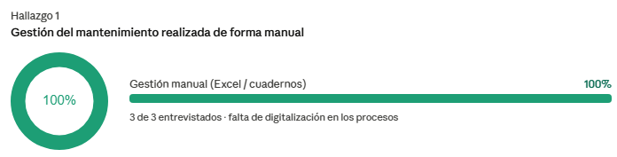

El 100% de los entrevistados gestiona el mantenimiento con Excel, libretas o cuadernillas. Ninguno cuenta con un sistema digital especializado. La coordinación depende del seguimiento personal del equipo técnico, lo que genera desorden y falta de trazabilidad.

**Fallas en máquinas con alto impacto en producción y costos**

  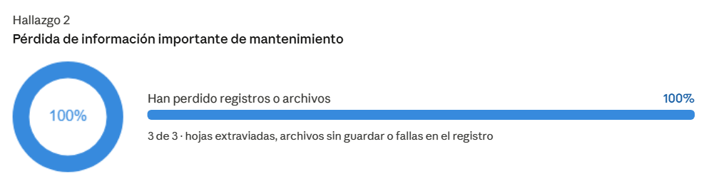

El 100% reportó que las fallas inesperadas detienen la producción, desorganizan la planificación y generan presión sobre el equipo. Esto se traduce en retrasos en pedidos, horas extra, costos adicionales de reparación y riesgo de incumplimiento con clientes.

**Interés en implementar un software de gestión de mantenimiento**

  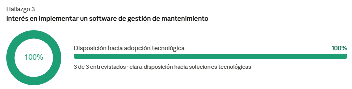

El 100% ha considerado adoptar un software. Las razones principales son: necesidad de mayor orden, prevención de fallas, reducción de errores humanos y mejora en la toma de decisiones basada en datos. La principal barrera es encontrar una solución simple que no genere carga adicional al equipo.

**Factores clave en la decisión de compra**

  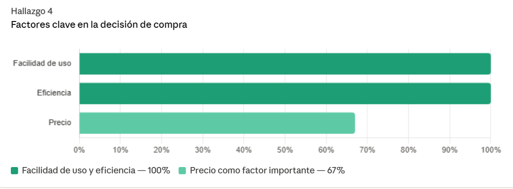

El 100% pone la facilidad de uso y la eficiencia como prioridad absoluta. Si el sistema es complicado, el equipo no lo adoptará. El 67% también considera el precio, pero lo evalúa en función del valor que aporta — si genera resultados, pasa a segundo plano.

**Funcionalidades esenciales que debe tener la solución**

  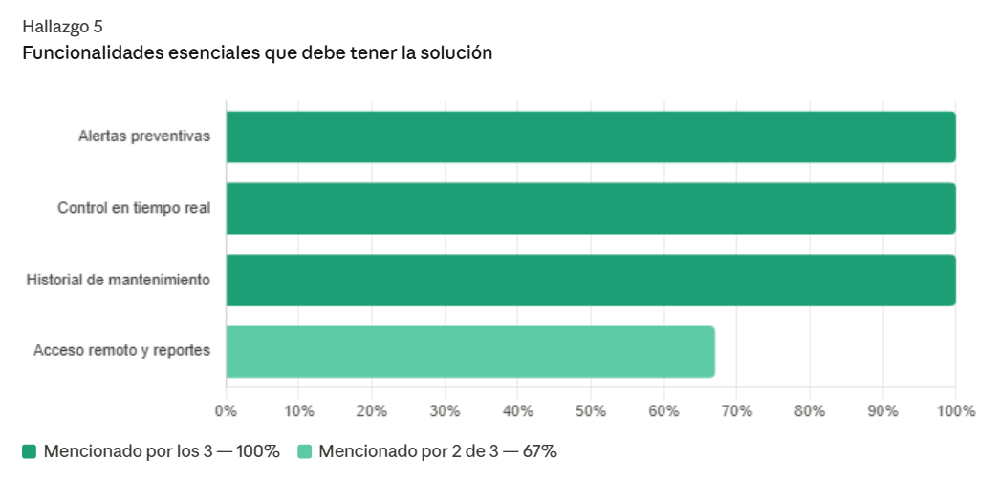

El 100% exige alertas preventivas, control en tiempo real e historial de mantenimiento por máquina.
El 67% añade acceso remoto y generación de reportes. 
La facilidad de uso es transversal a todos: si no es intuitivo, no se usa.

---

## Conclusiones:

Los decisores del sector textil gestionan el mantenimiento de forma completamente manual, sin herramientas digitales especializadas, lo que genera fallas recurrentes que impactan directamente la producción, los costos y la relación con los clientes. 
El 100% ya ha considerado implementar un software, pero la clave está en que sea simple y genere valor desde el primer uso.
Esto valida la propuesta que da una solución con alertas preventivas, historial de mantenimiento y control en tiempo real, diseñada para resolver el problema exacto que este segmento enfrenta hoy.

--- 

### Segmento 2: Jefes de Mantenimiento y Técnicos (Usuarios)

1. El 100% registra el mantenimiento de forma manual usando Excel, cuadernos o papel, sin un sistema centralizado, lo que genera información dispersa y desactualizada.
2. El 100% ha perdido información importante de mantenimiento en algún momento, ya sea por archivos mal guardados, hojas extraviadas o fallas en el registro.
3. El 100% señala que coordinar tareas es difícil porque dependen de comunicación verbal o WhatsApp, sin una herramienta formal que organice y asigne trabajos.
4. El 100% detecta fallas de forma reactiva, es decir, solo actúan cuando la máquina ya presenta el problema, debido a la falta de alertas y monitoreo preventivo.
5. El 100% considera que recibir alertas automáticas sería muy útil para anticiparse a fallas y pasar de un mantenimiento correctivo a uno preventivo.
6. El 100% coincide en las funcionalidades que desearían: alertas automáticas, historial de mantenimiento por máquina y asignación de tareas. El 67% también añade reportes y acceso desde celular o tablet.
7. El 100% adoptaría la herramienta si es fácil de usar, rápida y les ahorra tiempo, considerando que parte del equipo técnico tiene poca experiencia con software.

**Registro manual del mantenimiento sin sistema centralizado**

  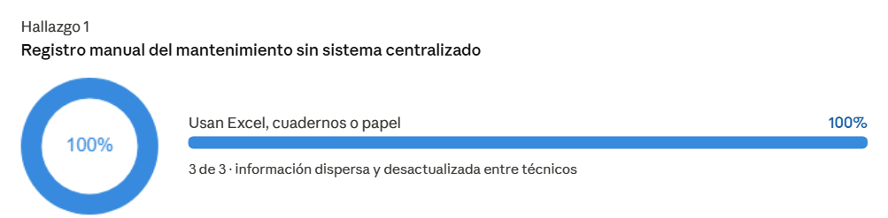

Los 3 jefes de mantenimiento usan Excel, cuadernos o papel para registrar el mantenimiento. 
Cada técnico lleva su propio registro por separado, lo que genera información dispersa, desactualizada y difícil de consultar.

**Pérdida de información importante de mantenimiento**

  

Los 3 han perdido registros en algún momento: archivos mal guardados, hojas extraviadas o fallas en el sistema.
Esto les hace perder el historial de las máquinas y en algunos casos afecta directamente la operación.

**Coordinación de tareas difícil por falta de herramienta formal**

  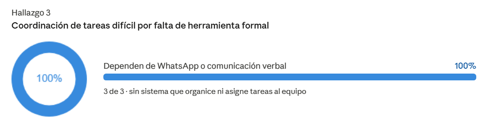

Los 3 coordinan por WhatsApp o de forma verbal. 
No existe ninguna plataforma donde se puedan ver las tareas asignadas, su estado o quién las atiende, lo que genera confusión especialmente en cambios de turno o urgencias.

**Detección de fallas reactiva por falta de monitoreo preventivo**

  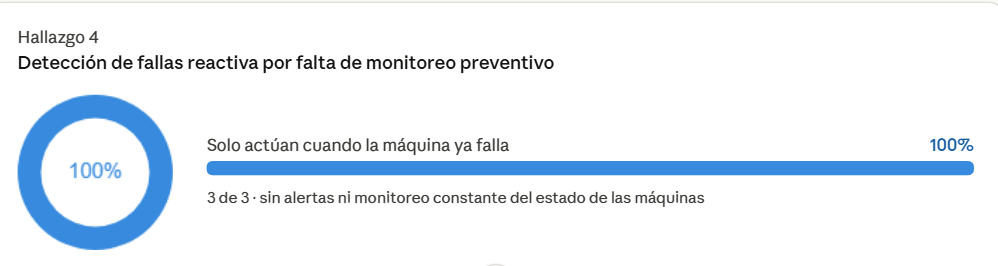

Los 3 actúan de forma reactiva: no hay monitoreo constante ni alertas, por lo que solo se enteran de un problema cuando la máquina ya falló. 
No existe un proceso de prevención establecido.

**Las alertas automáticas serían muy útiles para prevenir fallas**

  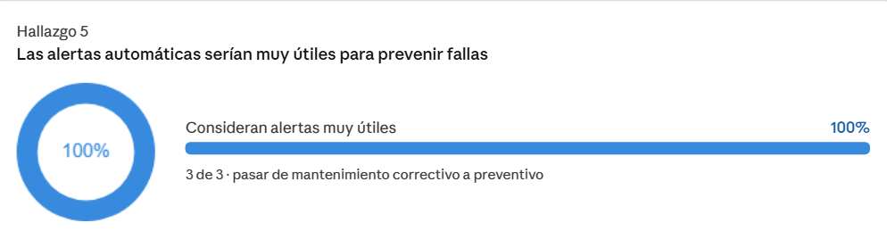

Los 3 coinciden en que recibir alertas les permitiría anticiparse a las fallas y planificar mejor, pasando de un mantenimiento correctivo a uno preventivo. 
Lo consideran la mejora más importante que podría tener una herramienta.

**Funcionalidades deseadas en una herramienta digital**

  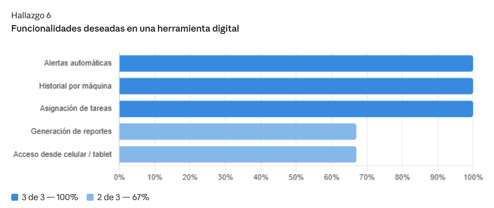

Los 3 piden alertas automáticas, historial por máquina y asignación de tareas. 
El 67% (2 de 3) además quiere reportes y acceso desde celular o tablet. 
Todo apunta a una herramienta que organice, registre y notifique en un solo lugar.

**Condiciones para adoptar la herramienta en el día a día**

  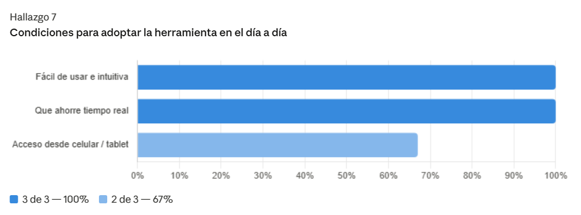

Los 3 adoptarían la herramienta si es fácil de usar y les ahorra tiempo real. 
El 67% también pide acceso desde el celular. 
El punto crítico es que parte del equipo técnico tiene poca experiencia con software, por lo que la simplicidad no es opcional.

---

## Conclusiones
La gestión del mantenimiento se realiza de forma manual y descentralizada, lo que genera pérdida de información, dificultades en la coordinación y un enfoque reactivo ante fallas. 
Existe una alta necesidad de una herramienta digital que centralice la información, incorpore alertas preventivas y facilite la gestión de tareas. Para su adopción, será clave que sea simple, intuitiva y accesible desde dispositivos móviles.

## 2.3. Needfinding.
### 2.3.1. User Personas.
### 2.3.2. User Task Matrix.
### 2.3.3. User Journey Mapping.
### 2.3.4. Empathy Mapping.
## 2.4. Big Picture Event Storming.
## 2.5. Ubiquitous Language.
