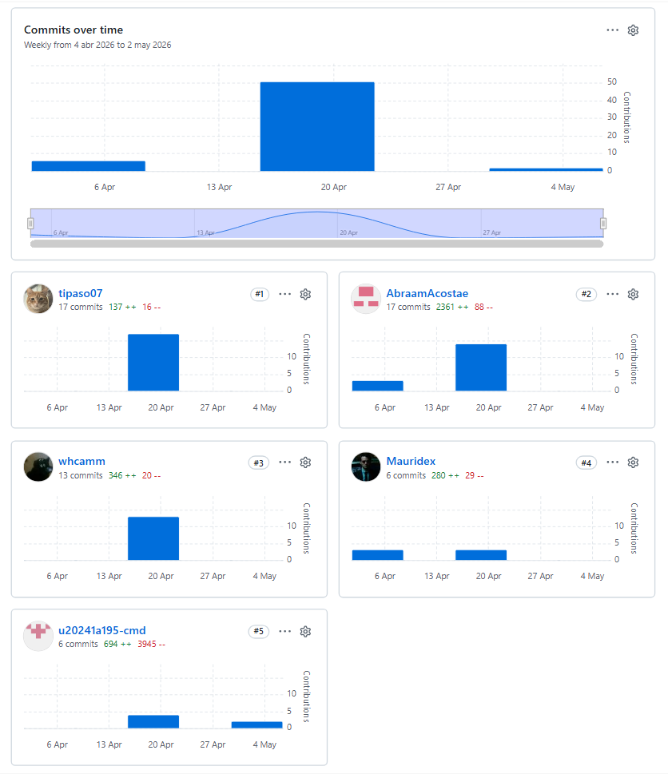
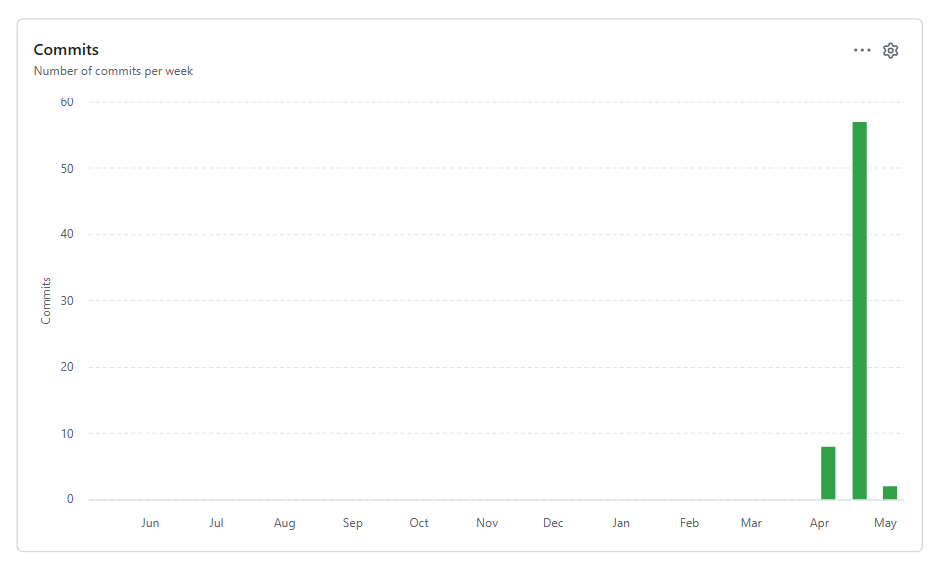

# Universidad Peruana de Ciencias Aplicadas

## Ingeniería de Software

**Ciclo:** 2026 - 01  
**Curso:** Desarrollo de Aplicaciones Open Source  
**NRC:** 20262  
**Docente:** Angel Augusto Velasquez Nuñez 

**Startup:** CodeUp  
**Producto:** TexCheck

| Código     | Nombre                           |
|------------|----------------------------------|
| U20241a195 | Diaz Yurivilca, Sofia          |
| U202219199 | Acosta Elera Abraam Bernabe        |
| U202411349 | Diaz Nuñez, Mauricio             |
| U202410421 | Diaz De La Cruz, Sebastian Gabriel |
| U202412462 | Cabrera Sotelo, Camila Celeste     |

**Abril - 2026**

  

---
# Registro de Versiones del Informe

| Versión  | Fecha          | Autor                 | Descripción de modificación |
| :------: | :------------: | :-------------------: | :-------------------------: |
| AV1      | 02 / 04 / 2026 | Todos los integrantes | Primera versión             |

# Project Report Collaboration Insights

A continuación se presentaran los commit realizados por los contribuidores:

- ⏩ Avance del **AV1**

- ⏩ Avance del **TB1**

---

## **Project Report Online**

- [ Capítulo I: Introducción](#-capítulo-i-introducción)
    - [1.1. Startup Profile](#11-startup-profile)
        - [1.1.1. Descripción de la Startup](#111-descripción-de-la-startup)
        - [1.1.2. Perfiles de integrantes del equipo](#112-perfiles-de-integrantes-del-equipo)
    - [1.2. Solution Profile](#12-solution-profile)
        - [1.2.1 Antecedentes y problemática](#121-antecedentes-y-problemática)
        - [1.2.2 Lean UX Process](#122-lean-ux-process)
            - [1.2.2.1. Lean UX Problem Statements](#1221-lean-ux-problem-statements)
            - [1.2.2.2. Lean UX Assumptions](#1222-lean-ux-assumptions)
            - [1.2.2.3. Lean UX Hypothesis Statements](#1223-lean-ux-hypothesis-statements)
            - [1.2.2.4. Lean UX Canvas](#1224-lean-ux-canvas)
    - [1.3. Segmentos objetivo](#13-segmentos-objetivo)
- [Capítulo II: Requirements Elicitation & Analysis](#-capítulo-ii-requirements-elicitation--analysis)
    - [2.1. Competidores](#21-competidores)
        - [2.1.1. Análisis competitivo](#211-análisis-competitivo)
        - [2.1.2. Estrategias y tácticas frente a competidores](#212-estrategias-y-tácticas-frente-a-competidores)
    - [2.2. Entrevistas](#22-entrevistas)
        - [2.2.1. Diseño de entrevistas](#221-diseño-de-entrevistas)
        - [2.2.2. Registro de entrevistas](#222-registro-de-entrevistas)
        - [2.2.3. Análisis de entrevistas](#223-análisis-de-entrevistas)
    - [2.3. Needfinding](#23-needfinding)
        - [2.3.1. User Personas](#231-user-personas)
        - [2.3.2. User Task Matrix](#232-user-task-matrix)
        - [2.3.3. User Journey Mapping](#233-user-journey-mapping)
        - [2.3.4. Empathy Mapping](#234-empathy-mapping)
    - [2.4. Big Picture EventStorming](#24-big-picture-eventstorming)
    - [2.5. Ubiquitous Language](#25-ubiquitous-language)
- [Capítulo III: Requirements Specification](#-capítulo-iii-requirements-specification)
    - [3.1. User Stories](#31-user-stories)
    - [3.2. Impact Mapping](#32-impact-mapping)
    - [3.3. Product Backlog](#33-product-backlog)
- [ Capítulo IV: Product Design](#-capítulo-iv-product-design)
    - [4.1. Style Guidelines](#41-style-guidelines)
    - [4.2. Information Architecture](#42-information-architecture)
    - [4.3. Landing Page UI Design](#43-landing-page-ui-design)
    - [4.4. Web Applications UX/UI Design](#44-web-applications-uxui-design)
    - [4.5. Web Applications Prototyping](#45-web-applications-prototyping)
    - [4.6. Domain-Driven Software Architecture](#46-domain-driven-software-architecture)
    - [4.7. Software Object-Oriented Design](#47-software-object-oriented-design)
    - [4.8. Database Design](#48-database-design)
- [🛠 Capítulo V: Product Implementation, Validation & Deployment](#-capítulo-v-product-implementation-validation--deployment)
    - [5.1. Software Configuration Management](#51-software-configuration-management)
    - [5.2. Landing Page, Services & Applications Implementation](#52-landing-page-services--applications-implementation)
        - [5.2.1. Sprint 1](#521-sprint-1)
            - [5.2.1.1. Sprint Planning 1](#5211-sprint-planning-1)
            - [5.2.1.2. Aspect Leaders and Collaborators](#5212-aspect-leaders-and-collaborators)
            - [5.2.1.3. Sprint Backlog 1](#5213-sprint-backlog-1)
            - [5.2.1.4. Development Evidence for Sprint Review](#5214-development-evidence-for-sprint-review)
            - [5.2.1.5. Execution Evidence for Sprint Review](#5215-execution-evidence-for-sprint-review)
            - [5.2.1.6. Services Documentation Evidence for Sprint Review](#5216-services-documentation-evidence-for-sprint-review)
            - [5.2.1.7. Software Deployment Evidence for Sprint Review](#5217-software-deployment-evidence-for-sprint-review)
            - [5.2.1.8. Team Collaboration Insights during Sprint](#5218-team-collaboration-insights-during-sprint)
    - [5.3. Validation Interviews](#53-validation-interviews)
    - [5.4. Video About-the-Product](#54-video-about-the-product)
- [ Conclusiones](#-conclusiones)
- [ Bibliografía](#-bibliografía)
- [ Anexos](#-anexos)

--- 
# Student Outcome

En esta sección se detallan las actividades realizadas en el trabajo final y el sustento de cómo estas han ayudado a desarrollar las dimensiones del Student Outcome 3 (ABET – EAC), el cual se define como la capacidad de comunicarse efectivamente con un rango de audiencias. La información se presenta a través del siguiente cuadro, donde se especifican las dimensiones de la competencia, las acciones realizadas por cada integrante y las conclusiones generales del equipo.

<table>
  <thead>
    <tr>
      <th>Criterio específico</th>
      <th>Acciones realizadas</th>
      <th>Conclusiones</th>
    </tr>
  </thead>
  <tbody>
    <tr>
      <td>Comunica oralmente con efectividad a diferentes rangos de audiencia.</td>
      <td>
        <strong>Sofia Diaz Yurivilca AV1:</strong> Participó en la explicación oral del proceso de investigación y planificación del proyecto TexCheck. Presentó el desarrollo de la sección <strong>2.2. Entrevistas</strong>, explicando el diseño de entrevistas, el registro de información y el análisis de los hallazgos obtenidos en los segmentos objetivo. Asimismo, explicó la elaboración del <strong>2.4. Big Picture Event Storming</strong> y del <strong>2.5. Ubiquitous Language</strong>, relacionando estos artefactos con el contexto actual del negocio y el lenguaje propio del dominio de mantenimiento textil. También comunicó los avances del <strong>Capítulo III: Requirements Specification</strong> y del <strong>Capítulo V: Product Implementation, Validation & Deployment</strong>, específicamente en las secciones <strong>5.1. Software Configuration Management</strong> y <strong>5.2.1. Sprint 1</strong>, incluyendo <strong>5.2.1.1. Sprint Planning 1</strong>, <strong>5.2.1.2. Aspect Leaders and Collaborators</strong> y <strong>5.2.1.3. Sprint Backlog 1</strong>.  
        <strong>Sebastian Diaz AV1:</strong> Participó en la explicación del proceso de investigación y diseño del proyecto TexCheck, presentando los resultados de las entrevistas, el análisis de usuarios y los artefactos de diseño como User Personas, User Journey Maps y Empathy Maps. Durante la presentación explicó el problema identificado en la industria textil y cómo la solución propuesta busca mejorar la gestión del mantenimiento.  
        <strong>Camila Cabrera AV1:</strong> Participó en la presentación de la propuesta de solución y del diseño de la interfaz del sistema. Explicó los wireframes y mockups de la landing page, describiendo la estructura del sitio, la jerarquía visual y las funcionalidades principales del sistema TexCheck.
      </td>
      <td>
        <strong>Sofia Diaz Yurivilca AV1:</strong> La exposición permitió comunicar de manera clara el proceso de levantamiento de información, la identificación de necesidades de los usuarios y la relación entre los hallazgos de entrevistas y los artefactos de análisis del proyecto. Asimismo, la explicación de los capítulos de requisitos y planificación del Sprint contribuyó a mostrar cómo el equipo organizó el alcance inicial de TexCheck y cómo se estructuró el trabajo para la primera iteración del proyecto.  
        <strong>Sebastian Diaz AV1:</strong> La exposición permitió comunicar de manera clara el proceso de investigación con usuarios y el análisis realizado para comprender las necesidades del sector textil, facilitando que la audiencia entienda el problema y la importancia de la solución propuesta.  
        <strong>Camila Cabrera AV1:</strong> La explicación de los wireframes y mockups permitió mostrar de forma visual cómo se tradujeron los hallazgos de la investigación en una propuesta de interfaz clara y funcional, facilitando la comprensión del diseño del sistema.
      </td>
    </tr>
    <tr>
      <td>Comunica por escrito con efectividad a diferentes rangos de audiencia.</td>
      <td>
        <strong>Sofia Diaz Yurivilca AV1:</strong> Participó en la redacción y organización de la sección <strong>2.2. Entrevistas</strong>, incluyendo el diseño de preguntas, el registro de entrevistas y el análisis de resultados obtenidos de los segmentos objetivo. Asimismo, colaboró en la elaboración de la sección <strong>2.4. Big Picture Event Storming</strong> y <strong>2.5. Ubiquitous Language</strong>, documentando los eventos del negocio actual y los términos relevantes del dominio. También participó en la elaboración del <strong>Capítulo III: Requirements Specification</strong>, así como en el <strong>Capítulo V: Product Implementation, Validation & Deployment</strong>, específicamente en <strong>5.1. Software Configuration Management</strong> y en el desarrollo del <strong>5.2.1. Sprint 1</strong>, que comprende las secciones <strong>5.2.1.1. Sprint Planning 1</strong>, <strong>5.2.1.2. Aspect Leaders and Collaborators</strong> y <strong>5.2.1.3. Sprint Backlog 1</strong>.  
        <strong>Sebastian Diaz AV1:</strong> Contribuyó en la elaboración de la documentación del proyecto, específicamente en las secciones relacionadas con la investigación de usuarios, entrevistas, análisis de resultados y desarrollo de artefactos de diseño como User Personas, User Task Matrix y Empathy Maps.  
        <strong>Camila Cabrera AV1:</strong> Participó en la redacción de las secciones relacionadas con el diseño de la interfaz, incluyendo Style Guidelines, Information Architecture, Wireframes y Mockups de la landing page, asegurando que la información se presente de manera clara y estructurada.
      </td>
      <td>
        <strong>Sofia Diaz Yurivilca AV1:</strong> La documentación escrita permitió organizar de manera clara los hallazgos obtenidos en las entrevistas, sustentar la definición de necesidades del proyecto y relacionar los artefactos de análisis con el dominio de mantenimiento textil. Además, la redacción de los capítulos de requisitos y planificación permitió presentar de forma ordenada el alcance inicial del producto, las historias de usuario, el Product Backlog y la organización del Sprint 1, facilitando la comprensión del proceso de desarrollo de TexCheck.  
        <strong>Sebastian Diaz AV1:</strong> La documentación escrita permitió estructurar de forma clara los hallazgos obtenidos en la investigación con usuarios, facilitando la comprensión del problema y justificando el desarrollo de la solución TexCheck.  
        <strong>Camila Cabrera AV1:</strong> La redacción de las secciones de diseño permitió explicar de manera organizada las decisiones de interfaz y arquitectura de información, contribuyendo a que el documento final sea claro, coherente y fácil de comprender.
      </td>
    </tr>
  </tbody>
</table>

---

# Capítulo I: Introducción

## 1.1. Startup Profile

TexCheck es una startup tecnológica orientada a la digitalización de la gestión del mantenimiento industrial dentro del sector manufacturero textil. Su propósito es ofrecer una plataforma digital integral, disponible en entornos Web y Mobile, diseñada para optimizar la operatividad de las empresas textiles mediante un control técnico más organizado, centralizado y eficiente de sus activos industriales.

La iniciativa surge a partir de la identificación de un problema recurrente dentro de las plantas de producción textiles: la ocurrencia de fallas inesperadas en maquinaria crítica, la dependencia de registros manuales y la falta de trazabilidad en el historial de mantenimiento. Estas situaciones generan interrupciones en la producción, incremento de costos operativos y dificultades para realizar mantenimiento preventivo de forma adecuada.

Frente a esta problemática, TexCheck propone una solución digital que permita centralizar la información técnica de los activos, automatizar la programación de mantenimientos preventivos, registrar intervenciones técnicas y facilitar la toma de decisiones basada en información histórica y métricas operativas.

Asimismo, la plataforma busca adaptarse a las necesidades de pequeñas y medianas empresas textiles, ofreciendo una solución accesible, intuitiva y orientada a mejorar la continuidad operativa y la eficiencia de los procesos de mantenimiento industrial.

#### Misión, Visión y Valores de TexCheck

| Concepto | Definición |
| :--- | :--- |
| **Misión** | Optimizar la gestión del mantenimiento industrial mediante una solución digital ágil, accesible y eficiente, que permita a las empresas textiles maximizar la disponibilidad de sus activos, reducir costos operativos y mejorar la organización de sus procesos técnicos mediante mantenimiento preventivo y monitoreo centralizado. |
| **Visión** | Posicionarse como una plataforma referente en gestión de mantenimiento preventivo para la industria textil peruana, impulsando la digitalización de procesos industriales y promoviendo una toma de decisiones basada en datos para mejorar la continuidad operativa y la eficiencia productiva. |
| **Valores** | **Innovación:** promover soluciones digitales orientadas a mejorar los procesos industriales.  **Compromiso:** brindar una plataforma confiable enfocada en las necesidades reales de las empresas textiles.  **Eficiencia:** optimizar los procesos de mantenimiento para reducir tiempos muertos y costos operativos.  **Accesibilidad:** desarrollar herramientas intuitivas y fáciles de usar para distintos perfiles de usuarios.  **Mejora continua:** fomentar la actualización constante de procesos y tecnologías para garantizar un servicio de calidad. |

### 1.1.1. Descripción de la Startup

|                     Foto                     | Nombres y Apellidos | Código | Carrera                | Conocimientos y Habilidades                                                                                                                                                                                                                                                                                                                                                                                         |
|:--------------------------------------------:| :--- | :---: |:-----------------------|:--------------------------------------------------------------------------------------------------------------------------------------------------------------------------------------------------------------------------------------------------------------------------------------------------------------------------------------------------------------------------------------------------------------------|
|  | Diaz Yurivilca, Sofia | u20241a195 | Ingenieria de Software | Trabajo en equipo, comunicación efectiva, organización y planificación de tareas, responsabilidad en la elaboración de documentación académica, análisis de requerimientos, redacción de informes técnicos, manejo básico de herramientas de diseño UX/UI, conocimientos en programación orientada a objetos con C++, desarrollo de interfaces en consola y Windows Forms, colaboración en proyectos de software.   |
|                                              | Acosta Elera Abraam Bernabe | U202219199 |                        | Resolución de problemas, análisis de información, colaboración en proyectos                                                                                                                                                                                                                                                                                                                                         |
|                                              | Diaz Nuñez, Mauricio | U202411349 |                        | Pensamiento analítico, investigación, gestión de información                                                                                                                                                                                                                                                                                                                                                        |
|  | Diaz De La Cruz, Sebastian Gabriel | U202410421 | Ingeniería de Software | Programación, desarrollo web, diseño de interfaces, lógica de programación, trabajo en equipo                                                                                                                                                                                                                                                                                                                       |
|    | Cabrera Sotelo, Camila Celeste | U202412462 | Ingeniería de Software | Desarrollo de software, diseño UI/UX, análisis de requerimientos, trabajo colaborativo, pensamiento lógico                                                                                                                                                                                                                                                                                                          |

## 1.2 Solution Profile

## 1.2.1. Antecedentes y problemática

La industria textil y de confecciones representa uno de los sectores manufactureros más importantes del Perú debido a su impacto económico y generación de empleo. Según el Ministerio de la Producción (PRODUCE, 2025), este sector aportó aproximadamente el 7.3% del PBI manufacturero y el 0.9% del PBI nacional durante el año 2024. Asimismo, la Sociedad Nacional de Industrias señala que la industria textil peruana genera alrededor de 400 mil empleos directos cada año, siendo las pequeñas y medianas empresas una parte importante de la actividad productiva del sector (SNI, 2021).

A pesar de su relevancia económica, muchas empresas textiles continúan gestionando sus procesos de mantenimiento industrial mediante métodos tradicionales y poco digitalizados. Durante las entrevistas realizadas para el proyecto TexCheck, los participantes indicaron que utilizan principalmente hojas de cálculo, registros físicos y aplicaciones de mensajería como WhatsApp para coordinar actividades técnicas, registrar mantenimientos y supervisar el estado de las máquinas. Esta situación genera pérdida de información, dificultades para realizar seguimiento de reparaciones y una limitada capacidad para detectar fallas antes de que afecten la continuidad operativa de la producción.

Asimismo, las fallas inesperadas representan pérdidas económicas importantes para las empresas textiles debido a interrupciones de producción, retrasos en pedidos y aumento de costos de reparación. Deloitte (2021) señala que el downtime no planificado continúa siendo una de las principales causas de pérdida económica en entornos manufactureros e industriales. Sin embargo, muchas pequeñas y medianas empresas aún no cuentan con herramientas digitales especializadas debido a barreras económicas, limitaciones tecnológicas y complejidad de implementación de las soluciones existentes en el mercado.

Con el propósito de comprender esta problemática en profundidad, se aplicó la técnica de las 5W’s y 2H’s:

### What (Qué)

#### ¿Cuál es el problema?

El problema central es la ausencia de una plataforma digital accesible y especializada que permita a las empresas textiles registrar, monitorear y gestionar correctamente las actividades de mantenimiento industrial. Actualmente, gran parte de la información relacionada con reparaciones, mantenimientos y seguimiento técnico se encuentra dispersa entre registros físicos, hojas de cálculo y comunicación informal. Esto genera pérdida de información, retrasos en la coordinación de tareas, baja trazabilidad de las intervenciones y dificultades para realizar mantenimiento preventivo de manera oportuna.

#### ¿Cuál es la relación con la persona en cuestión?

Los Líderes operativos necesitan supervisar constantemente la continuidad de la producción, identificar riesgos en la maquinaria y reducir pérdidas ocasionadas por fallas inesperadas. Sin embargo, muchas veces deben tomar decisiones sin contar con información centralizada, indicadores claros o reportes actualizados sobre el estado de los activos industriales.

Por otro lado, el Personal de mantenimiento necesita registrar reparaciones, coordinar tareas técnicas, ejecutar mantenimientos preventivos y correctivos, y acceder rápidamente al historial de las máquinas. Sin embargo, el uso de herramientas manuales limita la organización de las actividades, dificulta el seguimiento de intervenciones y aumenta el riesgo de pérdida de información técnica.

### When (Cuándo)

#### ¿Cuándo sucede el problema?

El problema ocurre de forma continua durante las operaciones diarias de producción y mantenimiento industrial. Las dificultades se presentan cuando se registran mantenimientos manualmente, cuando se coordinan reparaciones mediante mensajes informales o cuando se necesita consultar información técnica almacenada en diferentes medios físicos y digitales.

Asimismo, la problemática se intensifica durante periodos de alta demanda productiva, donde cualquier interrupción de maquinaria afecta directamente el cumplimiento de pedidos, la continuidad operativa y la capacidad de respuesta de la empresa textil.

### Where (Dónde)

#### ¿Dónde está el cliente cuando usa el producto?

Los usuarios se encuentran principalmente dentro de plantas textiles, áreas operativas, zonas de producción y espacios de mantenimiento industrial. En estos entornos supervisan maquinaria, realizan inspecciones técnicas, coordinan actividades de mantenimiento y revisan el estado de los activos que intervienen en la producción.

#### ¿A dónde se dirige?

Las empresas textiles buscan optimizar la continuidad operativa, reducir fallas inesperadas y mejorar la organización del mantenimiento industrial mediante herramientas digitales que permitan centralizar información, facilitar la coordinación técnica y apoyar la toma de decisiones basada en datos.

#### ¿Dónde surge el problema?

El problema surge principalmente dentro de las áreas operativas de mantenimiento y producción, especialmente durante el registro de mantenimientos, la coordinación entre áreas, el seguimiento de reparaciones, la atención de fallas y la supervisión del estado de las máquinas. Según PRODUCE (2023), las pequeñas y medianas empresas representan una gran parte de las unidades manufactureras del país, siendo muchas de ellas organizaciones que aún presentan limitaciones en la adopción de herramientas digitales para gestionar procesos internos.

### Who (Quién)

#### ¿Quiénes están involucrados?

Los principales involucrados pertenecen a dos segmentos identificados durante las entrevistas realizadas. El primer segmento corresponde a los Líderes operativos, responsables de supervisar la continuidad productiva, controlar riesgos operativos y tomar decisiones relacionadas con el estado de la maquinaria. El segundo segmento corresponde al Personal de mantenimiento, encargado de ejecutar, coordinar y registrar actividades de mantenimiento preventivo y correctivo dentro de la planta textil.

#### ¿A quiénes les sucede el problema?

El problema afecta principalmente a pequeñas y medianas empresas textiles que aún gestionan el mantenimiento industrial mediante procesos manuales y herramientas poco especializadas. En el caso de los Líderes operativos, la problemática se refleja en la falta de visibilidad sobre el estado real de la maquinaria, la dificultad para anticipar riesgos y las pérdidas ocasionadas por interrupciones de producción.

En el caso del Personal de mantenimiento, el problema se evidencia en la pérdida de información técnica, la duplicación de trabajo, la desorganización de tareas, la detección tardía de fallas y la falta de un historial ordenado de intervenciones realizadas sobre cada activo industrial.

#### ¿Quién lo utilizará?

La solución estará dirigida principalmente a dos segmentos específicos.

El primer segmento corresponde a los Líderes operativos, quienes utilizarán la plataforma para supervisar el estado de la maquinaria, visualizar indicadores operativos, consultar reportes de mantenimiento y mejorar la planificación de acciones preventivas.

El segundo segmento corresponde al Personal de mantenimiento, quienes utilizarán la plataforma para registrar activos, programar mantenimientos, ejecutar tareas técnicas, reportar fallas, registrar soluciones y acceder rápidamente al historial técnico de los activos industriales.

### Why (Por qué)

#### ¿Cuál es la causa del problema?

La principal causa del problema es el bajo nivel de digitalización presente en muchas empresas textiles peruanas, especialmente en procesos relacionados con mantenimiento industrial. Además, muchas organizaciones continúan dependiendo de procesos manuales debido a que las soluciones existentes en el mercado suelen ser costosas, complejas o poco adaptadas a las necesidades de pequeñas y medianas empresas textiles.

Según Movistar Empresas (2023), gran parte de las pymes peruanas reconoce dificultades para adoptar soluciones digitales debido a limitaciones económicas, falta de capacitación tecnológica y resistencia al cambio organizacional. Esta situación refuerza la necesidad de una solución accesible, intuitiva y especializada que permita una transición gradual desde los registros manuales hacia una gestión digital del mantenimiento.

### How (Cómo)

#### ¿Cómo prefieren los usuarios acceder al contenido?

Los usuarios prefieren acceder mediante computadoras y dispositivos móviles que les permitan registrar información rápidamente desde planta y consultar el estado de las máquinas en tiempo real. Asimismo, esperan una plataforma intuitiva, rápida y fácil de usar, debido a que no todos los trabajadores poseen conocimientos avanzados en herramientas tecnológicas.

Para los Líderes operativos, el acceso a paneles, reportes e indicadores resulta importante para la supervisión y toma de decisiones. Para el Personal de mantenimiento, el acceso móvil o desde planta resulta relevante para registrar intervenciones, evidencias, observaciones técnicas y estados de mantenimiento sin depender de registros físicos.

#### ¿Qué llevó a la persona a llegar a esta situación?

La combinación de procesos tradicionales, dependencia de registros manuales, uso de hojas de cálculo, comunicación informal y falta de soluciones digitales accesibles ha provocado que muchas empresas continúen gestionando el mantenimiento de forma reactiva en lugar de preventiva. Además, la presión operativa diaria dificulta la implementación de herramientas complejas dentro de entornos industriales donde se requiere rapidez, claridad y facilidad de uso.

### How much (Cuánto)

#### ¿Cuánto impacta el problema?

Las fallas inesperadas generan pérdidas económicas debido a interrupciones en la producción, incremento de costos de reparación, retrasos operativos, pérdida de tiempo técnico y disminución de la eficiencia operativa. Durante las entrevistas realizadas, los participantes indicaron que las fallas afectan constantemente la continuidad de producción y generan presión adicional sobre los equipos responsables de mantenimiento.

Asimismo, Deloitte (2021) señala que el downtime no planificado representa una de las principales causas de pérdida económica dentro de entornos industriales y manufactureros.

#### ¿Cuántas empresas podrían verse beneficiadas?

Según PRODUCE (2023), las pequeñas y medianas empresas representan una gran parte del sector manufacturero peruano, incluyendo organizaciones textiles que actualmente buscan mejorar sus procesos mediante herramientas digitales más accesibles y especializadas. Asimismo, el Sondeo de Adopción Digital de Movistar Empresas (2024) indica que el 98% de las pymes peruanas considera importante invertir en digitalización para mejorar su productividad y competitividad, evidenciando una oportunidad de crecimiento para soluciones digitales orientadas al sector industrial.

#### ¿Cuánto valor podría aportar una solución digital?

Una solución como TexCheck podría aportar valor al reducir la pérdida de información, mejorar la coordinación entre los Líderes operativos y el Personal de mantenimiento, optimizar la planificación del mantenimiento preventivo y facilitar la trazabilidad de las intervenciones técnicas.

Para los Líderes operativos, el valor principal se encuentra en mejorar la continuidad operativa, visualizar indicadores confiables y reducir pérdidas ocasionadas por downtime.

Para el Personal de mantenimiento, el valor principal se encuentra en acceder rápidamente al historial técnico de las máquinas, registrar información de forma organizada, recibir alertas oportunas y coordinar tareas de mantenimiento de manera más eficiente.

### 1.2.2. Lean UX Process

### 1.2.2.1. Lean UX Problem Statements

La industria textil en Perú enfrenta constantes problemas en la gestión del mantenimiento de maquinaria debido a la dependencia de procesos manuales y herramientas poco especializadas. Muchas empresas continúan utilizando registros físicos, hojas de cálculo y coordinación informal mediante llamadas o aplicaciones de mensajería, lo que dificulta el seguimiento del mantenimiento, la detección temprana de fallas y la conservación del historial técnico de los activos.

Esta situación provoca interrupciones en la producción, retrasos en pedidos, pérdida de información importante y un incremento en los costos operativos. Además, durante periodos de alta demanda, las fallas inesperadas generan presión sobre las áreas responsables de la operación y el mantenimiento, afectando directamente la continuidad productiva de las empresas textiles.

Aunque existen plataformas CMMS en el mercado, muchas de ellas están orientadas a grandes corporaciones, presentan costos elevados o resultan complejas para pequeñas y medianas empresas textiles que buscan soluciones rápidas y fáciles de implementar. Como resultado, muchas organizaciones continúan trabajando con métodos tradicionales que limitan la trazabilidad, la coordinación entre áreas y la toma de decisiones basada en datos.

El desafío no consiste únicamente en digitalizar registros, sino en encontrar una forma eficiente de mejorar la coordinación, el control y la planificación del mantenimiento preventivo dentro de entornos industriales con recursos limitados y distintos niveles de adaptación tecnológica.

TexCheck busca responder a este desafío mediante una plataforma digital accesible e intuitiva, orientada a dos segmentos principales: Líderes operativos y Personal de mantenimiento. Los Líderes operativos requieren visibilidad sobre el estado de la maquinaria, indicadores claros y reportes que les permitan tomar decisiones oportunas. El Personal de mantenimiento necesita registrar activos, ejecutar intervenciones, atender fallas, recibir alertas y consultar el historial técnico de las máquinas de forma rápida y ordenada.

Sabremos que estamos avanzando correctamente cuando las empresas logren reducir fallas inesperadas, mejorar la organización del mantenimiento, disminuir la pérdida de información técnica y reducir el downtime mediante el uso de una plataforma digital accesible, especializada e intuitiva.

#### 1.2.2.2. Lean UX Assumptions

### A. Business Assumptions

1. Creemos que nuestros clientes, principalmente pequeñas y medianas empresas textiles, necesitan reducir las pérdidas ocasionadas por fallas inesperadas, retrasos en producción, pérdida de información técnica y desorganización en la gestión del mantenimiento industrial.
2. Estas necesidades se resuelven con una plataforma digital accesible que centralice el registro de activos industriales, facilite la planificación del mantenimiento preventivo, permita registrar intervenciones técnicas y brinde trazabilidad sobre el historial de cada máquina.
3. Nuestros primeros clientes serán pequeñas y medianas empresas textiles ubicadas en Lima Metropolitana y Callao, debido a la concentración de actividad manufacturera y a la necesidad de mejorar procesos internos de mantenimiento.
4. Valor esperado #1: reducción del downtime y mejora del control del mantenimiento preventivo.
5. Beneficios adicionales: reducción de errores en registros manuales, mejor coordinación entre áreas operativas y personal técnico, acceso rápido al historial de mantenimiento, detección temprana de fallas y mayor trazabilidad de las intervenciones realizadas.
6. Adquisición: referencias del sector industrial, demostraciones prácticas, contacto directo con empresas textiles, networking empresarial y marketing digital B2B.
7. Ingresos: modelo de suscripción SaaS mensual, escalado según la cantidad de usuarios, activos registrados y funcionalidades contratadas.
8. Principal competencia: plataformas CMMS como Fiix, UpKeep e IBM Maximo.
9. Ventaja competitiva: enfoque especializado en empresas textiles, facilidad de uso, rápida implementación, costos accesibles para pymes y adaptación a usuarios con distintos niveles de experiencia tecnológica.
10. Principal riesgo del producto: baja adopción debido a la resistencia al cambio tecnológico y a la costumbre de trabajar con registros físicos, hojas de cálculo o comunicación informal.
11. Mitigación: incorporación guiada, capacitación básica, soporte inicial, interfaz intuitiva y una versión inicial enfocada en beneficios rápidos como registro de activos, alertas y consulta de historial técnico.
12. Otras suposiciones críticas: disponibilidad de dispositivos móviles o computadoras dentro de planta, conectividad suficiente para registrar información, disposición de las empresas a digitalizar sus procesos de mantenimiento y compromiso del personal para mantener actualizados los registros.

### B. User Assumptions

* ¿Quién es el usuario?

Los usuarios principales son los Líderes operativos y el Personal de mantenimiento de pequeñas y medianas empresas textiles. Los Líderes operativos supervisan la continuidad de producción, revisan indicadores y toman decisiones sobre el estado de la maquinaria. El Personal de mantenimiento registra activos, ejecuta mantenimientos, atiende fallas y actualiza el historial técnico de las máquinas.

* ¿Dónde encaja el producto?

TexCheck encaja en las operaciones diarias de producción y mantenimiento industrial dentro de plantas textiles. La plataforma se utiliza durante la supervisión del estado de la maquinaria, la planificación de mantenimientos preventivos, la ejecución de intervenciones técnicas, la atención de fallas y la consulta de reportes e indicadores.

* Problema a resolver: fallas inesperadas en maquinaria crítica, pérdida de información técnica, baja trazabilidad de intervenciones, mantenimiento reactivo, registros manuales dispersos y dificultad para coordinar tareas entre las áreas operativas y el personal técnico.

* Uso típico: registrar activos industriales, consultar fichas técnicas, programar mantenimientos preventivos, asignar responsables, registrar observaciones técnicas, reportar fallas, recibir alertas, consultar historial de máquinas y generar reportes de mantenimiento.

* Funcionalidades importantes: registro digital de activos, ficha técnica por máquina, planificación de mantenimiento preventivo, checklists de mantenimiento, alertas automáticas, gestión de fallas, historial técnico, reportes de mantenimiento y dashboard de indicadores.

* Aspecto y sensación: interfaz clara, simple y responsiva; uso de paneles con indicadores clave, alertas visuales para fallas o mantenimientos vencidos, navegación ordenada por módulos y diseño accesible desde computadoras y dispositivos móviles.

### C. User Outcome & Benefit Assumptions

* El Personal de mantenimiento podrá registrar información técnica de forma más rápida, ordenada y confiable.

* Los Líderes operativos tendrán mayor visibilidad sobre el estado de la maquinaria, las fallas activas y los mantenimientos pendientes.

* Las empresas textiles podrán reducir tiempos muertos ocasionados por fallas inesperadas.

* La coordinación entre Líderes operativos y Personal de mantenimiento mejorará mediante información centralizada y actualizada.

* El historial técnico permitirá consultar intervenciones anteriores, identificar fallas recurrentes y evitar pérdida de información importante.

* Las alertas automáticas permitirán anticiparse a mantenimientos próximos, vencidos o fallas críticas.

* La toma de decisiones será más eficiente gracias al acceso a reportes, indicadores y datos consolidados sobre el mantenimiento industrial.

### D. Business Outcome Assumptions

* Reducir el downtime generado por fallas inesperadas en un 15% durante los primeros 6 meses de uso piloto.

* Reducir los errores y la pérdida de información en registros manuales en un 40% durante los primeros 3 meses.

* Incrementar el cumplimiento del mantenimiento preventivo en un 30% durante los primeros 3 meses de uso.

* Lograr la adopción de TexCheck en al menos 20 empresas textiles durante el primer año.

* Conseguir que el 70% de los usuarios registrados utilicen activamente la plataforma cada semana.

* Lograr que al menos el 80% de las intervenciones de mantenimiento realizadas durante el piloto queden registradas correctamente en el historial técnico del activo.

### E. Feature Assumptions

* El registro digital de activos permitirá centralizar la información técnica de cada máquina y reducirá la dependencia de registros físicos o archivos dispersos.

* La ficha técnica por activo facilitará la consulta de datos importantes antes de realizar una intervención de mantenimiento.

* La planificación de mantenimiento preventivo permitirá organizar intervenciones antes de que ocurran fallas críticas.

* Los checklists de mantenimiento ayudarán a estandarizar las actividades técnicas y reducir omisiones durante la ejecución.

* Las alertas automáticas ayudarán a detectar mantenimientos próximos, vencidos o fallas críticas antes de que afecten gravemente la producción.

* La gestión de fallas permitirá clasificar incidentes por criticidad, generar órdenes correctivas y registrar soluciones técnicas.

* El historial técnico digital reducirá la pérdida de información y permitirá hacer seguimiento a reparaciones, fallas recurrentes e intervenciones anteriores.

* Los reportes y dashboards permitirán a los Líderes operativos tomar decisiones basadas en datos sobre el estado de la maquinaria y el cumplimiento del mantenimiento.

* El acceso desde dispositivos móviles permitirá al Personal de mantenimiento registrar información directamente desde planta.

* Una interfaz simple e intuitiva facilitará la adopción de TexCheck por usuarios con distintos niveles de experiencia tecnológica.

#### 1.2.2.3. Lean UX Hypothesis Statements

Las hipótesis de TexCheck se formulan a partir de los business outcomes, los segmentos objetivo, los beneficios esperados para el usuario y las posibles soluciones definidas en el Lean UX Canvas. Para esta sección, se utiliza la estructura propuesta por Lean UX:

Creemos que lograremos [resultado de negocio] si [persona/segmento] obtiene [beneficio o resultado del usuario] con [funcionalidad o solución].

#### Hypothesis Statement 01: Registro digital de activos

Creemos que lograremos reducir los errores y la pérdida de información técnica en un 40% durante los primeros 3 meses si el Personal de mantenimiento obtiene una forma rápida y ordenada de registrar, actualizar y consultar la información de las máquinas con el registro digital de activos y fichas técnicas de TexCheck.

#### Hypothesis Statement 02: Historial técnico de mantenimiento

Creemos que lograremos que al menos el 80% de las intervenciones de mantenimiento realizadas durante el piloto queden registradas correctamente en el historial técnico del activo si el Personal de mantenimiento obtiene acceso centralizado a reparaciones, fallas e intervenciones anteriores con el historial técnico digital de TexCheck.

#### Hypothesis Statement 03: Planificación de mantenimiento preventivo

Creemos que lograremos incrementar el cumplimiento del mantenimiento preventivo en un 30% durante los primeros 3 meses si el Personal de mantenimiento obtiene una forma organizada de programar, reprogramar y ejecutar mantenimientos con el módulo de planificación preventiva, checklists y asignación de responsables de TexCheck.

#### Hypothesis Statement 04: Alertas automáticas de mantenimiento y fallas

Creemos que lograremos reducir el downtime generado por fallas inesperadas en un 15% durante los primeros 6 meses si los Líderes operativos y el Personal de mantenimiento obtienen avisos oportunos sobre mantenimientos próximos, mantenimientos vencidos y fallas críticas con el sistema de alertas y notificaciones de TexCheck.

#### Hypothesis Statement 05: Gestión de fallas y mantenimiento correctivo

Creemos que lograremos mejorar la atención de fallas críticas y reducir la desorganización del mantenimiento correctivo si el Personal de mantenimiento obtiene una forma estructurada de clasificar fallas, generar órdenes correctivas, marcar activos fuera de servicio y registrar soluciones técnicas con el módulo de gestión de fallas de TexCheck.

#### Hypothesis Statement 06: Reportes e indicadores operativos

Creemos que lograremos mejorar la toma de decisiones operativas si los Líderes operativos obtienen información clara y consolidada sobre mantenimientos realizados, fallas activas, activos fuera de servicio y cumplimiento preventivo con los reportes y dashboards de TexCheck.

#### Hypothesis Statement 07: Coordinación entre áreas operativas y mantenimiento

Creemos que lograremos mejorar la coordinación entre Líderes operativos y Personal de mantenimiento si ambos segmentos obtienen información centralizada sobre tareas asignadas, estado de activos, alertas y avances de mantenimiento con una plataforma digital compartida.

#### Hypothesis Statement 08: Acceso desde planta

Creemos que lograremos aumentar la actualización oportuna de registros técnicos si el Personal de mantenimiento obtiene la posibilidad de registrar observaciones, evidencias, tiempos de intervención y cierre de tareas directamente desde planta con una plataforma accesible desde dispositivos móviles y computadoras.

#### Hypothesis Statement 09: Interfaz simple e intuitiva

Creemos que lograremos que el 70% de los usuarios registrados utilicen activamente la plataforma cada semana si los Líderes operativos y el Personal de mantenimiento obtienen una experiencia simple, rápida e intuitiva con una interfaz organizada por módulos, alertas visuales claras y acceso rápido a las funciones principales.

#### Hypothesis Statement 10: Adopción en empresas textiles

Creemos que lograremos la adopción de TexCheck en al menos 20 empresas textiles durante el primer año si los Líderes operativos y el Personal de mantenimiento reconocen que la plataforma ayuda a reducir fallas inesperadas, mejorar la trazabilidad y ordenar la gestión del mantenimiento mediante una solución digital accesible y especializada para el sector textil.

---

#### 1.2.2.4. Lean UX Canvas

<table>
  <tr>
    <td valign="top">
     <strong>1) Problema de negocio</strong>  
     Muchas pequeñas y medianas empresas textiles gestionan el mantenimiento de su maquinaria mediante registros físicos, hojas de cálculo y comunicación informal por mensajes o llamadas. Esta forma de trabajo genera pérdida de información técnica, baja trazabilidad, retrasos en la coordinación de tareas y dificultad para detectar fallas antes de que afecten la producción.  
     En este contexto, TexCheck busca responder a la siguiente pregunta: ¿cómo digitalizar la gestión del mantenimiento industrial en empresas textiles para que los equipos puedan centralizar información, coordinar tareas, anticiparse a fallas y reducir interrupciones operativas sin agregar complejidad al trabajo diario?
   </td>

   <td rowspan="2" valign="top">
     <strong>5) Ideas de soluciones</strong>
     <ul>
       <li>Registro digital de activos para centralizar la información técnica de cada máquina.</li>
       <li>Ficha técnica por activo para documentar características, estado, ubicación y datos relevantes de la maquinaria.</li>
       <li>Historial técnico por activo para consultar reparaciones, intervenciones y fallas anteriores.</li>
       <li>Planificación de mantenimiento preventivo para programar, reprogramar y organizar intervenciones.</li>
       <li>Checklists de mantenimiento para estandarizar las actividades técnicas durante cada intervención.</li>
       <li>Alertas automáticas para informar sobre mantenimientos próximos, vencidos o fallas críticas.</li>
       <li>Asignación y seguimiento de tareas para mejorar la coordinación entre Líderes operativos y Personal de mantenimiento.</li>
       <li>Gestión de fallas para reportar incidentes, clasificarlos por criticidad, generar órdenes correctivas y registrar soluciones.</li>
       <li>Reportes y dashboard de indicadores para visualizar activos, fallas, mantenimientos y cumplimiento preventivo.</li>
       <li>Acceso desde computadoras y dispositivos móviles para registrar información directamente desde planta.</li>
     </ul>
   </td>

   <td valign="top">
     <strong>2) Resultados comerciales</strong>
     <ul>
       <li>Reducir el downtime generado por fallas inesperadas en un 15% durante los primeros 6 meses de uso piloto.</li>
       <li>Reducir los errores y la pérdida de información en registros manuales en un 40% durante los primeros 3 meses.</li>
       <li>Incrementar el cumplimiento del mantenimiento preventivo en un 30% durante los primeros 3 meses de uso.</li>
       <li>Lograr la adopción de TexCheck en al menos 20 empresas textiles durante el primer año.</li>
       <li>Conseguir que el 70% de los usuarios registrados utilicen activamente la plataforma cada semana.</li>
       <li>Lograr que al menos el 80% de las intervenciones de mantenimiento realizadas durante el piloto queden registradas correctamente en el historial técnico del activo.</li>
     </ul>
   </td>
 </tr>

 <tr>
   <td valign="top">
     <strong>3) Usuarios y clientes</strong>  
     Los usuarios y clientes principales pertenecen a dos segmentos identificados durante las entrevistas. El primer segmento está conformado por Líderes operativos, quienes necesitan supervisar la continuidad de la producción, revisar indicadores, identificar riesgos operativos y tomar decisiones relacionadas con el estado de la maquinaria.  
     El segundo segmento está conformado por Personal de mantenimiento, encargado de registrar activos, planificar mantenimientos, ejecutar intervenciones preventivas y correctivas, atender fallas y mantener actualizado el historial técnico de las máquinas.  
     Ambos segmentos requieren información organizada, rápida de consultar y útil para reducir fallas, mejorar la planificación y evitar pérdidas por registros manuales incompletos o dispersos.
   </td>

   <td valign="top">
     <strong>4) Beneficios del usuario</strong>
     <ul>
       <li>Mayor visibilidad del estado de la maquinaria, fallas activas y mantenimientos pendientes.</li>
       <li>Reducción de pérdida de información causada por registros físicos, hojas de cálculo o archivos dispersos.</li>
       <li>Acceso rápido al historial técnico de cada máquina.</li>
       <li>Mejor coordinación entre Líderes operativos y Personal de mantenimiento mediante información centralizada.</li>
       <li>Detección más temprana de mantenimientos vencidos, tareas pendientes y fallas críticas mediante alertas automáticas.</li>
       <li>Mayor capacidad para planificar mantenimientos preventivos y reducir interrupciones de producción.</li>
       <li>Mejor toma de decisiones gracias a reportes, indicadores y datos históricos organizados.</li>
     </ul>
   </td>
 </tr>

 <tr>
   <td valign="top">
     <strong>6) Hipótesis</strong>
     <ul>
       <li>Creemos que lograremos reducir los errores y la pérdida de información técnica en un 40% durante los primeros 3 meses si el Personal de mantenimiento obtiene una forma rápida y ordenada de registrar, actualizar y consultar la información de las máquinas con el registro digital de activos y fichas técnicas de TexCheck.</li>

<li>Creemos que lograremos que al menos el 80% de las intervenciones de mantenimiento realizadas durante el piloto queden registradas correctamente en el historial técnico del activo si el Personal de mantenimiento obtiene acceso centralizado a reparaciones, fallas e intervenciones anteriores con el historial técnico digital de TexCheck.</li>

<li>Creemos que lograremos incrementar el cumplimiento del mantenimiento preventivo en un 30% durante los primeros 3 meses si el Personal de mantenimiento obtiene una forma organizada de programar, reprogramar y ejecutar mantenimientos con el módulo de planificación preventiva, checklists y asignación de responsables de TexCheck.</li>

<li>Creemos que lograremos reducir el downtime generado por fallas inesperadas en un 15% durante los primeros 6 meses si los Líderes operativos y el Personal de mantenimiento obtienen avisos oportunos sobre mantenimientos próximos, mantenimientos vencidos y fallas críticas con el sistema de alertas y notificaciones de TexCheck.</li>

<li>Creemos que lograremos mejorar la atención de fallas críticas y reducir la desorganización del mantenimiento correctivo si el Personal de mantenimiento obtiene una forma estructurada de clasificar fallas, generar órdenes correctivas, marcar activos fuera de servicio y registrar soluciones técnicas con el módulo de gestión de fallas de TexCheck.</li>

<li>Creemos que lograremos mejorar la toma de decisiones operativas si los Líderes operativos obtienen información clara y consolidada sobre mantenimientos realizados, fallas activas, activos fuera de servicio y cumplimiento preventivo con los reportes y dashboards de TexCheck.</li>

<li>Creemos que lograremos mejorar la coordinación entre Líderes operativos y Personal de mantenimiento si ambos segmentos obtienen información centralizada sobre tareas asignadas, estado de activos, alertas y avances de mantenimiento con una plataforma digital compartida.</li>

<li>Creemos que lograremos aumentar la actualización oportuna de registros técnicos si el Personal de mantenimiento obtiene la posibilidad de registrar observaciones, evidencias, tiempos de intervención y cierre de tareas directamente desde planta con una plataforma accesible desde dispositivos móviles y computadoras.</li>

<li>Creemos que lograremos que el 70% de los usuarios registrados utilicen activamente la plataforma cada semana si los Líderes operativos y el Personal de mantenimiento obtienen una experiencia simple, rápida e intuitiva con una interfaz organizada por módulos, alertas visuales claras y acceso rápido a las funciones principales.</li>

<li>Creemos que lograremos la adopción de TexCheck en al menos 20 empresas textiles durante el primer año si los Líderes operativos y el Personal de mantenimiento reconocen que la plataforma ayuda a reducir fallas inesperadas, mejorar la trazabilidad y ordenar la gestión del mantenimiento mediante una solución digital accesible y especializada para el sector textil.</li>
</ul>
   </td>

   <td valign="top">
     <strong>7) ¿Qué es lo más importante que necesitamos aprender primero?</strong>  
     Lo primero que debemos validar es si la pérdida de información técnica, la baja trazabilidad, la desorganización del mantenimiento y la detección tardía de fallas son problemas suficientemente relevantes para que los Líderes operativos y el Personal de mantenimiento adopten una plataforma digital especializada.  
     También necesitamos comprobar si los usuarios estarían dispuestos a reemplazar gradualmente el uso de cuadernos físicos, archivos Excel y coordinación informal por una herramienta centralizada que les permita registrar activos, planificar mantenimientos, consultar historiales, recibir alertas, atender fallas y generar reportes.  
     Además, se debe validar si una solución simple e intuitiva puede integrarse al flujo diario de trabajo en planta sin generar resistencia, retrasos o carga adicional para los usuarios.
   </td>

   <td valign="top">
     <strong>8) ¿Cuál es la menor cantidad de trabajo que necesitamos hacer para resolver las dudas y para hacer lo siguiente más importante?</strong>  
     El siguiente paso clave es desarrollar un MVP enfocado en las funcionalidades principales del mantenimiento textil: registro digital de activos, ficha técnica, historial técnico, planificación de mantenimiento preventivo, checklists, alertas, gestión de fallas y reportes básicos.  
     Esta versión mínima debe ser validada con usuarios representativos de ambos segmentos mediante pruebas de usabilidad y simulaciones de escenarios reales de mantenimiento. Durante la validación se deben medir tiempos de registro, facilidad de uso, comprensión de los flujos principales, utilidad percibida de las alertas, claridad de los reportes y disposición de los usuarios para emplear TexCheck como reemplazo parcial de sus procesos manuales actuales.
   </td>
</tr>
</table>

### 1.3. Segmentos Objetivo

TexCheck está orientado a pequeñas y medianas empresas textiles que necesitan mejorar la gestión del mantenimiento de su maquinaria industrial. En este contexto, el problema principal identificado es la dependencia de procesos manuales, hojas de cálculo, registros físicos y comunicación informal para coordinar tareas de mantenimiento. Esta situación ocasiona pérdida de información, falta de trazabilidad, detección tardía de fallas y paradas inesperadas de producción.

A partir de las entrevistas realizadas, se identificaron dos segmentos objetivo principales. El primero corresponde a los Líderes operativos, quienes requieren mayor visibilidad sobre el estado de la maquinaria, las fallas activas y el cumplimiento del mantenimiento preventivo para tomar decisiones oportunas. El segundo corresponde al Personal de mantenimiento, quienes necesitan registrar intervenciones, coordinar tareas, atender fallas y acceder rápidamente al historial técnico de los activos industriales.

#### Segmento objetivo 1: Líderes operativos

TexCheck está enfocado en Líderes operativos de empresas textiles, quienes son responsables de supervisar la continuidad de la producción, controlar riesgos operativos y tomar decisiones relacionadas con el estado de la maquinaria. Este segmento necesita herramientas que le permitan acceder a información actualizada, visualizar indicadores, identificar fallas críticas, revisar reportes de mantenimiento y mejorar la planificación de acciones preventivas dentro de la planta.

#### A. Características demográficas

Los usuarios de este segmento tienen entre 27 y 35 años, de acuerdo con las entrevistas realizadas a perfiles vinculados con la gestión operativa del sector textil. Residen principalmente en Lima Metropolitana y Callao, y cuentan con experiencia laboral aproximada de 3 a 5 años en empresas textiles o manufactureras. Ocupan cargos relacionados con la supervisión, coordinación o dirección operativa dentro de la planta, por lo que tienen responsabilidad directa sobre la continuidad productiva, el control de costos y la coordinación con las áreas técnicas.

#### B. Aspectos geográficos

Este segmento se ubica principalmente en Lima Metropolitana y Callao, zonas donde se concentra una parte importante de la actividad manufacturera y textil del país. Su entorno de trabajo se desarrolla dentro de plantas textiles, oficinas operativas, áreas de producción y espacios de supervisión operativa. En estos espacios, los Líderes operativos requieren acceso a información actualizada sobre el estado de la maquinaria, reportes de mantenimiento, indicadores de cumplimiento y alertas relacionadas con posibles fallas o interrupciones productivas.

#### C. Aspectos psicográficos

Los Líderes operativos están motivados por optimizar la continuidad operativa, reducir costos asociados a fallas inesperadas y mejorar la eficiencia de la producción. Valoran especialmente la facilidad de uso, la rapidez de implementación y la posibilidad de visualizar información clara para tomar decisiones. Sus principales frustraciones son las paradas inesperadas de producción, la falta de trazabilidad en el historial de mantenimiento, la dependencia de reportes manuales y la ausencia de información centralizada en tiempo real.

En cuanto a su comportamiento tecnológico, utilizan principalmente Excel, registros manuales o comunicación directa para supervisar información operativa. También coordinan actividades mediante herramientas básicas de mensajería. Aunque reconocen el valor de una solución digital, requieren que esta sea accesible, clara y no represente una carga adicional para la operación diaria.

#### D. Información estadística de sustento

Según PRODUCE, la industria textil y de confecciones representa un sector relevante dentro de la manufactura peruana, con participación en la producción nacional y generación de empleo. Esta relevancia evidencia la necesidad de fortalecer procesos internos que permitan mejorar la productividad y competitividad de las empresas textiles.

Asimismo, los resultados de las entrevistas realizadas muestran que los perfiles vinculados con la gestión operativa reconocen que la gestión del mantenimiento todavía se apoya en herramientas manuales o básicas, como Excel, registros físicos o coordinación directa. Del mismo modo, se identificó que las fallas inesperadas generan impacto en la producción, afectando los tiempos de entrega, los costos operativos y la continuidad de la planta.

#### Segmento objetivo 2: Personal de mantenimiento

TexCheck también está dirigido al Personal de mantenimiento de empresas textiles e industriales, quienes son responsables de ejecutar, coordinar y registrar actividades de mantenimiento preventivo y correctivo. Este segmento necesita herramientas simples, rápidas y accesibles que faciliten el registro de información técnica, la coordinación de tareas, la atención de fallas y el acceso al historial técnico de las máquinas.

#### A. Características demográficas

Los usuarios de este segmento tienen entre 25 y 27 años, según las entrevistas realizadas. Residen principalmente en Lima Metropolitana y cuentan con una experiencia aproximada de 5 a 7 años en mantenimiento industrial. Ocupan cargos operativos o de supervisión técnica relacionados con mantenimiento, por lo que su trabajo está directamente vinculado con la ejecución y seguimiento de reparaciones, revisiones preventivas, atención de fallas y coordinación de actividades técnicas dentro de la planta.

#### B. Aspectos geográficos

Este segmento se ubica principalmente en Lima Metropolitana, dentro de plantas textiles, áreas de mantenimiento y zonas operativas donde se encuentran las máquinas industriales. Su trabajo se desarrolla directamente en campo, por lo que necesita acceder a la información desde computadoras y dispositivos móviles, especialmente cuando realiza inspecciones, registra reparaciones, reporta fallas o coordina tareas con otros miembros del equipo.

#### C. Aspectos psicográficos

El Personal de mantenimiento está motivado por reducir tiempos perdidos, mejorar la coordinación de tareas y evitar errores generados por registros manuales. Valora las herramientas simples, rápidas e intuitivas, ya que no todos los trabajadores poseen el mismo nivel de dominio tecnológico. Sus principales frustraciones son la pérdida de información importante, la duplicación de trabajo, la comunicación desorganizada, la detección tardía de fallas y la falta de monitoreo preventivo.

En cuanto a su comportamiento tecnológico, utiliza principalmente Excel, registros físicos y WhatsApp para coordinar actividades. Se muestra dispuesto a usar software siempre que este sea fácil de utilizar, accesible desde celular, tablet o computadora, y le permita ahorrar tiempo en lugar de complicar sus tareas diarias.

#### D. Información estadística de sustento

Los resultados de las entrevistas muestran que el Personal de mantenimiento utiliza principalmente Excel, registros físicos o WhatsApp para gestionar actividades de mantenimiento. Asimismo, se identificaron dificultades relacionadas con pérdida de información, información dispersa y falta de un historial ordenado de reparaciones. Además, los entrevistados indicaron que las alertas automáticas serían útiles para anticiparse a fallas, planificar mejor las intervenciones y reducir la dependencia de mantenimientos correctivos.

Estos hallazgos sustentan la necesidad de una plataforma como TexCheck, orientada a centralizar la información técnica, facilitar la coordinación del mantenimiento y mejorar la trazabilidad de las intervenciones dentro de plantas textiles.

---

# Capítulo II: Requirements Elicitation & Analysis
## 2.1. Competidores.
### 2.1.1. Análisis competitivo.
### 2.1.2. Estrategias y tácticas frente a competidores.
## 2.2. Entrevistas.
### 2.2.1. Diseño de entrevistas.
### 2.2.2. Registro de entrevistas.
### 2.2.3. Análisis de entrevistas.
## 2.3. Needfinding.
### 2.3.1. User Personas.
### 2.3.2. User Task Matrix.
### 2.3.3. User Journey Mapping.
### 2.3.4. Empathy Mapping.
## 2.4. Big Picture Event Storming.
## 2.5. Ubiquitous Language.

---

# Capítulo III: Requirements Specification
## 3.1. User Stories.
## 3.2. Impact Mapping
## 3.3. Product Backlog.

---

# Capítulo IV: Product Design
## 4.1. Style Guidelines.
### 4.1.1. General Style Guidelines.
### 4.1.2. Web Style Guidelines.
## 4.2. Information Architecture.
### 4.2.1. Organization Systems.
### 4.2.2. Labeling Systems.
### 4.2.3. SEO Tags and Meta Tags
### 4.2.4. Searching Systems.
### 4.2.5. Navigation Systems.
## 4.3. Landing Page UI Design.
### 4.3.1. Landing Page Wireframe.
### 4.3.2. Landing Page Mock-up.
## 4.4. Web Applications UX/UI Design.
### 4.4.1. Web Applications Wireframes.
### 4.4.2. Web Applications Wireflow Diagrams.
### 4.4.2. Web Applications Mock-ups.
### 4.4.3. Web Applications User Flow Diagrams.
## 4.5. Web Applications Prototyping.
## 4.6. Domain-Driven Software Architecture.
### 4.6.1. Design-Level Event Storming.
### 4.6.2. Software Architecture Context Diagram.
### 4.6.3. Software Architecture Container Diagrams.
### 4.6.4. Software Architecture Components Diagrams.
## 4.7. Software Object-Oriented Design.
### 4.7.1. Class Diagrams.
## 4.8. Database Design.
### 4.8.1. Database Diagrams.

--- 

# Capítulo V: Product Implementation, Validation & Deployment.
## 5.1. Software Configuration Management.
### 5.1.1. Software Development Environment Configuration.
### 5.1.2. Source Code Management.
### 5.1.3. Source Code Style Guide & Conventions.
### 5.1.4. Software Deployment Configuration.
## 5.2. Landing Page, Services & Applications Implementation.
### 5.2.1. Sprint 1
#### 5.2.1.1. Sprint Planning 1.
#### 5.2.1.2. Aspect Leaders and Collaborators.
#### 5.2.1.3. Sprint Backlog 1.
#### 5.2.1.4. Development Evidence for Sprint Review.
#### 5.2.1.5. Execution Evidence for Sprint Review.
#### 5.2.1.6. Services Documentation Evidence for Sprint Review.
#### 5.2.1.7. Software Deployment Evidence for Sprint Review.
#### 5.2.1.8. Team Collaboration Insights during Sprint.

# Conclusiones

---

# Bibliografía

---

# Anexos
