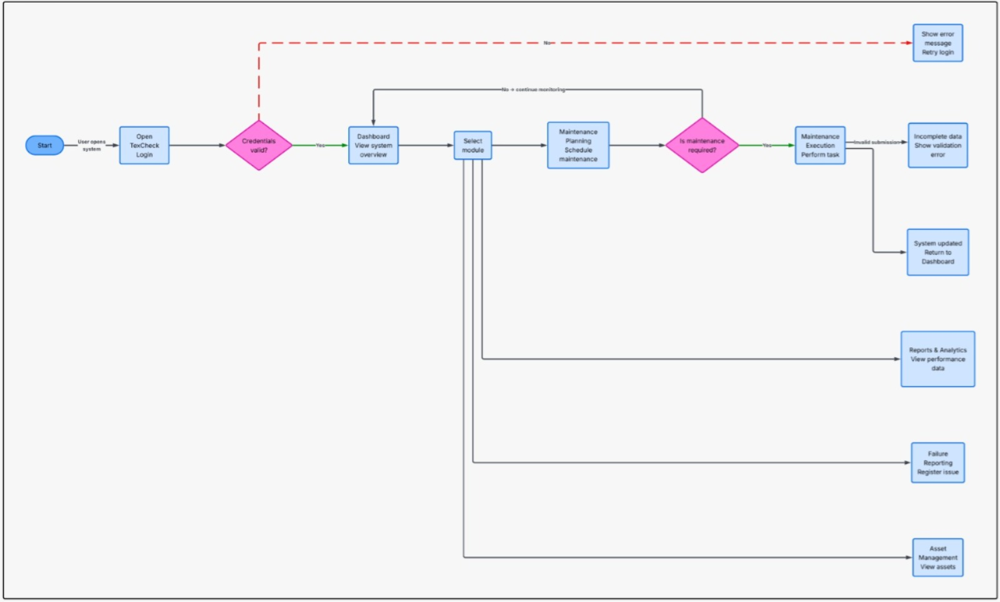

# Universidad Peruana de Ciencias Aplicadas

## Ingeniería de Software

**Ciclo:** 2026 - 01  
**Curso:** Desarrollo de Aplicaciones Open Source  
**NRC:** 20262  
**Docente:** Angel Augusto Velasquez Nuñez 

**Startup:** CodeUp  
**Producto:** TexCheck

| Código     | Nombre                           |
|------------|----------------------------------|
| U20241a195 | Diaz Yurivilca, Sofia          |
| U202219199 | Acosta Elera Abraam Bernabe        |
| U202411349 | Diaz Nuñez, Mauricio             |
| U202410421 | Diaz De La Cruz, Sebastian Gabriel |
| U202412462 | Cabrera Sotelo, Camila Celeste     |

**Abril - 2026**

  

---
# Registro de Versiones del Informe

| Versión  | Fecha          | Autor                 | Descripción de modificación |
| :------: | :------------: | :-------------------: | :-------------------------: |
|       | |  |            |

# Project Report Collaboration Insights

---

## **Project Report Online**

- [Universidad Peruana de Ciencias Aplicadas](#universidad-peruana-de-ciencias-aplicadas)
  - [Ingeniería de Software](#ingeniería-de-software)
- [Registro de Versiones del Informe](#registro-de-versiones-del-informe)
- [Project Report Collaboration Insights](#project-report-collaboration-insights)
  - [**Project Report Online**](#project-report-online)
- [Student Outcome](#student-outcome)
- [Capítulo I: Introducción](#capítulo-i-introducción)
  - [1.1. Startup Profile](#11-startup-profile)
    - [1.1.1. Descripción de Startup](#111-descripción-de-startup)
  - [1.2 Solution Profile](#12-solution-profile)
  - [1.2.1. Antecedentes y problemática](#121-antecedentes-y-problemática)
    - [1.2.2. Lean UX Process](#122-lean-ux-process)
    - [1.2.2.1. Lean UX Problem Statements](#1221-lean-ux-problem-statements)
      - [1.2.2.2. Lean UX Assumptions](#1222-lean-ux-assumptions)
      - [1.2.2.3. Lean UX Hypothesis Statements](#1223-lean-ux-hypothesis-statements)
    - [1.2.2.3. Lean UX Hypothesis Statements](#1223-lean-ux-hypothesis-statements-1)
      - [1.2.2.4. Lean UX Canvas](#1224-lean-ux-canvas)
    - [1.3. Segmentos Objetivo.](#13-segmentos-objetivo)
- [Capítulo II: Requirements Elicitation \& Analysis](#capítulo-ii-requirements-elicitation--analysis)
  - [2.1. Competidores.](#21-competidores)
    - [2.1.1. Análisis competitivo.](#211-análisis-competitivo)
    - [2.1.2. Estrategias y tácticas frente a competidores.](#212-estrategias-y-tácticas-frente-a-competidores)
  - [2.2. Entrevistas.](#22-entrevistas)
    - [2.2.1. Diseño de entrevistas.](#221-diseño-de-entrevistas)
    - [2.2.2. Registro de entrevistas.](#222-registro-de-entrevistas)
    - [2.2.3. Análisis de entrevistas.](#223-análisis-de-entrevistas)
  - [2.3. Needfinding.](#23-needfinding)
    - [2.3.1. User Personas.](#231-user-personas)
    - [2.3.2 User Task Matrix](#232-user-task-matrix)
    - [2.3.3. User Journey Mapping.](#233-user-journey-mapping)
    - [2.3.4. Empathy Mapping.](#234-empathy-mapping)
  - [2.4. Big Picture Event Storming.](#24-big-picture-event-storming)
  - [2.5. Ubiquitous Language.](#25-ubiquitous-language)
- [Capítulo III: Requirements Specification](#capítulo-iii-requirements-specification)
  - [3.1. User Stories.](#31-user-stories)
  - [3.2. Impact Mapping](#32-impact-mapping)
  - [3.3. Product Backlog.](#33-product-backlog)
- [Capítulo IV: Product Design](#capítulo-iv-product-design)
  - [4.1. Style Guidelines.](#41-style-guidelines)
    - [4.1.1. General Style Guidelines](#411-general-style-guidelines)
    - [4.1.2. Web Style Guidelines.](#412-web-style-guidelines)
  - [4.2. Information Architecture.](#42-information-architecture)
    - [4.2.1. Organization Systems.](#421-organization-systems)
    - [4.2.2. Labeling Systems.](#422-labeling-systems)
    - [4.2.3. SEO Tags and Meta Tags](#423-seo-tags-and-meta-tags)
    - [4.2.4. Searching Systems.](#424-searching-systems)
    - [4.2.5. Navigation Systems.](#425-navigation-systems)
  - [4.3. Landing Page UI Design.](#43-landing-page-ui-design)
    - [4.3.1. Landing Page Wireframe.](#431-landing-page-wireframe)
    - [4.3.2. Landing Page Mock-up.](#432-landing-page-mock-up)
  - [4.4. Web Applications UX/UI Design.](#44-web-applications-uxui-design)
    - [4.4.1. Web Applications Wireframes.](#441-web-applications-wireframes)
    - [4.4.2. Web Applications Wireflow Diagrams.](#442-web-applications-wireflow-diagrams)
    - [4.4.3. Web Applications Mock-ups.](#443-web-applications-mock-ups)
    - [4.4.4. Web Applications User Flow Diagrams](#444-web-applications-user-flow-diagrams)
  - [4.6. Domain-Driven Software Architecture.](#46-domain-driven-software-architecture)
    - [4.6.1. Design-Level Event Storming.](#461-design-level-event-storming)
  - [4.6.2. Software Architecture Context Diagram](#462-software-architecture-context-diagram)
  - [4.6.3. Software Architecture Container Diagram](#463-software-architecture-container-diagram)
    - [4.6.4. Software Architecture Components Diagrams.](#464-software-architecture-components-diagrams)
  - [4.7. Software Object-Oriented Design.](#47-software-object-oriented-design)
    - [4.7.1. Class Diagrams.](#471-class-diagrams)
  - [4.8. Database Design.](#48-database-design)
    - [4.8.1. Database Diagrams.](#481-database-diagrams)
- [Capítulo V: Product Implementation, Validation \& Deployment.](#capítulo-v-product-implementation-validation--deployment)
- [Conclusiones](#conclusiones)
- [Bibliografía](#bibliografía)

--- 
# Student Outcome

En esta sección se detallan las actividades realizadas en el trabajo final y el sustento de cómo estas han ayudado a desarrollar las dimensiones del Student Outcome 3 (ABET – EAC), el cual se define como la capacidad de comunicarse efectivamente con un rango de audiencias. La información se presenta a través del siguiente cuadro, donde se especifican las dimensiones de la competencia, las acciones realizadas por cada integrante y las conclusiones generales del equipo.

<table>
  <thead>
    <tr>
      <th>Criterio específico</th>
      <th>Acciones realizadas</th>
      <th>Conclusiones</th>
    </tr>
  </thead>
  <tbody>
    <tr>
      <td>Comunica oralmente con efectividad a diferentes rangos de audiencia.</td>
      <td>
        <strong>Sofia Diaz Yurivilca AV1:</strong> Participó en la explicación oral del proceso de investigación y planificación del proyecto TexCheck. Presentó el desarrollo de la sección <strong>2.2. Entrevistas</strong>, explicando el diseño de entrevistas, el registro de información y el análisis de los hallazgos obtenidos en los segmentos objetivo. Asimismo, explicó la elaboración del <strong>2.4. Big Picture Event Storming</strong> y del <strong>2.5. Ubiquitous Language</strong>, relacionando estos artefactos con el contexto actual del negocio y el lenguaje propio del dominio de mantenimiento textil. También comunicó los avances del <strong>Capítulo III: Requirements Specification</strong> y del <strong>Capítulo V: Product Implementation, Validation & Deployment</strong>, específicamente en las secciones <strong>5.1. Software Configuration Management</strong> y <strong>5.2.1. Sprint 1</strong>, incluyendo <strong>5.2.1.1. Sprint Planning 1</strong>, <strong>5.2.1.2. Aspect Leaders and Collaborators</strong> y <strong>5.2.1.3. Sprint Backlog 1</strong>.  
        <strong>Sofia Diaz Yurivilca TB1:</strong> Participó en la exposición de las secciones relacionadas con el análisis de entrevistas, Needfinding y diseño centrado en el usuario, explicando cómo los hallazgos obtenidos permitieron definir las funcionalidades y la propuesta de valor de TexCheck.  
        <strong>Sebastian Diaz AV1:</strong> Participó en la explicación del proceso de investigación y diseño del proyecto TexCheck, presentando los resultados de las entrevistas, el análisis de usuarios y los artefactos de diseño como User Personas, User Journey Maps y Empathy Maps. Durante la presentación explicó el problema identificado en la industria textil y cómo la solución propuesta busca mejorar la gestión del mantenimiento.  
        <strong>Sebastian Diaz TB1:</strong> Participó en la exposición del diseño del Landing Page y Mockups del sistema TexCheck, explicando la estructura visual de la interfaz, la organización de contenidos y las funcionalidades principales orientadas a mejorar la experiencia del usuario.  
        <strong>Camila Cabrera AV1:</strong> Participó en la presentación de la propuesta de solución y del diseño de la interfaz del sistema. Explicó los wireframes y mockups de la landing page, describiendo la estructura del sitio, la jerarquía visual y las funcionalidades principales del sistema TexCheck.  
        <strong>Camila Cabrera TB1:</strong> Participó en la explicación de las secciones relacionadas con UX/UI Design, Information Architecture y Landing Page Mock-up, comunicando cómo las decisiones de diseño fueron alineadas con las necesidades identificadas durante la investigación de usuarios.
      </td>
      <td>
        <strong>Sofia Diaz Yurivilca AV1:</strong> La exposición permitió comunicar de manera clara el proceso de levantamiento de información, la identificación de necesidades de los usuarios y la relación entre los hallazgos de entrevistas y los artefactos de análisis del proyecto. Asimismo, la explicación de los capítulos de requisitos y planificación del Sprint contribuyó a mostrar cómo el equipo organizó el alcance inicial de TexCheck y cómo se estructuró el trabajo para la primera iteración del proyecto.  
        <strong>Sofia Diaz Yurivilca TB1:</strong> La exposición permitió comunicar de manera clara la relación entre las necesidades identificadas en los usuarios y las decisiones tomadas para el diseño de la solución TexCheck, facilitando la comprensión del enfoque centrado en el usuario aplicado en el proyecto.  
        <strong>Sebastian Diaz AV1:</strong> La exposición permitió comunicar de manera clara el proceso de investigación con usuarios y el análisis realizado para comprender las necesidades del sector textil, facilitando que la audiencia entienda el problema y la importancia de la solución propuesta.  
        <strong>Sebastian Diaz TB1:</strong> La presentación permitió explicar de forma clara y visual la propuesta de interfaz de TexCheck, facilitando que la audiencia comprenda la estructura del Landing Page y la experiencia planteada para los usuarios.  
        <strong>Camila Cabrera AV1:</strong> La explicación de los wireframes y mockups permitió mostrar de forma visual cómo se tradujeron los hallazgos de la investigación en una propuesta de interfaz clara y funcional, facilitando la comprensión del diseño del sistema.  
        <strong>Camila Cabrera TB1:</strong> La exposición permitió comunicar de manera efectiva las decisiones de diseño y arquitectura de información aplicadas en TexCheck, mostrando cómo la interfaz fue desarrollada para ofrecer una experiencia intuitiva y organizada.
      </td>
    </tr>
    <tr>
      <td>Comunica por escrito con efectividad a diferentes rangos de audiencia.</td>
      <td>
        <strong>Sofia Diaz Yurivilca AV1:</strong> Participó en la redacción y organización de la sección <strong>2.2. Entrevistas</strong>, incluyendo el diseño de preguntas, el registro de entrevistas y el análisis de resultados obtenidos de los segmentos objetivo. Asimismo, colaboró en la elaboración de la sección <strong>2.4. Big Picture Event Storming</strong> y <strong>2.5. Ubiquitous Language</strong>, documentando los eventos del negocio actual y los términos relevantes del dominio. También participó en la elaboración del <strong>Capítulo III: Requirements Specification</strong>, así como en el <strong>Capítulo V: Product Implementation, Validation & Deployment</strong>, específicamente en <strong>5.1. Software Configuration Management</strong> y en el desarrollo del <strong>5.2.1. Sprint 1</strong>, que comprende las secciones <strong>5.2.1.1. Sprint Planning 1</strong>, <strong>5.2.1.2. Aspect Leaders and Collaborators</strong> y <strong>5.2.1.3. Sprint Backlog 1</strong>.  
        <strong>Sofia Diaz Yurivilca TB1:</strong> Participó en la redacción y corrección de las secciones relacionadas con entrevistas, Needfinding y análisis de usuarios, asegurando que la información se presente de manera clara, organizada y alineada con los objetivos del proyecto.  
        <strong>Sebastian Diaz AV1:</strong> Contribuyó en la elaboración de la documentación del proyecto, específicamente en las secciones relacionadas con la investigación de usuarios, entrevistas, análisis de resultados y desarrollo de artefactos de diseño como User Personas, User Task Matrix y Empathy Maps.  
        <strong>Sebastian Diaz TB1:</strong> Participó en la documentación de las secciones relacionadas con Landing Page UI Design y Mock-ups, describiendo la estructura visual, jerarquía de contenido y experiencia de usuario planteada para TexCheck.  
        <strong>Camila Cabrera AV1:</strong> Participó en la redacción de las secciones relacionadas con el diseño de la interfaz, incluyendo Style Guidelines, Information Architecture, Wireframes y Mockups de la landing page, asegurando que la información se presente de manera clara y estructurada.  
        <strong>Camila Cabrera TB1:</strong> Participó en la elaboración y corrección de la documentación correspondiente a UX/UI Design, Information Architecture y Landing Page Mock-up, contribuyendo a mejorar la claridad y organización del documento final.
      </td>
      <td>
        <strong>Sofia Diaz Yurivilca AV1:</strong> La documentación escrita permitió organizar de manera clara los hallazgos obtenidos en las entrevistas, sustentar la definición de necesidades del proyecto y relacionar los artefactos de análisis con el dominio de mantenimiento textil. Además, la redacción de los capítulos de requisitos y planificación permitió presentar de forma ordenada el alcance inicial del producto, las historias de usuario, el Product Backlog y la organización del Sprint 1, facilitando la comprensión del proceso de desarrollo de TexCheck.  
        <strong>Sofia Diaz Yurivilca TB1:</strong> La documentación escrita permitió fortalecer la explicación de los hallazgos obtenidos durante la investigación y justificar las decisiones tomadas en el diseño de TexCheck, mejorando la claridad y coherencia del documento final.  
        <strong>Sebastian Diaz AV1:</strong> La documentación escrita permitió estructurar de forma clara los hallazgos obtenidos en la investigación con usuarios, facilitando la comprensión del problema y justificando el desarrollo de la solución TexCheck.  
        <strong>Sebastian Diaz TB1:</strong> La documentación permitió describir de manera organizada el diseño visual y la estructura del Landing Page, facilitando la comprensión de la propuesta UX/UI del sistema TexCheck.  
        <strong>Camila Cabrera AV1:</strong> La redacción de las secciones de diseño permitió explicar de manera organizada las decisiones de interfaz y arquitectura de información, contribuyendo a que el documento final sea claro, coherente y fácil de comprender.  
        <strong>Camila Cabrera TB1:</strong> Las correcciones y mejoras realizadas en la documentación permitieron fortalecer la claridad de las secciones de diseño y experiencia de usuario, mejorando la calidad y presentación final del documento.
      </td>
    </tr>
  </tbody>
</table>

---

# Capítulo I: Introducción
## 1.1. Startup Profile
### 1.1.1. Descripción de Startup                                                                                        
## 1.2 Solution Profile
## 1.2.1. Antecedentes y problemática

La industria textil y de confecciones representa uno de los sectores manufactureros más importantes del Perú debido a su impacto económico y generación de empleo. Según el Ministerio de la Producción (PRODUCE, 2025), este sector aportó aproximadamente el 7.3% del PBI manufacturero y el 0.9% del PBI nacional durante el año 2024. Asimismo, la Sociedad Nacional de Industrias señala que la industria textil peruana genera alrededor de 400 mil empleos directos cada año, siendo las pequeñas y medianas empresas una parte importante de la actividad productiva del sector (SNI, 2021).

A pesar de su relevancia económica, muchas empresas textiles continúan gestionando sus procesos de mantenimiento industrial mediante métodos tradicionales y poco digitalizados. Durante las entrevistas realizadas para el proyecto TexCheck, los participantes indicaron que utilizan principalmente hojas de cálculo, registros físicos y aplicaciones de mensajería como WhatsApp para coordinar actividades técnicas, registrar mantenimientos y supervisar el estado de las máquinas. Esta situación genera pérdida de información, dificultades para realizar seguimiento de reparaciones y una limitada capacidad para detectar fallas antes de que afecten la continuidad operativa de la producción.

Asimismo, las fallas inesperadas representan pérdidas económicas importantes para las empresas textiles debido a interrupciones de producción, retrasos en pedidos y aumento de costos de reparación. Deloitte (2021) señala que el downtime no planificado continúa siendo una de las principales causas de pérdida económica en entornos manufactureros e industriales. Sin embargo, muchas pequeñas y medianas empresas aún no cuentan con herramientas digitales especializadas debido a barreras económicas, limitaciones tecnológicas y complejidad de implementación de las soluciones existentes en el mercado.

Con el propósito de comprender esta problemática en profundidad, se aplicó la técnica de las 5W’s y 2H’s:

### What (Qué)

#### ¿Cuál es el problema?

El problema central es la ausencia de una plataforma digital accesible y especializada que permita a las empresas textiles registrar, monitorear y gestionar correctamente las actividades de mantenimiento industrial. Actualmente, gran parte de la información relacionada con reparaciones, mantenimientos y seguimiento técnico se encuentra dispersa entre registros físicos, hojas de cálculo y comunicación informal. Esto genera pérdida de información, retrasos en la coordinación de tareas, baja trazabilidad de las intervenciones y dificultades para realizar mantenimiento preventivo de manera oportuna.

#### ¿Cuál es la relación con la persona en cuestión?

Los Líderes operativos necesitan supervisar constantemente la continuidad de la producción, identificar riesgos en la maquinaria y reducir pérdidas ocasionadas por fallas inesperadas. Sin embargo, muchas veces deben tomar decisiones sin contar con información centralizada, indicadores claros o reportes actualizados sobre el estado de los activos industriales.

Por otro lado, el Personal de mantenimiento necesita registrar reparaciones, coordinar tareas técnicas, ejecutar mantenimientos preventivos y correctivos, y acceder rápidamente al historial de las máquinas. Sin embargo, el uso de herramientas manuales limita la organización de las actividades, dificulta el seguimiento de intervenciones y aumenta el riesgo de pérdida de información técnica.

### When (Cuándo)

#### ¿Cuándo sucede el problema?

El problema ocurre de forma continua durante las operaciones diarias de producción y mantenimiento industrial. Las dificultades se presentan cuando se registran mantenimientos manualmente, cuando se coordinan reparaciones mediante mensajes informales o cuando se necesita consultar información técnica almacenada en diferentes medios físicos y digitales.

Asimismo, la problemática se intensifica durante periodos de alta demanda productiva, donde cualquier interrupción de maquinaria afecta directamente el cumplimiento de pedidos, la continuidad operativa y la capacidad de respuesta de la empresa textil.

### Where (Dónde)

#### ¿Dónde está el cliente cuando usa el producto?

Los usuarios se encuentran principalmente dentro de plantas textiles, áreas operativas, zonas de producción y espacios de mantenimiento industrial. En estos entornos supervisan maquinaria, realizan inspecciones técnicas, coordinan actividades de mantenimiento y revisan el estado de los activos que intervienen en la producción.

#### ¿A dónde se dirige?

Las empresas textiles buscan optimizar la continuidad operativa, reducir fallas inesperadas y mejorar la organización del mantenimiento industrial mediante herramientas digitales que permitan centralizar información, facilitar la coordinación técnica y apoyar la toma de decisiones basada en datos.

#### ¿Dónde surge el problema?

El problema surge principalmente dentro de las áreas operativas de mantenimiento y producción, especialmente durante el registro de mantenimientos, la coordinación entre áreas, el seguimiento de reparaciones, la atención de fallas y la supervisión del estado de las máquinas. Según PRODUCE (2023), las pequeñas y medianas empresas representan una gran parte de las unidades manufactureras del país, siendo muchas de ellas organizaciones que aún presentan limitaciones en la adopción de herramientas digitales para gestionar procesos internos.

### Who (Quién)

#### ¿Quiénes están involucrados?

Los principales involucrados pertenecen a dos segmentos identificados durante las entrevistas realizadas. El primer segmento corresponde a los Líderes operativos, responsables de supervisar la continuidad productiva, controlar riesgos operativos y tomar decisiones relacionadas con el estado de la maquinaria. El segundo segmento corresponde al Personal de mantenimiento, encargado de ejecutar, coordinar y registrar actividades de mantenimiento preventivo y correctivo dentro de la planta textil.

#### ¿A quiénes les sucede el problema?

El problema afecta principalmente a pequeñas y medianas empresas textiles que aún gestionan el mantenimiento industrial mediante procesos manuales y herramientas poco especializadas. En el caso de los Líderes operativos, la problemática se refleja en la falta de visibilidad sobre el estado real de la maquinaria, la dificultad para anticipar riesgos y las pérdidas ocasionadas por interrupciones de producción.

En el caso del Personal de mantenimiento, el problema se evidencia en la pérdida de información técnica, la duplicación de trabajo, la desorganización de tareas, la detección tardía de fallas y la falta de un historial ordenado de intervenciones realizadas sobre cada activo industrial.

#### ¿Quién lo utilizará?

La solución estará dirigida principalmente a dos segmentos específicos.

El primer segmento corresponde a los Líderes operativos, quienes utilizarán la plataforma para supervisar el estado de la maquinaria, visualizar indicadores operativos, consultar reportes de mantenimiento y mejorar la planificación de acciones preventivas.

El segundo segmento corresponde al Personal de mantenimiento, quienes utilizarán la plataforma para registrar activos, programar mantenimientos, ejecutar tareas técnicas, reportar fallas, registrar soluciones y acceder rápidamente al historial técnico de los activos industriales.

### Why (Por qué)

#### ¿Cuál es la causa del problema?

La principal causa del problema es el bajo nivel de digitalización presente en muchas empresas textiles peruanas, especialmente en procesos relacionados con mantenimiento industrial. Además, muchas organizaciones continúan dependiendo de procesos manuales debido a que las soluciones existentes en el mercado suelen ser costosas, complejas o poco adaptadas a las necesidades de pequeñas y medianas empresas textiles.

Según Movistar Empresas (2023), gran parte de las pymes peruanas reconoce dificultades para adoptar soluciones digitales debido a limitaciones económicas, falta de capacitación tecnológica y resistencia al cambio organizacional. Esta situación refuerza la necesidad de una solución accesible, intuitiva y especializada que permita una transición gradual desde los registros manuales hacia una gestión digital del mantenimiento.

### How (Cómo)

#### ¿Cómo prefieren los usuarios acceder al contenido?

Los usuarios prefieren acceder mediante computadoras y dispositivos móviles que les permitan registrar información rápidamente desde planta y consultar el estado de las máquinas en tiempo real. Asimismo, esperan una plataforma intuitiva, rápida y fácil de usar, debido a que no todos los trabajadores poseen conocimientos avanzados en herramientas tecnológicas.

Para los Líderes operativos, el acceso a paneles, reportes e indicadores resulta importante para la supervisión y toma de decisiones. Para el Personal de mantenimiento, el acceso móvil o desde planta resulta relevante para registrar intervenciones, evidencias, observaciones técnicas y estados de mantenimiento sin depender de registros físicos.

#### ¿Qué llevó a la persona a llegar a esta situación?

La combinación de procesos tradicionales, dependencia de registros manuales, uso de hojas de cálculo, comunicación informal y falta de soluciones digitales accesibles ha provocado que muchas empresas continúen gestionando el mantenimiento de forma reactiva en lugar de preventiva. Además, la presión operativa diaria dificulta la implementación de herramientas complejas dentro de entornos industriales donde se requiere rapidez, claridad y facilidad de uso.

### How much (Cuánto)

#### ¿Cuánto impacta el problema?

Las fallas inesperadas generan pérdidas económicas debido a interrupciones en la producción, incremento de costos de reparación, retrasos operativos, pérdida de tiempo técnico y disminución de la eficiencia operativa. Durante las entrevistas realizadas, los participantes indicaron que las fallas afectan constantemente la continuidad de producción y generan presión adicional sobre los equipos responsables de mantenimiento.

Asimismo, Deloitte (2021) señala que el downtime no planificado representa una de las principales causas de pérdida económica dentro de entornos industriales y manufactureros.

#### ¿Cuántas empresas podrían verse beneficiadas?

Según PRODUCE (2023), las pequeñas y medianas empresas representan una gran parte del sector manufacturero peruano, incluyendo organizaciones textiles que actualmente buscan mejorar sus procesos mediante herramientas digitales más accesibles y especializadas. Asimismo, el Sondeo de Adopción Digital de Movistar Empresas (2024) indica que el 98% de las pymes peruanas considera importante invertir en digitalización para mejorar su productividad y competitividad, evidenciando una oportunidad de crecimiento para soluciones digitales orientadas al sector industrial.

#### ¿Cuánto valor podría aportar una solución digital?

Una solución como TexCheck podría aportar valor al reducir la pérdida de información, mejorar la coordinación entre los Líderes operativos y el Personal de mantenimiento, optimizar la planificación del mantenimiento preventivo y facilitar la trazabilidad de las intervenciones técnicas.

Para los Líderes operativos, el valor principal se encuentra en mejorar la continuidad operativa, visualizar indicadores confiables y reducir pérdidas ocasionadas por downtime.

Para el Personal de mantenimiento, el valor principal se encuentra en acceder rápidamente al historial técnico de las máquinas, registrar información de forma organizada, recibir alertas oportunas y coordinar tareas de mantenimiento de manera más eficiente.

### 1.2.2. Lean UX Process
### 1.2.2.1. Lean UX Problem Statements

La industria textil en Perú enfrenta constantes problemas en la gestión del mantenimiento de maquinaria debido a la dependencia de procesos manuales y herramientas poco especializadas. Muchas empresas continúan utilizando registros físicos, hojas de cálculo y coordinación informal mediante llamadas o aplicaciones de mensajería, lo que dificulta el seguimiento del mantenimiento, la detección temprana de fallas y la conservación del historial técnico de los activos.

Esta situación provoca interrupciones en la producción, retrasos en pedidos, pérdida de información importante y un incremento en los costos operativos. Además, durante periodos de alta demanda, las fallas inesperadas generan presión sobre las áreas responsables de la operación y el mantenimiento, afectando directamente la continuidad productiva de las empresas textiles.

Aunque existen plataformas CMMS en el mercado, muchas de ellas están orientadas a grandes corporaciones, presentan costos elevados o resultan complejas para pequeñas y medianas empresas textiles que buscan soluciones rápidas y fáciles de implementar. Como resultado, muchas organizaciones continúan trabajando con métodos tradicionales que limitan la trazabilidad, la coordinación entre áreas y la toma de decisiones basada en datos.

El desafío no consiste únicamente en digitalizar registros, sino en encontrar una forma eficiente de mejorar la coordinación, el control y la planificación del mantenimiento preventivo dentro de entornos industriales con recursos limitados y distintos niveles de adaptación tecnológica.

En TexCheck, los wireframes fueron diseñados para representar las principales funcionalidades del sistema, incluyendo la autenticación de usuarios, el panel principal de monitoreo, la gestión de activos, la planificación de mantenimientos, el registro de fallas y la visualización de reportes y analíticas.

Sabremos que estamos avanzando correctamente cuando las empresas logren reducir fallas inesperadas, mejorar la organización del mantenimiento, disminuir la pérdida de información técnica y reducir el downtime mediante el uso de una plataforma digital accesible, especializada e intuitiva.

### A. Business Assumptions

Los wireframes completos y editables pueden visualizarse en el prototipo desarrollado en Figma:
https://www.figma.com/design/K7X1UxoGOVLGb2aa3IIK41/TexTCheck-Wireframes-Mockups?t=4Tp22yuMeaoHiIDM-1

---

### B. User Assumptions

Los wireflow diagrams combinan wireframes con diagramas de flujo para representar cómo los usuarios navegan entre las diferentes pantallas de la aplicación TexCheck. Este tipo de representación permite comprender visualmente la secuencia de interacción dentro del sistema y las acciones que desencadenan cada transición entre interfaces.

Los usuarios principales son los Líderes operativos y el Personal de mantenimiento de pequeñas y medianas empresas textiles. Los Líderes operativos supervisan la continuidad de producción, revisan indicadores y toman decisiones sobre el estado de la maquinaria. El Personal de mantenimiento registra activos, ejecuta mantenimientos, atiende fallas y actualiza el historial técnico de las máquinas.

* ¿Dónde encaja el producto?

---

* Uso típico: registrar activos industriales, consultar fichas técnicas, programar mantenimientos preventivos, asignar responsables, registrar observaciones técnicas, reportar fallas, recibir alertas, consultar historial de máquinas y generar reportes de mantenimiento.

* Funcionalidades importantes: registro digital de activos, ficha técnica por máquina, planificación de mantenimiento preventivo, checklists de mantenimiento, alertas automáticas, gestión de fallas, historial técnico, reportes de mantenimiento y dashboard de indicadores.

* Aspecto y sensación: interfaz clara, simple y responsiva; uso de paneles con indicadores clave, alertas visuales para fallas o mantenimientos vencidos, navegación ordenada por módulos y diseño accesible desde computadoras y dispositivos móviles.

### C. User Outcome & Benefit Assumptions

* El Personal de mantenimiento podrá registrar información técnica de forma más rápida, ordenada y confiable.

* Los Líderes operativos tendrán mayor visibilidad sobre el estado de la maquinaria, las fallas activas y los mantenimientos pendientes.

* Las empresas textiles podrán reducir tiempos muertos ocasionados por fallas inesperadas.

* La coordinación entre Líderes operativos y Personal de mantenimiento mejorará mediante información centralizada y actualizada.

* El historial técnico permitirá consultar intervenciones anteriores, identificar fallas recurrentes y evitar pérdida de información importante.

* Las alertas automáticas permitirán anticiparse a mantenimientos próximos, vencidos o fallas críticas.

* La toma de decisiones será más eficiente gracias al acceso a reportes, indicadores y datos consolidados sobre el mantenimiento industrial.

### D. Business Outcome Assumptions

* Reducir el downtime generado por fallas inesperadas en un 15% durante los primeros 6 meses de uso piloto.

* Reducir los errores y la pérdida de información en registros manuales en un 40% durante los primeros 3 meses.

* Incrementar el cumplimiento del mantenimiento preventivo en un 30% durante los primeros 3 meses de uso.

* Lograr la adopción de TexCheck en al menos 20 empresas textiles durante el primer año.

* Conseguir que el 70% de los usuarios registrados utilicen activamente la plataforma cada semana.

* Lograr que al menos el 80% de las intervenciones de mantenimiento realizadas durante el piloto queden registradas correctamente en el historial técnico del activo.

### E. Feature Assumptions

  

* La ficha técnica por activo facilitará la consulta de datos importantes antes de realizar una intervención de mantenimiento.

* La planificación de mantenimiento preventivo permitirá organizar intervenciones antes de que ocurran fallas críticas.

* Los checklists de mantenimiento ayudarán a estandarizar las actividades técnicas y reducir omisiones durante la ejecución.

* Las alertas automáticas ayudarán a detectar mantenimientos próximos, vencidos o fallas críticas antes de que afecten gravemente la producción.

* La gestión de fallas permitirá clasificar incidentes por criticidad, generar órdenes correctivas y registrar soluciones técnicas.

https://miro.com/app/board/uXjVGe-lBxE=/

* Los reportes y dashboards permitirán a los Líderes operativos tomar decisiones basadas en datos sobre el estado de la maquinaria y el cumplimiento del mantenimiento.

* El acceso desde dispositivos móviles permitirá al Personal de mantenimiento registrar información directamente desde planta.

* Una interfaz simple e intuitiva facilitará la adopción de TexCheck por usuarios con distintos niveles de experiencia tecnológica.

#### 1.2.2.3. Lean UX Hypothesis Statements

Creemos que lograremos [resultado de negocio] si [persona/segmento] obtiene [beneficio o resultado del usuario] con [funcionalidad o solución].

#### Hypothesis Statement 01: Registro digital de activos

Creemos que lograremos reducir los errores y la pérdida de información técnica en un 40% durante los primeros 3 meses si el Personal de mantenimiento obtiene una forma rápida y ordenada de registrar, actualizar y consultar la información de las máquinas con el registro digital de activos y fichas técnicas de TexCheck.

#### Hypothesis Statement 02: Historial técnico de mantenimiento

Creemos que lograremos que al menos el 80% de las intervenciones de mantenimiento realizadas durante el piloto queden registradas correctamente en el historial técnico del activo si el Personal de mantenimiento obtiene acceso centralizado a reparaciones, fallas e intervenciones anteriores con el historial técnico digital de TexCheck.

#### Hypothesis Statement 03: Planificación de mantenimiento preventivo

Creemos que lograremos incrementar el cumplimiento del mantenimiento preventivo en un 30% durante los primeros 3 meses si el Personal de mantenimiento obtiene una forma organizada de programar, reprogramar y ejecutar mantenimientos con el módulo de planificación preventiva, checklists y asignación de responsables de TexCheck.

#### Hypothesis Statement 04: Alertas automáticas de mantenimiento y fallas

Creemos que lograremos reducir el downtime generado por fallas inesperadas en un 15% durante los primeros 6 meses si los Líderes operativos y el Personal de mantenimiento obtienen avisos oportunos sobre mantenimientos próximos, mantenimientos vencidos y fallas críticas con el sistema de alertas y notificaciones de TexCheck.

#### Hypothesis Statement 05: Gestión de fallas y mantenimiento correctivo

Creemos que lograremos mejorar la atención de fallas críticas y reducir la desorganización del mantenimiento correctivo si el Personal de mantenimiento obtiene una forma estructurada de clasificar fallas, generar órdenes correctivas, marcar activos fuera de servicio y registrar soluciones técnicas con el módulo de gestión de fallas de TexCheck.

#### Hypothesis Statement 06: Reportes e indicadores operativos

Creemos que lograremos mejorar la toma de decisiones operativas si los Líderes operativos obtienen información clara y consolidada sobre mantenimientos realizados, fallas activas, activos fuera de servicio y cumplimiento preventivo con los reportes y dashboards de TexCheck.

#### Hypothesis Statement 07: Coordinación entre áreas operativas y mantenimiento

---

#### 1.2.2.4. Lean UX Canvas

<table>
  <tr>
    <td valign="top">
     <strong>1) Problema de negocio</strong>  
     Muchas pequeñas y medianas empresas textiles gestionan el mantenimiento de su maquinaria mediante registros físicos, hojas de cálculo y comunicación informal por mensajes o llamadas. Esta forma de trabajo genera pérdida de información técnica, baja trazabilidad, retrasos en la coordinación de tareas y dificultad para detectar fallas antes de que afecten la producción.  
     En este contexto, TexCheck busca responder a la siguiente pregunta: ¿cómo digitalizar la gestión del mantenimiento industrial en empresas textiles para que los equipos puedan centralizar información, coordinar tareas, anticiparse a fallas y reducir interrupciones operativas sin agregar complejidad al trabajo diario?
   </td>

   <td rowspan="2" valign="top">
     <strong>5) Ideas de soluciones</strong>
     <ul>
       <li>Registro digital de activos para centralizar la información técnica de cada máquina.</li>
       <li>Ficha técnica por activo para documentar características, estado, ubicación y datos relevantes de la maquinaria.</li>
       <li>Historial técnico por activo para consultar reparaciones, intervenciones y fallas anteriores.</li>
       <li>Planificación de mantenimiento preventivo para programar, reprogramar y organizar intervenciones.</li>
       <li>Checklists de mantenimiento para estandarizar las actividades técnicas durante cada intervención.</li>
       <li>Alertas automáticas para informar sobre mantenimientos próximos, vencidos o fallas críticas.</li>
       <li>Asignación y seguimiento de tareas para mejorar la coordinación entre Líderes operativos y Personal de mantenimiento.</li>
       <li>Gestión de fallas para reportar incidentes, clasificarlos por criticidad, generar órdenes correctivas y registrar soluciones.</li>
       <li>Reportes y dashboard de indicadores para visualizar activos, fallas, mantenimientos y cumplimiento preventivo.</li>
       <li>Acceso desde computadoras y dispositivos móviles para registrar información directamente desde planta.</li>
     </ul>
   </td>

   <td valign="top">
     <strong>2) Resultados comerciales</strong>
     <ul>
       <li>Reducir el downtime generado por fallas inesperadas en un 15% durante los primeros 6 meses de uso piloto.</li>
       <li>Reducir los errores y la pérdida de información en registros manuales en un 40% durante los primeros 3 meses.</li>
       <li>Incrementar el cumplimiento del mantenimiento preventivo en un 30% durante los primeros 3 meses de uso.</li>
       <li>Lograr la adopción de TexCheck en al menos 20 empresas textiles durante el primer año.</li>
       <li>Conseguir que el 70% de los usuarios registrados utilicen activamente la plataforma cada semana.</li>
       <li>Lograr que al menos el 80% de las intervenciones de mantenimiento realizadas durante el piloto queden registradas correctamente en el historial técnico del activo.</li>
     </ul>
   </td>
 </tr>

 <tr>
   <td valign="top">
     <strong>3) Usuarios y clientes</strong>  
     Los usuarios y clientes principales pertenecen a dos segmentos identificados durante las entrevistas. El primer segmento está conformado por Líderes operativos, quienes necesitan supervisar la continuidad de la producción, revisar indicadores, identificar riesgos operativos y tomar decisiones relacionadas con el estado de la maquinaria.  
     El segundo segmento está conformado por Personal de mantenimiento, encargado de registrar activos, planificar mantenimientos, ejecutar intervenciones preventivas y correctivas, atender fallas y mantener actualizado el historial técnico de las máquinas.  
     Ambos segmentos requieren información organizada, rápida de consultar y útil para reducir fallas, mejorar la planificación y evitar pérdidas por registros manuales incompletos o dispersos.
   </td>

   <td valign="top">
     <strong>4) Beneficios del usuario</strong>
     <ul>
       <li>Mayor visibilidad del estado de la maquinaria, fallas activas y mantenimientos pendientes.</li>
       <li>Reducción de pérdida de información causada por registros físicos, hojas de cálculo o archivos dispersos.</li>
       <li>Acceso rápido al historial técnico de cada máquina.</li>
       <li>Mejor coordinación entre Líderes operativos y Personal de mantenimiento mediante información centralizada.</li>
       <li>Detección más temprana de mantenimientos vencidos, tareas pendientes y fallas críticas mediante alertas automáticas.</li>
       <li>Mayor capacidad para planificar mantenimientos preventivos y reducir interrupciones de producción.</li>
       <li>Mejor toma de decisiones gracias a reportes, indicadores y datos históricos organizados.</li>
     </ul>
   </td>
 </tr>

 <tr>
   <td valign="top">
     <strong>6) Hipótesis</strong>
     <ul>
       <li>Creemos que lograremos reducir los errores y la pérdida de información técnica en un 40% durante los primeros 3 meses si el Personal de mantenimiento obtiene una forma rápida y ordenada de registrar, actualizar y consultar la información de las máquinas con el registro digital de activos y fichas técnicas de TexCheck.</li>

<li>Creemos que lograremos que al menos el 80% de las intervenciones de mantenimiento realizadas durante el piloto queden registradas correctamente en el historial técnico del activo si el Personal de mantenimiento obtiene acceso centralizado a reparaciones, fallas e intervenciones anteriores con el historial técnico digital de TexCheck.</li>

<li>Creemos que lograremos incrementar el cumplimiento del mantenimiento preventivo en un 30% durante los primeros 3 meses si el Personal de mantenimiento obtiene una forma organizada de programar, reprogramar y ejecutar mantenimientos con el módulo de planificación preventiva, checklists y asignación de responsables de TexCheck.</li>

<li>Creemos que lograremos reducir el downtime generado por fallas inesperadas en un 15% durante los primeros 6 meses si los Líderes operativos y el Personal de mantenimiento obtienen avisos oportunos sobre mantenimientos próximos, mantenimientos vencidos y fallas críticas con el sistema de alertas y notificaciones de TexCheck.</li>

<li>Creemos que lograremos mejorar la atención de fallas críticas y reducir la desorganización del mantenimiento correctivo si el Personal de mantenimiento obtiene una forma estructurada de clasificar fallas, generar órdenes correctivas, marcar activos fuera de servicio y registrar soluciones técnicas con el módulo de gestión de fallas de TexCheck.</li>

<li>Creemos que lograremos mejorar la toma de decisiones operativas si los Líderes operativos obtienen información clara y consolidada sobre mantenimientos realizados, fallas activas, activos fuera de servicio y cumplimiento preventivo con los reportes y dashboards de TexCheck.</li>

<li>Creemos que lograremos mejorar la coordinación entre Líderes operativos y Personal de mantenimiento si ambos segmentos obtienen información centralizada sobre tareas asignadas, estado de activos, alertas y avances de mantenimiento con una plataforma digital compartida.</li>

<li>Creemos que lograremos aumentar la actualización oportuna de registros técnicos si el Personal de mantenimiento obtiene la posibilidad de registrar observaciones, evidencias, tiempos de intervención y cierre de tareas directamente desde planta con una plataforma accesible desde dispositivos móviles y computadoras.</li>

<li>Creemos que lograremos que el 70% de los usuarios registrados utilicen activamente la plataforma cada semana si los Líderes operativos y el Personal de mantenimiento obtienen una experiencia simple, rápida e intuitiva con una interfaz organizada por módulos, alertas visuales claras y acceso rápido a las funciones principales.</li>

<li>Creemos que lograremos la adopción de TexCheck en al menos 20 empresas textiles durante el primer año si los Líderes operativos y el Personal de mantenimiento reconocen que la plataforma ayuda a reducir fallas inesperadas, mejorar la trazabilidad y ordenar la gestión del mantenimiento mediante una solución digital accesible y especializada para el sector textil.</li>
</ul>
   </td>

   <td valign="top">
     <strong>7) ¿Qué es lo más importante que necesitamos aprender primero?</strong>  
     Lo primero que debemos validar es si la pérdida de información técnica, la baja trazabilidad, la desorganización del mantenimiento y la detección tardía de fallas son problemas suficientemente relevantes para que los Líderes operativos y el Personal de mantenimiento adopten una plataforma digital especializada.  
     También necesitamos comprobar si los usuarios estarían dispuestos a reemplazar gradualmente el uso de cuadernos físicos, archivos Excel y coordinación informal por una herramienta centralizada que les permita registrar activos, planificar mantenimientos, consultar historiales, recibir alertas, atender fallas y generar reportes.  
     Además, se debe validar si una solución simple e intuitiva puede integrarse al flujo diario de trabajo en planta sin generar resistencia, retrasos o carga adicional para los usuarios.
   </td>

   <td valign="top">
     <strong>8) ¿Cuál es la menor cantidad de trabajo que necesitamos hacer para resolver las dudas y para hacer lo siguiente más importante?</strong>  
     El siguiente paso clave es desarrollar un MVP enfocado en las funcionalidades principales del mantenimiento textil: registro digital de activos, ficha técnica, historial técnico, planificación de mantenimiento preventivo, checklists, alertas, gestión de fallas y reportes básicos.  
     Esta versión mínima debe ser validada con usuarios representativos de ambos segmentos mediante pruebas de usabilidad y simulaciones de escenarios reales de mantenimiento. Durante la validación se deben medir tiempos de registro, facilidad de uso, comprensión de los flujos principales, utilidad percibida de las alertas, claridad de los reportes y disposición de los usuarios para emplear TexCheck como reemplazo parcial de sus procesos manuales actuales.
   </td>
</tr>
</table>

### 1.3. Segmentos Objetivo

TexCheck está orientado a pequeñas y medianas empresas textiles que necesitan mejorar la gestión del mantenimiento de su maquinaria industrial. En este contexto, el problema principal identificado es la dependencia de procesos manuales, hojas de cálculo, registros físicos y comunicación informal para coordinar tareas de mantenimiento. Esta situación ocasiona pérdida de información, falta de trazabilidad, detección tardía de fallas y paradas inesperadas de producción.

A partir de las entrevistas realizadas, se identificaron dos segmentos objetivo principales. El primero corresponde a los Líderes operativos, quienes requieren mayor visibilidad sobre el estado de la maquinaria, las fallas activas y el cumplimiento del mantenimiento preventivo para tomar decisiones oportunas. El segundo corresponde al Personal de mantenimiento, quienes necesitan registrar intervenciones, coordinar tareas, atender fallas y acceder rápidamente al historial técnico de los activos industriales.

#### Segmento objetivo 1: Líderes operativos

TexCheck está enfocado en Líderes operativos de empresas textiles, quienes son responsables de supervisar la continuidad de la producción, controlar riesgos operativos y tomar decisiones relacionadas con el estado de la maquinaria. Este segmento necesita herramientas que le permitan acceder a información actualizada, visualizar indicadores, identificar fallas críticas, revisar reportes de mantenimiento y mejorar la planificación de acciones preventivas dentro de la planta.

#### A. Características demográficas

Los usuarios de este segmento tienen entre 27 y 35 años, de acuerdo con las entrevistas realizadas a perfiles vinculados con la gestión operativa del sector textil. Residen principalmente en Lima Metropolitana y Callao, y cuentan con experiencia laboral aproximada de 3 a 5 años en empresas textiles o manufactureras. Ocupan cargos relacionados con la supervisión, coordinación o dirección operativa dentro de la planta, por lo que tienen responsabilidad directa sobre la continuidad productiva, el control de costos y la coordinación con las áreas técnicas.

#### B. Aspectos geográficos

Este segmento se ubica principalmente en Lima Metropolitana y Callao, zonas donde se concentra una parte importante de la actividad manufacturera y textil del país. Su entorno de trabajo se desarrolla dentro de plantas textiles, oficinas operativas, áreas de producción y espacios de supervisión operativa. En estos espacios, los Líderes operativos requieren acceso a información actualizada sobre el estado de la maquinaria, reportes de mantenimiento, indicadores de cumplimiento y alertas relacionadas con posibles fallas o interrupciones productivas.

#### C. Aspectos psicográficos

Los Líderes operativos están motivados por optimizar la continuidad operativa, reducir costos asociados a fallas inesperadas y mejorar la eficiencia de la producción. Valoran especialmente la facilidad de uso, la rapidez de implementación y la posibilidad de visualizar información clara para tomar decisiones. Sus principales frustraciones son las paradas inesperadas de producción, la falta de trazabilidad en el historial de mantenimiento, la dependencia de reportes manuales y la ausencia de información centralizada en tiempo real.

En cuanto a su comportamiento tecnológico, utilizan principalmente Excel, registros manuales o comunicación directa para supervisar información operativa. También coordinan actividades mediante herramientas básicas de mensajería. Aunque reconocen el valor de una solución digital, requieren que esta sea accesible, clara y no represente una carga adicional para la operación diaria.

#### D. Información estadística de sustento

Según PRODUCE, la industria textil y de confecciones representa un sector relevante dentro de la manufactura peruana, con participación en la producción nacional y generación de empleo. Esta relevancia evidencia la necesidad de fortalecer procesos internos que permitan mejorar la productividad y competitividad de las empresas textiles.

Enlace de la Landing Page:  https://1asi0729-2610-20262-codeup.github.io/TexCheck-landing/

#### Segmento objetivo 2: Personal de mantenimiento

TexCheck también está dirigido al Personal de mantenimiento de empresas textiles e industriales, quienes son responsables de ejecutar, coordinar y registrar actividades de mantenimiento preventivo y correctivo. Este segmento necesita herramientas simples, rápidas y accesibles que faciliten el registro de información técnica, la coordinación de tareas, la atención de fallas y el acceso al historial técnico de las máquinas.

#### A. Características demográficas

Los usuarios de este segmento tienen entre 25 y 27 años, según las entrevistas realizadas. Residen principalmente en Lima Metropolitana y cuentan con una experiencia aproximada de 5 a 7 años en mantenimiento industrial. Ocupan cargos operativos o de supervisión técnica relacionados con mantenimiento, por lo que su trabajo está directamente vinculado con la ejecución y seguimiento de reparaciones, revisiones preventivas, atención de fallas y coordinación de actividades técnicas dentro de la planta.

#### B. Aspectos geográficos

Este segmento se ubica principalmente en Lima Metropolitana, dentro de plantas textiles, áreas de mantenimiento y zonas operativas donde se encuentran las máquinas industriales. Su trabajo se desarrolla directamente en campo, por lo que necesita acceder a la información desde computadoras y dispositivos móviles, especialmente cuando realiza inspecciones, registra reparaciones, reporta fallas o coordina tareas con otros miembros del equipo.

#### C. Aspectos psicográficos

El Personal de mantenimiento está motivado por reducir tiempos perdidos, mejorar la coordinación de tareas y evitar errores generados por registros manuales. Valora las herramientas simples, rápidas e intuitivas, ya que no todos los trabajadores poseen el mismo nivel de dominio tecnológico. Sus principales frustraciones son la pérdida de información importante, la duplicación de trabajo, la comunicación desorganizada, la detección tardía de fallas y la falta de monitoreo preventivo.

En cuanto a su comportamiento tecnológico, utiliza principalmente Excel, registros físicos y WhatsApp para coordinar actividades. Se muestra dispuesto a usar software siempre que este sea fácil de utilizar, accesible desde celular, tablet o computadora, y le permita ahorrar tiempo en lugar de complicar sus tareas diarias.

#### D. Información estadística de sustento

Los resultados de las entrevistas muestran que el Personal de mantenimiento utiliza principalmente Excel, registros físicos o WhatsApp para gestionar actividades de mantenimiento. Asimismo, se identificaron dificultades relacionadas con pérdida de información, información dispersa y falta de un historial ordenado de reparaciones. Además, los entrevistados indicaron que las alertas automáticas serían útiles para anticiparse a fallas, planificar mejor las intervenciones y reducir la dependencia de mantenimientos correctivos.

Estos hallazgos sustentan la necesidad de una plataforma como TexCheck, orientada a centralizar la información técnica, facilitar la coordinación del mantenimiento y mejorar la trazabilidad de las intervenciones dentro de plantas textiles.

---

# Capítulo II: Requirements Elicitation & Analysis
## 2.1. Competidores.
## 2.1.1. Análisis competitivo.

| Elemento | TexCheck  | Fiix CMMS  | UpKeep  | IBM Maximo Application Suite  |
|---|---|---|---|---|
| **¿Por qué llevar a cabo este análisis?** | El análisis se realiza para determinar cómo TexCheck puede diferenciarse dentro del mercado de soluciones de mantenimiento industrial, considerando que existen plataformas CMMS consolidadas, pero muchas de ellas están orientadas a empresas grandes, poseen costos elevados o no están especializadas en el sector textil peruano. La pregunta principal es: **¿cómo puede TexCheck posicionarse como una alternativa accesible, especializada e intuitiva para pequeñas y medianas empresas textiles que necesitan digitalizar su mantenimiento industrial sin asumir la complejidad de plataformas empresariales globales?** | Se analiza Fiix porque es una plataforma CMMS reconocida internacionalmente, enfocada en ayudar a las empresas a planificar, rastrear y optimizar el mantenimiento mediante gestión de activos, órdenes de trabajo, reportes, integraciones y herramientas basadas en IA. Su presencia permite comparar a TexCheck frente a una solución madura, de enfoque general y orientada a múltiples industrias. | Se analiza UpKeep porque es una plataforma CMMS mobile-first orientada a equipos de mantenimiento que necesitan crear órdenes de trabajo, automatizar mantenimientos preventivos, usar checklists y acceder a información desde cualquier dispositivo. Su enfoque móvil la convierte en un competidor importante frente a TexCheck, especialmente para técnicos que trabajan directamente en planta. | Se analiza IBM Maximo porque es una suite EAM/CMMS empresarial de alto nivel, orientada a la gestión avanzada de activos, mantenimiento preventivo, predictivo, inspecciones, inventario, analítica e integración con tecnologías empresariales. Representa la competencia más robusta y compleja dentro del mercado de gestión de activos industriales. |
| **Perfil — Overview** | TexCheck es una startup tecnológica orientada a la digitalización de la gestión del mantenimiento industrial en el sector manufacturero textil. Su propósito es ofrecer una plataforma Web y Mobile que permita registrar activos, programar mantenimientos preventivos, reportar fallas, consultar historial técnico, generar alertas y visualizar indicadores operativos. Su enfoque nace de una problemática identificada en empresas textiles: fallas inesperadas en maquinaria crítica, dependencia de registros manuales, uso de Excel, comunicación por WhatsApp y falta de trazabilidad técnica. | Fiix CMMS es una plataforma de mantenimiento basada en la nube que permite planificar, rastrear y optimizar operaciones de mantenimiento. Ofrece gestión de activos, órdenes de trabajo, mantenimiento preventivo, inventario, reportes, integraciones y herramientas de IA. Su propuesta está orientada a empresas que buscan centralizar sus operaciones de mantenimiento y mejorar el rendimiento de sus activos. | UpKeep es una plataforma CMMS impulsada por IA y diseñada con enfoque mobile-first. Su propuesta busca que los equipos de mantenimiento completen órdenes de trabajo desde cualquier dispositivo, agreguen fotos, utilicen checklists, actualicen información en tiempo real y automaticen tareas preventivas. La empresa indica que su plataforma busca pasar de operaciones reactivas a operaciones proactivas. | IBM Maximo Application Suite es una plataforma empresarial de gestión de activos que integra mantenimiento, inspección, monitoreo, inventario, analítica, gestión de campo y capacidades de IA. IBM la presenta como una solución para mejorar el desempeño de activos, programar trabajos, completar órdenes con acceso móvil y detectar anomalías mediante imágenes, video, sensores o datos operativos. |
| **Ventaja competitiva** | La ventaja competitiva de TexCheck se basa en su **especialización en el sector textil peruano**, su enfoque en pequeñas y medianas empresas, su facilidad de uso y su modelo accesible frente a plataformas globales. A diferencia de soluciones generales, TexCheck se adapta a flujos reales de mantenimiento textil: registro de máquinas, historial técnico, planificación preventiva, fallas recurrentes, alertas, checklists y reportes pensados para líderes operativos y personal de mantenimiento. Además, su propuesta responde a un mercado donde el 99.4% de empresas textiles formales son MYPE y donde el 66% se concentra en Lima, lo cual facilita una estrategia inicial de entrada local. | Su ventaja competitiva está en ser una plataforma CMMS madura, cloud-based, con funcionalidades amplias para mantenimiento, gestión de activos, inventario, reportes e integraciones. También cuenta con herramientas de IA y una propuesta orientada a optimizar activos en distintos sectores industriales. Su fortaleza principal es la experiencia acumulada y la capacidad de cubrir procesos de mantenimiento de manera integral. | Su ventaja competitiva está en su enfoque mobile-first. UpKeep facilita que técnicos puedan crear, completar y actualizar órdenes de trabajo desde cualquier dispositivo, con fotos, checklists y actualizaciones en tiempo real. Esta orientación resulta atractiva para equipos operativos que trabajan fuera de oficina o directamente en planta. | Su ventaja competitiva está en su robustez empresarial, escalabilidad, analítica avanzada, integración con gestión de activos, inventario, inspecciones, mantenimiento predictivo y ecosistema IBM. Es una solución preparada para grandes organizaciones con procesos complejos, múltiples sedes, altos volúmenes de activos y necesidades avanzadas de confiabilidad operacional. |
| **¿Qué valor ofrece a los clientes?** | TexCheck ofrece valor al permitir que las empresas textiles reduzcan la pérdida de información técnica, mejoren la trazabilidad de las intervenciones, organicen el mantenimiento preventivo y disminuyan las interrupciones por fallas inesperadas. Para los líderes operativos, ofrece visibilidad sobre activos, fallas, mantenimientos pendientes y reportes. Para el personal de mantenimiento, ofrece una herramienta práctica para registrar intervenciones, consultar historiales, recibir alertas y coordinar tareas. Este valor es importante porque el downtime no planificado puede generar pérdidas relevantes en entornos industriales. | Fiix ofrece valor mediante la centralización de activos, órdenes de trabajo, inventario, mantenimiento preventivo y reportes. Su objetivo es que las empresas dejen de gestionar activos “a ciegas” y puedan observar, rastrear y optimizar el rendimiento de sus equipos. También permite mejorar la organización del mantenimiento y reducir tiempos administrativos. | UpKeep ofrece valor al permitir que los equipos de mantenimiento gestionen órdenes de trabajo desde cualquier lugar, automaticen tareas preventivas, usen checklists y mantengan visibilidad en tiempo real. Su propuesta se enfoca en reducir trabajo administrativo, acelerar respuestas y facilitar el trabajo del técnico en campo. | IBM Maximo ofrece valor a empresas intensivas en activos al integrar mantenimiento, gestión de activos, inspecciones, inventario, analítica, automatización y capacidades predictivas. Su valor se centra en optimizar el ciclo de vida de los activos, mejorar la confiabilidad, reducir riesgos operativos y apoyar decisiones complejas basadas en datos. |
| **Perfil de Marketing — Mercado objetivo** | TexCheck se dirige principalmente a pequeñas y medianas empresas textiles ubicadas en Lima Metropolitana y Callao, especialmente aquellas que todavía gestionan mantenimiento con Excel, registros físicos y comunicación informal. Sus usuarios principales son líderes operativos, jefes de planta, supervisores de producción, jefes de mantenimiento y técnicos. El mercado objetivo es atractivo porque PRODUCE registró más de **46 mil empresas formales** en la industria textil y confecciones en 2023, con fuerte concentración en Lima y predominio de micro y pequeñas empresas. | Fiix se dirige a empresas de múltiples sectores que necesitan profesionalizar la gestión de mantenimiento. Su mercado objetivo incluye empresas manufactureras, plantas industriales, operaciones con activos físicos, equipos de mantenimiento y organizaciones que buscan una solución CMMS en la nube. No está limitado a un sector específico. | UpKeep se dirige a equipos de mantenimiento que requieren movilidad, rapidez y gestión operativa desde campo. Su mercado objetivo incluye manufactura, facilities, servicios, logística, operaciones de campo y empresas con técnicos que necesitan actualizar órdenes de trabajo desde celulares o tablets. | IBM Maximo se dirige principalmente a grandes empresas, corporaciones y organizaciones intensivas en activos. Su mercado incluye manufactura avanzada, energía, minería, transporte, utilities, petróleo y gas, infraestructura, aeropuertos, salud y empresas con necesidades complejas de mantenimiento, confiabilidad, inventario y gestión de activos empresariales. |
| **Perfil de Marketing — Estrategias de marketing** | TexCheck debe aplicar una estrategia B2B enfocada en nicho. Sus acciones principales pueden ser: demostraciones directas a empresas textiles, visitas a plantas, pruebas piloto, casos de uso con reducción de fallas, contenido educativo sobre mantenimiento preventivo, campañas en LinkedIn, alianzas con gremios textiles, contacto con jefes de planta y mantenimiento, y mensajes centrados en “dejar Excel y papel sin complicar el trabajo diario”. También puede usar datos del sector para reforzar su propuesta: crecimiento de producción textil y confecciones de **+10.1% en 2024** y concentración empresarial en Lima. | Fiix utiliza marketing digital B2B, demostraciones de producto, contenido educativo sobre mantenimiento, casos de éxito, SEO para búsquedas relacionadas con CMMS, recursos descargables y posicionamiento como solución cloud de mantenimiento. Su mensaje se orienta a mejorar organización, uptime, gestión de activos y eficiencia del equipo. | UpKeep utiliza una estrategia basada en producto mobile-first, demostraciones, contenido educativo, comparativas de software CMMS, casos de uso y comunicación orientada a técnicos y equipos de campo. Su marketing destaca rapidez, facilidad, IA y gestión desde cualquier dispositivo. | IBM Maximo utiliza marketing empresarial, ventas consultivas, partners tecnológicos, eventos corporativos, documentación técnica, casos de éxito, integración con el ecosistema IBM y posicionamiento en transformación digital industrial. Su estrategia se dirige a tomadores de decisión de grandes organizaciones y áreas de operaciones, TI, mantenimiento y confiabilidad. |
| **Perfil de Producto — Productos & Servicios** | TexCheck ofrece una plataforma Web y Mobile con módulos de registro de activos, ficha técnica de maquinaria, historial técnico, programación de mantenimiento preventivo, checklists, alertas automáticas, gestión de fallas, asignación de responsables, reportes, dashboards e indicadores como cumplimiento preventivo, activos fuera de servicio, fallas activas y mantenimientos vencidos. También puede incluir servicios de capacitación, onboarding, soporte inicial y configuración básica para empresas textiles. | Fiix ofrece gestión de activos, órdenes de trabajo, mantenimiento preventivo, inventario, reportes, integraciones y herramientas de IA. Su plataforma permite a las empresas planificar, rastrear y optimizar tareas de mantenimiento, además de mejorar la visibilidad del rendimiento de activos. | UpKeep ofrece CMMS, gestión de órdenes de trabajo, mantenimiento preventivo, checklists, seguimiento de tiempo y costos, inventario, lecturas de medidores, códigos de barras, reportes, analítica, funcionalidades offline en planes superiores y herramientas de IA como Nova y Smart Checklist Builder. | IBM Maximo ofrece módulos de mantenimiento, gestión de activos, inspección visual, field service management, inventario MRO, monitoreo, mantenimiento predictivo, movilidad, integraciones, analítica e inteligencia artificial. IBM indica que su CMMS ayuda a automatizar órdenes de trabajo, flujos, programación laboral y gestión de materiales. |
| **Perfil de Producto — Precios & Costos** | TexCheck puede aplicar un modelo SaaS mensual accesible y escalable según número de máquinas, usuarios y funcionalidades. Una propuesta inicial podría ser: **Plan Básico** para microempresas textiles con registro de activos, historial y alertas básicas; **Plan Pro** para pequeñas empresas con mantenimiento preventivo, checklists, fallas y reportes; **Plan Enterprise** para empresas con múltiples sedes, roles avanzados, dashboards e integraciones. Su ventaja es ofrecer precios más adaptados a pymes textiles peruanas que plataformas globales con costos por usuario en dólares. | Fiix maneja planes por suscripción. Sus planes suelen ser flexibles, con suscripción mensual o anual y posibilidad de avanzar a planes superiores según el crecimiento de la operación. Referencialmente, algunas plataformas de comparación reportan precios desde aproximadamente **USD 45 por usuario al mes**, aunque estos precios pueden variar según plan, país y condiciones comerciales. | UpKeep ofrece precios por usuario y por mes. Referencialmente, algunas plataformas de comparación muestran planes desde aproximadamente **USD 45 por usuario/mes** y planes profesionales desde aproximadamente **USD 75 por usuario/mes**, aunque también existen fuentes que reportan precios de entrada menores según modalidad o plan consultado. Por ello, el costo debe considerarse referencial y sujeto a variación. | IBM Maximo no se presenta como una solución de precio simple por usuario para pymes. Su modelo se basa en paquetes client-managed o SaaS y utiliza un sistema de licenciamiento por créditos llamado **AppPoints**, que permite agregar funcionalidades y usuarios según el consumo. Esto lo vuelve flexible para grandes organizaciones, pero más complejo para pequeñas empresas que buscan costos simples y previsibles. |
| **Perfil de Producto — Canales de distribución Web y/o Móvil** | TexCheck se distribuirá mediante una plataforma Web para líderes operativos y jefes de mantenimiento, y una versión Mobile o responsive para técnicos en planta. La versión Web permitirá dashboards, reportes, programación y administración de activos. La versión móvil permitirá registrar intervenciones, subir evidencias, completar checklists, recibir alertas y consultar historial desde la zona de producción. | Fiix funciona como plataforma cloud/web y cuenta con capacidades orientadas a la gestión digital de mantenimiento. Su propuesta se centra en el acceso a información, reportes, activos y órdenes de trabajo mediante una plataforma digital integrada. | UpKeep tiene una orientación claramente mobile-first. Su plataforma permite crear y completar órdenes de trabajo desde cualquier dispositivo, agregar fotos, completar checklists y actualizar información en tiempo real. Además, su página de precios menciona funciones móviles offline en planes superiores. | IBM Maximo ofrece acceso Web y móvil. Maximo Mobile se integra con Maximo Manage para ofrecer aplicaciones de inspección, órdenes de trabajo de técnicos, activos e inventario en dispositivos Android, iOS y Windows. |
| **Análisis SWOT — Fortalezas** | Especialización en empresas textiles peruanas. Plataforma pensada para usuarios con distintos niveles de experiencia tecnológica. Enfoque en pymes, con menor complejidad que soluciones empresariales. Módulos alineados con necesidades reales: activos, historial, mantenimiento preventivo, checklists, alertas, fallas y reportes. Mayor cercanía al mercado local. Posibilidad de capacitación directa y soporte personalizado. Propuesta de valor alineada con un sector donde predominan micro y pequeñas empresas. | Marca reconocida dentro del mercado CMMS. Plataforma cloud madura. Funcionalidades amplias para mantenimiento, activos, inventario, reportes e integraciones. Presencia internacional. Herramientas de IA y enfoque en optimización de activos. | Enfoque mobile-first fuerte. Buena adaptación para técnicos en campo. Funcionalidades prácticas como fotos, checklists, órdenes de trabajo, mantenimiento preventivo y actualizaciones en tiempo real. Posicionamiento claro hacia equipos operativos. | Alta robustez empresarial. Integración con el ecosistema IBM. Capacidades avanzadas de mantenimiento predictivo, inspecciones, inventario, analítica e IA. Adecuado para organizaciones grandes y operaciones críticas. |
| **Análisis SWOT — Debilidades** | Al ser una startup, TexCheck todavía no cuenta con reconocimiento de marca, casos de éxito consolidados ni base amplia de clientes. Puede enfrentar dificultades iniciales de adopción por resistencia al cambio en empresas acostumbradas a Excel, papel o WhatsApp. También puede tener limitaciones iniciales en integraciones avanzadas, IA predictiva o conexión con sensores industriales. | Puede resultar costoso para empresas pequeñas si se cobra por usuario en dólares. Su enfoque generalista no necesariamente responde a particularidades del sector textil peruano. Puede requerir mayor configuración para adaptarse a procesos específicos. | Su costo por usuario puede crecer al aumentar el equipo. Algunas funciones avanzadas, como analítica completa, offline, dashboards personalizados o integraciones, pueden depender de planes superiores. No está especializado en textiles peruanas. | Puede ser demasiado complejo y costoso para pymes textiles. Su modelo de AppPoints puede ser difícil de comprender para empresas que buscan una solución simple. Requiere mayor inversión, capacitación, configuración e integración tecnológica. |
| **Análisis SWOT — Oportunidades** | Crecimiento del mercado CMMS a nivel global. Necesidad de digitalización en pymes industriales. Alta concentración de empresas textiles en Lima, lo que facilita pilotos y ventas B2B locales. Oportunidad de reemplazar Excel, papel y WhatsApp por una herramienta especializada. Potencial de integrar progresivamente IA, IoT o analítica predictiva. El sector textil peruano mostró recuperación en 2024, con crecimiento de **+10.1%** en producción textil y confecciones frente a 2023. | Puede expandirse a más industrias que buscan digitalizar mantenimiento. El crecimiento global del CMMS favorece su adopción. También puede aprovechar la demanda de IA, reportes y mantenimiento preventivo. | Puede crecer en empresas que priorizan movilidad y rapidez operativa. La tendencia a gestionar mantenimiento desde dispositivos móviles favorece su propuesta. La adopción de IA también puede fortalecer su posicionamiento. | Puede aprovechar la demanda de grandes empresas por mantenimiento predictivo, monitoreo avanzado, gestión de activos críticos, IA e integración empresarial. También puede beneficiarse de proyectos de transformación digital industrial. |
| **Análisis SWOT — Amenazas** | Competencia de plataformas globales con mayor presupuesto, funcionalidades avanzadas y reconocimiento. Resistencia al cambio de empresas textiles que prefieren procesos manuales. Posible dificultad para demostrar retorno de inversión en etapas iniciales. Riesgo de que competidores internacionales reduzcan precios o lancen planes para pymes. Dependencia de la conectividad y disposición tecnológica dentro de planta. | Competidores mobile-first como UpKeep pueden captar usuarios que priorizan facilidad operativa. Soluciones empresariales como IBM Maximo pueden captar empresas grandes. Startups locales podrían competir con precios más bajos o mayor adaptación regional. | Competidores con mayor profundidad empresarial pueden atraer a empresas grandes. Soluciones locales pueden ofrecer precios más bajos. También enfrenta presión por diferenciación, ya que varias plataformas CMMS ya ofrecen movilidad, checklists y órdenes de trabajo. | Soluciones más simples y económicas pueden captar pymes que no necesitan una suite empresarial completa. La complejidad del producto puede alejar a empresas medianas o pequeñas. También enfrenta competencia de plataformas CMMS más ágiles y especializadas. |

## Análisis SWOT detallado

| Startup / Competidor | Fortalezas | Debilidades | Oportunidades | Amenazas |
|---|---|---|---|---|
| **TexCheck** | TexCheck cuenta con una propuesta especializada en el sector textil peruano, lo cual le permite diseñar flujos de mantenimiento ajustados a la realidad de pequeñas y medianas empresas textiles. Su principal fortaleza es que no busca ser un CMMS genérico, sino una solución enfocada en registrar maquinaria textil, programar mantenimientos preventivos, gestionar fallas, mantener historial técnico y emitir alertas comprensibles para líderes operativos y técnicos. Además, puede ofrecer una experiencia más simple y cercana que las plataformas internacionales, con capacitación local, precios adaptados al mercado peruano y soporte directo. | Su principal debilidad es que, al ser una startup en etapa inicial, todavía no cuenta con reconocimiento de marca, historial de clientes, casos de éxito, integraciones avanzadas o capacidades predictivas consolidadas. También puede enfrentar limitaciones presupuestarias frente a competidores globales. Otra debilidad es que la adopción dependerá de la disposición de empresas textiles a abandonar registros físicos, Excel y coordinación informal. | Existe una oportunidad clara en el sector textil peruano, donde PRODUCE registró 46,693 empresas formales en 2023, con 95.4% microempresas y 4.0% pequeñas empresas. Esto muestra un mercado amplio de empresas que podrían necesitar soluciones accesibles y menos complejas que las plataformas empresariales globales. Además, el mercado global de CMMS crecería de USD 1.29 mil millones en 2024 a USD 2.41 mil millones en 2030, lo cual confirma una tendencia favorable hacia la digitalización del mantenimiento. | TexCheck enfrenta amenazas como la entrada de competidores internacionales con más recursos, la resistencia al cambio tecnológico, la baja formalización de algunos procesos industriales, la sensibilidad al precio en pymes y la posibilidad de que empresas sigan prefiriendo Excel o WhatsApp por costumbre. También puede verse afectada si competidores consolidados lanzan versiones más económicas para pequeñas empresas. |
| **Fiix CMMS** | Fiix tiene como fortaleza ser una plataforma CMMS cloud reconocida, con herramientas para gestión de activos, órdenes de trabajo, mantenimiento preventivo, inventario, reportes, integraciones e IA. Su madurez funcional le permite atender empresas de distintos sectores y tamaños. Además, su comunicación comercial está orientada a mejorar la organización del mantenimiento y optimizar el rendimiento de activos. | Su debilidad frente a TexCheck es que no está especializada en el sector textil peruano. Puede resultar más generalista y requerir configuración adicional para adaptarse a procesos específicos de plantas textiles. Además, sus precios referenciales en dólares pueden ser una barrera para pymes locales, especialmente si se calculan por usuario. | Puede aprovechar el crecimiento del mercado CMMS y la necesidad global de reducir downtime. También tiene oportunidad de fortalecer sus capacidades con IA, integraciones y reportes avanzados. El crecimiento de la digitalización industrial puede aumentar su adopción en empresas que buscan dejar procesos manuales. | Puede enfrentar presión de competidores mobile-first, soluciones más económicas, plataformas EAM empresariales y startups especializadas por industria. En mercados como Perú, una solución local con menor costo y mayor adaptación puede ser más atractiva para pymes. |
| **UpKeep** | UpKeep tiene una fortaleza clara en movilidad. Su plataforma permite que los técnicos creen y completen órdenes de trabajo desde cualquier dispositivo, adjunten fotos, usen checklists y actualicen información en tiempo real. Esta orientación mobile-first resulta muy útil para equipos de mantenimiento que trabajan en planta o en campo. Además, incorpora IA y automatización para reducir tareas administrativas. | Su debilidad es que, aunque facilita el trabajo operativo, no está enfocada específicamente en empresas textiles peruanas. Su costo por usuario puede aumentar a medida que crece el equipo. Además, funciones como reportes avanzados, modo offline, dashboards personalizados o integraciones pueden depender de planes superiores. | Tiene oportunidad de crecer en empresas que buscan soluciones móviles y rápidas para mantenimiento. La tendencia hacia trabajo operativo desde celulares y tablets fortalece su propuesta. También puede beneficiarse del interés por IA aplicada a mantenimiento y automatización. | Sus amenazas incluyen competidores con funciones similares, soluciones locales más económicas y plataformas empresariales más completas. También puede tener dificultades en mercados donde las pymes buscan precios más bajos, soporte local o adaptación sectorial específica. |
| **IBM Maximo Application Suite** | IBM Maximo tiene como fortaleza su robustez empresarial, escalabilidad y profundidad funcional. Integra mantenimiento, gestión de activos, inventario, inspecciones, field service, analítica, IA y mantenimiento predictivo. También cuenta con el respaldo de IBM y un ecosistema tecnológico amplio. Es una solución adecuada para empresas con operaciones críticas, múltiples activos, integración empresarial y necesidades avanzadas de confiabilidad. | Su principal debilidad frente a TexCheck es la complejidad. Para una pyme textil, IBM Maximo puede ser demasiado amplio, costoso y difícil de implementar. Su modelo de licenciamiento por AppPoints puede ser flexible para grandes empresas, pero menos comprensible para organizaciones que buscan una suscripción simple y accesible. | Puede aprovechar la transformación digital industrial, el crecimiento del mantenimiento predictivo y la necesidad de grandes empresas por integrar activos, datos, sensores, inspecciones y reportes en un solo ecosistema. También puede beneficiarse de la creciente preocupación por el costo del downtime, que Siemens estima en USD 1.4 billones anuales para las 500 empresas más grandes del mundo. | Sus amenazas son las soluciones CMMS más simples, económicas y rápidas de implementar. Para empresas medianas o pequeñas, plataformas como TexCheck pueden ser más atractivas por su facilidad de uso, precio accesible y adaptación local. También puede perder oportunidades en nichos donde no se requiere una suite empresarial completa. |

### 2.1.2. Estrategias y tácticas frente a competidores.

A partir del análisis competitivo realizado, TexCheck identifica como competidores indirectos a plataformas CMMS consolidadas como Fiix CMMS, UpKeep e IBM Maximo Application Suite. Estas soluciones cuentan con mayor trayectoria, reconocimiento internacional y funcionalidades avanzadas; sin embargo, también presentan limitaciones para pequeñas y medianas empresas textiles peruanas, debido a sus costos, complejidad de implementación o enfoque generalista.

Frente a este contexto, TexCheck plantea una estrategia competitiva basada en la **especialización en el sector textil peruano**, la **accesibilidad para pymes** y la **facilidad de adopción tecnológica**. La finalidad no es competir directamente con plataformas empresariales de gran escala, sino posicionarse como una alternativa práctica, cercana e intuitiva para empresas que actualmente gestionan sus mantenimientos mediante Excel, registros físicos, WhatsApp o procesos poco trazables.

### Estrategia de diferenciación especializada

TexCheck buscará diferenciarse mediante una propuesta enfocada en las necesidades reales de las empresas textiles. A diferencia de Fiix, UpKeep e IBM Maximo, que son soluciones orientadas a múltiples industrias, TexCheck se centrará en procesos propios de plantas textiles, como el registro de maquinaria, la programación de mantenimientos preventivos, la gestión de fallas recurrentes y el historial técnico de cada activo.

Como táctica, la plataforma incluirá módulos y flujos adaptados a maquinaria textil, tales como máquinas de confección, remalladoras, bordadoras, cortadoras y equipos industriales. Además, usará un lenguaje claro para líderes operativos y personal de mantenimiento, evitando una experiencia demasiado técnica o compleja.

### Estrategia de accesibilidad económica

TexCheck aprovechará la debilidad de sus competidores relacionada con costos elevados o modelos de licenciamiento complejos. Para ello, aplicará un modelo SaaS accesible y escalable, según la cantidad de usuarios, máquinas registradas y funcionalidades requeridas.

Como táctica, se plantean planes diferenciados para micro, pequeñas y medianas empresas textiles. También se podrán ofrecer demostraciones, pruebas piloto y periodos de validación para que las empresas comprueben el valor de la plataforma antes de contratar un plan completo.

### Estrategia de facilidad de uso e implementación rápida

Una amenaza importante para TexCheck es la resistencia al cambio tecnológico, ya que muchas empresas textiles aún utilizan registros manuales, hojas de cálculo o comunicación informal. Por ello, la plataforma debe ser sencilla, intuitiva y rápida de implementar.

Como táctica, TexCheck organizará su interfaz en módulos claros: activos, mantenimientos, fallas, alertas, historial y reportes. Asimismo, se incluirán tutoriales básicos, mensajes de ayuda y acompañamiento inicial para facilitar la adopción por parte de usuarios con distintos niveles de experiencia tecnológica.

### Estrategia móvil para el trabajo en planta

Frente a competidores como UpKeep, que destacan por su enfoque mobile-first, TexCheck deberá fortalecer su acceso móvil o responsive. Esto permitirá que el personal de mantenimiento registre información directamente desde la planta, sin depender de una computadora fija.

Como táctica, la versión móvil permitirá reportar fallas, completar checklists, registrar observaciones, subir evidencias, actualizar estados y cerrar intervenciones desde un celular o tablet. Se priorizarán formularios cortos, botones visibles y alertas claras para facilitar el uso durante la operación diaria.

### Estrategia de comunicación basada en valor operativo

TexCheck comunicará su propuesta no solo como un software de mantenimiento, sino como una herramienta para reducir desorden, evitar pérdida de información, mejorar la trazabilidad y anticipar fallas. Esta estrategia permitirá que los usuarios comprendan mejor el beneficio directo de adoptar la plataforma.

Como táctica, se usarán mensajes comerciales concretos como: “consulta el historial de una máquina en segundos”, “recibe alertas antes de que venza un mantenimiento” o “organiza las tareas del equipo técnico desde una sola plataforma”. Estos mensajes estarán dirigidos a jefes de planta, líderes operativos, supervisores y técnicos de mantenimiento.

### Estrategia de entrada al mercado local

TexCheck iniciará su posicionamiento en Lima Metropolitana y Callao, debido a la concentración de empresas textiles y manufactureras en estas zonas. Esta estrategia facilitará las visitas comerciales, demostraciones presenciales y validaciones iniciales con empresas reales.

Como táctica, se buscará contactar pymes textiles, realizar pilotos controlados, participar en espacios relacionados con el sector industrial y recopilar testimonios de los primeros usuarios. Esto permitirá construir confianza y diferenciar a TexCheck frente a soluciones internacionales.

### Estrategia de mejora continua

Aunque TexCheck iniciará con funcionalidades esenciales, deberá evolucionar progresivamente para reducir la brecha frente a competidores más avanzados. En una primera etapa, se priorizarán funciones como registro de activos, historial técnico, planificación preventiva, alertas y gestión de fallas.

Posteriormente, se podrán incorporar dashboards avanzados, indicadores como MTBF y MTTR, reportes descargables, roles personalizados, integración con sensores IoT y analítica predictiva básica. Esta evolución permitirá que TexCheck mantenga su simplicidad inicial, pero aumente su valor competitivo con el tiempo.

### Conclusión

En síntesis, TexCheck enfrentará a sus competidores mediante una estrategia basada en especialización, accesibilidad, simplicidad y cercanía al mercado local. La plataforma aprovechará las debilidades de las soluciones globales, como su enfoque generalista, costos elevados y complejidad, para posicionarse como una alternativa más adecuada para pequeñas y medianas empresas textiles peruanas que buscan digitalizar su gestión de mantenimiento industrial.

## 2.2. Entrevistas.
### 2.2.1. Diseño de entrevistas.
### 2.2.2. Registro de entrevistas.

### Segmento #1: Directores y Gerentes de Producción / Dueños (Los Decisores)

  <!-- Encabezado -->
  

     Primera Entrevista
  

  <!-- Imagen de la captura de pantalla -->
  

    
  

  <!-- Datos en dos columnas -->
  <table style="width: 100%; border-collapse: collapse; font-size: 0.88em;">
    <tr>
      <td style="padding: 7px 14px; border: 1px solid #138dffa4; width: 50%;">
        <strong>Entrevistado:</strong> Carlos Antonio Geldres Cortés
      </td>
      <td style="padding: 7px 14px; border: 1px solid #138dffa4; width: 50%;">
        <strong>Género:</strong> Masculino
      </td>
    </tr>
    <tr>
      <td style="padding: 7px 14px; border: 1px solid #138dffa4;">
        <strong>Entrevistador(a):</strong> Sofia Diaz Yurivilca
      </td>
      <td style="padding: 7px 14px; border: 1px solid #138dffa4;">
        <strong>Edad:</strong> 30 años
      </td>
    </tr>
    <tr>
      <td style="padding: 7px 14px; border: 1px solid #138dffa4;">
        <strong>Duración:</strong> 5:21
      </td>
      <td style="padding: 7px 14px; border: 1px solid #138dffa4;">
        <strong>Lugar de Residencia:</strong> Callao
      </td>
    </tr>
  </table>

  <!-- Link -->
  <table style="width: 100%; border-collapse: collapse; font-size: 0.88em;">
    <tr>
      <td style="padding: 7px 14px; border: 1px solid #138dffa4;">
        <strong>Link de la entrevista:</strong>
        <a href="https://upcedupe-my.sharepoint.com/:v:/g/personal/u20241a649_upc_edu_pe/IQCYkT4CzK0aTI93vswRka05AXao4RtU9u95Nk0_dNoNJcs?e=XTqIwh
" style="color: #138dffa4;">https://youtu.be/4l_g1qi_1jA</a>
      </td>
    </tr>
  </table>

  <!-- Descripción -->
  <table style="width: 100%; border-collapse: collapse; font-size: 0.88em;">
    <tr>
      <td style="padding: 10px 14px; line-height: 1.6;">
        El entrevistado, gerente con 5 años de experiencia en el rubro, señaló que actualmente la gestión del mantenimiento de maquinaria se realiza mediante mantenimiento preventivo programado y correctivo. Sin embargo, indicó que aún dependen en gran medida de la reacción ante fallas inesperadas, lo que genera interrupciones en la producción, desorganización y presión sobre el equipo técnico.
        Además, destacó que las fallas ocasionan un impacto económico significativo debido a la pérdida de producción, incremento de costos operativos e incumplimiento de plazos. Actualmente, utilizan herramientas básicas como hojas de cálculo y registros manuales, las cuales no ofrecen una visión integral ni información en tiempo real.
        El entrevistado considera muy importante contar con un historial de mantenimiento para analizar patrones de fallos y mejorar la toma de decisiones. También manifestó interés en implementar un software de gestión que permita automatizar procesos, reducir errores y optimizar el seguimiento.
        Finalmente, mencionó que busca una solución eficiente, fácil de usar y con buen valor, que incluya funcionalidades como alertas automatizadas, reportes personalizados, acceso remoto, integración con otros sistemas y monitoreo en tiempo real para anticiparse a problemas.
      </td>
    </tr>
  </table>

  <!-- Encabezado -->
  

     Segunda Entrevista
  

  <!-- Imagen de la captura de pantalla -->
  

    
  

  <!-- Datos en dos columnas -->
  <table style="width: 100%; border-collapse: collapse; font-size: 0.88em;">
    <tr>
      <td style="padding: 7px 14px; border: 1px solid #138dffa4; width: 50%;">
        <strong>Entrevistado:</strong> Claudia Sánchez
      </td>
      <td style="padding: 7px 14px; border: 1px solid #138dffa4; width: 50%;">
        <strong>Género:</strong> Femenino
      </td>
    </tr>
    <tr>
      <td style="padding: 7px 14px; border: 1px solid #138dffa4;">
        <strong>Entrevistador(a):</strong> Sofia Diaz Yurivilca
      </td>
      <td style="padding: 7px 14px; border: 1px solid #138dffa4;">
        <strong>Edad:</strong> 28 años
      </td>
    </tr>
    <tr>
      <td style="padding: 7px 14px; border: 1px solid #138dffa4;">
        <strong>Duración:</strong> 6:22
      </td>
      <td style="padding: 7px 14px; border: 1px solid #138dffa4;">
        <strong>Lugar de Residencia:</strong> San Miguel
      </td>
    </tr>
  </table>

  <!-- Link -->
  <table style="width: 100%; border-collapse: collapse; font-size: 0.88em;">
    <tr>
      <td style="padding: 7px 14px; border: 1px solid #138dffa4;">
        <strong>Link de la entrevista:</strong>
        <a href="https://upcedupe-my.sharepoint.com/:v:/g/personal/u20241a649_upc_edu_pe/IQCYa-KL9X3aT7zog-URlgdVAfWCY2df825KCcm_VuoMdTE?e=qUbEr5
" style="color: #138dffa4;">https://youtu.be/EEKWHsld94o</a>
      </td>
    </tr>
  </table>

  <!-- Descripción -->
  <table style="width: 100%; border-collapse: collapse; font-size: 0.88em;">
    <tr>
      <td style="padding: 10px 14px; line-height: 1.6;">
       La entrevistada, directora y dueña con 5 años de experiencia en el rubro, indicó que actualmente la gestión del mantenimiento se realiza de forma mixta, combinando el uso de Excel para planificación básica con la experiencia del equipo técnico, quienes toman decisiones sobre las intervenciones necesarias. 
       Señaló que las fallas inesperadas generan interrupciones en toda la operación, afectando la cadena productiva, los tiempos de entrega y generando presión adicional. Además, estas paradas tienen un impacto económico significativo, ya que implican pérdida de producción, costos adicionales como horas extras y posibles incumplimientos con los clientes.
       Actualmente utilizan herramientas como Excel y coordinación directa con el equipo, pero no cuentan con un sistema centralizado especializado en mantenimiento. Destacó que contar con un historial de mantenimiento es muy importante, ya que permite tener trazabilidad, mejorar la toma de decisiones y anticiparse a problemas.
       La entrevistada ha considerado implementar un software de gestión, pero menciona que el principal reto es encontrar una solución que se adapte a su operación sin generar carga adicional. En su decisión de compra prioriza la eficiencia y la facilidad de uso sobre el precio.Finalmente, indicó que le gustaría contar con mayor control y visibilidad en tiempo real del estado de las máquinas, así como una herramienta intuitiva e interactiva que incluya alertas preventivas, reduzca la incertidumbre y permita mejorar el control y la calidad del mantenimiento.
      </td>
    </tr>
  </table>

  <!-- Encabezado -->
  

     Tercera Entrevista
  

  <!-- Imagen de la captura de pantalla -->
  

    
  

  <!-- Datos en dos columnas -->
  <table style="width: 100%; border-collapse: collapse; font-size: 0.88em;">
    <tr>
      <td style="padding: 7px 14px; border: 1px solid #138dffa4; width: 50%;">
        <strong>Entrevistado:</strong> Carolina Andrea Palma flores
      </td>
      <td style="padding: 7px 14px; border: 1px solid #138dffa4; width: 50%;">
        <strong>Género:</strong> Femenino
      </td>
    </tr>
    <tr>
      <td style="padding: 7px 14px; border: 1px solid #138dffa4;">
        <strong>Entrevistador(a):</strong> Sofia Diaz Yurivilca
      </td>
      <td style="padding: 7px 14px; border: 1px solid #138dffa4;">
        <strong>Edad:</strong> 27 años
      </td>
    </tr>
    <tr>
      <td style="padding: 7px 14px; border: 1px solid #138dffa4;">
        <strong>Duración:</strong> 5:29
      </td>
      <td style="padding: 7px 14px; border: 1px solid #138dffa4;">
        <strong>Lugar de Residencia:</strong> San Miguel
      </td>
    </tr>
  </table>

  <!-- Link -->
  <table style="width: 100%; border-collapse: collapse; font-size: 0.88em;">
    <tr>
      <td style="padding: 7px 14px; border: 1px solid #138dffa4;">
        <strong>Link de la entrevista:</strong>
        <a href="https://upcedupe-my.sharepoint.com/:v:/g/personal/u20241a649_upc_edu_pe/IQDAxURxpfPdTJN_hZCLpeuPAfostEz5mK8vOuC94QKYsHs?e=q2fdik
" style="color: #138dffa4;">https://youtu.be/YHS-4NJCxK0</a>
      </td>
    </tr>
  </table>

  <!-- Descripción -->
  <table style="width: 100%; border-collapse: collapse; font-size: 0.88em;">
    <tr>
      <td style="padding: 10px 14px; line-height: 1.6;">
      La entrevista a una gerente de operaciones del sector textil evidencia que el mantenimiento de maquinaria se gestiona de forma manual mediante Excel y registros físicos, lo que genera desorden y dependencia del personal. Las fallas ocurren con frecuencia, aproximadamente una vez por semana, provocando paradas en la producción, retrasos en pedidos y pérdidas económicas.
Ante esta situación, la empresa considera necesario implementar un software de gestión que permita mejorar el control, prevenir fallas mediante alertas, programar mantenimientos y registrar el historial de las máquinas, priorizando que sea fácil de usar y eficiente.
      </td>
    </tr>
  </table>

### Segmento 2: Jefes de Mantenimiento y Técnicos (Usuarios)

  <!-- Encabezado -->
  

     Primera Entrevista
  

  <!-- Imagen de la captura de pantalla -->
  

    
  

  <!-- Datos en dos columnas -->
  <table style="width: 100%; border-collapse: collapse; font-size: 0.88em;">
    <tr>
      <td style="padding: 7px 14px; border: 1px solid #138dffa4; width: 50%;">
        <strong>Entrevistado:</strong> Sebastián Curay
      </td>
      <td style="padding: 7px 14px; border: 1px solid #138dffa4; width: 50%;">
        <strong>Género:</strong> Masculino
      </td>
    </tr>
    <tr>
      <td style="padding: 7px 14px; border: 1px solid #138dffa4;">
        <strong>Entrevistador(a):</strong> Sofia Diaz Yurivilca
      </td>
      <td style="padding: 7px 14px; border: 1px solid #138dffa4;">
        <strong>Edad:</strong> 27 años
      </td>
    </tr>
    <tr>
      <td style="padding: 7px 14px; border: 1px solid #138dffa4;">
        <strong>Duración:</strong> 6:35
      </td>
      <td style="padding: 7px 14px; border: 1px solid #138dffa4;">
        <strong>Lugar de Residencia:</strong> San Martín de Porres
      </td>
    </tr>
  </table>

  <!-- Link -->
  <table style="width: 100%; border-collapse: collapse; font-size: 0.88em;">
    <tr>
      <td style="padding: 7px 14px; border: 1px solid #138dffa4;">
        <strong>Link de la entrevista:</strong>
        <a href="https://upcedupe-my.sharepoint.com/:v:/g/personal/u20241a649_upc_edu_pe/IQBr1j564p_XTJ2XARgapQSDAcck1Gk81ARgcZiPatHpQv4?e=jBhi6r
" style="color: #138dffa4;">https://youtu.be/vAGy0cUlMiA</a>
      </td>
    </tr>
  </table>

  <!-- Descripción -->
  <table style="width: 100%; border-collapse: collapse; font-size: 0.88em;">
    <tr>
      <td style="padding: 10px 14px; line-height: 1.6;">
        El entrevistado, jefe de mantenimiento con 7 años de experiencia, indicó que actuamente el registro del mantenimiento se realiza de forma manual mediante cuadernos y archivos en Excel, lo que genera que la información esté dispersa y poco organizada. 
        Señaló que una de las principales dificultades es la falta de un historial ordenado, lo que dificulta conocer intervenciones anteriores en las máquinas, generando retrasos y duplicación de trabajo. Asimismo, mencionó que en algunas ocasiones se ha perdido información importante debido a registros incompletos o mal gestionados.
        En cuanto a la coordinación de tareas, indicó que resulta complicada, ya que la comunicación se realiza de manera informal (verbal o mediante WhatsApp), sin una plataforma centralizada para asignar y monitorear actividades.
        También destacó que la detección de fallas no es oportuna, debido a la ausencia de monitoreo constante y alertas, lo que obliga a depender de revisiones manuales o de que ocurra una falla.
        El entrevistado considera que una herramienta digital sería muy útil si incluye funcionalidades como alertas automáticas, historial de mantenimiento por máquina, asignación de tareas, acceso desde distintos dispositivos y facilidad de uso. Finalmente, resaltó que para que una solución como TexCheck sea adoptada diariamente, debe ser intuitiva, rápida y capaz de ahorrar tiempo en lugar de complicar el trabajo.
      </td>
    </tr>
  </table>

  <!-- Encabezado -->
  

     Segunda Entrevista
  

  <!-- Imagen de la captura de pantalla -->
  

    
  

  <!-- Datos en dos columnas -->
  <table style="width: 100%; border-collapse: collapse; font-size: 0.88em;">
    <tr>
      <td style="padding: 7px 14px; border: 1px solid #138dffa4; width: 50%;">
        <strong>Entrevistado:</strong> Fernando Sebastian Villar Suarez
      </td>
      <td style="padding: 7px 14px; border: 1px solid #138dffa4; width: 50%;">
        <strong>Género:</strong> Masculino
      </td>
    </tr>
    <tr>
      <td style="padding: 7px 14px; border: 1px solid #138dffa4;">
        <strong>Entrevistador(a):</strong> Sofia Diaz Yurivilca
      </td>
      <td style="padding: 7px 14px; border: 1px solid #138dffa4;">
        <strong>Edad:</strong> 25 años
      </td>
    </tr>
    <tr>
      <td style="padding: 7px 14px; border: 1px solid #138dffa4;">
        <strong>Duración:</strong> 5:29
      </td>
      <td style="padding: 7px 14px; border: 1px solid #138dffa4;">
        <strong>Lugar de Residencia:</strong> San Miguel
      </td>
    </tr>
  </table>

  <!-- Link -->
  <table style="width: 100%; border-collapse: collapse; font-size: 0.88em;">
    <tr>
      <td style="padding: 7px 14px; border: 1px solid #138dffa4;">
        <strong>Link de la entrevista:</strong>
        <a href="https://upcedupe-my.sharepoint.com/:v:/g/personal/u20241a649_upc_edu_pe/IQDknWtBn86jRbvaFKn9OBjSAZe-V2SoeFhUzmvsWCH4hrU?e=vbC7RF
" style="color: #138dffa4;">https://youtu.be/F4Qqx1uudzY</a>
      </td>
    </tr>
  </table>

  <!-- Descripción -->
  <table style="width: 100%; border-collapse: collapse; font-size: 0.88em;">
    <tr>
      <td style="padding: 10px 14px; line-height: 1.6;">
La entrevista a Fernando Sebastián Villar Suárez, de 25 años, jefe de mantenimiento industrial con aproximadamente 5 a 6 años de experiencia, evidencia que la gestión del mantenimiento se realiza mediante Excel, registros en papel y comunicación por WhatsApp. Este método genera dispersión de la información, dificultades en el seguimiento de reparaciones y problemas de coordinación, especialmente en situaciones de urgencia o cambios de turno. 
Asimismo, se han presentado pérdidas de información importante, lo que incluso ha afectado la relación con clientes. Otro problema relevante es la falta de un enfoque preventivo, ya que no cuentan con alertas ni controles que permitan detectar fallas a tiempo. 
Frente a ello, el entrevistado considera necesaria la implementación de una herramienta digital que incluya alertas automáticas, historial de mantenimiento, reportes y gestión de tareas. Además, destaca que para garantizar su uso, el sistema debe ser sencillo, intuitivo, accesible desde distintos dispositivos y que permita ahorrar tiempo en las labores diarias, contribuyendo así a mejorar la productividad.
  
</td>
    </tr>
  </table>

  <!-- Encabezado -->
  

     Tercera Entrevista
  

  <!-- Imagen de la captura de pantalla -->
  

    
  

  <!-- Datos en dos columnas -->
  <table style="width: 100%; border-collapse: collapse; font-size: 0.88em;">
    <tr>
      <td style="padding: 7px 14px; border: 1px solid #138dffa4; width: 50%;">
        <strong>Entrevistado:</strong> Carlos Mendoza
      </td>
      <td style="padding: 7px 14px; border: 1px solid #138dffa4; width: 50%;">
        <strong>Género:</strong> Masculino
      </td>
    </tr>
    <tr>
      <td style="padding: 7px 14px; border: 1px solid #138dffa4;">
        <strong>Entrevistador(a):</strong> Sofia Diaz Yurivilca
      </td>
      <td style="padding: 7px 14px; border: 1px solid #138dffa4;">
        <strong>Edad:</strong> 26 años
      </td>
    </tr>
    <tr>
      <td style="padding: 7px 14px; border: 1px solid #138dffa4;">
        <strong>Duración:</strong> 5:35
      </td>
      <td style="padding: 7px 14px; border: 1px solid #138dffa4;">
        <strong>Lugar de Residencia:</strong> San Miguel
      </td>
    </tr>
  </table>

  <!-- Link -->
  <table style="width: 100%; border-collapse: collapse; font-size: 0.88em;">
    <tr>
      <td style="padding: 7px 14px; border: 1px solid #138dffa4;">
        <strong>Link de la entrevista:</strong>
        <a href="https://upcedupe-my.sharepoint.com/:v:/g/personal/u20241a649_upc_edu_pe/IQBwdZcKJQzrTpODSZngeRVTAWlN7lmZLehqVHTcSGHQ_B8?e=vsktM4 " style="color: #138dffa4;">https://youtu.be/lcjoVHlBCKM</a>
      </td>
    </tr>
  </table>

  <!-- Descripción -->
  <table style="width: 100%; border-collapse: collapse; font-size: 0.88em;">
    <tr>
      <td style="padding: 10px 14px; line-height: 1.6;">
La entrevista a Carlos Mendoza, jefe de mantenimiento en una empresa textil con 6 años de experiencia, evidencia que la gestión del mantenimiento se realiza de forma descentralizada mediante Excel, registros en papel y comunicación por WhatsApp. Esta falta de centralización provoca dispersión de la información, dificultades en el seguimiento de reparaciones, problemas de coordinación y pérdida de datos importantes.
Asimismo, la empresa no cuenta con un enfoque preventivo, ya que las fallas se detectan únicamente cuando ocurren, lo que afecta la eficiencia del área. Frente a ello, el entrevistado considera necesaria la implementación de una herramienta digital que permita centralizar la información, gestionar el historial de las máquinas, asignar tareas y recibir alertas preventivas.
Finalmente, resalta que para garantizar su uso, el sistema debe ser sencillo, rápido y fácil de utilizar, especialmente considerando que algunos trabajadores presentan dificultades para adaptarse a nuevas tecnologías.
      </td>
    </tr>
  </table>

### 2.2.3. Análisis de entrevistas.
## 2.3. Needfinding.
### 2.3.1. User Personas.
### 2.3.2 User Task Matrix
### 2.3.3. User Journey Mapping.
### 2.3.4. Empathy Mapping.
## 2.4. Big Picture Event Storming.
## 2.5. Ubiquitous Language.

# Segmento 1: Directores y Gerentes de Producción / Dueños

El primer segmento está conformado por tres entrevistados: Carlos Antonio Geldres Cortés, Claudia Sánchez y Carolina Andrea Palma Flores. Este grupo representa a los usuarios decisores, ya que ocupan roles vinculados a la dirección, gerencia, propiedad o gestión operativa dentro de empresas textiles. Sus respuestas se relacionan principalmente con la continuidad de la producción, el impacto económico de las fallas, la toma de decisiones y la necesidad de mayor control sobre el estado de la maquinaria.

## 1. Datos generales del segmento

| Característica | Resultado | Porcentaje |
|---|---:|---:|
| Total de entrevistados | 3 personas | 100% |
| Entrevistados hombres | 1 persona | 33.3% |
| Entrevistadas mujeres | 2 personas | 66.7% |
| Edad entre 27 y 30 años | 3 personas | 100% |
| Residencia en San Miguel | 2 personas | 66.7% |
| Residencia en Callao | 1 persona | 33.3% |
| Experiencia aproximada de 5 años en el rubro | 2 personas | 66.7% |
| Ocupan cargos de decisión o dirección | 3 personas | 100% |

## 2. Herramientas actuales usadas para gestionar mantenimiento

| Herramienta o método mencionado | Entrevistados que lo mencionan | Porcentaje |
|---|---:|---:|
| Uso de Excel u hojas de cálculo | 3 de 3 | 100% |
| Uso de registros físicos o manuales | 2 de 3 | 66.7% |
| Coordinación directa con el equipo técnico | 2 de 3 | 66.7% |
| Ausencia de un sistema centralizado especializado | 3 de 3 | 100% |
| Dependencia de la experiencia del equipo técnico | 2 de 3 | 66.7% |

Los resultados muestran que el **100% de los decisores entrevistados** utiliza herramientas básicas como Excel u hojas de cálculo para gestionar el mantenimiento. Esto evidencia que las empresas ya realizan algún tipo de registro, pero no cuentan con una plataforma especializada que centralice la información, permita monitoreo en tiempo real o facilite la toma de decisiones.

Además, el **66.7%** depende de registros físicos o coordinación directa con el equipo técnico, lo cual genera riesgo de pérdida de información, desorden operativo y dificultad para consultar el historial de las máquinas.

## 3. Problemas identificados en la gestión actual

| Problema identificado | Entrevistados que lo mencionan | Porcentaje |
|---|---:|---:|
| Fallas inesperadas en maquinaria | 3 de 3 | 100% |
| Interrupciones en la producción | 3 de 3 | 100% |
| Impacto económico significativo | 3 de 3 | 100% |
| Pérdida de producción | 2 de 3 | 66.7% |
| Incremento de costos operativos | 2 de 3 | 66.7% |
| Incumplimiento de plazos o retrasos en pedidos | 2 de 3 | 66.7% |
| Desorganización en la gestión del mantenimiento | 2 de 3 | 66.7% |
| Falta de información en tiempo real | 2 de 3 | 66.7% |
| Falta de visión integral del estado de las máquinas | 2 de 3 | 66.7% |

El problema más representativo de este segmento es la interrupción de la producción causada por fallas inesperadas, ya que fue mencionado por el **100% de los entrevistados**. Esto confirma que la continuidad operativa es una preocupación central para los decisores.

Asimismo, el **100%** reconoce que las fallas tienen un impacto económico significativo. Este impacto se expresa en pérdida de producción, costos adicionales, horas extras, retrasos en pedidos o incumplimientos con clientes.

## 4. Necesidades detectadas en el segmento

| Necesidad identificada | Entrevistados que la mencionan | Porcentaje |
|---|---:|---:|
| Contar con historial de mantenimiento | 3 de 3 | 100% |
| Mejorar la trazabilidad de las intervenciones | 3 de 3 | 100% |
| Implementar un software de gestión | 3 de 3 | 100% |
| Recibir alertas preventivas o automatizadas | 3 de 3 | 100% |
| Tener mayor visibilidad del estado de las máquinas | 2 de 3 | 66.7% |
| Acceder a reportes personalizados | 1 de 3 | 33.3% |
| Monitoreo en tiempo real | 2 de 3 | 66.7% |
| Acceso remoto a la información | 1 de 3 | 33.3% |
| Integración con otros sistemas | 1 de 3 | 33.3% |

El **100% de los entrevistados** considera necesario contar con un historial de mantenimiento, lo cual demuestra que la trazabilidad es una necesidad clave para este segmento. Para los decisores, el historial permite conocer intervenciones anteriores, analizar patrones de fallas y mejorar la toma de decisiones.

También se observa que el **100%** muestra interés en implementar un software de gestión. Sin embargo, este interés está condicionado a que la herramienta sea eficiente, sencilla y no genere carga adicional en la operación.

## 5. Criterios de decisión para adoptar una solución digital

| Criterio de decisión | Entrevistados que lo mencionan | Porcentaje |
|---|---:|---:|
| Facilidad de uso | 3 de 3 | 100% |
| Eficiencia operativa | 3 de 3 | 100% |
| Buen valor o relación costo-beneficio | 1 de 3 | 33.3% |
| Que no genere carga adicional | 1 de 3 | 33.3% |
| Interfaz intuitiva | 2 de 3 | 66.7% |
| Control y visibilidad en tiempo real | 2 de 3 | 66.7% |

El principal criterio de adopción es la facilidad de uso, mencionada por el **100% de los entrevistados**. Esto indica que TexCheck debe evitar una experiencia compleja, ya que los decisores buscan una plataforma que mejore el control operativo sin complicar el trabajo diario.

Además, el **100%** prioriza la eficiencia, lo que significa que la solución debe demostrar beneficios concretos: reducción de errores, mejor planificación, alertas oportunas y mayor control sobre las máquinas.

## 6. Características subjetivas del segmento

| Característica subjetiva | Evidencia en entrevistas | Porcentaje |
|---|---|---:|
| Preocupación por la continuidad operativa | Relacionan las fallas con interrupciones, retrasos y presión sobre el equipo | 100% |
| Interés en prevenir fallas | Solicitan alertas, programación y monitoreo | 100% |
| Necesidad de mayor control | Buscan visibilidad, trazabilidad y reportes | 100% |
| Búsqueda de eficiencia | Desean reducir errores, optimizar seguimiento y mejorar decisiones | 100% |
| Rechazo a soluciones complejas | Priorizan facilidad de uso y baja carga operativa | 100% |
| Preocupación por costos e impacto económico | Mencionan pérdidas, horas extras o incumplimientos | 100% |

Desde una perspectiva subjetiva, los decisores muestran una fuerte preocupación por evitar interrupciones en la producción. Para ellos, una falla de maquinaria no representa solo un problema técnico, sino una amenaza directa para la rentabilidad, los tiempos de entrega y la relación con los clientes.

Por ello, este segmento necesita una solución que transmita control, seguridad y eficiencia. TexCheck debe responder a esta expectativa mediante reportes claros, alertas preventivas, historial técnico y una interfaz que facilite la supervisión.

## 7. Síntesis estadística del segmento 1

| Aspecto clave | Resultado principal |
|---|---|
| Herramienta más usada actualmente | Excel u hojas de cálculo: 100% |
| Problema más frecuente | Fallas inesperadas e interrupciones de producción: 100% |
| Necesidad más importante | Historial de mantenimiento y trazabilidad: 100% |
| Funcionalidad más valorada | Alertas preventivas y software de gestión: 100% |
| Criterio de adopción más importante | Facilidad de uso y eficiencia: 100% |
| Mayor preocupación | Impacto económico de las fallas: 100% |

## 8. Conclusión del segmento 1

El segmento de Directores, Gerentes de Producción y Dueños se caracteriza por priorizar la continuidad operativa, el control de costos y la toma de decisiones basada en información confiable. El análisis evidencia que el **100%** de los entrevistados reconoce problemas relacionados con fallas inesperadas, interrupciones de producción, impacto económico y falta de una solución centralizada.

Por ello, este segmento representa al usuario decisor de TexCheck. Su principal expectativa es contar con una plataforma que permita mejorar la visibilidad del estado de las máquinas, consultar historiales, recibir alertas preventivas y tomar decisiones oportunas. Para lograr su adopción, TexCheck debe ser eficiente, intuitivo y demostrar valor operativo desde sus primeras funcionalidades.

--- 

### Segmento 2: Jefes de Mantenimiento y Técnicos (Usuarios)

# Segmento 2: Jefes de Mantenimiento y Técnicos

El segundo segmento está conformado por tres entrevistados: Sebastián Curay, Fernando Sebastián Villar Suárez y Carlos Mendoza. Este grupo representa a los usuarios operativos de TexCheck, ya que se encargan directamente de ejecutar, coordinar y registrar actividades de mantenimiento preventivo y correctivo en empresas textiles o industriales.

## 1. Datos generales del segmento

| Característica | Resultado | Porcentaje |
|---|---:|---:|
| Total de entrevistados | 3 personas | 100% |
| Entrevistados hombres | 3 personas | 100% |
| Edad entre 25 y 27 años | 3 personas | 100% |
| Residencia en San Miguel | 2 personas | 66.7% |
| Residencia en San Martín de Porres | 1 persona | 33.3% |
| Experiencia entre 5 y 7 años en mantenimiento | 3 personas | 100% |
| Ocupan rol de jefe de mantenimiento o técnico | 3 personas | 100% |

## 2. Herramientas actuales usadas para mantenimiento

| Herramienta o método mencionado | Entrevistados que lo mencionan | Porcentaje |
|---|---:|---:|
| Uso de Excel | 3 de 3 | 100% |
| Uso de registros en papel o cuadernos | 3 de 3 | 100% |
| Uso de WhatsApp | 3 de 3 | 100% |
| Comunicación verbal o informal | 2 de 3 | 66.7% |
| Ausencia de plataforma centralizada | 3 de 3 | 100% |

El **100% de los entrevistados** utiliza Excel, registros en papel y WhatsApp para gestionar actividades de mantenimiento. Esto evidencia que el trabajo técnico depende de herramientas dispersas, no integradas y poco adecuadas para el seguimiento de reparaciones.

La ausencia de una plataforma centralizada también fue mencionada por el **100%**, lo cual confirma que TexCheck puede resolver una necesidad concreta: unificar la información técnica en un solo entorno digital.

## 3. Problemas identificados en la gestión actual

| Problema identificado | Entrevistados que lo mencionan | Porcentaje |
|---|---:|---:|
| Información dispersa | 3 de 3 | 100% |
| Falta de historial ordenado | 3 de 3 | 100% |
| Dificultad para conocer intervenciones anteriores | 3 de 3 | 100% |
| Pérdida de información importante | 3 de 3 | 100% |
| Registros incompletos o mal gestionados | 2 de 3 | 66.7% |
| Duplicación de trabajo | 1 de 3 | 33.3% |
| Dificultades de coordinación | 3 de 3 | 100% |
| Problemas en cambios de turno o urgencias | 1 de 3 | 33.3% |
| Falta de seguimiento de reparaciones | 3 de 3 | 100% |

Los resultados muestran que el principal problema del segmento operativo es la dispersión de información, mencionada por el **100%** de los entrevistados. Esta situación afecta el seguimiento de reparaciones, la consulta de intervenciones anteriores y la organización de tareas.

Además, el **100%** señaló que existe pérdida de información importante o dificultad para acceder a datos técnicos previos. Esto representa una oportunidad directa para TexCheck, ya que el historial de mantenimiento por máquina puede reducir errores, duplicación de trabajo y tiempos de búsqueda.

## 4. Coordinación y comunicación del trabajo técnico

| Aspecto de coordinación | Entrevistados que lo mencionan | Porcentaje |
|---|---:|---:|
| Coordinación mediante WhatsApp | 3 de 3 | 100% |
| Coordinación verbal o informal | 2 de 3 | 66.7% |
| Dificultad para asignar tareas | 2 de 3 | 66.7% |
| Dificultad para monitorear actividades | 2 de 3 | 66.7% |
| Problemas por cambios de turno | 1 de 3 | 33.3% |
| Falta de una plataforma para seguimiento | 3 de 3 | 100% |

El **100% de los entrevistados** indicó que la coordinación se realiza mediante WhatsApp o canales informales. Aunque estas herramientas son rápidas, no permiten llevar un control adecuado de tareas, responsables, fechas, estados o evidencias.

Esto demuestra que TexCheck debe incluir funciones de asignación de tareas, seguimiento de estados y notificaciones, ya que estas funcionalidades responden a una necesidad operativa real del segmento.

## 5. Falta de enfoque preventivo

| Aspecto preventivo identificado | Entrevistados que lo mencionan | Porcentaje |
|---|---:|---:|
| Las fallas se detectan tarde o cuando ya ocurren | 3 de 3 | 100% |
| No cuentan con alertas automáticas | 3 de 3 | 100% |
| Dependen de revisiones manuales | 2 de 3 | 66.7% |
| Falta de monitoreo constante | 2 de 3 | 66.7% |
| Necesidad de prevenir fallas | 3 de 3 | 100% |

El **100% de los entrevistados** indicó que no cuentan con alertas automáticas ni mecanismos suficientes para detectar fallas de forma preventiva. Esta situación genera un mantenimiento principalmente reactivo, donde el equipo técnico actúa cuando la falla ya ocurrió.

Por esta razón, TexCheck debe priorizar funcionalidades como alertas preventivas, programación de mantenimientos, checklists y seguimiento del estado de las máquinas.

## 6. Funcionalidades esperadas en TexCheck

| Funcionalidad esperada | Entrevistados que la mencionan | Porcentaje |
|---|---:|---:|
| Alertas automáticas o preventivas | 3 de 3 | 100% |
| Historial de mantenimiento por máquina | 3 de 3 | 100% |
| Asignación o gestión de tareas | 3 de 3 | 100% |
| Acceso desde distintos dispositivos | 2 de 3 | 66.7% |
| Reportes de mantenimiento | 1 de 3 | 33.3% |
| Centralización de información | 3 de 3 | 100% |
| Registro de fallas | 3 de 3 | 100% |
| Seguimiento de reparaciones | 3 de 3 | 100% |

Las funcionalidades más valoradas por este segmento son las alertas automáticas, el historial de mantenimiento, la centralización de información y la gestión de tareas. Todas ellas fueron mencionadas por el **100% de los entrevistados**.

Esto confirma que TexCheck debe priorizar un MVP enfocado en resolver los problemas operativos más urgentes: registrar información, consultar historial, asignar tareas y anticipar fallas.

## 7. Condiciones para la adopción de la herramienta

| Condición para usar TexCheck diariamente | Entrevistados que la mencionan | Porcentaje |
|---|---:|---:|
| Que sea sencilla | 3 de 3 | 100% |
| Que sea intuitiva | 3 de 3 | 100% |
| Que sea rápida | 3 de 3 | 100% |
| Que permita ahorrar tiempo | 2 de 3 | 66.7% |
| Que no complique el trabajo | 2 de 3 | 66.7% |
| Que sea accesible desde varios dispositivos | 2 de 3 | 66.7% |
| Que ayude a mejorar la productividad | 1 de 3 | 33.3% |

El **100% de los entrevistados** considera que la herramienta debe ser sencilla, intuitiva y rápida. Esto demuestra que la adopción de TexCheck dependerá directamente de la experiencia de usuario.

Si la plataforma toma demasiado tiempo o resulta difícil de aprender, el personal técnico podría continuar usando Excel, papel o WhatsApp. Por ello, TexCheck debe diseñarse con formularios simples, botones claros, navegación directa y flujos rápidos.

## 8. Características subjetivas del segmento

| Característica subjetiva | Evidencia en entrevistas | Porcentaje |
|---|---|---:|
| Preocupación por la pérdida de información | Mencionan registros incompletos, dispersos o mal gestionados | 100% |
| Frustración por la falta de historial | Señalan dificultad para conocer intervenciones anteriores | 100% |
| Necesidad de ahorrar tiempo | Buscan una herramienta que no complique el trabajo | 66.7% |
| Interés en mejorar la coordinación | Requieren asignar y monitorear tareas | 100% |
| Preocupación por la adaptación tecnológica | Mencionan que algunos trabajadores pueden tener dificultad con nuevas herramientas | 33.3% |
| Valoración de la simplicidad | Solicitan una solución sencilla, rápida e intuitiva | 100% |

Desde una perspectiva subjetiva, los jefes de mantenimiento y técnicos muestran frustración por la desorganización de la información. La falta de historial, la pérdida de datos y la coordinación informal afectan directamente su trabajo diario.

Este segmento no busca una solución compleja, sino una herramienta práctica que le permita ahorrar tiempo, evitar errores y registrar información de forma más ordenada.

## 9. Síntesis estadística del segmento 2

| Aspecto clave | Resultado principal |
|---|---|
| Herramientas más usadas actualmente | Excel, papel y WhatsApp: 100% |
| Problema más frecuente | Información dispersa y falta de historial: 100% |
| Necesidad más importante | Centralización de información: 100% |
| Funcionalidades más valoradas | Alertas, historial y gestión de tareas: 100% |
| Condición de adopción más importante | Sencillez, rapidez e intuición: 100% |
| Mayor preocupación | Pérdida de información y mala coordinación: 100% |

# Comparación general entre segmentos

## 1. Comparación de características objetivas

| Característica | Segmento 1: Decisores | Segmento 2: Usuarios técnicos |
|---|---|---|
| Total de entrevistados | 3 personas | 3 personas |
| Edad predominante | 27 a 30 años | 25 a 27 años |
| Experiencia predominante | Aproximadamente 5 años | Entre 5 y 7 años |
| Rol principal | Dirección, gerencia o toma de decisiones | Ejecución y coordinación del mantenimiento |
| Zona de residencia principal | San Miguel y Callao | San Miguel y San Martín de Porres |
| Relación con TexCheck | Deciden o influyen en la compra | Usan la plataforma diariamente |

## 2. Comparación de herramientas actuales

| Herramienta o método | Segmento 1 | Segmento 2 |
|---|---:|---:|
| Excel u hojas de cálculo | 100% | 100% |
| Registros físicos o papel | 66.7% | 100% |
| WhatsApp | No se menciona como principal | 100% |
| Coordinación directa o informal | 66.7% | 100% |
| Sistema centralizado especializado | 0% | 0% |

## 3. Comparación de problemas principales

| Problema | Segmento 1 | Segmento 2 |
|---|---:|---:|
| Fallas inesperadas | 100% | 100% |
| Interrupciones en producción | 100% | 66.7% |
| Impacto económico | 100% | 33.3% |
| Información dispersa | 66.7% | 100% |
| Falta de historial ordenado | 100% | 100% |
| Pérdida de información | 66.7% | 100% |
| Problemas de coordinación | 66.7% | 100% |
| Falta de alertas preventivas | 100% | 100% |

## 4. Comparación de necesidades

| Necesidad | Segmento 1: Decisores | Segmento 2: Usuarios técnicos |
|---|---:|---:|
| Historial de mantenimiento | 100% | 100% |
| Alertas preventivas | 100% | 100% |
| Software de gestión | 100% | 100% |
| Centralización de información | 100% | 100% |
| Reportes | 33.3% | 33.3% |
| Visibilidad en tiempo real | 66.7% | 33.3% |
| Asignación de tareas | 33.3% | 100% |
| Acceso desde distintos dispositivos | 33.3% | 66.7% |

## 5. Comparación de criterios de adopción

| Criterio de adopción | Segmento 1 | Segmento 2 |
|---|---:|---:|
| Facilidad de uso | 100% | 100% |
| Rapidez | 66.7% | 100% |
| Intuitividad | 66.7% | 100% |
| Eficiencia | 100% | 66.7% |
| Que no genere carga adicional | 33.3% | 66.7% |
| Que permita ahorrar tiempo | 33.3% | 66.7% |
| Que tenga buen valor costo-beneficio | 33.3% | 33.3% |

## 6. Comparación de motivaciones

| Motivación | Segmento 1: Decisores | Segmento 2: Usuarios técnicos |
|---|---|---|
| Principal motivación | Mantener la continuidad operativa y reducir pérdidas económicas. | Ahorrar tiempo, ordenar tareas y evitar pérdida de información. |
| Enfoque del problema | Estratégico y económico. | Operativo y técnico. |
| Resultado esperado | Mayor control, reportes, visibilidad y prevención. | Registro rápido, historial claro, alertas y coordinación. |
| Mayor preocupación | Paradas de producción, costos y retrasos con clientes. | Información dispersa, mala coordinación y duplicación de trabajo. |

# Hallazgos principales del análisis

| Hallazgo | Sustento estadístico | Relación con TexCheck |
|---|---:|---|
| Las empresas aún dependen de herramientas básicas para mantenimiento. | 100% de ambos segmentos usa Excel, papel, registros físicos o WhatsApp. | TexCheck debe centralizar la información técnica en una plataforma Web y Mobile. |
| Existe una necesidad clara de historial de mantenimiento. | 100% de ambos segmentos considera importante el historial por máquina. | TexCheck debe priorizar el módulo de historial técnico de activos. |
| Las fallas inesperadas afectan la operación. | 100% de decisores y 100% de técnicos mencionan fallas o detección tardía. | TexCheck debe incluir alertas preventivas y planificación de mantenimiento. |
| La falta de centralización genera problemas. | 100% de técnicos y 66.7% de decisores evidencian información dispersa o desorganizada. | TexCheck debe funcionar como repositorio único de activos, fallas e intervenciones. |
| La facilidad de uso es una condición clave. | 100% de ambos segmentos solicita una herramienta fácil, sencilla o intuitiva. | TexCheck debe tener una interfaz simple, clara y rápida de aprender. |
| La coordinación actual es informal. | 100% de técnicos y 66.7% de decisores mencionan coordinación directa, verbal o WhatsApp. | TexCheck debe permitir asignación de tareas, estados y responsables. |
| Los usuarios valoran las alertas preventivas. | 100% de ambos segmentos solicita alertas o prevención. | TexCheck debe incluir alertas de mantenimientos próximos, vencidos y fallas críticas. |

---
# Conclusión general del análisis de entrevistas

El análisis de entrevistas evidencia que los dos segmentos objetivo comparten una problemática central: la gestión actual del mantenimiento industrial depende de herramientas manuales, archivos dispersos y comunicación informal. Sin embargo, cada segmento experimenta el problema desde una perspectiva diferente.

Los **Directores, Gerentes de Producción y Dueños** se enfocan en el impacto estratégico de las fallas. Para ellos, los principales problemas son la interrupción de la producción, las pérdidas económicas, los retrasos en pedidos y la falta de visibilidad para tomar decisiones. Por ello, necesitan reportes, historial técnico, alertas preventivas y control del estado de las máquinas.

Los **Jefes de Mantenimiento y Técnicos** se enfocan en el trabajo operativo diario. Sus principales problemas son la pérdida de información, la falta de historial ordenado, la coordinación informal, la duplicación de trabajo y la detección tardía de fallas. Por ello, necesitan una plataforma sencilla, rápida e intuitiva que les permita registrar intervenciones, consultar información y coordinar tareas desde distintos dispositivos.

En conclusión, los resultados respaldan la necesidad de desarrollar TexCheck como una plataforma digital Web y Mobile orientada a centralizar la información técnica, mejorar la trazabilidad, programar mantenimientos preventivos, generar alertas y facilitar la coordinación entre los responsables de producción y mantenimiento.

## 2.3. Needfinding

La fase de **Needfinding** tiene como objetivo comprender profundamente a los usuarios, su contexto de trabajo y los problemas reales que enfrentan al realizar sus tareas. Este proceso es fundamental dentro del enfoque de diseño centrado en el usuario, ya que permite identificar necesidades, dificultades y oportunidades de mejora antes de proponer una solución tecnológica.

Para el desarrollo de este proyecto se analizó información obtenida a partir de entrevistas, observación del contexto de trabajo y revisión de prácticas actuales relacionadas con la gestión de mantenimiento en entornos de manufactura textil. El objetivo de este análisis fue entender cómo se realizan actualmente los procesos de mantenimiento y cuáles son los principales desafíos que enfrentan los usuarios al gestionar equipos industriales.

Durante este proceso se identificaron diversos problemas, entre ellos la falta de centralización de la información sobre mantenimiento de equipos, dificultades para registrar y hacer seguimiento a fallas en las máquinas, así como una limitada visibilidad del estado de los equipos y de las actividades de mantenimiento realizadas. Estas situaciones pueden generar paradas inesperadas en la producción, problemas de coordinación entre las áreas de mantenimiento y producción, y un incremento en los costos operativos.

Con el fin de estructurar y representar los hallazgos obtenidos, se desarrollaron distintos artefactos de diseño centrado en el usuario. Estos artefactos permiten visualizar de manera clara los comportamientos de los usuarios, las tareas que realizan, su experiencia durante el proceso actual y los factores emocionales que influyen en su trabajo.

Los artefactos presentados en esta sección son los siguientes:

- **User Personas**, que representan los principales perfiles de usuarios involucrados en la gestión de mantenimiento.
- **User Task Matrix**, que identifica las tareas que los usuarios realizan para cumplir sus objetivos.
- **User Journey Mapping**, que describe el recorrido completo que realizan los usuarios en la situación actual (escenario As-Is).
- **Empathy Mapping**, que permite comprender las motivaciones, percepciones, preocupaciones y necesidades de los usuarios.

En conjunto, estos artefactos permiten obtener una visión integral del estado actual del proceso de mantenimiento en las plantas textiles. Este análisis constituye la base para identificar oportunidades de mejora que podrán ser abordadas mediante la plataforma **TexCheck**, orientada a optimizar la gestión del mantenimiento y reducir fallas inesperadas en los equipos de producción.

### 2.3.1. User Personas.
#### Personal Técnico de Mantenimiento (Perfil Operativo):
  
  
#### Jefes de Planta y Gerentes de Operaciones (Perfil Estratégico):
  

### 2.3.2 User Task Matrix

El User Task Matrix permite identificar y comparar las principales tareas que realizan los diferentes segmentos de usuarios para cumplir sus objetivos dentro del proceso de mantenimiento industrial. Es importante destacar que estas tareas representan actividades que los usuarios realizan actualmente, independientemente de la existencia de una solución de software.

Para este proyecto se consideran los dos segmentos identificados previamente:

- Técnico de Mantenimiento (perfil operativo)
- Jefe de Planta / Gerente de Operaciones (perfil estratégico)

La matriz permite analizar la frecuencia con la que cada tarea se realiza y la importancia que tiene para cada usuario. Esto ayuda a identificar cuáles son las actividades más críticas dentro del proceso actual de gestión de mantenimiento.

| Tareas | Técnico de Mantenimiento Frecuencia | Técnico de Mantenimiento Importancia | Jefe de Planta Frecuencia | Jefe de Planta Importancia |
|------|------|------|------|------|
| Realizar inspecciones de maquinaria | Alta | Alta | Media | Alta |
| Detectar y reportar fallas en equipos | Alta | Alta | Media | Alta |
| Ejecutar mantenimiento preventivo | Alta | Alta | Media | Alta |
| Ejecutar mantenimiento correctivo | Media | Alta | Baja | Alta |
| Registrar intervenciones de mantenimiento | Alta | Alta | Baja | Media |
| Consultar manuales técnicos o procedimientos | Media | Media | Baja | Baja |
| Coordinar con otros técnicos o turnos | Alta | Media | Media | Media |
| Monitorear el estado general de la maquinaria | Media | Alta | Alta | Alta |
| Analizar indicadores de mantenimiento | Baja | Media | Alta | Alta |
| Planificar ciclos de mantenimiento | Baja | Media | Alta | Alta |
| Evaluar desempeño del mantenimiento | Baja | Media | Alta | Alta |

Luego de analizar la matriz de tareas se pueden identificar algunas diferencias y coincidencias entre los segmentos.

En el caso del técnico de mantenimiento, las tareas más frecuentes están relacionadas con la ejecución directa del mantenimiento en planta, como la inspección de equipos, la detección de fallas y el registro de intervenciones. Estas actividades son fundamentales para garantizar el correcto funcionamiento de la maquinaria y evitar interrupciones en la producción.

Por otro lado, el jefe de planta o gerente de operaciones se enfoca principalmente en tareas de supervisión y gestión estratégica, como el monitoreo del estado de los equipos, el análisis de indicadores de mantenimiento y la planificación de ciclos de mantenimiento preventivo.

Ambos perfiles coinciden en la importancia de detectar fallas en equipos y asegurar el correcto funcionamiento de la maquinaria. Sin embargo, difieren en el nivel operativo y estratégico de sus responsabilidades.

Este análisis permite identificar oportunidades de mejora para la solución TexCheck, especialmente en la centralización de información de mantenimiento, la automatización de registros y la generación de indicadores que permitan una mejor toma de decisiones.

### 2.3.3. User Journey Mapping.

#### User Journey Mapping del Personal Técnico de Mantenimiento (Perfil Operativo):
  
  
#### User Journey Mapping del Jefes de Planta y Gerentes de Operaciones (Perfil Estratégico):
  
  
### 2.3.4. Empathy Mapping.

#### Empathy Mapping del Personal Técnico de Mantenimiento (Perfil Operativo):
  
  
#### Empathy Mapping del Jefes de Planta y Gerentes de Operaciones (Perfil Estratégico):
  
  
## 2.4. Big Picture Event Storming.

## 2.5. Ubiquitous Language.
## Core del negocio:
### 1. Asset (Activo)
Equipo o maquinaria utilizada en el proceso de producción textil que requiere monitoreo y mantenimiento.
### 2. Maintenance (Mantenimiento)
Conjunto de actividades realizadas para asegurar el correcto funcionamiento de un activo.
### 3. Preventive Maintenance (Mantenimiento Preventivo)
Mantenimiento planificado que se realiza periódicamente para evitar fallas en los activos.
### 4. Corrective Maintenance (Mantenimiento Correctivo)
Mantenimiento realizado después de que ocurre una falla, con el objetivo de restaurar el funcionamiento del activo.
### 5. Maintenance Schedule (Plan de Mantenimiento)
Programación de actividades de mantenimiento para un activo en un periodo determinado.
##  Ejecución y fallas
### 1. Failure (Falla)
Evento en el que un activo deja de funcionar correctamente o presenta un comportamiento anómalo.
### 2. Critical Failure (Falla Crítica)
Falla que afecta significativamente la operación y requiere atención inmediata.
### 3. Downtime (Tiempo de Inactividad)
Periodo en el que un activo no está operativo debido a mantenimiento o fallas.
### 4. Repair (Reparación)
Acción de corregir una falla para restablecer el funcionamiento del activo.
### 5. Maintenance Task (Tarea de Mantenimiento)
Actividad específica que forma parte de un mantenimiento.
## Historial y análisis
### 1. Maintenance History (Historial de Mantenimiento)
Registro de todas las intervenciones realizadas sobre un activo.
### 2. Technical Record (Registro Técnico)
Documento o dato que detalla una intervención realizada sobre un activo.
### 3. Performance Indicator (Indicador de Desempeño)
Métrica utilizada para evaluar el rendimiento y estado de los activos.
### 4. Report (Reporte)
Resumen estructurado de información sobre mantenimiento, fallas o desempeño de los activos.
## Inteligencia del negocio
### 1. Predictive Maintenance (Mantenimiento Predictivo)
Enfoque que utiliza datos históricos para anticipar posibles fallas en los activos.
### 2. Failure Prediction (Predicción de Fallas)
Estimación de la probabilidad de que ocurra una falla en un activo.
### 3. Risk Level (Nivel de Riesgo)
Medida que indica la probabilidad e impacto de una posible falla.
### 4. Recommendation (Recomendación)
Sugerencia generada para mejorar el mantenimiento o evitar fallas.
## Alertas
### 1. Alert (Alerta)
Notificación generada ante una condición relevante, como una falla o riesgo elevado.
### 2. Notification (Notificación)
Mensaje enviado a un usuario para informarle sobre un evento importante.
### 3. Reminder (Recordatorio)
Notificación programada para alertar sobre un mantenimiento próximo.
## Integración
### 1. Sensor Data (Datos de Sensores)
Información recolectada desde dispositivos que monitorean el estado de los activos.
### 2. Real-Time Monitoring (Monitoreo en Tiempo Real)
Seguimiento continuo del estado de un activo mediante datos actualizados constantemente.

### 3. Integration (Integración)
Proceso mediante el cual el sistema se conecta con fuentes externas para recibir o enviar información.

---

# Capítulo III: Requirements Specification
## 3.1. User Stories

User Stories describe system requirements from the end-user perspective, prioritizing the functionality and value that each action provides. In the TexCheck project, the stories were formulated based on the needs identified during the user analysis, interviews, and Lean UX process, focusing on the two main target segments: Operational Leaders and Maintenance Staff.

The purpose of these stories is to define the main functionalities required to improve maintenance traceability, reduce unexpected machinery failures, support preventive maintenance planning, and centralize technical information within textile companies. Each story clearly defines who the user is, what they want to achieve, and the goal behind that action. It also includes verifiable acceptance criteria written in Gherkin format, using the Given–When–Then structure, to ensure compliance with the expected behavior.

<table>
  <thead>
    <tr>
      <th>Epic / Story ID</th>
      <th>Title</th>
      <th>Description</th>
      <th>Acceptance Criteria</th>
      <th>Related to (Epic ID)</th>
    </tr>
  </thead>
  <tbody>

   <!-- EPIC 01 -->
   <tr>
     <td><strong>EP-01</strong></td>
     <td><strong>Industrial Asset Management</strong></td>
     <td>As the maintenance team, it is required to manage industrial assets in order to centralize the technical information of textile machinery.</td>
     <td>N/A</td>
     <td>N/A</td>
   </tr>

   <tr>
     <td>US-01</td>
     <td>Register industrial asset</td>
     <td>As Maintenance Staff, I want to register industrial assets so that I can centralize the technical information of each machine.</td>
     <td>
       <strong>Scenario 1: Asset registration with valid data</strong> 
       Given that Maintenance Staff has the required technical data of the asset, 
       When the asset information is registered in the system, 
       Then the system stores the asset, assigns it a unique identifier, and makes it available for consultation within the company.  
 <strong>Scenario 2: Registration rejected due to incomplete data</strong>  Given that Maintenance Staff does not complete one or more required asset fields,  When Maintenance Staff attempts to register the asset,  Then the system rejects the registration and indicates which required data is missing. </td> <td>EP-01</td> </tr>
 <tr> <td>US-02</td> <td>Update asset information</td> <td>As Maintenance Staff, I want to update the technical information of an asset so that its data remains accurate and up to date.</td> <td> <strong>Scenario 1: Asset update with valid data</strong>  Given that an asset is registered in the company,  When Maintenance Staff modifies its allowed technical data,  Then the system updates the asset information and keeps the record associated with the same company.  
 <strong>Scenario 2: Update rejected due to non-existing asset</strong>  Given that the requested asset does not exist or does not belong to the company,  When Maintenance Staff attempts to modify it,  Then the system prevents the update and informs that the asset is not available. </td> <td>EP-01</td> </tr>
 <tr> <td>US-03</td> <td>View asset details</td> <td>As Maintenance Staff, I want to view the technical information of an asset so that I can know its characteristics before performing an intervention.</td> <td> <strong>Scenario 1: Existing asset consultation</strong>  Given that the asset is registered in the company,  When Maintenance Staff views its information,  Then the system displays the technical data, current status, location, and last maintenance date of the asset.  
 <strong>Scenario 2: Asset consultation with incomplete information</strong>  Given that the asset has incomplete technical information,  When Maintenance Staff views its details,  Then the system displays the available data and identifies the fields pending completion. </td> <td>EP-01</td> </tr>
 <tr> <td>US-04</td> <td>Assign asset to production area</td> <td>As an Operational Leader, I want to assign an asset to a production area so that I can know its operational location within the plant.</td> <td> <strong>Scenario 1: Asset assigned to a valid area</strong>  Given that the asset exists and the production area is registered,  When the Operational Leader assigns the asset to that area,  Then the system records the asset’s operational location and displays it in its technical information.  
 <strong>Scenario 2: Assignment rejected due to non-existing area</strong>  Given that the selected area does not exist in the company,  When the Operational Leader attempts to assign the asset,  Then the system rejects the assignment and informs that the area is not registered. </td> <td>EP-01</td> </tr>
 <tr> <td>US-05</td> <td>Change asset operational status</td> <td>As Maintenance Staff, I want to update the operational status of an asset so that it reflects whether it is operational, under maintenance, or out of service.</td> <td> <strong>Scenario 1: Allowed status change</strong>  Given that the asset exists and has a current operational status,  When Maintenance Staff registers a new allowed status,  Then the system updates the asset status and records the change date.  
 <strong>Scenario 2: Status change rejected</strong>  Given that the new status does not match an allowed system status,  When Maintenance Staff attempts to update the asset,  Then the system rejects the change and informs the valid available statuses. </td> <td>EP-01</td> </tr>
 <tr> <td>US-06</td> <td>Register asset technical sheet</td> <td>As Maintenance Staff, I want to register the technical sheet of an asset so that I can document its main characteristics and support future interventions.</td> <td> <strong>Scenario 1: Technical sheet registered with valid data</strong>  Given that the asset is registered in the company,  When Maintenance Staff registers its required technical data,  Then the system saves the technical sheet and associates it with the corresponding asset.  
 <strong>Scenario 2: Technical sheet rejected due to incomplete data</strong>  Given that the technical sheet has empty required fields,  When Maintenance Staff attempts to register it,  Then the system rejects the registration and indicates which fields must be completed. </td> <td>EP-01</td> </tr>
 <tr> <td>US-07</td> <td>Deactivate industrial asset</td> <td>As an Operational Leader, I want to deactivate an industrial asset so that it can be removed from the operational process when it can no longer be used.</td> <td> <strong>Scenario 1: Asset deactivated with technical justification</strong>  Given that the asset exists and has a technical deactivation justification,  When the Operational Leader registers the asset deactivation,  Then the system changes its status to deactivated and preserves its technical history.  
 <strong>Scenario 2: Deactivation rejected due to missing justification</strong>  Given that no technical justification is registered,  When the Operational Leader attempts to deactivate the asset,  Then the system prevents the deactivation and informs that a justification must be registered. </td> <td>EP-01</td> </tr>
 <!-- EPIC 02 --> <tr> <td><strong>EP-02</strong></td> <td><strong>Preventive Maintenance Planning</strong></td> <td>As the maintenance team, it is required to plan preventive maintenance activities in order to reduce unexpected failures and improve operational continuity.</td> <td>N/A</td> <td>N/A</td> </tr>
 <tr> <td>US-08</td> <td>Schedule preventive maintenance</td> <td>As Maintenance Staff, I want to schedule preventive maintenance activities so that interventions can be organized before failures occur.</td> <td> <strong>Scenario 1: Valid maintenance scheduling</strong>  Given that there is an asset registered and available for planning,  When Maintenance Staff schedules a date, responsible person, and maintenance type,  Then the system registers the maintenance with pending status and associates it with the corresponding asset.  
 <strong>Scenario 2: Scheduling rejected due to invalid date</strong>  Given that the proposed date is earlier than the current date,  When Maintenance Staff attempts to schedule the maintenance,  Then the system rejects the scheduling and informs that the date must be current or future. </td> <td>EP-02</td> </tr>
 <tr> <td>US-09</td> <td>Reschedule preventive maintenance</td> <td>As Maintenance Staff, I want to reschedule preventive maintenance so that planning can be adjusted when operational conditions change.</td> <td> <strong>Scenario 1: Valid rescheduling</strong>  Given that there is a pending preventive maintenance activity,  When Maintenance Staff registers a new valid date,  Then the system updates the maintenance date and keeps the change history.  
 <strong>Scenario 2: Rescheduling rejected due to completed maintenance</strong>  Given that the maintenance activity has already been completed,  When Maintenance Staff attempts to reschedule it,  Then the system prevents the modification and informs that the maintenance can no longer be rescheduled. </td> <td>EP-02</td> </tr>
 <tr> <td>US-10</td> <td>Define maintenance checklist</td> <td>As Maintenance Staff, I want to define a list of activities for preventive maintenance so that technical execution can be standardized.</td> <td> <strong>Scenario 1: Checklist registered for maintenance</strong>  Given that there is a pending preventive maintenance activity,  When Maintenance Staff registers associated technical activities,  Then the system saves the checklist and links it to the corresponding maintenance activity.  
 <strong>Scenario 2: Checklist rejected due to missing activities</strong>  Given that no technical activity is registered,  When Maintenance Staff attempts to save the checklist,  Then the system rejects the registration and informs that at least one activity must exist. </td> <td>EP-02</td> </tr>
 <tr> <td>US-11</td> <td>Prioritize critical assets</td> <td>As an Operational Leader, I want to identify critical assets so that their maintenance can be prioritized and production interruption risks can be reduced.</td> <td> <strong>Scenario 1: Asset marked as critical</strong>  Given that the asset is registered in the company,  When the Operational Leader defines its criticality level,  Then the system stores the asset criticality and considers it in maintenance planning.  
 <strong>Scenario 2: Undefined criticality</strong>  Given that an asset has no assigned criticality level,  When the preventive planning is consulted,  Then the system identifies the asset as pending classification. </td> <td>EP-02</td> </tr>
 <tr> <td>US-12</td> <td>Avoid maintenance scheduling overlap</td> <td>As Maintenance Staff, I want to avoid scheduling two maintenance activities for the same asset in the same period so that planning conflicts can be reduced.</td> <td> <strong>Scenario 1: Scheduling without conflict</strong>  Given that the asset does not have another maintenance activity scheduled in the same period,  When Maintenance Staff registers the planning,  Then the system allows the maintenance scheduling.  
 <strong>Scenario 2: Scheduling with conflict</strong>  Given that the asset already has maintenance scheduled in the same period,  When Maintenance Staff attempts to register a new plan,  Then the system prevents the registration and informs that a scheduling conflict exists. </td> <td>EP-02</td> </tr>
 <tr> <td>US-13</td> <td>Assign maintenance responsible person</td> <td>As Maintenance Staff, I want to assign a responsible person to each maintenance activity so that the activity can be properly followed up.</td> <td> <strong>Scenario 1: Responsible person assigned correctly</strong>  Given that there is a pending maintenance activity and an available responsible person,  When Maintenance Staff assigns the responsible person,  Then the system records the assignment and links the task to the corresponding responsible person.  
 <strong>Scenario 2: Assignment rejected due to invalid responsible person</strong>  Given that the selected responsible person does not belong to the authorized team,  When the task assignment is attempted,  Then the system rejects the assignment and informs that the responsible person is not valid. </td> <td>EP-02</td> </tr>
 <tr> <td>US-14</td> <td>Define maintenance frequency</td> <td>As Maintenance Staff, I want to define the maintenance frequency of an asset so that periodic inspections can be planned.</td> <td> <strong>Scenario 1: Frequency defined correctly</strong>  Given that the asset is registered,  When Maintenance Staff defines a valid frequency,  Then the system stores the frequency and uses it to calculate future interventions.  
 <strong>Scenario 2: Invalid frequency</strong>  Given that the entered frequency is not valid,  When Maintenance Staff attempts to register it,  Then the system rejects the registration and informs the allowed values. </td> <td>EP-02</td> </tr>
 <tr> <td>US-15</td> <td>View maintenance calendar</td> <td>As an Operational Leader, I want to view the maintenance calendar so that I can know the scheduled interventions.</td> <td> <strong>Scenario 1: Calendar with scheduled maintenance</strong>  Given that there are scheduled maintenance activities in a period,  When the Operational Leader views the calendar,  Then the system displays dates, assets, responsible people, and maintenance statuses.  
 <strong>Scenario 2: Calendar without maintenance activities</strong>  Given that there are no scheduled maintenance activities in the selected period,  When the Operational Leader views the calendar,  Then the system informs that there are no maintenance activities registered for that period. </td> <td>EP-02</td> </tr>
 <!-- EPIC 03 --> <tr> <td><strong>EP-03</strong></td> <td><strong>Maintenance Execution and Recording</strong></td> <td>As the technical team, it is required to execute, record, and close maintenance activities in order to maintain traceability of completed interventions.</td> <td>N/A</td> <td>N/A</td> </tr>
 <tr> <td>US-16</td> <td>View assigned maintenance activities</td> <td>As Maintenance Staff, I want to view assigned maintenance activities so that I can know the tasks I must perform.</td> <td> <strong>Scenario 1: Assigned maintenance activities found</strong>  Given that Maintenance Staff has assigned maintenance activities,  When assigned pending activities are consulted,  Then the system displays the associated maintenance activities with asset, date, type, and status.  
 <strong>Scenario 2: No assigned maintenance activities</strong>  Given that Maintenance Staff has no pending activities,  When assigned maintenance activities are consulted,  Then the system informs that there are no pending activities for the user. </td> <td>EP-03</td> </tr>
 <tr> <td>US-17</td> <td>Register maintenance start</td> <td>As Maintenance Staff, I want to register the start of a maintenance activity so that the intervention is reflected as in progress.</td> <td> <strong>Scenario 1: Maintenance start registered</strong>  Given that there is an assigned maintenance activity with pending status,  When Maintenance Staff registers its start,  Then the system changes the maintenance status to in progress and records the start date and time.  
 <strong>Scenario 2: Start rejected due to invalid status</strong>  Given that the maintenance activity is already completed or canceled,  When Maintenance Staff attempts to start the activity,  Then the system rejects the action and informs that the maintenance cannot be started. </td> <td>EP-03</td> </tr>
 <tr> <td>US-18</td> <td>Record checklist completion</td> <td>As Maintenance Staff, I want to record the completion of checklist activities so that completed tasks can be evidenced.</td> <td> <strong>Scenario 1: Checklist partially completed</strong>  Given that the maintenance activity has defined activities,  When Maintenance Staff marks some activities as completed,  Then the system saves the checklist progress and keeps the maintenance activity in progress.  
 <strong>Scenario 2: Checklist fully completed</strong>  Given that all checklist activities have been marked as completed,  When Maintenance Staff saves the progress,  Then the system marks the checklist as complete and enables the technical closure of the maintenance activity. </td> <td>EP-03</td> </tr>
 <tr> <td>US-19</td> <td>Register technical observations</td> <td>As Maintenance Staff, I want to register technical observations so that findings, actions performed, and recommendations can be documented.</td> <td> <strong>Scenario 1: Technical observation registered</strong>  Given that the maintenance activity is pending or in progress,  When Maintenance Staff registers a technical observation,  Then the system stores it associated with the maintenance activity, the asset, and the responsible user.  
 <strong>Scenario 2: Empty observation rejected</strong>  Given that Maintenance Staff does not enter content in the observation,  When the registration is attempted,  Then the system rejects the record and informs that the observation cannot be empty. </td> <td>EP-03</td> </tr>
 <tr> <td>US-20</td> <td>Complete maintenance activity</td> <td>As Maintenance Staff, I want to complete a maintenance activity so that the performed intervention is recorded.</td> <td> <strong>Scenario 1: Maintenance completed with full information</strong>  Given that the maintenance activity is in progress and has technical information registered,  When Maintenance Staff completes the activity,  Then the system changes the status to completed, records the closing date, and updates the asset history.  
 <strong>Scenario 2: Closure rejected due to incomplete information</strong>  Given that the maintenance activity does not have technical observations or minimum activities registered,  When Maintenance Staff attempts to complete it,  Then the system prevents the closure and informs what information must be completed. </td> <td>EP-03</td> </tr>
 <tr> <td>US-21</td> <td>Attach maintenance evidence</td> <td>As Maintenance Staff, I want to attach maintenance evidence so that the performed intervention can be supported.</td> <td> <strong>Scenario 1: Evidence attached correctly</strong>  Given that there is a maintenance activity in progress or completed,  When Maintenance Staff attaches valid evidence,  Then the system stores the evidence and associates it with the corresponding maintenance activity.  
 <strong>Scenario 2: Evidence rejected due to invalid format</strong>  Given that the attached file does not meet the allowed formats,  When Maintenance Staff attempts to register it,  Then the system rejects the file and informs the accepted formats. </td> <td>EP-03</td> </tr>
 <tr> <td>US-22</td> <td>Register maintenance time spent</td> <td>As Maintenance Staff, I want to register the time spent on an intervention so that the actual maintenance duration can be measured.</td> <td> <strong>Scenario 1: Time registered correctly</strong>  Given that there is a maintenance activity in progress,  When Maintenance Staff registers the time spent,  Then the system stores the duration associated with the maintenance activity.  
 <strong>Scenario 2: Invalid time rejected</strong>  Given that the registered time is less than or equal to zero,  When Maintenance Staff attempts to save it,  Then the system rejects the record and informs that the time must be valid. </td> <td>EP-03</td> </tr>
 <!-- EPIC 04 --> <tr> <td><strong>EP-04</strong></td> <td><strong>Failure Management and Corrective Maintenance</strong></td> <td>As the plant and maintenance team, it is required to report, classify, and address failures in order to reduce the impact of production interruptions.</td> <td>N/A</td> <td>N/A</td> </tr>
 <tr> <td>US-23</td> <td>Report asset failure</td> <td>As an Operational Leader, I want to report a machinery failure so that Maintenance Staff can address it in a timely manner.</td> <td> <strong>Scenario 1: Failure reported with minimum information</strong>  Given that there is an asset registered in the company,  When the Operational Leader reports a failure indicating asset, description, and impact level,  Then the system registers the failure with reported status and associates it with the corresponding asset.  
 <strong>Scenario 2: Report rejected due to unidentified asset</strong>  Given that the affected asset is not identified,  When the Operational Leader attempts to report a failure,  Then the system rejects the report and informs that it must be associated with an existing asset. </td> <td>EP-04</td> </tr>
 <tr> <td>US-24</td> <td>Classify failure by criticality</td> <td>As Maintenance Staff, I want to classify a failure by criticality level so that its attention can be prioritized.</td> <td> <strong>Scenario 1: Failure classified correctly</strong>  Given that there is a reported failure,  When Maintenance Staff defines its criticality,  Then the system updates the failure with the criticality level and corresponding priority.  
 <strong>Scenario 2: Failure without defined criticality</strong>  Given that a failure has no assigned criticality,  When the list of pending failures is reviewed,  Then the system identifies it as pending classification. </td> <td>EP-04</td> </tr>
 <tr> <td>US-25</td> <td>Generate corrective order</td> <td>As Maintenance Staff, I want to generate a corrective maintenance order so that a registered failure can be addressed.</td> <td> <strong>Scenario 1: Corrective order generated</strong>  Given that there is a registered and classified failure,  When Maintenance Staff generates a corrective order,  Then the system creates the order, links it to the failure, and makes it available for technical assignment.  
 <strong>Scenario 2: Duplicate order not allowed</strong>  Given that the failure already has an active corrective order,  When Maintenance Staff attempts to generate another order for the same failure,  Then the system prevents duplication and informs that an active order already exists. </td> <td>EP-04</td> </tr>
 <tr> <td>US-26</td> <td>Mark asset as out of service</td> <td>As Maintenance Staff, I want to mark an asset as out of service so that it is not considered available while it has a critical failure.</td> <td> <strong>Scenario 1: Asset marked as out of service</strong>  Given that there is a critical failure associated with the asset,  When Maintenance Staff changes its operational status,  Then the system registers the asset as out of service and preserves the relationship with the reported failure.  
 <strong>Scenario 2: Change rejected without technical justification</strong>  Given that no failure or technical reason is registered,  When Maintenance Staff attempts to mark the asset as out of service,  Then the system requests a technical justification before making the change. </td> <td>EP-04</td> </tr>
 <tr> <td>US-27</td> <td>Register failure solution</td> <td>As Maintenance Staff, I want to register the solution applied to a failure so that the asset technical history can be updated.</td> <td> <strong>Scenario 1: Solution registered and failure closed</strong>  Given that there is a failure under attention,  When Maintenance Staff registers the applied solution and intervention result,  Then the system changes the failure status to resolved and updates the asset technical history.  
 <strong>Scenario 2: Closure rejected due to missing solution</strong>  Given that the applied solution is not registered,  When Maintenance Staff attempts to close the failure,  Then the system prevents the closure and informs that the solution must be documented. </td> <td>EP-04</td> </tr>
 <tr> <td>US-28</td> <td>Reopen unresolved failure</td> <td>As Maintenance Staff, I want to reopen a failure when the problem persists so that its attention can continue.</td> <td> <strong>Scenario 1: Failure reopened correctly</strong>  Given that a failure was marked as resolved,  When Maintenance Staff records that the problem persists,  Then the system changes the failure status to reopened and records the reason.  
 <strong>Scenario 2: Reopening rejected without reason</strong>  Given that no reopening reason is registered,  When Maintenance Staff attempts to reopen the failure,  Then the system rejects the action and informs that the reason must be provided. </td> <td>EP-04</td> </tr>
 <tr> <td>US-29</td> <td>View active failures</td> <td>As an Operational Leader, I want to view active failures so that I can know the risks affecting production.</td> <td> <strong>Scenario 1: Active failures found</strong>  Given that there are reported or in-progress failures,  When the Operational Leader views active failures,  Then the system displays the affected asset, criticality, status, and responsible person.  
 <strong>Scenario 2: No active failures</strong>  Given that there are no active failures,  When the Operational Leader views the information,  Then the system informs that there are no failures pending attention. </td> <td>EP-04</td> </tr>
 <!-- EPIC 05 --> <tr> <td><strong>EP-05</strong></td> <td><strong>Alerts and Notifications</strong></td> <td>As TexCheck users, it is required to receive timely alerts in order to anticipate failures, overdue maintenance activities, or assigned tasks.</td> <td>N/A</td> <td>N/A</td> </tr>
 <tr> <td>US-30</td> <td>Generate upcoming maintenance alert</td> <td>As Maintenance Staff, I want to receive alerts about upcoming maintenance activities so that interventions can be planned on time.</td> <td> <strong>Scenario 1: Alert generated for upcoming maintenance</strong>  Given that preventive maintenance has an upcoming date according to the defined range,  When the system evaluates the current planning,  Then it generates an alert associated with the asset, date, and maintenance responsible person.  
 <strong>Scenario 2: No alert outside defined range</strong>  Given that the scheduled maintenance is outside the defined upcoming range,  When the system evaluates the planning,  Then it does not generate a preventive alert for that maintenance. </td> <td>EP-05</td> </tr>
 <tr> <td>US-31</td> <td>Generate overdue maintenance alert</td> <td>As an Operational Leader, I want to identify overdue maintenance activities so that I can know pending operational risks.</td> <td> <strong>Scenario 1: Alert generated for overdue maintenance</strong>  Given that a pending maintenance activity has a date earlier than the current date,  When the system reviews the planning,  Then it generates an overdue maintenance alert associated with the corresponding asset.  
 <strong>Scenario 2: Alert resolved when maintenance is completed</strong>  Given that an overdue maintenance activity has been completed,  When the system updates its status,  Then the alert no longer appears as pending and is recorded as addressed. </td> <td>EP-05</td> </tr>
 <tr> <td>US-32</td> <td>Generate critical failure alert</td> <td>As an Operational Leader, I want to receive alerts about critical failures so that I can act quickly when production interruptions occur.</td> <td> <strong>Scenario 1: Alert registered for critical failure</strong>  Given that a failure has been classified as high criticality,  When the system registers the classification,  Then it generates an alert addressed to plant and maintenance responsible users.  
 <strong>Scenario 2: No critical alert for non-critical failure</strong>  Given that a failure has low or medium criticality,  When the system processes the classification,  Then it does not generate a critical alert and keeps the failure in the regular attention flow. </td> <td>EP-05</td> </tr>
 <tr> <td>US-33</td> <td>Notify task assignment</td> <td>As Maintenance Staff, I want to be notified when a task is assigned to me so that I can address it within the established deadline.</td> <td> <strong>Scenario 1: Notification for assigned task</strong>  Given that a maintenance task has been assigned to Maintenance Staff,  When the system records the assignment,  Then it generates a notification with the asset, task type, date, and priority.  
 <strong>Scenario 2: Notification not generated without responsible person</strong>  Given that a task has no assigned responsible person,  When the system validates the assignment,  Then it does not generate a notification and marks the task as pending responsible person. </td> <td>EP-05</td> </tr>
 <tr> <td>US-34</td> <td>Avoid duplicate alerts</td> <td>As Maintenance Staff, I want the system to avoid duplicate alerts so that confusion in maintenance management can be reduced.</td> <td> <strong>Scenario 1: Single alert for active event</strong>  Given that there is already an active alert for a maintenance activity or failure,  When the system evaluates the same condition again,  Then it does not create a duplicate alert and preserves the original alert.  
 <strong>Scenario 2: New alert after previous event closure</strong>  Given that a previous alert was addressed and closed,  When a critical condition occurs again,  Then the system generates a new alert with updated date and reason. </td> <td>EP-05</td> </tr>
 <tr> <td>US-35</td> <td>View alert history</td> <td>As Maintenance Staff, I want to view the alert history so that I can review previous events and actions taken.</td> <td> <strong>Scenario 1: Alert history available</strong>  Given that alerts are registered,  When Maintenance Staff views the alert history,  Then the system displays date, type, related asset, status, and reason for each alert.  
 <strong>Scenario 2: Alert history without alerts</strong>  Given that no alerts are registered,  When Maintenance Staff views the alert history,  Then the system informs that there are no alerts available. </td> <td>EP-05</td> </tr>
 <!-- EPIC 06 --> <tr> <td><strong>EP-06</strong></td> <td><strong>Technical History and Reports</strong></td> <td>As strategic and operational users, it is required to view technical history and reports in order to make decisions based on organized information.</td> <td>N/A</td> <td>N/A</td> </tr>
 <tr> <td>US-36</td> <td>View asset technical history</td> <td>As Maintenance Staff, I want to view the technical history of an asset so that I can know previous interventions, failures, and maintenance activities.</td> <td> <strong>Scenario 1: History displayed with existing records</strong>  Given that the asset has registered maintenance activities or failures,  When Maintenance Staff views its history,  Then the system displays the interventions ordered by date with type, responsible person, status, and result.  
 <strong>Scenario 2: History without records</strong>  Given that the asset has no registered interventions,  When its technical history is viewed,  Then the system informs that there are no records for that asset yet. </td> <td>EP-06</td> </tr>
 <tr> <td>US-37</td> <td>Filter maintenance history</td> <td>As Maintenance Staff, I want to filter the maintenance history so that I can find specific interventions by asset, date, or type.</td> <td> <strong>Scenario 1: Filter with matching results</strong>  Given that there are records matching the selected criteria,  When Maintenance Staff filters the history,  Then the system displays only the records that match the asset, date, or maintenance type.  
 <strong>Scenario 2: Filter without results</strong>  Given that there are no records matching the selected criteria,  When the filter is applied,  Then the system informs that no records were found for the search. </td> <td>EP-06</td> </tr>
 <tr> <td>US-38</td> <td>Generate maintenance report</td> <td>As an Operational Leader, I want to generate maintenance reports so that I can evaluate the operational situation of the plant.</td> <td> <strong>Scenario 1: Report generated with available data</strong>  Given that maintenance records exist within the requested period,  When the Operational Leader generates a report,  Then the system presents completed, pending, and overdue maintenance activities, as well as intervened assets.  
 <strong>Scenario 2: Report without data for selected period</strong>  Given that no maintenance records exist in the requested period,  When the report is generated,  Then the system informs that there is no data available for that range. </td> <td>EP-06</td> </tr>
 <tr> <td>US-39</td> <td>View maintenance indicators</td> <td>As an Operational Leader, I want to view maintenance indicators so that I can evaluate the operational continuity of the machinery.</td> <td> <strong>Scenario 1: Indicators calculated with sufficient information</strong>  Given that maintenance activities, failures, and assets are registered,  When the Operational Leader views the indicators,  Then the system displays number of failures, completed maintenance activities, overdue maintenance activities, and out-of-service assets.  
 <strong>Scenario 2: Incomplete indicators due to missing data</strong>  Given that the company does not have enough information,  When the indicators are viewed,  Then the system displays the available values and identifies the indicators that cannot be calculated. </td> <td>EP-06</td> </tr>
 <tr> <td>US-40</td> <td>Export maintenance report</td> <td>As an Operational Leader, I want to export maintenance reports so that I can share information with internal company stakeholders.</td> <td> <strong>Scenario 1: Report exported with available information</strong>  Given that there is a generated report with valid data,  When the Operational Leader requests the export,  Then the system generates a file with the report information and records the generation date.  
 <strong>Scenario 2: Export rejected due to empty report</strong>  Given that the report contains no available information,  When the Operational Leader requests the export,  Then the system informs that an empty report cannot be exported. </td> <td>EP-06</td> </tr>
 <tr> <td>US-41</td> <td>View recurring failure report</td> <td>As Maintenance Staff, I want to view recurring failures so that I can identify machines with repeated problems.</td> <td> <strong>Scenario 1: Report with recurring failures</strong>  Given that there are repeated failures associated with an asset,  When Maintenance Staff views the report,  Then the system displays the assets with the highest number of failures and their frequency.  
 <strong>Scenario 2: No recurring failures</strong>  Given that there are no repeated failures in the selected period,  When the report is generated,  Then the system informs that no recurring failures were identified. </td> <td>EP-06</td> </tr>
 <tr> <td>US-42</td> <td>View preventive maintenance compliance report</td> <td>As an Operational Leader, I want to view preventive maintenance compliance so that I can evaluate whether activities are completed on time.</td> <td> <strong>Scenario 1: Compliance calculated</strong>  Given that preventive maintenance activities are scheduled and executed,  When the Operational Leader views the report,  Then the system displays the percentage of completed, overdue, and pending maintenance activities.  
 <strong>Scenario 2: No preventive maintenance activities</strong>  Given that no preventive maintenance activities are scheduled,  When the Operational Leader views the report,  Then the system informs that there is not enough information to calculate compliance. </td> <td>EP-06</td> </tr>
 <!-- EPIC 07 --> <tr> <td><strong>EP-07</strong></td> <td><strong>Landing Page</strong></td> <td>As a visitor, it is required to understand TexCheck’s value proposition and access relevant information according to the segment of interest.</td> <td>N/A</td> <td>N/A</td> </tr>
 <tr> <td>US-43</td> <td>Understand value proposition</td> <td>As a Visitor, I want to understand what problem TexCheck solves so that I can decide whether the solution is related to the needs of my textile company.</td> <td> <strong>Scenario 1: Value proposition available</strong>  Given that the Visitor accesses the TexCheck informational website,  When the main information is reviewed,  Then the system presents the platform purpose, the problem it addresses, and the general benefits for textile companies.  
 <strong>Scenario 2: Incomplete value proposition information</strong>  Given that content related to the main problem or benefit is missing,  When the Visitor reviews the information,  Then the website does not meet the acceptance criterion until the problem, solution, and expected benefit are included. </td> <td>EP-07</td> </tr>
 <tr> <td>US-44</td> <td>View benefits by segment</td> <td>As a Visitor from the Operational Leaders segment or the Maintenance Staff segment, I want to know TexCheck’s benefits according to my role so that I can identify whether the solution responds to my needs.</td> <td> <strong>Scenario 1: Benefits for Operational Leaders</strong>  Given that the visitor belongs to the Operational Leaders segment,  When segment-based information is reviewed,  Then the website presents benefits related to operational continuity, reports, indicators, and downtime reduction.  
 <strong>Scenario 2: Benefits for Maintenance Staff</strong>  Given that the visitor belongs to the Maintenance Staff segment,  When segment-based information is reviewed,  Then the website presents benefits related to maintenance records, technical history, alerts, and task coordination. </td> <td>EP-07</td> </tr>
 <tr> <td>US-45</td> <td>View main features</td> <td>As a Visitor, I want to know the main features of TexCheck so that I can evaluate whether they cover my company’s maintenance problems.</td> <td> <strong>Scenario 1: Main features visible</strong>  Given that the Visitor reviews the product information,  When the features section is consulted,  Then the website presents asset registration, technical history, preventive alerts, maintenance tasks, and reports.  
 <strong>Scenario 2: Feature without description</strong>  Given that a feature appears without a benefit explanation,  When the Visitor reviews the section,  Then the content must be completed with a clear description of the value it provides. </td> <td>EP-07</td> </tr>
 <tr> <td>US-46</td> <td>Request commercial contact</td> <td>As an Interested Visitor, I want to send my contact information so that I can request more information about TexCheck.</td> <td> <strong>Scenario 1: Contact request registered</strong>  Given that the Visitor provides valid contact data and an inquiry,  When the request is submitted,  Then the system registers the request and confirms that it will be addressed by the TexCheck team.  
 <strong>Scenario 2: Request rejected due to incomplete data</strong>  Given that the Visitor does not provide required contact data,  When the request is submitted,  Then the system rejects the submission and indicates which data must be completed. </td> <td>EP-07</td>
   </tr>

   <tr>
     <td>US-47</td>
     <td>Access segment-based call to action</td>
     <td>As a Visitor from the Operational Leaders segment or the Maintenance Staff segment, I want to find a call to action associated with my segment so that I can continue toward the experience that matches my need.</td>
     <td>
       <strong>Scenario 1: Call to action for Operational Leaders</strong> 
       Given that the visitor identifies as part of the Operational Leaders segment, 
       When the corresponding call to action is selected, 
Then the system directs the visitor to information related to supervision, reports, and operational control.  

<strong>Scenario 2: Call to action for Maintenance Staff</strong> 
Given that the visitor identifies as part of the Maintenance Staff segment, 
When the corresponding call to action is selected, 
Then the system directs the visitor to information related to maintenance records, alerts, and technical tasks.
</td>
<td>EP-07</td>
   </tr>

   <!-- EPIC 08 -->
   <tr>
     <td><strong>EP-08</strong></td>
     <td><strong>User and Role Management</strong></td>
     <td>As a client company, it is required to manage users and roles in order to control access to functions according to responsibilities.</td>
     <td>N/A</td>
     <td>N/A</td>
   </tr>

   <tr>
<td>US-48</td>
<td>Register company user</td>
<td>As a Company Administrator, I want to register users so that Operational Leaders and Maintenance Staff can access TexCheck.</td>
<td>
<strong>Scenario 1: User registered with valid data</strong> 
Given that the Company Administrator has valid collaborator data, 
When the user is registered, 
Then the system creates the account associated with the company and leaves it pending activation or initial access.  

<strong>Scenario 2: Registration rejected due to duplicate email</strong> 
Given that the collaborator email is already registered, 
When the Administrator attempts to register the user, 
Then the system prevents the registration and informs that the email is already associated with an account.
</td>
<td>EP-08</td>
   </tr>

   <tr>
     <td>US-49</td>
     <td>Assign role to user</td>
     <td>As a Company Administrator, I want to assign roles to users so that they only access the functions related to their responsibilities.</td>
     <td>
       <strong>Scenario 1: Role assigned correctly</strong> 
       Given that the user exists within the company, 
       When the Administrator assigns a valid role, 
       Then the system updates the user permissions according to the assigned role.  

<strong>Scenario 2: Invalid role rejected</strong> 
Given that the selected role does not exist or is not allowed for the company, 
When the Administrator attempts to assign it, 
Then the system rejects the assignment and informs the available roles.
</td>
<td>EP-08</td>
   </tr>

   <tr>
     <td>US-50</td>
     <td>Authenticate registered user</td>
     <td>As a Registered User, I want to access TexCheck with my credentials so that I can use the functions authorized according to my role.</td>
     <td>
       <strong>Scenario 1: Authorized access</strong> 
       Given that the user has valid credentials and an active account, 
       When access to the system is requested, 
       Then the system validates the user identity and enables the functions corresponding to the user role.  

<strong>Scenario 2: Access rejected</strong> 
Given that the credentials are invalid or the account is not active, 
When the user attempts to access the system, 
Then the system rejects the access and informs that authentication was not valid.
</td>
<td>EP-08</td>
   </tr>

   <tr>
     <td>US-51</td>
     <td>Manage role permissions</td>
     <td>As a Company Administrator, I want to configure permissions by role so that sensitive information can be protected and responsibilities can be organized.</td>
     <td>
       <strong>Scenario 1: Permissions applied by role</strong> 
       Given that there is a role configured within the company, 
       When the Administrator defines its permissions, 
       Then the system applies those permissions to the users associated with the role.  

<strong>Scenario 2: Action not allowed by role</strong> 
Given that a user attempts to perform an action not allowed by their role, 
When the system validates the permissions, 
Then it blocks the action and informs that the user does not have sufficient authorization.
</td>
<td>EP-08</td>
   </tr>

   <tr>
     <td>US-52</td>
     <td>Recover user access</td>
     <td>As a Registered User, I want to recover my access so that I can use TexCheck again if I forget my credentials.</td>
     <td>
       <strong>Scenario 1: Recovery requested with registered email</strong> 
       Given that the user provides an email associated with an existing account, 
       When access recovery is requested, 
       Then the system generates a recovery process and notifies the user through the registered channel.  

<strong>Scenario 2: Recovery requested with unregistered email</strong> 
Given that the provided email does not belong to a registered account, 
When access recovery is requested, 
Then the system displays a generic response without revealing whether the email exists.
</td>
<td>EP-08</td>
   </tr>

   <tr>
     <td>US-53</td>
     <td>Deactivate company user</td>
     <td>As a Company Administrator, I want to deactivate users so that collaborators who should no longer use TexCheck cannot access it.</td>
     <td>
       <strong>Scenario 1: User deactivated correctly</strong> 
       Given that the user belongs to the company, 
       When the Administrator deactivates the account, 
       Then the system blocks user access and preserves historical records.  

<strong>Scenario 2: Deactivation rejected due to non-existing user</strong> 
Given that the user does not exist or does not belong to the company, 
When the Administrator attempts to deactivate the user, 
Then the system rejects the action and informs that the user is not available.
</td>
<td>EP-08</td>
   </tr>

   <!-- EPIC 09 -->
   <tr>
     <td><strong>EP-09</strong></td>
     <td><strong>Dashboard and Indicators</strong></td>
     <td>As strategic users, it is required to view summarized information in order to supervise the status of assets, maintenance activities, and failures.</td>
     <td>N/A</td>
     <td>N/A</td>
   </tr>

   <tr>
     <td>US-54</td>
     <td>View asset summary</td>
     <td>As an Operational Leader, I want to view an asset summary so that I can know the general status of the machinery.</td>
     <td>
       <strong>Scenario 1: Asset summary available</strong> 
       Given that assets are registered, 
       When the Operational Leader views the summary, 
       Then the system displays operational, under-maintenance, and out-of-service assets.  

<strong>Scenario 2: No assets registered</strong> 
Given that there are no registered assets, 
When the Operational Leader views the summary, 
Then the system informs that there are no assets available yet.
</td>
<td>EP-09</td>
   </tr>

   <tr>
     <td>US-55</td>
     <td>View pending maintenance activities</td>
     <td>As Maintenance Staff, I want to view pending maintenance activities so that I can prioritize upcoming tasks.</td>
     <td>
       <strong>Scenario 1: Pending maintenance activities found</strong> 
       Given that pending maintenance activities exist, 
       When Maintenance Staff views the indicator, 
       Then the system displays quantity, asset, responsible person, and scheduled date.  

<strong>Scenario 2: No pending maintenance activities</strong> 
Given that there are no pending maintenance activities, 
When Maintenance Staff views the indicator, 
Then the system informs that there are no pending activities.
</td>
<td>EP-09</td>
   </tr>

   <tr>
     <td>US-56</td>
     <td>View active failures</td>
     <td>As an Operational Leader, I want to view active failures so that I can know the risks affecting operational continuity.</td>
     <td>
       <strong>Scenario 1: Active failures visible</strong> 
       Given that active failures are registered, 
       When the Operational Leader views the indicator, 
       Then the system displays the number of failures, criticality, and affected assets.  

<strong>Scenario 2: No active failures</strong> 
Given that there are no active failures, 
When the Operational Leader views the indicator, 
Then the system informs that there are no pending failures.
</td>
<td>EP-09</td>
   </tr>

   <tr>
     <td>US-57</td>
     <td>View out-of-service assets</td>
     <td>As an Operational Leader, I want to view out-of-service assets so that I can know which machines are not available for production.</td>
     <td>
       <strong>Scenario 1: Out-of-service assets identified</strong> 
       Given that there are assets with out-of-service status, 
       When the Operational Leader views the indicator, 
       Then the system displays the affected assets, area, and registered reason.  

<strong>Scenario 2: No out-of-service assets</strong> 
Given that there are no out-of-service assets, 
When the Operational Leader views the indicator, 
Then the system informs that there are no out-of-service assets.
</td>
<td>EP-09</td>
   </tr>

   <tr>
     <td>US-58</td>
     <td>View preventive maintenance compliance</td>
     <td>As an Operational Leader, I want to view preventive maintenance compliance so that I can evaluate planning effectiveness.</td>
     <td>
       <strong>Scenario 1: Preventive compliance visible</strong> 
       Given that preventive maintenance activities are scheduled, 
       When the Operational Leader views the indicator, 
       Then the system displays completed, pending, and overdue maintenance activities.  

<strong>Scenario 2: No compliance data</strong> 
Given that there are no preventive maintenance records, 
When the Operational Leader views the indicator, 
Then the system informs that there is not enough data.
</td>
<td>EP-09</td>
   </tr>
 <tr> <td>US-59</td> <td>View indicators by production area</td> <td>As an Operational Leader, I want to view indicators by production area so that I can identify areas with higher maintenance incidence.</td> <td> <strong>Scenario 1: Indicators by area available</strong>  Given that assets are assigned to production areas,  When the Operational Leader views indicators by area,  Then the system displays maintenance activities, failures, and affected assets for each area.  
 <strong>Scenario 2: Area without assigned assets</strong>  Given that an area has no assigned assets,  When the Operational Leader views its indicators,  Then the system informs that there is no data for that area. </td> <td>EP-09</td> </tr>
  </tbody>
</table>

### Technical Stories:
<table>
  <tbody>
<!-- EPIC 10 --> <tr> <td><strong>EP-10</strong></td> <td><strong>Technical Stories – RESTful API</strong></td> <td>As the development team, it is required to implement RESTful services in order to integrate the Web Application with TexCheck’s business logic.</td> <td>N/A</td> <td>N/A</td> </tr>
 <tr> <td>TS-01</td> <td>Implement industrial asset service</td> <td>As a Developer, I want to implement services to manage industrial assets so that the Web Application can register, consult, and update technical information about textile machinery.</td> <td> <strong>Scenario 1: Asset registered through valid request</strong>  Given that the Web Application sends a request with the required technical data of an industrial asset,  When the service validates and processes the request,  Then it registers the asset, generates a unique identifier, and returns a successful creation response with the registered information.  
 <strong>Scenario 2: Request rejected due to incomplete data</strong>  Given that the Web Application sends a request without one or more required asset fields,  When the service validates the received information,  Then it rejects the operation and returns an error response indicating the missing fields. </td> <td>EP-10</td> </tr>
 <tr> <td>TS-02</td> <td>Implement maintenance planning service</td> <td>As a Developer, I want to implement services to schedule and reschedule preventive maintenance so that the Web Application can manage technical intervention planning.</td> <td> <strong>Scenario 1: Preventive maintenance scheduled correctly</strong>  Given that the Web Application sends a request with valid asset, date, maintenance type, and responsible person,  When the service processes the planning,  Then it registers the maintenance activity with pending status and associates it with the corresponding asset.  
 <strong>Scenario 2: Request rejected due to invalid data</strong>  Given that the Web Application sends a request with an invalid date or unregistered asset,  When the service validates the scheduling request,  Then it rejects the operation and indicates which data must be corrected. </td> <td>EP-10</td> </tr>
 <tr> <td>TS-03</td> <td>Implement maintenance execution service</td> <td>As a Developer, I want to implement services to start, update, and complete maintenance activities so that Maintenance Staff can record intervention progress.</td> <td> <strong>Scenario 1: Maintenance status updated correctly</strong>  Given that the Web Application sends a valid request to start or complete a maintenance activity,  When the service validates the current maintenance status,  Then it updates the corresponding status and records the change date.  
 <strong>Scenario 2: Update rejected due to invalid status transition</strong>  Given that the Web Application requests a status transition that is not allowed,  When the service validates the maintenance activity,  Then it rejects the operation and informs that the status change is not valid. </td> <td>EP-10</td> </tr>
 <tr> <td>TS-04</td> <td>Implement maintenance checklist service</td> <td>As a Developer, I want to implement services to manage maintenance checklists so that the Web Application can record standardized technical activities.</td> <td> <strong>Scenario 1: Checklist registered correctly</strong>  Given that the Web Application sends a request with valid technical activities associated with a maintenance activity,  When the service processes the information,  Then it registers the checklist and links it to the corresponding maintenance activity.  
 <strong>Scenario 2: Request rejected due to checklist without activities</strong>  Given that the Web Application sends a checklist request without technical activities,  When the service validates the received information,  Then it rejects the operation and informs that at least one activity must exist. </td> <td>EP-10</td> </tr>
 <tr> <td>TS-05</td> <td>Implement failure service</td> <td>As a Developer, I want to implement services to report, classify, and update asset failures so that the system maintains traceability of technical incidents.</td> <td> <strong>Scenario 1: Failure registered correctly</strong>  Given that the Web Application sends a request with asset, description, and impact level,  When the service validates the received information,  Then it registers the failure with reported status and associates it with the corresponding asset.  
 <strong>Scenario 2: Request rejected due to non-existing failure or asset</strong>  Given that the Web Application references an unregistered asset or failure,  When the service validates the received identifier,  Then it rejects the operation and informs that the requested resource was not found. </td> <td>EP-10</td> </tr>
 <tr> <td>TS-06</td> <td>Implement corrective order service</td> <td>As a Developer, I want to implement services to generate and update corrective orders so that registered failures can be addressed by Maintenance Staff.</td> <td> <strong>Scenario 1: Corrective order generated correctly</strong>  Given that there is a registered and classified failure,  When the Web Application sends a request to generate a corrective order,  Then the service creates the order, links it to the failure, and makes it available for technical assignment.  
 <strong>Scenario 2: Request rejected due to duplicate order</strong>  Given that a failure already has an active corrective order,  When the Web Application attempts to generate a new order for the same failure,  Then the service rejects the operation and informs that an active order already exists. </td> <td>EP-10</td> </tr>
 <tr> <td>TS-07</td> <td>Implement alerts and notifications service</td> <td>As a Developer, I want to implement services to generate, consult, and update alerts so that users can receive timely information about maintenance activities and failures.</td> <td> <strong>Scenario 1: Alert generated by valid condition</strong>  Given that there is an upcoming maintenance, overdue maintenance, or critical failure condition,  When the service evaluates the alert rules,  Then it registers an alert associated with the corresponding event and makes it available for consultation.  
 <strong>Scenario 2: Duplicate alert avoided</strong>  Given that there is already an active alert for the same condition,  When the service evaluates the event again,  Then it does not generate a duplicate alert. </td> <td>EP-10</td> </tr>
 <tr> <td>TS-08</td> <td>Implement technical history service</td> <td>As a Developer, I want to implement technical history services so that interventions, failures, and maintenance activities associated with each industrial asset can be consulted.</td> <td> <strong>Scenario 1: Technical history consulted correctly</strong>  Given that the Web Application requests the history of an existing asset,  When the service processes the request,  Then it returns the interventions, failures, and maintenance activities associated with the asset in chronological order.  
 <strong>Scenario 2: History request rejected due to non-existing asset</strong>  Given that the Web Application requests the history of an unregistered asset,  When the service validates the asset identifier,  Then it rejects the operation and informs that the asset was not found. </td> <td>EP-10</td> </tr>
 <tr> <td>TS-09</td> <td>Implement maintenance report service</td> <td>As a Developer, I want to implement services to generate maintenance reports so that the platform provides consolidated information to Operational Leaders.</td> <td> <strong>Scenario 1: Report generated with available data</strong>  Given that there are asset, maintenance, and failure records in the requested period,  When the Web Application requests a maintenance report,  Then the service returns consolidated information about maintenance activities, failures, statuses, and responsible users.  
 <strong>Scenario 2: Report rejected due to invalid parameters</strong>  Given that the Web Application sends an inconsistent date range or incomplete parameters,  When the service validates the request,  Then it rejects the operation and informs which parameters must be corrected. </td> <td>EP-10</td> </tr>
 <tr> <td>TS-10</td> <td>Implement users, roles, and authorization service</td> <td>As a Developer, I want to implement users, roles, and authorization services so that access to TexCheck functionalities can be controlled according to each profile’s responsibilities.</td> <td> <strong>Scenario 1: User created with valid role</strong>  Given that the Web Application sends valid user and role data,  When the service processes the request,  Then it registers the user, associates the user with the company, and assigns the corresponding role.  
 <strong>Scenario 2: Operation rejected due to unauthorized role</strong>  Given that a user attempts to perform an action not allowed by their role,  When the service validates the permissions,  Then it rejects the operation and informs that the user does not have sufficient authorization. </td> <td>EP-10</td> </tr>

  </tbody>
</table>

## 3.2. Impact Mapping

El Impact Mapping de TexCheck permite relacionar los objetivos de negocio con los segmentos objetivo, los impactos esperados, los entregables del producto y las User Stories que permiten desarrollar cada funcionalidad. Este artefacto ayuda a verificar que las historias propuestas no sean funciones aisladas, sino elementos conectados con la problemática principal del proyecto: fallas inesperadas, baja trazabilidad, pérdida de información técnica y dependencia de procesos manuales en la gestión del mantenimiento industrial.

Para su elaboración, se consideraron como actores principales a los dos segmentos identificados en el proyecto: Líderes operativos y Personal de mantenimiento. Los Líderes operativos requieren supervisar la continuidad de la producción, revisar indicadores y tomar decisiones basadas en información confiable. Por otro lado, el Personal de mantenimiento necesita registrar activos, planificar intervenciones, ejecutar mantenimientos, atender fallas y mantener actualizado el historial técnico de las máquinas.

El Impact Map incluye varios Business Goals formulados bajo criterios SMART, orientados a reducir el downtime, incrementar el cumplimiento del mantenimiento preventivo, disminuir la pérdida de información técnica y promover la adopción de TexCheck en empresas textiles. Cada impacto se relaciona con entregables concretos, como gestión de activos industriales, planificación de mantenimiento preventivo, gestión de fallas, alertas, historial técnico, reportes, dashboard y landing page. Estos entregables se encuentran sustentados por las User Stories definidas en la sección 3.1.

## 3.3. Product Backlog.

A continuación, se presenta el Product Backlog de TexCheck con las User Stories priorizadas según su valor para el negocio. El orden considera primero las funcionalidades que apoyan la validación del producto y la comunicación de la propuesta de valor mediante la Landing Page. Luego, se priorizan las funcionalidades principales que atienden la problemática identificada: fallas inesperadas, pérdida de información técnica, baja trazabilidad y dependencia de registros manuales.
Las funcionalidades de mayor prioridad operativa incluyen la gestión de activos industriales, planificación de mantenimiento preventivo, ejecución de mantenimientos, gestión de fallas, alertas, historial técnico, reportes e indicadores. Finalmente, se ubican las historias relacionadas con usuarios y roles, ya que funcionan como soporte para el acceso organizado y seguro a la plataforma.

<table>
  <thead>
    <tr>
      <th># Orden</th>
      <th>User Story Id</th>
      <th>Título</th>
      <th>Descripción</th>
      <th>Story Points (1 / 2 / 3 / 5 / 8)</th>
    </tr>
  </thead>
  <tbody>
<!-- BLOQUE 1: LANDING PAGE -->
<tr><td>1</td><td>US-43</td><td>Conocer propuesta de valor</td><td>Como Visitante, quiero conocer qué problema resuelve TexCheck para decidir si la solución se relaciona con las necesidades de mi empresa textil.</td><td>3</td></tr>
<tr><td>2</td><td>US-44</td><td>Consultar beneficios por segmento</td><td>Como Visitante del segmento Líderes operativos o del segmento Personal de mantenimiento, quiero conocer los beneficios de TexCheck según mi rol para identificar si la solución responde a mis necesidades.</td><td>3</td></tr>
<tr><td>3</td><td>US-45</td><td>Consultar funcionalidades principales</td><td>Como Visitante, quiero conocer las funcionalidades principales de TexCheck para evaluar si cubren los problemas de mantenimiento de mi empresa.</td><td>3</td></tr>
<tr><td>4</td><td>US-46</td><td>Solicitar contacto comercial</td><td>Como Visitante interesado, quiero enviar mis datos de contacto para solicitar más información sobre TexCheck.</td><td>2</td></tr>
<tr><td>5</td><td>US-47</td><td>Acceder a llamada de acción por segmento</td><td>Como Visitante del segmento Líderes operativos o del segmento Personal de mantenimiento, quiero encontrar una llamada de acción asociada a mi segmento para continuar hacia la experiencia que corresponde a mi necesidad.</td><td>2</td></tr>
<!-- BLOQUE 2: GESTIÓN DE ACTIVOS INDUSTRIALES -->
<tr><td>6</td><td>US-01</td><td>Registrar activo industrial</td><td>Como Personal de mantenimiento, quiero registrar activos industriales para centralizar la información técnica de cada máquina.</td><td>3</td></tr>
<tr><td>7</td><td>US-06</td><td>Registrar ficha técnica de activo</td><td>Como Personal de mantenimiento, quiero registrar la ficha técnica de un activo para documentar sus características principales y facilitar futuras intervenciones.</td><td>3</td></tr>
<tr><td>8</td><td>US-03</td><td>Consultar detalle de activo</td><td>Como Personal de mantenimiento, quiero consultar la información técnica de un activo para conocer sus características antes de intervenirlo.</td><td>2</td></tr>
<tr><td>9</td><td>US-02</td><td>Actualizar información de activo</td><td>Como Personal de mantenimiento, quiero actualizar la información técnica de un activo para mantener sus datos correctos y vigentes.</td><td>3</td></tr>
<tr><td>10</td><td>US-04</td><td>Asignar activo a área de producción</td><td>Como Líder operativo, quiero asignar un activo a un área de producción para conocer su ubicación operativa dentro de la planta.</td><td>2</td></tr>
<tr><td>11</td><td>US-05</td><td>Cambiar estado operativo de activo</td><td>Como Personal de mantenimiento, quiero actualizar el estado operativo de un activo para reflejar si se encuentra operativo, en mantenimiento o fuera de servicio.</td><td>2</td></tr>
<!-- BLOQUE 3: PLANIFICACIÓN DE MANTENIMIENTO PREVENTIVO -->
<tr><td>12</td><td>US-08</td><td>Programar mantenimiento preventivo</td><td>Como Personal de mantenimiento, quiero programar mantenimientos preventivos para organizar las intervenciones antes de que ocurran fallas.</td><td>5</td></tr>
<tr><td>13</td><td>US-10</td><td>Definir checklist de mantenimiento</td><td>Como Personal de mantenimiento, quiero definir una lista de actividades para un mantenimiento preventivo para estandarizar la ejecución técnica.</td><td>3</td></tr>
<tr><td>14</td><td>US-13</td><td>Asignar responsable de mantenimiento</td><td>Como Personal de mantenimiento, quiero asignar un responsable a cada mantenimiento para asegurar que la actividad tenga seguimiento.</td><td>3</td></tr>
<tr><td>15</td><td>US-14</td><td>Definir frecuencia de mantenimiento</td><td>Como Personal de mantenimiento, quiero definir la frecuencia de mantenimiento de un activo para planificar revisiones periódicas.</td><td>3</td></tr>
<tr><td>16</td><td>US-15</td><td>Consultar calendario de mantenimiento</td><td>Como Líder operativo, quiero consultar el calendario de mantenimiento para conocer las intervenciones programadas.</td><td>3</td></tr>
<tr><td>17</td><td>US-09</td><td>Reprogramar mantenimiento preventivo</td><td>Como Personal de mantenimiento, quiero reprogramar un mantenimiento preventivo para ajustar la planificación cuando cambien las condiciones operativas.</td><td>3</td></tr>
<tr><td>18</td><td>US-12</td><td>Evitar solapamiento de mantenimientos</td><td>Como Personal de mantenimiento, quiero evitar que dos mantenimientos del mismo activo se programen en el mismo periodo para reducir conflictos de planificación.</td><td>5</td></tr>
<tr><td>19</td><td>US-11</td><td>Priorizar activos críticos</td><td>Como Líder operativo, quiero identificar activos críticos para priorizar su mantenimiento y reducir riesgos de interrupción productiva.</td><td>3</td></tr>
<!-- BLOQUE 4: EJECUCIÓN Y REGISTRO DE MANTENIMIENTO -->
<tr><td>20</td><td>US-16</td><td>Consultar mantenimientos asignados</td><td>Como Personal de mantenimiento, quiero consultar los mantenimientos asignados para conocer las actividades que debo realizar.</td><td>2</td></tr>
<tr><td>21</td><td>US-17</td><td>Registrar inicio de mantenimiento</td><td>Como Personal de mantenimiento, quiero registrar el inicio de una actividad de mantenimiento para reflejar que la intervención se encuentra en ejecución.</td><td>2</td></tr>
<tr><td>22</td><td>US-18</td><td>Registrar cumplimiento de checklist</td><td>Como Personal de mantenimiento, quiero registrar el cumplimiento de actividades del checklist para evidenciar las tareas realizadas.</td><td>3</td></tr>
<tr><td>23</td><td>US-19</td><td>Registrar observaciones técnicas</td><td>Como Personal de mantenimiento, quiero registrar observaciones técnicas para documentar hallazgos, acciones realizadas y recomendaciones.</td><td>2</td></tr>
<tr><td>24</td><td>US-20</td><td>Finalizar mantenimiento</td><td>Como Personal de mantenimiento, quiero finalizar una actividad de mantenimiento para dejar constancia de la intervención realizada.</td><td>3</td></tr>
<tr><td>25</td><td>US-21</td><td>Adjuntar evidencia de mantenimiento</td><td>Como Personal de mantenimiento, quiero adjuntar evidencia de mantenimiento para respaldar la intervención realizada.</td><td>3</td></tr>
<tr><td>26</td><td>US-22</td><td>Registrar tiempo empleado en mantenimiento</td><td>Como Personal de mantenimiento, quiero registrar el tiempo empleado en una intervención para medir la duración real del mantenimiento.</td><td>2</td></tr>
<!-- BLOQUE 5: GESTIÓN DE FALLAS Y MANTENIMIENTO CORRECTIVO -->
<tr><td>27</td><td>US-23</td><td>Reportar falla de activo</td><td>Como Líder operativo, quiero reportar una falla de maquinaria para que el Personal de mantenimiento pueda atenderla oportunamente.</td><td>3</td></tr>
<tr><td>28</td><td>US-24</td><td>Clasificar falla por criticidad</td><td>Como Personal de mantenimiento, quiero clasificar una falla por nivel de criticidad para priorizar su atención.</td><td>3</td></tr>
<tr><td>29</td><td>US-25</td><td>Generar orden correctiva</td><td>Como Personal de mantenimiento, quiero generar una orden de mantenimiento correctivo para atender una falla registrada.</td><td>5</td></tr>
<tr><td>30</td><td>US-26</td><td>Marcar activo fuera de servicio</td><td>Como Personal de mantenimiento, quiero marcar un activo como fuera de servicio para evitar que se considere disponible mientras presenta una falla crítica.</td><td>3</td></tr>
<tr><td>31</td><td>US-27</td><td>Registrar solución de falla</td><td>Como Personal de mantenimiento, quiero registrar la solución aplicada a una falla para actualizar el historial técnico del activo.</td><td>3</td></tr>
<tr><td>32</td><td>US-29</td><td>Consultar fallas activas</td><td>Como Líder operativo, quiero consultar las fallas activas para conocer los riesgos que afectan la producción.</td><td>2</td></tr>
<tr><td>33</td><td>US-28</td><td>Reabrir falla no resuelta</td><td>Como Personal de mantenimiento, quiero reabrir una falla cuando el problema persiste para continuar su atención.</td><td>3</td></tr>
<!-- BLOQUE 6: ALERTAS Y NOTIFICACIONES -->
<tr><td>34</td><td>US-30</td><td>Generar alerta de mantenimiento próximo</td><td>Como Personal de mantenimiento, quiero recibir alertas de mantenimientos próximos para planificar las intervenciones a tiempo.</td><td>5</td></tr>
<tr><td>35</td><td>US-31</td><td>Generar alerta de mantenimiento vencido</td><td>Como Líder operativo, quiero identificar mantenimientos vencidos para conocer riesgos operativos pendientes.</td><td>5</td></tr>
<tr><td>36</td><td>US-32</td><td>Generar alerta de falla crítica</td><td>Como Líder operativo, quiero recibir alertas de fallas críticas para actuar rápidamente ante interrupciones de producción.</td><td>5</td></tr>
<tr><td>37</td><td>US-33</td><td>Notificar asignación de tarea</td><td>Como Personal de mantenimiento, quiero ser notificado cuando se me asigne una tarea para atenderla dentro del plazo establecido.</td><td>3</td></tr>
<tr><td>38</td><td>US-34</td><td>Evitar alertas duplicadas</td><td>Como Personal de mantenimiento, quiero que el sistema evite alertas duplicadas para reducir confusión en la gestión de mantenimiento.</td><td>3</td></tr>
<tr><td>39</td><td>US-35</td><td>Consultar historial de alertas</td><td>Como Personal de mantenimiento, quiero consultar el historial de alertas para revisar eventos anteriores y acciones tomadas.</td><td>2</td></tr>
<!-- BLOQUE 7: HISTORIAL TÉCNICO Y REPORTES -->
<tr><td>40</td><td>US-36</td><td>Consultar historial técnico de activo</td><td>Como Personal de mantenimiento, quiero consultar el historial técnico de un activo para conocer intervenciones, fallas y mantenimientos anteriores.</td><td>3</td></tr>
<tr><td>41</td><td>US-37</td><td>Filtrar historial de mantenimiento</td><td>Como Personal de mantenimiento, quiero filtrar el historial de mantenimiento para encontrar intervenciones específicas por activo, fecha o tipo.</td><td>3</td></tr>
<tr><td>42</td><td>US-38</td><td>Generar reporte de mantenimiento</td><td>Como Líder operativo, quiero generar reportes de mantenimiento para evaluar la situación operativa de la planta.</td><td>5</td></tr>
<tr><td>43</td><td>US-39</td><td>Visualizar indicadores de mantenimiento</td><td>Como Líder operativo, quiero visualizar indicadores de mantenimiento para evaluar la continuidad operativa de la maquinaria.</td><td>5</td></tr>
<tr><td>44</td><td>US-41</td><td>Consultar reporte de fallas recurrentes</td><td>Como Personal de mantenimiento, quiero consultar fallas recurrentes para identificar máquinas con problemas repetitivos.</td><td>5</td></tr>
<tr><td>45</td><td>US-42</td><td>Consultar reporte de cumplimiento preventivo</td><td>Como Líder operativo, quiero consultar el cumplimiento del mantenimiento preventivo para evaluar si las actividades se realizan dentro del plazo.</td><td>5</td></tr>
<tr><td>46</td><td>US-40</td><td>Exportar reporte de mantenimiento</td><td>Como Líder operativo, quiero exportar reportes de mantenimiento para compartir información con responsables internos de la empresa.</td><td>3</td></tr>
<!-- BLOQUE 8: DASHBOARD E INDICADORES -->
<tr><td>47</td><td>US-54</td><td>Visualizar resumen de activos</td><td>Como Líder operativo, quiero visualizar un resumen de activos para conocer el estado general de la maquinaria.</td><td>3</td></tr>
<tr><td>48</td><td>US-55</td><td>Visualizar mantenimientos pendientes</td><td>Como Personal de mantenimiento, quiero visualizar mantenimientos pendientes para priorizar las actividades próximas.</td><td>3</td></tr>
<tr><td>49</td><td>US-56</td><td>Visualizar fallas activas</td><td>Como Líder operativo, quiero visualizar fallas activas para conocer riesgos que afectan la continuidad operativa.</td><td>3</td></tr>
<tr><td>50</td><td>US-57</td><td>Visualizar activos fuera de servicio</td><td>Como Líder operativo, quiero visualizar activos fuera de servicio para conocer qué máquinas no están disponibles para producción.</td><td>3</td></tr>
<tr><td>51</td><td>US-58</td><td>Visualizar cumplimiento de mantenimiento preventivo</td><td>Como Líder operativo, quiero visualizar el cumplimiento del mantenimiento preventivo para evaluar la efectividad de la planificación.</td><td>3</td></tr>
<tr><td>52</td><td>US-59</td><td>Visualizar indicadores por área de producción</td><td>Como Líder operativo, quiero visualizar indicadores por área de producción para identificar zonas con mayor incidencia de mantenimiento.</td><td>3</td></tr>
<tr><td>53</td><td>US-07</td><td>Dar de baja un activo industrial</td><td>Como Líder operativo, quiero dar de baja un activo industrial para retirarlo del proceso operativo cuando ya no pueda ser utilizado.</td><td>2</td></tr>
<tr><td>54</td><td>US-48</td><td>Registrar usuario de empresa</td><td>Como Administrador de Empresa, quiero registrar usuarios para que los Líderes operativos y el Personal de mantenimiento puedan acceder a TexCheck.</td><td>3</td></tr>
<tr><td>55</td><td>US-49</td><td>Asignar rol a usuario</td><td>Como Administrador de Empresa, quiero asignar roles a los usuarios para que accedan solo a las funciones relacionadas con su responsabilidad.</td><td>3</td></tr>
<tr><td>56</td><td>US-50</td><td>Autenticar usuario registrado</td><td>Como Usuario registrado, quiero acceder a TexCheck con mis credenciales para utilizar las funciones autorizadas según mi rol.</td><td>3</td></tr>
<tr><td>57</td><td>US-51</td><td>Gestionar permisos por rol</td><td>Como Administrador de Empresa, quiero configurar permisos por rol para proteger información sensible y ordenar responsabilidades.</td><td>5</td></tr>
<tr><td>58</td><td>US-52</td><td>Recuperar acceso de usuario</td><td>Como Usuario registrado, quiero recuperar mi acceso para volver a utilizar TexCheck si olvido mis credenciales.</td><td>3</td></tr>
<tr><td>59</td><td>US-53</td><td>Desactivar usuario de empresa</td><td>Como Administrador de Empresa, quiero desactivar usuarios para impedir el acceso de colaboradores que ya no deben utilizar TexCheck.</td><td>2</td></tr>

  </tbody>
</table>

# Capítulo IV: Product Design
## 4.1. Style Guidelines.
### 4.1.1. General Style Guidelines.
### 4.1.2. Web Style Guidelines.
## 4.2. Information Architecture.
### 4.2.1. Organization Systems.
### 4.2.2. Labeling Systems.
### 4.2.3. SEO Tags and Meta Tags
### 4.2.4. Searching Systems.
### 4.2.5. Navigation Systems.
## 4.3. Landing Page UI Design.
### 4.3.1. Landing Page Wireframe.
### 4.3.2. Landing Page Mock-up.
## 4.4. Web Applications UX/UI Design.
### 4.4.1. Web Applications Wireframes.
### 4.4.2. Web Applications Wireflow Diagrams.
### 4.4.2. Web Applications Mock-ups.
### 4.4.3. Web Applications User Flow Diagrams.
## 4.5. Web Applications Prototyping.
## 4.6. Domain-Driven Software Architecture.
### 4.6.1. Design-Level Event Storming.
### 4.6.2. Software Architecture Context Diagram.
### 4.6.3. Software Architecture Container Diagrams.
### 4.6.4. Software Architecture Components Diagrams.
## 4.7. Software Object-Oriented Design.

### 4.7.1. Class Diagrams.

El Class Diagram de **TexCheck** representa la estructura orientada a objetos del sistema, mostrando las clases principales, sus atributos, métodos y relaciones. Este diseño permite organizar los módulos del sistema y definir la interacción entre los componentes para la gestión del mantenimiento textil.

### 5.2.2. Sprint 2

#### 5.2.2.1. Sprint Planning 2.

Para este segundo Sprint, el equipo estableció como objetivo principal el desarrollo de la primera versión funcional de la Frontend Web Application de TexCheck, además de implementar mejoras visuales, estructurales y funcionales sobre la Landing Page desarrollada durante el Sprint 1. La reunión de planificación se llevó a cabo de manera virtual, donde se definieron las nuevas User Stories, Technical Stories, el Sprint Goal y la distribución de responsabilidades entre los miembros del equipo.

<table border="1" cellpadding="8" cellspacing="0" style="border-collapse: collapse; width: 100%;">
  <tbody>
    <tr>
      <td colspan="2"><strong>Sprint 2</strong></td>
    </tr>
    <tr>
      <td colspan="2"><strong>Sprint Planning Background</strong></td>
    </tr>
    <tr>
      <td><strong>Date</strong></td>
      <td>2026-05-03</td>
    </tr>
    <tr>
      <td><strong>Time</strong></td>
      <td>08:00 PM</td>
    </tr>
    <tr>
      <td><strong>Location</strong></td>
      <td>Reunión virtual vía Discord</td>
    </tr>
    <tr>
      <td><strong>Prepared By</strong></td>
      <td>Diaz Yurivilca, Sofia</td>
    </tr>
    <tr>
      <td><strong>Attendees (to planning meeting)</strong></td>
      <td>
        Diaz Yurivilca, Sofia / 
        Acosta Elera Abraam Bernabe / 
        Diaz Nuñez, Mauricio / 
        Diaz De La Cruz, Sebastian Gabriel / 
        Cabrera Sotelo, Camila Celeste
      </td>
    </tr>
    <tr>
      <td><strong>Sprint 2 – 1 Review Summary</strong></td>
      <td>Durante la revisión del Sprint 1 se identificó la necesidad de mejorar la experiencia visual y responsive del Landing Page, así como iniciar el desarrollo funcional de la Frontend Web Application para permitir interacción con módulos de mantenimiento y activos.</td>
    </tr>
    <tr>
      <td><strong>Sprint 2 – 1 Retrospective Summary</strong></td>
      <td>El equipo acordó fortalecer el uso de Git Flow, mejorar la organización de ramas feature y mantener revisiones cruzadas de código para asegurar mayor estabilidad durante el desarrollo frontend.</td>
    </tr>
    <tr>
      <td colspan="2"><strong>Sprint Goal &amp; User Stories</strong></td>
    </tr>
    <tr>
      <td><strong>Sprint 2 Goal</strong></td>
      <td>
        Our focus is on developing the first functional version of the TexCheck Frontend Web Application while improving the Landing Page based on feedback received during Sprint 1. We believe this increment delivers a more complete user experience by integrating interactive interfaces for asset management, maintenance planning, dashboards and authentication features. This will be confirmed when users can access the updated Landing Page and interact with the deployed Frontend application.
      </td>
    </tr>
    <tr>
      <td><strong>Sprint 2 Velocity</strong></td>
      <td>16</td>
    </tr>
    <tr>
      <td><strong>Sum of Story Points</strong></td>
      <td>16</td>
    </tr>
  </tbody>
</table>

---

#### 5.2.2.2. Aspect Leaders and Collaborators.

Durante este Sprint, el equipo organizó el trabajo en torno al desarrollo del frontend, mejora del Landing Page, implementación de navegación, dashboards y componentes visuales. Asimismo, se realizaron validaciones técnicas y revisiones colaborativas para garantizar estabilidad y calidad en la aplicación desplegada.

<table border="1" cellpadding="8" cellspacing="0" style="border-collapse: collapse; width: 100%;">
  <thead>
    <tr>
      <th>Team Member (Last Name, First Name)</th>
      <th>GitHub Username</th>
      <th>Frontend Architecture & CI/CD Leader (L) / Collaborator (C)</th>
      <th>Dashboard and Components Leader (L) / Collaborator (C)</th>
      <th>Routing and Authentication Leader (L) / Collaborator (C)</th>
      <th>Landing Page Improvements Leader (L) / Collaborator (C)</th>
    </tr>
  </thead>
  <tbody>
    <tr>
      <td>Diaz Yurivilca, Sofia</td>
      <td>u20241a195-cmd</td>
      <td>L</td>
      <td>C</td>
      <td>C</td>
      <td>C</td>
    </tr>
    <tr>
      <td>Acosta Elera Abraam Bernabe</td>
      <td>AbraamAcostae</td>
      <td>C</td>
      <td>L</td>
      <td>C</td>
      <td>C</td>
    </tr>
    <tr>
      <td>Diaz Nuñez, Mauricio</td>
      <td>Mauridex</td>
      <td>C</td>
      <td>C</td>
      <td>L</td>
      <td>C</td>
    </tr>
    <tr>
      <td>Diaz De La Cruz, Sebastian Gabriel</td>
      <td>tipaso07</td>
      <td>C</td>
      <td>L</td>
      <td>C</td>
      <td>L</td>
    </tr>
    <tr>
      <td>Cabrera Sotelo, Camila Celeste</td>
      <td>whcamm</td>
      <td>C</td>
      <td>C</td>
      <td>C</td>
      <td>L</td>
    </tr>
  </tbody>
</table>

---

#### 5.2.2.3. Sprint Backlog 2.

El objetivo principal de este Sprint fue desarrollar la primera versión funcional de la Frontend Web Application de TexCheck y mejorar la Landing Page desplegada durante el Sprint 1. Para ello, el equipo trabajó con User Stories relacionadas a gestión de activos, dashboard, autenticación y navegación del sistema. Asimismo, se consideraron Technical Stories orientadas a la arquitectura frontend y consumo futuro de servicios RESTful.

<table border="1" cellpadding="8" cellspacing="0" style="border-collapse: collapse; width: 100%;">
  <thead>
    <tr>
      <th colspan="8">Sprint # Sprint 2</th>
    </tr>
    <tr>
      <th colspan="2">User Story</th>
      <th colspan="6">Work-Item / Task</th>
    </tr>
    <tr>
      <th>Id</th>
      <th>Title</th>
      <th>Id</th>
      <th>Title</th>
      <th>Description</th>
      <th>Estimation (Hours)</th>
      <th>Assigned To</th>
      <th>Status</th>
    </tr>
  </thead>
  <tbody>
    <tr>
      <td>US-43</td>
      <td>Understand value proposition</td>
      <td>T-07</td>
      <td>Improve Landing Page sections</td>
      <td>Actualizar contenido visual, mejorar diseño responsive y optimizar estructura del Landing Page.</td>
      <td>3</td>
      <td>Cabrera Sotelo, Camila Celeste</td>
      <td>Done</td>
    </tr>
    <tr>
      <td>US-45</td>
      <td>View main features</td>
      <td>T-08</td>
      <td>Implement features section redesign</td>
      <td>Mejorar visualización de funcionalidades principales y beneficios del sistema.</td>
      <td>2</td>
      <td>Acosta Elera Abraam Bernabe</td>
      <td>Done</td>
    </tr>
    <tr>
      <td>US-50</td>
      <td>Authenticate registered user</td>
      <td>T-09</td>
      <td>Implement login interface</td>
      <td>Desarrollar la vista de autenticación y validación visual de acceso.</td>
      <td>4</td>
      <td>Diaz Nuñez, Mauricio</td>
      <td>Done</td>
    </tr>
    <tr>
      <td>US-54</td>
      <td>View asset summary</td>
      <td>T-10</td>
      <td>Create dashboard summary</td>
      <td>Implementar dashboard principal mostrando indicadores y resumen de activos.</td>
      <td>4</td>
      <td>Diaz De La Cruz, Sebastian Gabriel</td>
      <td>Done</td>
    </tr>
    <tr>
      <td>US-55</td>
      <td>View pending maintenance activities</td>
      <td>T-11</td>
      <td>Create maintenance cards</td>
      <td>Implementar componentes visuales para actividades pendientes de mantenimiento.</td>
      <td>3</td>
      <td>Diaz De La Cruz, Sebastian Gabriel</td>
      <td>Done</td>
    </tr>
    <tr>
      <td>US-59</td>
      <td>View indicators by production area</td>
      <td>T-12</td>
      <td>Implement charts and indicators</td>
      <td>Desarrollar componentes gráficos para indicadores operacionales.</td>
      <td>3</td>
      <td>Acosta Elera Abraam Bernabe</td>
      <td>Done</td>
    </tr>
    <tr>
      <td>TS-01</td>
      <td>Implement industrial asset service</td>
      <td>T-13</td>
      <td>Frontend asset module structure</td>
      <td>Configurar estructura frontend para gestión de activos y futuras integraciones API.</td>
      <td>3</td>
      <td>Diaz Yurivilca, Sofia</td>
      <td>Done</td>
    </tr>
    <tr>
      <td>TS-10</td>
      <td>Implement users, roles, and authorization service</td>
      <td>T-14</td>
      <td>Implement role-based navigation</td>
      <td>Implementar navegación dinámica basada en autenticación y roles.</td>
      <td>3</td>
      <td>Diaz Nuñez, Mauricio</td>
      <td>Done</td>
    </tr>
    <tr>
      <td>TS-09</td>
      <td>Implement maintenance report service</td>
      <td>T-15</td>
      <td>Create report visualization UI</td>
      <td>Desarrollar interfaz visual para reportes e indicadores de mantenimiento.</td>
      <td>3</td>
      <td>Acosta Elera Abraam Bernabe</td>
      <td>Done</td>
    </tr>
    <tr>
      <td>US-47</td>
      <td>Access segment-based call to action</td>
      <td>T-16</td>
      <td>Deploy frontend application</td>
      <td>Realizar despliegue de la primera versión funcional del Frontend Web Application.</td>
      <td>2</td>
      <td>Diaz Yurivilca, Sofia</td>
      <td>Done</td>
    </tr>

  </tbody>
</table>

#### 5.2.2.4. Development Evidence for Sprint Review.

Durante el Sprint 2, el equipo trabajó en dos frentes principales: la mejora de la Landing Page previamente desplegada y el desarrollo de la primera versión funcional de la Frontend Web Application de TexCheck. Se realizaron commits relacionados con la configuración inicial del frontend, creación de componentes, implementación de navegación, vistas principales, dashboard, autenticación visual y despliegue de la aplicación.

<table border="1" cellpadding="8" cellspacing="0" style="border-collapse: collapse; width: 100%;">
  <thead>
    <tr>
      <th>Repository</th>
      <th>Branch</th>
      <th>Commit Id</th>
      <th>Commit Message</th>
      <th>Commit Message Body</th>
      <th>Committed on (Date)</th>
    </tr>
  </thead>
  <tbody>
    <tr>
      <td>TexCheck/frontend-web-app</td>
      <td>main</td>
      <td>init012</td>
      <td>Initial frontend project setup</td>
      <td>Creación inicial del proyecto Frontend Web Application con estructura base.</td>
      <td>2026-05-03</td>
    </tr>
    <tr>
      <td>TexCheck/frontend-web-app</td>
      <td>develop</td>
      <td>feat013</td>
      <td>feat: add login view</td>
      <td>Implementación de la primera vista de autenticación para usuarios registrados.</td>
      <td>2026-05-04</td>
    </tr>
    <tr>
      <td>TexCheck/frontend-web-app</td>
      <td>develop</td>
      <td>feat014</td>
      <td>feat: implement dashboard layout</td>
      <td>Desarrollo del dashboard principal con indicadores generales del sistema.</td>
      <td>2026-05-05</td>
    </tr>
    <tr>
      <td>TexCheck/frontend-web-app</td>
      <td>feature/navigation</td>
      <td>feat015</td>
      <td>feat: configure app routing</td>
      <td>Configuración de rutas internas y navegación entre vistas principales.</td>
      <td>2026-05-05</td>
    </tr>
    <tr>
      <td>TexCheck/frontend-web-app</td>
      <td>feature/components</td>
      <td>feat016</td>
      <td>feat: create maintenance cards</td>
      <td>Creación de componentes visuales para actividades de mantenimiento pendientes.</td>
      <td>2026-05-06</td>
    </tr>
    <tr>
      <td>TexCheck/frontend-web-app</td>
      <td>feature/assets</td>
      <td>feat017</td>
      <td>feat: add asset summary module</td>
      <td>Implementación del módulo visual de resumen de activos industriales.</td>
      <td>2026-05-06</td>
    </tr>
    <tr>
      <td>TexCheck/landing-page</td>
      <td>develop</td>
      <td>fix018</td>
      <td>fix: improve landing page responsive design</td>
      <td>Mejora del diseño responsive, estilos visuales y secciones informativas del Landing Page.</td>
      <td>2026-05-07</td>
    </tr>
    <tr>
      <td>TexCheck/frontend-web-app</td>
      <td>main</td>
      <td>deploy019</td>
      <td>deploy: publish frontend web application</td>
      <td>Despliegue de la primera versión funcional de la Frontend Web Application.</td>
      <td>2026-05-08</td>
    </tr>
  </tbody>
</table>

---

#### 5.2.2.5. Execution Evidence for Sprint Review.

El Sprint 2 culminó con la implementación de la primera versión funcional de la Frontend Web Application de TexCheck y una nueva versión mejorada del Landing Page. La aplicación frontend permitió representar visualmente los principales módulos del sistema, incluyendo autenticación, dashboard, resumen de activos, actividades de mantenimiento e indicadores operacionales.

Entre los principales logros destacan:

- Implementación de la estructura base de la Frontend Web Application.
- Desarrollo de la vista inicial de autenticación de usuarios.
- Creación del dashboard principal con indicadores de activos y mantenimiento.
- Implementación de componentes reutilizables para tarjetas, módulos e información operativa.
- Configuración de navegación interna entre vistas.
- Mejora visual y responsive del Landing Page.
- Corrección y optimización de artefactos previamente presentados.
- Despliegue de una nueva versión del Landing Page.
- Despliegue de la primera versión funcional de la Frontend Web Application.

Enlace de la Landing Page actualizada:  
https://1asi0729-2610-20262-codeup.github.io/texcheck-business-website/

Enlace de la Frontend Web Application:  
URL_DEL_FRONTEND_WEB_APPLICATION

---

#### 5.2.2.6. Services Documentation Evidence for Sprint Review.

Durante este Sprint, la Frontend Web Application fue desarrollada como una primera versión funcional orientada a la presentación de interfaces, navegación y componentes visuales. No se realizó integración completa con servicios backend productivos; sin embargo, se consideró una estructura preparada para futuras conexiones con servicios RESTful asociados a gestión de activos, mantenimiento, usuarios, roles e indicadores.

Por ello, la documentación de servicios se mantiene en una versión preliminar, considerando los siguientes módulos técnicos planificados:

<table border="1" cellpadding="8" cellspacing="0" style="border-collapse: collapse; width: 100%;">
  <thead>
    <tr>
      <th>Technical Story</th>
      <th>Service</th>
      <th>Purpose</th>
      <th>Status</th>
    </tr>
  </thead>
  <tbody>
    <tr>
      <td>TS-01</td>
      <td>Industrial Asset Service</td>
      <td>Gestionar registro, consulta y actualización de activos industriales.</td>
      <td>Planned</td>
    </tr>
    <tr>
      <td>TS-02</td>
      <td>Maintenance Planning Service</td>
      <td>Gestionar programación y reprogramación de mantenimientos preventivos.</td>
      <td>Planned</td>
    </tr>
    <tr>
      <td>TS-09</td>
      <td>Maintenance Report Service</td>
      <td>Generar reportes e indicadores de mantenimiento.</td>
      <td>Planned</td>
    </tr>
    <tr>
      <td>TS-10</td>
      <td>Users, Roles and Authorization Service</td>
      <td>Gestionar autenticación, usuarios, roles y permisos.</td>
      <td>Planned</td>
    </tr>
  </tbody>
</table>

En esta etapa, los servicios fueron considerados a nivel de diseño y preparación de interfaz, quedando su integración técnica completa para próximos Sprints.

---

#### 5.2.2.7. Software Deployment Evidence for Sprint Review.

Durante el Sprint 2, el equipo realizó el despliegue de dos entregables principales: la nueva versión del Landing Page y la primera versión funcional de la Frontend Web Application. Ambos despliegues permitieron validar el avance del producto desde una perspectiva visual, funcional y accesible para revisión.

Estrategia de Despliegue Implementada:

Se mantuvo el uso de GitHub Pages como plataforma de despliegue para el Landing Page, asegurando continuidad con el Sprint anterior. Para la Frontend Web Application, se configuró un entorno de publicación que permite acceder a la aplicación desde un enlace público y validar sus principales vistas.

Pasos realizados durante el despliegue:

- Se actualizaron los cambios del Landing Page en el repositorio correspondiente.
- Se corrigieron estilos, secciones responsive y contenido visual.
- Se configuró la estructura de build de la Frontend Web Application.
- Se validó que la aplicación frontend cargue correctamente desde el navegador.
- Se verificó la navegación entre vistas principales.
- Se revisó la visualización en dispositivos desktop y mobile.
- Se documentaron los enlaces de acceso para revisión del Sprint.

Enlace de la Landing Page actualizada:  
https://1asi0729-2610-20262-codeup.github.io/TexCheck-landing/

Enlace de la Frontend Web Application:  
URL_DEL_FRONTEND_WEB_APPLICATION

Esta estrategia de despliegue permitió evidenciar el incremento funcional del producto, pasando de una Landing Page informativa a una primera versión de aplicación web con interfaces de interacción.

---

#### 5.2.2.8. Team Collaboration Insights during Sprint.

Durante el Sprint 2, el equipo fortaleció su dinámica de trabajo colaborativo mediante el uso de GitHub, Discord y una distribución más clara de responsabilidades. A diferencia del Sprint anterior, este Sprint requirió mayor coordinación técnica debido al desarrollo paralelo de la Landing Page y la Frontend Web Application.

El equipo aplicó una estrategia de trabajo basada en ramas feature, revisiones cruzadas y commits semánticos para mantener el orden del repositorio y facilitar la integración de avances. Además, se reforzó la comunicación entre integrantes para validar decisiones de diseño, estructura de componentes y navegación del sistema.

Metodología de Desarrollo Colaborativo

El equipo mantuvo una metodología basada en Git Flow, trabajando con ramas específicas antes de integrar cambios a la rama principal. Esta dinámica permitió reducir conflictos, organizar mejor las funcionalidades y asegurar una entrega más estable.

Organización y Distribución del Trabajo

<table border="1" cellpadding="8" cellspacing="0" style="border-collapse: collapse; width: 100%;">
  <thead>
    <tr>
      <th>Rol</th>
      <th>Responsable</th>
      <th>Funciones</th>
    </tr>
  </thead>
  <tbody>
    <tr>
      <td>Líder de Sprint</td>
      <td>Diaz Yurivilca, Sofia</td>
      <td>Coordinación general, estructura frontend, validación de despliegue y seguimiento de entregables.</td>
    </tr>
    <tr>
      <td>Frontend Development</td>
      <td>Diaz De La Cruz, Sebastian Gabriel / Acosta Elera Abraam Bernabe</td>
      <td>Desarrollo de dashboard, componentes visuales, tarjetas de mantenimiento e indicadores.</td>
    </tr>
    <tr>
      <td>Routing and Authentication</td>
      <td>Diaz Nuñez, Mauricio</td>
      <td>Configuración de navegación, vistas principales y autenticación visual.</td>
    </tr>
    <tr>
      <td>Landing Page Review</td>
      <td>Cabrera Sotelo, Camila Celeste</td>
      <td>Corrección de contenido, mejora visual y revisión de coherencia del Landing Page.</td>
    </tr>
  </tbody>
</table>

#### Actividades de Implementación Desarrolladas

**Flujo de Trabajo con Ramas**
- Cada integrante trabajó en ramas específicas según la funcionalidad asignada.
- Ramas implementadas:
    - `feature/frontend-setup`
    - `feature/login-view`
    - `feature/dashboard`
    - `feature/navigation`
    - `feature/asset-summary`
    - `feature/landing-improvements`
- Se realizaron integraciones progresivas hacia `develop` y posteriormente hacia `main`.

**Proceso de Revisión de Código**
- Se revisaron los cambios antes de integrarlos a la rama principal.
- Se validó la coherencia visual de los componentes.
- Se verificó que las vistas mantengan una estructura ordenada.
- Se corrigieron detalles de estilos, navegación y responsive design.

**Comunicación y Coordinación**
- Coordinación constante vía Discord.
- Revisión grupal de avances del frontend.
- Validación de entregables antes del despliegue.
- Ajustes colaborativos sobre el Landing Page y la Web Application.

**Integración Continua**
- Commits frecuentes con mensajes descriptivos.
- Separación de responsabilidades por módulos.
- Validación previa al despliegue.
- Registro de evidencias para el Sprint Review.

**Gestión de Problemas**
- Corrección de errores de navegación.
- Ajustes en la estructura visual del dashboard.
- Revisión de rutas y carga de componentes.
- Optimización responsive del Landing Page.

**Conclusión**

El Sprint 2 permitió consolidar un avance importante en el producto TexCheck, ya que el equipo no solo mejoró los artefactos previamente presentados, sino que también desarrolló y desplegó la primera versión funcional de la Frontend Web Application. La colaboración fue más organizada, técnica y orientada a resultados, fortaleciendo la base del proyecto para los siguientes Sprints.

  

  

--- 

# Capítulo V: Product Implementation, Validation & Deployment.
## 5.1. Software Configuration Management.
### 5.1.1. Software Development Environment Configuration.
### 5.1.2. Source Code Management.
### 5.1.3. Source Code Style Guide & Conventions.
### 5.1.4. Software Deployment Configuration.
## 5.2. Landing Page, Services & Applications Implementation.
### 5.2.1. Sprint 1
#### 5.2.1.1. Sprint Planning 1.
#### 5.2.1.2. Aspect Leaders and Collaborators.
#### 5.2.1.3. Sprint Backlog 1.
#### 5.2.1.4. Development Evidence for Sprint Review.
#### 5.2.1.5. Execution Evidence for Sprint Review.
#### 5.2.1.6. Services Documentation Evidence for Sprint Review.
#### 5.2.1.7. Software Deployment Evidence for Sprint Review.
#### 5.2.1.8. Team Collaboration Insights during Sprint.

# Conclusiones

---

# Bibliografía