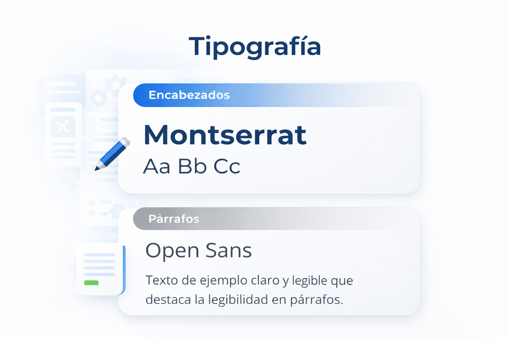
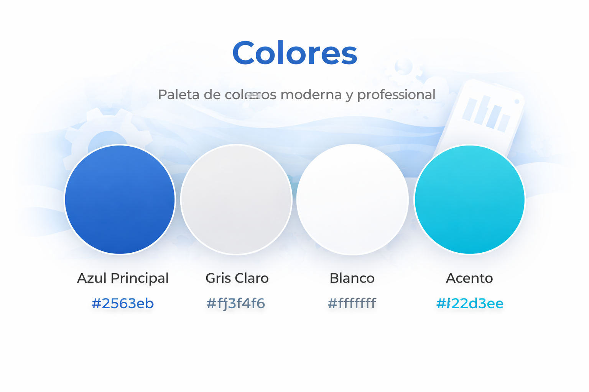
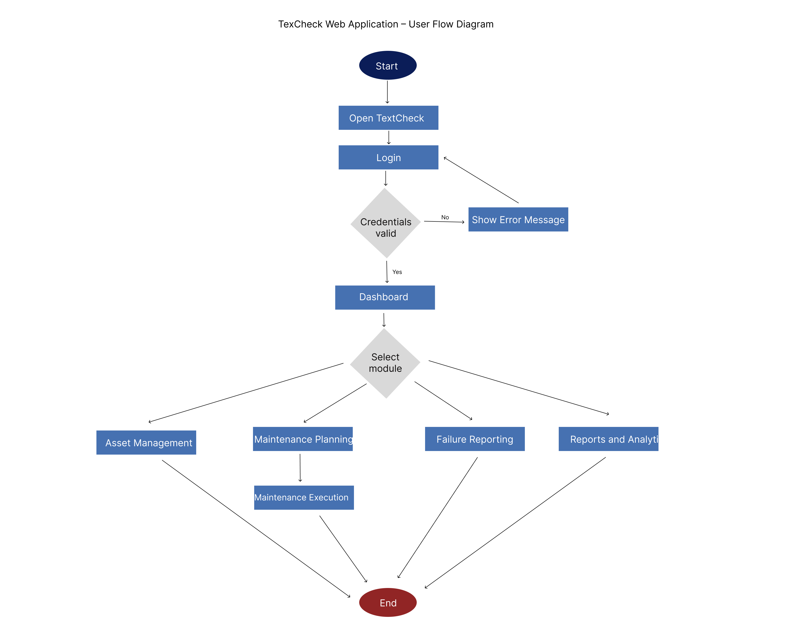

# Universidad Peruana de Ciencias Aplicadas

## Ingeniería de Software

**Ciclo:** 2026 - 01  
**Curso:** Desarrollo de Aplicaciones Open Source  
**NRC:** 20262  
**Docente:** Angel Augusto Velasquez Nuñez 

**Startup:** CodeUp  
**Producto:** TexCheck

| Código      | Nombre                           |
|-------------|----------------------------------|
|  u20241a195 | Diaz Yurivilca, Sofia          |
| U202219199  | Acosta Elera Abraam Bernabe        |
| U202411349  | Diaz Nuñez, Mauricio             |
| U202410421  | Diaz De La Cruz, Sebastian Gabriel |
| U202412462  | Cabrera Sotelo, Camila Celeste     |

**Abril - 2026**

  

---
# Registro de Versiones del Informe

| Versión  | Fecha          | Autor                 | Descripción de modificación |
| :------: | :------------: | :-------------------: | :-------------------------: |
| AV1      | 02 / 04 / 2026 | Todos los integrantes | Primera versión             |

# Project Report Collaboration Insights

---

## **Project Report Online**

### [Capítulo I: Introducción]()
- [1.1. Startup Profile]()
    - [1.1.1 Descripción de la Startup]()
    - [1.1.2 Perfiles de integrantes del equipo]()
- [1.2 Solution Profile]()
    - [1.2.1 Antecedentes y problemática]()
    - [1.2.2 Lean UX Process]()
        - [1.2.2.1. Lean UX Problem Statements]()
        - [1.2.2.2. Lean UX Assumptions]()
        - [1.2.2.3. Lean UX Hypothesis Statements]()
        - [1.2.2.4. Lean UX Canvas]()
- [1.3. Segmentos objetivo]()

### [Capítulo II: Requirements Elicitation & Analysis]()
- [2.1. Competidores]()
    - [2.1.1. Análisis competitivo]()
    - [2.1.2. Estrategias y tácticas frente a competidores]()
- [2.2. Entrevistas]()
    - [2.2.1. Diseño de entrevistas]()
    - [2.2.2. Registro de entrevistas]()
    - [2.2.3. Análisis de entrevistas]()
- [2.3. Needfinding]()
    - [2.3.1. User Personas]()
    - [2.3.2. User Task Matrix]()
    - [2.3.3. User Journey Mapping]()
    - [2.3.4. Empathy Mapping]()
- [2.4. Big Picture Event Storming.]()
- [2.5. Ubiquitous Language]()

### [Capítulo III: Requirements Specification]()
- [3.1. User Stories]()
- [3.2. Impact Mapping]()
- [3.3. Product Backlog]()

### [Capítulo IV: Product Design]()
- [4.1. Style Guidelines]()
    - [4.1.1. General Style Guidelines]()
    - [4.1.2. Web Style Guidelines]()
- [4.2. Information Architecture]()
    - [4.2.1. Organization Systems]()
    - [4.2.2. Labeling Systems]()
    - [4.2.3. SEO Tags and Meta Tags]()
    - [4.2.4. Searching Systems]()
    - [4.2.5. Navigation Systems]()
- [4.3. Landing Page UI Design]()
    - [4.3.1. Landing Page Wireframe]()
    - [4.3.2. Landing Page Mock-up]()
- [4.4. Web Applications UX/UI Design]()
    - [4.4.1. Web Applications Wireframes]()
    - [4.4.2. Web Applications Wireflow Diagrams]()
    - [4.4.3. Web Applications Mock-ups]()
    - [4.4.4. Web Applications User Flow Diagrams]()
- [4.5. Web Applications Prototyping]()
- [4.6. Domain-Driven Software Architecture]()
    - [4.6.1. Design-Level Event Storming]()
    - [4.6.2. Software Architecture Context Diagram]()
    - [4.6.3. Software Architecture Container Diagrams]()
    - [4.6.4. Software Architecture Components Diagrams]()
- [4.7. Software Object-Oriented Design]()
    - [4.7.1. Class Diagrams]()
- [4.8. Database Design]()
    - [4.8.1. Database Diagram]()

### [Capítulo V: Product Implementation, Validation & Deployment]()
- [5.1. Software Configuration Management]()
    - [5.1.1. Software Development Environment Configuration]()
    - [5.1.2. Source Code Management]()
    - [5.1.3. Source Code Style Guide & Conventions]()
    - [5.1.4. Software Deployment Configuration]()
- [5.2. Landing Page, Services & Applications Implementation]()
    - [5.2.1. Sprint 1]()
        - [5.2.1.1. Sprint Planning 1]()
        - [5.2.1.2. Sprint Backlog 1]()
        - [5.2.1.3. Development Evidence for Sprint Review]()
        - [5.2.1.4. Testing Suite Evidence for Sprint Review]()
        - [5.2.1.5. Execution Evidence for Sprint Review]()
        - [5.2.1.6. Services Documentation Evidence for Sprint Review]()
        - [5.2.1.7. Software Deployment Evidence for Sprint Review]()
        - [5.2.1.8. Team Collaboration Insights during Sprint]()

- [Conclusiones y recomendaciones](docs/conclusiones.md)
- [Video About-the-Team](docs/video-about-the-team.md)
- [Bibliografía](docs/bibliografia.md)
- [Anexos](docs/anexos.md)

--- 
# Student Outcome

En esta sección se detallan las actividades realizadas en el trabajo final y el sustento de cómo estas han ayudado a desarrollar las dimensiones del Student Outcome 3 (ABET – EAC), el cual se define como la capacidad de comunicarse efectivamente con un rango de audiencias. La información se presenta a través del siguiente cuadro, donde se especifican las dimensiones de la competencia, las acciones realizadas por cada integrante y las conclusiones generales del equipo.

<table>
  <thead>
    <tr>
      <th>Criterio específico</th>
      <th>Acciones realizadas</th>
      <th>Conclusiones</th>
    </tr>
  </thead>
  <tbody>
    <tr>
      <td>Comunica oralmente con efectividad a diferentes rangos de audiencia.</td>
      <td>
        Acciones realizadas de cada uno aqui...
      </td>
      <td>Conclusiónes aquí...</td>
    </tr>
    <tr>
      <td>Comunica por escrito con efectividad a diferentes rangos de audiencia.</td>
      <td>
        Acciones realizadas de cada uno aqui...
      </td>
      <td>Conclusiónes aquí...</td>
    </tr>
  </tbody>
</table>

---

# Capítulo I: Introducción
## 1.1. Startup Profile
### 1.1.1. Descripción de la Startup
### 1.1.2. Perfiles de integrantes del equipo
## 1.2. Solution Profile
### 1.2.1 Antecedentes y problemática
### 1.2.2 Lean UX Process.
#### 1.2.2.1. Lean UX Problem Statements.
#### 1.2.2.2. Lean UX Assumptions.
#### 1.2.2.3. Lean UX Hypothesis Statements.
#### 1.2.2.4. Lean UX Canvas.
## 1.3. Segmentos objetivo.

---

# Capítulo II: Requirements Elicitation & Analysis
## 2.1. Competidores.
### 2.1.1. Análisis competitivo.
### 2.1.2. Estrategias y tácticas frente a competidores.
## 2.2. Entrevistas.
### 2.2.1. Diseño de entrevistas.
### 2.2.2. Registro de entrevistas.
### 2.2.3. Análisis de entrevistas.
## 2.3. Needfinding.
### 2.3.1. User Personas.
### 2.3.2. User Task Matrix.
### 2.3.3. User Journey Mapping.
### 2.3.4. Empathy Mapping.
## 2.4. Big Picture Event Storming.
## 2.5. Ubiquitous Language.

---

# Capítulo III: Requirements Specification
## 3.1. User Stories.
## 3.2. Impact Mapping
## 3.3. Product Backlog.

---

# Capítulo IV: Product Design
En esta sección se abarca el planteamiento de la propuesta de Software Architecture & Design, incluyendo Domain-Driven Software Architecture, Object-Oriented Software Design, así como UX/UI Design para la experiencia web. Para ello se tomará como base el conjunto de User Stories identificados así como el Impact Map.

## 4.1. Style Guidelines.
En esta sección, el equipo sienta las bases para contar con un repositorio central y organizado de uso común para todo el equipo, que incluye assets, fuentes, paletas de colores y otros recursos. Esto con el fin de mantener una presentación consistente y enfocada en todos los productos desarrollados. Se incluyen secciones para General Style Guidelines, Web Style Guidelines y Mobile Style Guidelines.

### 4.1.1. General Style Guidelines
#### Branding

Para el desarrollo de la identidad visual del proyecto, se ha optado por un diseño de logotipo que representa la esencia y los valores principales de la aplicación. El logotipo utiliza una tipografía moderna y clara, transmitiendo profesionalismo y confianza. El ícono busca reflejar eficiencia, innovación y facilidad de uso. La selección de colores vibrantes y equilibrados refuerza la percepción de estabilidad y dinamismo. La integración de estos elementos visuales comunica el compromiso del equipo con la excelencia y la experiencia del usuario.

  

#### Typography

La tipografía seleccionada para el proyecto combina modernidad y funcionalidad. Se ha elegido una fuente principal sans-serif para los encabezados, que aporta claridad y sofisticación en entornos digitales. Para los textos de párrafo, se utiliza una fuente secundaria que favorece la legibilidad y resalta la información clave, contribuyendo a una experiencia visual atractiva y accesible.

  

#### Colors

La paleta de colores fue definida para transmitir confianza, eficiencia y modernidad. Los tonos principales, como azul y gris, evocan profesionalismo y claridad, mientras que acentos en colores vivos aportan dinamismo y frescura. Esta combinación refuerza la identidad visual del producto como una solución tecnológica amigable y confiable.

  

#### Spacing

El espaciado en la interfaz está cuidadosamente definido para asegurar una presentación limpia y organizada. Se emplea separación uniforme entre elementos, lo que mejora la legibilidad, facilita la navegación y aporta equilibrio visual al diseño. El uso consistente de márgenes y paddings contribuye a una experiencia de usuario clara y agradable.

### 4.1.2. Web Style Guidelines.

TexCheck cuenta con un diseño web adaptable que garantiza una experiencia fluida y consistente en cualquier dispositivo. Se emplea el patrón de diseño en forma de Z, ideal para resaltar las funcionalidades principales como la gestión de activos, la programación de mantenimientos y el acceso a reportes operativos. El logotipo se ubica en la esquina superior izquierda, mientras que la barra de navegación y el llamado a la acción para registrar o programar mantenimientos se sitúan a la derecha, guiando al usuario de manera intuitiva a través de la interfaz. Los elementos visuales y de interacción han sido optimizados para asegurar accesibilidad, legibilidad y facilidad de uso en pantallas de escritorio, tabletas y móviles.

## 4.2. Information Architecture.
En esta sección se presentan las decisiones y fundamentos que guían la organización del contenido en las experiencias web y móvil de TexCheck, incluyendo la Landing Page y las aplicaciones. El objetivo es que los usuarios se adapten fácilmente a la funcionalidad de cada producto y encuentren lo que necesitan sin esfuerzo. Se abordan los Organization Systems y Labeling Systems, entre otros.

### 4.2.1. Organization Systems.

#### Visual Hierarchy

- **Encabezado principal:** En la parte superior de la interfaz se ubican las funciones clave de TexCheck, como la gestión de activos, la programación de mantenimientos y el acceso a reportes operativos, facilitando la navegación y el acceso rápido a las herramientas principales.
- **Panel de acciones:** El usuario puede seleccionar entre diferentes acciones, como registrar un nuevo activo, programar una intervención de mantenimiento o consultar el historial de intervenciones.
- **Zona de resultados:** Los resultados de las operaciones y reportes de mantenimiento se muestran de forma destacada y clara, permitiendo al usuario interpretar fácilmente el estado de los activos y las alertas relevantes.

#### Step by Step to Accomplish.

Este enfoque se implementa para guiar al usuario en procesos secuenciales, como el registro y control de activos textiles, la programación y ejecución de mantenimientos, y la consulta de reportes, asegurando claridad y evitando errores.

**User Goal:**  
Quiero gestionar y controlar eficientemente el mantenimiento de los activos textiles de mi planta, minimizando fallas y optimizando la producción.

**User Flow:**
1. Registrar o actualizar un activo textil (máquina, equipo, etc.).
2. Programar una rutina de mantenimiento preventivo o correctivo.
3. Registrar la ejecución de la tarea de mantenimiento.
4. Visualizar reportes de historial y alertas de fallas.

**Wireflow:**
- El usuario accede al dashboard principal y visualiza el estado de los activos.
- Selecciona un activo para ver detalles o programar mantenimiento.
- Registra la intervención realizada, adjuntando observaciones y repuestos usados.
- Consulta reportes y gráficos de desempeño y alertas en tiempo real.

### 4.2.2. Labeling Systems.

TexCheck utiliza un sistema de etiquetas y botones intuitivos para que los usuarios, ya sean técnicos de mantenimiento, jefes de planta o gerentes, puedan registrar, monitorear y gestionar activos textiles fácilmente.

- Los botones principales están claramente etiquetados: “Registrar activo”, “Programar mantenimiento”, “Registrar intervención”, “Ver reportes”.
- Los filtros y opciones utilizan etiquetas como “Tipo de activo”, “Estado”, “Fecha de próxima intervención”, “Prioridad”.
- Las alertas y mensajes de ayuda son breves y directos: “Mantenimiento pendiente”, “Falla detectada”, “Intervención registrada exitosamente”.
- En los reportes se incluyen etiquetas como “Historial de intervenciones”, “Alertas críticas”, “Disponibilidad de activos”.

### 4.2.3. SEO Tags and Meta Tags
Los SEO tags y meta tags son fundamentales para mejorar el posicionamiento de TexCheck en motores de búsqueda y ofrecer información relevante sobre cada página. A continuación, se presentan los principales tags que se utilizarán tanto en la Landing Page como en la Web Application:

**Landing Page:**
- Title Tag: `<title>TexCheck - Gestión de Mantenimiento Textil</title>`
- Meta Description: `<meta name="description" content="TexCheck es una plataforma digital para la gestión eficiente de activos y mantenimiento en la industria textil, optimizando la operatividad y reduciendo costos." />`
- Meta Keywords: `<meta name="keywords" content="mantenimiento textil, gestión de activos, industria textil, mantenimiento preventivo, TexCheck" />`
- Meta Author: `<meta name="author" content="Equipo TexCheck" />`
- Meta Viewport: `<meta name="viewport" content="width=device-width, initial-scale=1.0" />`
- Language Tag: `<meta http-equiv="Content-Language" content="es-PE">`
- Robots Tag: `<meta name="robots" content="index, follow">`
- Canonical Tag: `<link rel="canonical" href="https://www.texcheck.com/">`

**Web Application:**
- Title Tag: `<title>Panel de Control - TexCheck</title>`
- Meta Description: `<meta name="description" content="Panel de control para la gestión de activos, programación de mantenimientos y visualización de reportes en TexCheck." />`
- Meta Keywords: `<meta name="keywords" content="panel de control, activos textiles, reportes mantenimiento, TexCheck" />`
- Meta Author: `<meta name="author" content="Equipo TexCheck" />`
- Meta Viewport: `<meta name="viewport" content="width=device-width, initial-scale=1.0" />`
- Language Tag: `<meta http-equiv="Content-Language" content="es-PE">`
- Robots Tag: `<meta name="robots" content="noindex, nofollow">`
- Canonical Tag: `<link rel="canonical" href="https://www.texcheck.com/app">`
### 4.2.4. Searching Systems.
En TexCheck, los sistemas de búsqueda están diseñados para que los usuarios encuentren rápidamente información relevante sobre activos, mantenimientos y reportes. Se implementan las siguientes opciones:

- **Búsqueda de activos:** Permite localizar máquinas o equipos específicos mediante filtros como tipo de activo, estado, ubicación o código de inventario.
- **Búsqueda de mantenimientos:** Los usuarios pueden filtrar tareas programadas o ejecutadas por fecha, tipo de mantenimiento (preventivo/correctivo), responsable o prioridad.
- **Búsqueda en reportes:** Se ofrecen filtros avanzados para consultar el historial de intervenciones, alertas críticas y disponibilidad de activos.

Tras realizar una búsqueda, los resultados se presentan en tablas dinámicas y visualizaciones gráficas, facilitando la interpretación y toma de decisiones.
### 4.2.5. Navigation Systems.
El sistema de navegación de TexCheck está diseñado para guiar a los usuarios de manera intuitiva a través de la Landing Page y la Web Application, permitiéndoles cumplir sus objetivos de forma eficiente:

- **Menú principal:** Acceso rápido a las secciones clave: Dashboard, Activos, Mantenimientos, Reportes y Perfil de usuario.
- **Breadcrumbs:** Indican la ubicación actual del usuario dentro de la aplicación y facilitan el regreso a secciones previas.
- **Accesos directos:** Botones destacados para registrar activos, programar mantenimientos o generar reportes desde cualquier pantalla.
- **Panel lateral:** En la Web Application, un panel lateral permite navegar entre módulos sin perder el contexto de trabajo.
- **Ayuda contextual:** En cada sección, enlaces de ayuda y soporte técnico para resolver dudas o reportar incidencias.
  
## 4.3. Landing Page UI Design.

### 4.3.1. Landing Page Wireframe.

En esta sección se presentan los wireframes del Landing Page de TexCheck. Los wireframes permiten visualizar la estructura inicial de la página, mostrando la organización del contenido, la jerarquía visual y la distribución de los elementos antes de aplicar el diseño final.

Los wireframes fueron diseñados siguiendo los principios de arquitectura de información y jerarquía visual definidos previamente. La estructura organiza el contenido en secciones claras que permiten comunicar la propuesta de valor del producto de manera progresiva.

Hero y navegación:

Esta sección muestra la navegación principal junto con la sección hero del landing page. Aquí se presenta el logotipo de TexCheck, los enlaces de navegación y el llamado a la acción principal. El hero comunica la propuesta de valor del producto y guía al usuario hacia la exploración de la plataforma.

Problema y solución:

En esta sección se presentan los principales problemas relacionados con la gestión de mantenimiento en la industria textil, así como la propuesta de solución ofrecida por TexCheck. El objetivo es explicar claramente el contexto del problema y cómo la plataforma ayuda a resolverlo.

Funcionalidades y video:

Esta sección presenta las principales funcionalidades de la plataforma, organizadas en tarjetas que explican las capacidades del sistema. También incluye un espacio destinado a un video demostrativo donde se puede presentar el funcionamiento del sistema o la explicación del proyecto por parte del equipo.

Beneficios y footer:

La sección final del landing page resume los beneficios que TexCheck ofrece a los usuarios y presenta el footer del sitio web, donde se incluyen enlaces adicionales, información de contacto y navegación secundaria.
### 4.3.2. Landing Page Mock-up.

## 4.4. Web Applications UX/UI Design.
### 4.4.1. Web Applications Wireframes.

Los wireframes representan la estructura básica de las interfaces de la aplicación TexCheck. Estas representaciones de baja fidelidad permiten visualizar la organización de los elementos principales dentro de cada pantalla, tales como menús de navegación, formularios, tablas, botones y secciones de información.

El objetivo de los wireframes es definir la distribución del contenido y validar la usabilidad del sistema antes de aplicar el diseño visual final. De esta manera, se prioriza la funcionalidad y la lógica de interacción, facilitando la identificación de posibles mejoras en la navegación y en la organización de la información.

En TexCheck, los wireframes fueron diseñados para representar las principales funcionalidades del sistema, incluyendo la autenticación de usuarios, el panel principal de monitoreo, la gestión de activos y la planificación de mantenimientos.

---

### 4.4.2. Web Applications Wireflow Diagrams.

Los wireflow diagrams combinan wireframes con diagramas de flujo para representar cómo los usuarios navegan entre las diferentes pantallas de la aplicación. Este tipo de representación permite comprender visualmente la secuencia de interacción dentro del sistema y las acciones que desencadenan cada transición entre interfaces.

El wireflow facilita la identificación de las rutas de navegación más importantes dentro de la plataforma, mostrando cómo los usuarios acceden desde la pantalla de inicio de sesión hacia el panel principal y posteriormente hacia los distintos módulos del sistema.

---

### 4.4.3. Web Applications Mock-ups.

Los mock-ups representan el diseño visual de alta fidelidad de la aplicación TexCheck. En esta etapa se incorporan los elementos gráficos definidos en las guías de estilo, incluyendo la paleta de colores, la tipografía, los componentes visuales y la jerarquía de información dentro de cada interfaz.

A diferencia de los wireframes, los mock-ups permiten visualizar cómo se verá la aplicación en su versión final, mostrando detalles como gráficos, tarjetas informativas, tablas dinámicas e indicadores de estado.

---

### 4.4.4. Web Applications User Flow Diagrams

Los User Flow Diagrams representan el recorrido que realiza el usuario dentro de la aplicación para completar una tarea específica. Estos diagramas permiten visualizar las acciones, decisiones y transiciones que ocurren durante la interacción con el sistema.

A través de los user flows se identifican los pasos necesarios para que un usuario pueda acceder al sistema, gestionar activos, programar mantenimientos o registrar fallas en los equipos. Este tipo de representación facilita la comprensión de la lógica de interacción y permite optimizar la experiencia del usuario.

  

---

## 4.5. Web Applications Prototyping.
## 4.6. Domain-Driven Software Architecture.
### 4.6.1. Design-Level Event Storming.
### 4.6.2. Software Architecture Context Diagram.
### 4.6.3. Software Architecture Container Diagrams.
### 4.6.4. Software Architecture Components Diagrams.
## 4.7. Software Object-Oriented Design.
### 4.7.1. Class Diagrams.
## 4.8. Database Design.
### 4.8.1. Database Diagrams.

--- 

# Capítulo V: Product Implementation, Validation & Deployment.
## 5.1. Software Configuration Management.
### 5.1.1. Software Development Environment Configuration.
### 5.1.2. Source Code Management.
### 5.1.3. Source Code Style Guide & Conventions.
### 5.1.4. Software Deployment Configuration.
## 5.2. Landing Page, Services & Applications Implementation.
### 5.2.1. Sprint 1
#### 5.2.1.1. Sprint Planning 1.
#### 5.2.1.2. Aspect Leaders and Collaborators.
#### 5.2.1.3. Sprint Backlog 1.
#### 5.2.1.4. Development Evidence for Sprint Review.
#### 5.2.1.5. Execution Evidence for Sprint Review.
#### 5.2.1.6. Services Documentation Evidence for Sprint Review.
#### 5.2.1.7. Software Deployment Evidence for Sprint Review.
#### 5.2.1.8. Team Collaboration Insights during Sprint.

# Conclusiones

---

# Bibliografía

---

# Anexos
