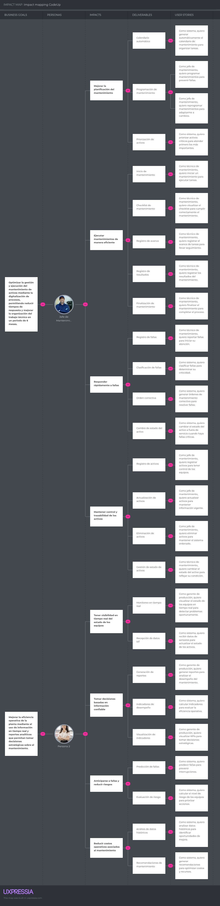
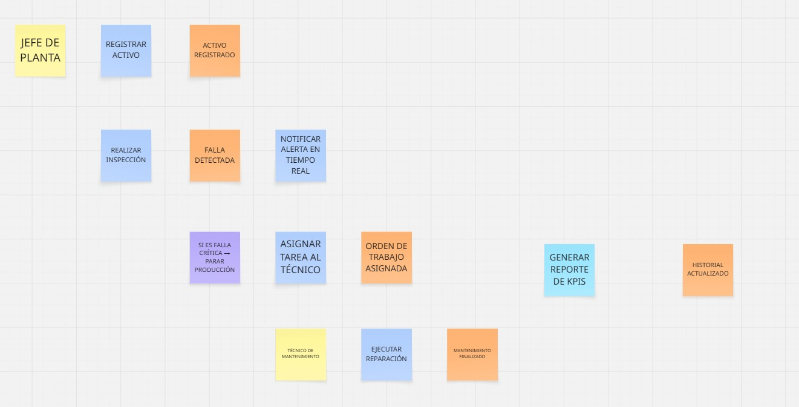
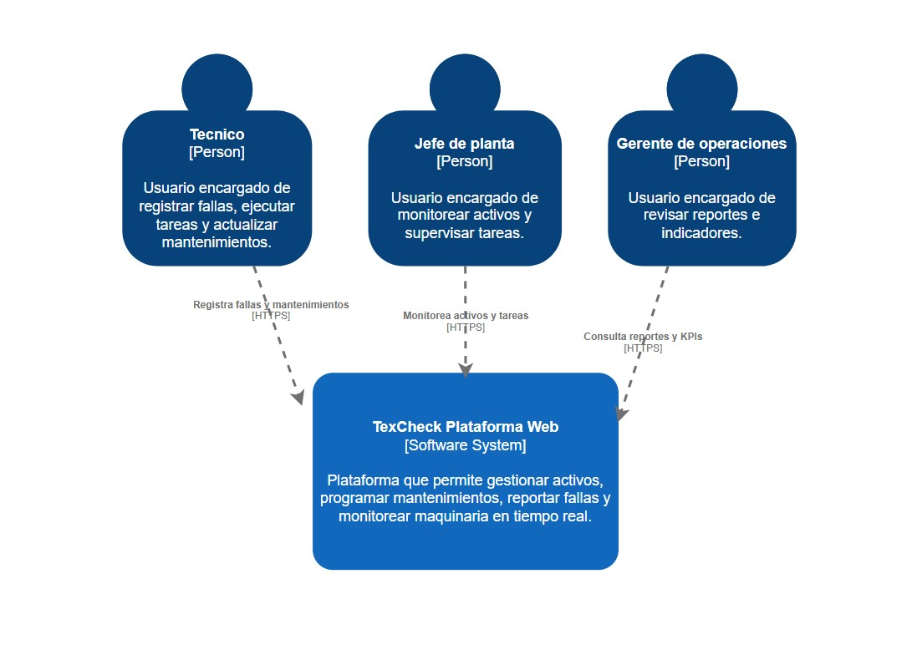
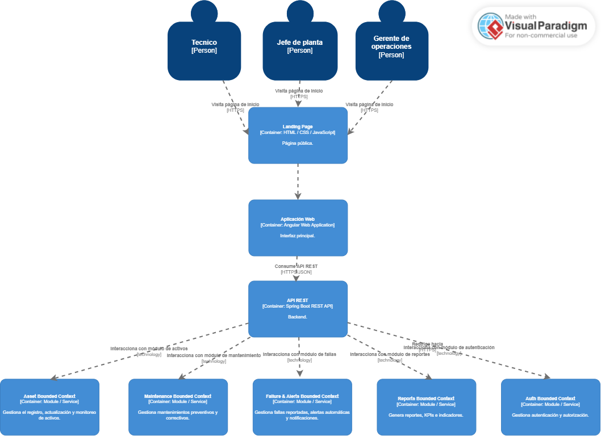
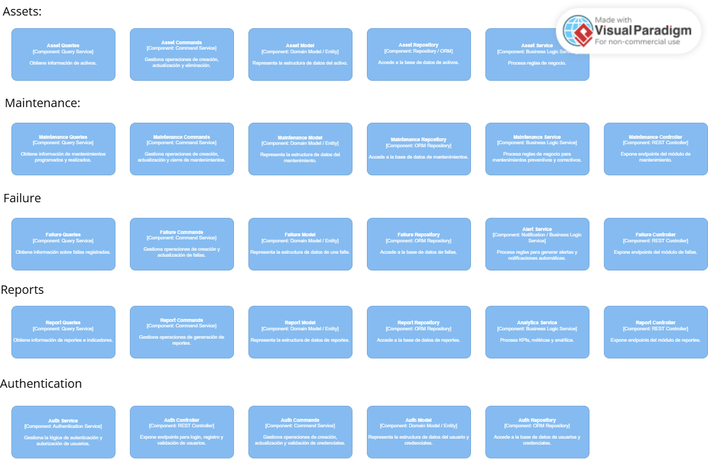

<div align="center">

# Universidad Peruana de Ciencias Aplicadas


## Ingeniería de Software

</div>

<div align="center">

**Ciclo:** 2026 - 01  
**Curso:** Desarrollo de Aplicaciones Open Source  
**NRC:** 20262  
**Docente:** Angel Augusto Velasquez Nuñez 

**Startup:** CodeUp  
**Producto:** TexCheck

| Código      | Nombre                           |
|-------------|----------------------------------|
|  u20241a195 | Diaz Yurivilca, Sofia          |
| U202219199  | Acosta Elera Abraam Bernabe        |
| U202411349  | Diaz Nuñez, Mauricio             |
| U202410421  | Diaz De La Cruz, Sebastian Gabriel |
| U202412462  | Cabrera Sotelo, Camila Celeste     |


**Abril - 2026**

  
</div>

---
# Registro de Versiones del Informe

<div align="center">

| Versión  | Fecha          | Autor                 | Descripción de modificación |
| :------: | :------------: | :-------------------: | :-------------------------: |
| AV1      | 02 / 04 / 2026 | Todos los integrantes | Primera versión             |

</div>

# Project Report Collaboration Insights

[](https://github.com/1ASI0729-2610-20262-CodeUp/TexCheck)

---

## **Project Report Online**

### [Capítulo I: Introducción]()
- [1.1. Startup Profile]()
    - [1.1.1 Descripción de la Startup]()
    - [1.1.2 Perfiles de integrantes del equipo]()
- [1.2 Solution Profile]()
    - [1.2.1 Antecedentes y problemática]()
    - [1.2.2 Lean UX Process]()
        - [1.2.2.1. Lean UX Problem Statements]()
        - [1.2.2.2. Lean UX Assumptions]()
        - [1.2.2.3. Lean UX Hypothesis Statements]()
        - [1.2.2.4. Lean UX Canvas]()
- [1.3. Segmentos objetivo]()

### [Capítulo II: Requirements Elicitation & Analysis]()
- [2.1. Competidores]()
    - [2.1.1. Análisis competitivo]()
    - [2.1.2. Estrategias y tácticas frente a competidores]()
- [2.2. Entrevistas]()
    - [2.2.1. Diseño de entrevistas]()
    - [2.2.2. Registro de entrevistas]()
    - [2.2.3. Análisis de entrevistas]()
- [2.3. Needfinding]()
    - [2.3.1. User Personas]()
    - [2.3.2. User Task Matrix]()
    - [2.3.3. User Journey Mapping]()
    - [2.3.4. Empathy Mapping]()
- [2.4. Big Picture Event Storming.]()
- [2.5. Ubiquitous Language]()

### [Capítulo III: Requirements Specification]()
- [3.1. User Stories]()
- [3.2. Impact Mapping]()
- [3.3. Product Backlog]()

### [Capítulo IV: Product Design]()
- [4.1. Style Guidelines]()
    - [4.1.1. General Style Guidelines]()
    - [4.1.2. Web Style Guidelines]()
- [4.2. Information Architecture]()
    - [4.2.1. Organization Systems]()
    - [4.2.2. Labeling Systems]()
    - [4.2.3. SEO Tags and Meta Tags]()
    - [4.2.4. Searching Systems]()
    - [4.2.5. Navigation Systems]()
- [4.3. Landing Page UI Design]()
    - [4.3.1. Landing Page Wireframe]()
    - [4.3.2. Landing Page Mock-up]()
- [4.4. Web Applications UX/UI Design]()
    - [4.4.1. Web Applications Wireframes]()
    - [4.4.2. Web Applications Wireflow Diagrams]()
    - [4.4.3. Web Applications Mock-ups]()
    - [4.4.4. Web Applications User Flow Diagrams]()
- [4.5. Web Applications Prototyping]()
- [4.6. Domain-Driven Software Architecture]()
    - [4.6.1. Design-Level Event Storming]()
    - [4.6.2. Software Architecture Context Diagram]()
    - [4.6.3. Software Architecture Container Diagrams]()
    - [4.6.4. Software Architecture Components Diagrams]()
- [4.7. Software Object-Oriented Design]()
    - [4.7.1. Class Diagrams]()
- [4.8. Database Design]()
    - [4.8.1. Database Diagram]()

### [Capítulo V: Product Implementation, Validation & Deployment]()
- [5.1. Software Configuration Management]()
    - [5.1.1. Software Development Environment Configuration]()
    - [5.1.2. Source Code Management]()
    - [5.1.3. Source Code Style Guide & Conventions]()
    - [5.1.4. Software Deployment Configuration]()
- [5.2. Landing Page, Services & Applications Implementation]()
    - [5.2.1. Sprint 1]()
        - [5.2.1.1. Sprint Planning 1]()
        - [5.2.1.2. Sprint Backlog 1]()
        - [5.2.1.3. Development Evidence for Sprint Review]()
        - [5.2.1.4. Testing Suite Evidence for Sprint Review]()
        - [5.2.1.5. Execution Evidence for Sprint Review]()
        - [5.2.1.6. Services Documentation Evidence for Sprint Review]()
        - [5.2.1.7. Software Deployment Evidence for Sprint Review]()
        - [5.2.1.8. Team Collaboration Insights during Sprint]()

- [Conclusiones y recomendaciones](docs/conclusiones.md)
- [Video About-the-Team](docs/video-about-the-team.md)
- [Bibliografía](docs/bibliografia.md)
- [Anexos](docs/anexos.md)

--- 
# Student Outcome

En esta sección se detallan las actividades realizadas en el trabajo final y el sustento de cómo estas han ayudado a desarrollar las dimensiones del Student Outcome 3 (ABET – EAC), el cual se define como la capacidad de comunicarse efectivamente con un rango de audiencias. La información se presenta a través del siguiente cuadro, donde se especifican las dimensiones de la competencia, las acciones realizadas por cada integrante y las conclusiones generales del equipo.

<table>
  <thead>
    <tr>
      <th>Criterio específico</th>
      <th>Acciones realizadas</th>
      <th>Conclusiones</th>
    </tr>
  </thead>
  <tbody>
    <tr>
      <td>Comunica oralmente con efectividad a diferentes rangos de audiencia.</td>
      <td>
        Acciones realizadas de cada uno aqui...
      </td>
      <td>Conclusiónes aquí...</td>
    </tr>
    <tr>
      <td>Comunica por escrito con efectividad a diferentes rangos de audiencia.</td>
      <td>
        Acciones realizadas de cada uno aqui...
      </td>
      <td>Conclusiónes aquí...</td>
    </tr>
  </tbody>
</table>

---

# Capítulo I: Introducción
## 1.1. Startup Profile

TexCheck es una empresa emergente con un enfoque tecnológico e industrial, orientada a la transformación digital de la gestión del mantenimiento en el sector manufacturero. Su propósito es ofrecer una plataforma de software integral (Web y Mobile) diseñada específicamente para optimizar la operatividad de las empresas textiles, permitiendo un control técnico detallado y una reducción significativa de costos operativos mediante la prevención estratégica de fallas.

La iniciativa surge a partir de la observación de un problema recurrente en las plantas de producción: la ocurrencia de fallas inesperadas en equipos críticos, lo que genera elevados costos por reparaciones correctivas y una falta de trazabilidad en el historial de intervenciones técnicas. Ante esta situación, TexCheck busca convertirse en la herramienta estándar para el sector, facilitando el registro de activos, la programación automatizada de rutinas de mantenimiento y la toma de decisiones basada en datos históricos organizados.

#### Misión y Visión de TexCheck

| Concepto | Definición |
| :--- | :--- |
| **Misión** | Optimizar la gestión del mantenimiento industrial mediante una solución digital ágil y eficiente, que permita a las empresas textiles maximizar la disponibilidad de sus activos y reducir costos imprevistos a través de procesos estandarizados. |
| **Visión** | Convertirse en la plataforma líder en gestión de mantenimiento preventivo para la industria textil a nivel nacional, impulsando la excelencia operativa y la digitalización de procesos técnicos en toda la cadena de producción. |

### 1.1.1. Descripción de la Startup

| Foto | Nombres y Apellidos | Código | Carrera | Conocimientos y Habilidades |
| :---: | :--- | :---: | :--- | :--- |
|   | Diaz Yurivilca, Sofia | u20241a195 |  | Trabajo en equipo, comunicación efectiva, organización de tareas |
|  | Acosta Elera Abraam Bernabe | U202219199 |  | Resolución de problemas, análisis de información, colaboración en proyectos |
|  | Diaz Nuñez, Mauricio | U202411349 |  | Pensamiento analítico, investigación, gestión de información |
|  | Diaz De La Cruz, Sebastian Gabriel | U202410421 | Ingeniería de Software | Programación, desarrollo web, diseño de interfaces, lógica de programación, trabajo en equipo |
|  | Cabrera Sotelo, Camila Celeste | U202412462 | Ingeniería de Software | Desarrollo de software, diseño UI/UX, análisis de requerimientos, trabajo colaborativo, pensamiento lógico |

## 1.2 Solution Profile

### 1.2.1. Antecedentes y problemática

En la actualidad, la industria textil es uno de los pilares de la manufactura; sin embargo, la gestión de sus activos críticos sigue anclada en métodos tradicionales. Mientras la industria global avanza hacia la digitalización (Industria 4.0), muchas empresas locales aún dependen de registros manuales y procesos reactivos, lo que genera una brecha competitiva y operativa significativa.

**What (¿Qué?):**
El problema identificado es la ineficiencia en la gestión del mantenimiento de maquinaria textil. Existe una carencia de sistemas organizados que permitan programar, ejecutar y supervisar las intervenciones técnicas de forma sistemática. Esto provoca que la información técnica sea fragmentada, poco confiable y difícil de analizar para la mejora de procesos.

**When (¿Cuándo?):**
El problema se manifiesta de forma recurrente, especialmente durante los picos de producción donde la maquinaria es sometida a una carga de trabajo intensiva. La falta de mantenimiento preventivo resulta en fallas imprevistas que detienen líneas enteras de producción.

**Who (¿Quiénes?):**
Los principales afectados son los Jefes de Planta, quienes no logran cumplir con los plazos de entrega por paradas no programadas, y los Técnicos de Mantenimiento, quienes enfrentan una sobrecarga de trabajo correctivo. La empresa sufre pérdidas económicas y daños en su reputación frente a clientes.

**Why (¿Por qué?):**
La causa principal radica en la ausencia de una cultura de mantenimiento predictivo soportada por herramientas digitales. La dependencia de formatos físicos impide identificar patrones de falla, condenando a la empresa a un ciclo reactivo donde solo se actúa cuando el equipo deja de funcionar.

**How (¿Cómo?):**
La solución es TexCheck, una plataforma integral que centraliza la gestión de activos. Permite la creación de un inventario digital, la programación automatizada de tareas mediante checklists estandarizados y la generación de alertas en tiempo real.

**How Much (¿Cuánto?):**
El costo de una gestión ineficiente puede representar pérdidas de entre el 15% y 30% del tiempo de producción anual (Downtime). Una parada de planta no programada en una línea mediana puede generar pérdidas significativas en lucro cesante y costos de reparación de emergencia.

### 1.2.2. Lean UX Process

TexCheck busca transformar la gestión operativa en las plantas textiles, centrando la experiencia en el operario y el jefe de mantenimiento para garantizar que la transición del papel a lo digital sea intuitiva y eficiente. Aplicamos el marco Lean UX para validar hipótesis de diseño rápidamente, asegurando que la solución evolucione a partir de la retroalimentación real del personal técnico y gerencial del sector manufacturero.

#### 1.2.2.1 Lean UX Problem Statements

**Declaración del problema de negocio:**
Hemos observado que la falta de un sistema automatizado de mantenimiento preventivo está causando un incremento del 20% en costos de reparación y paradas imprevistas.

**Declaración del problema de usuario:**
Los técnicos de mantenimiento se ven afectados por la desorganización de órdenes de trabajo manuales, mientras que los jefes de planta carecen de visibilidad en tiempo real sobre el estado de sus activos.

**Meta:**
¿Cómo podemos optimizar la programación de tareas mediante una solución digital para reducir el downtime de las máquinas en un 15% durante los primeros seis meses?

#### 1.2.2.2. Lean UX Assumptions

**Feature: Sistema integral de gestión y monitoreo de mantenimiento textil**

* **Inventario Digital y Hoja de Vida de Activos:** Creemos que nuestros usuarios (jefes de planta y técnicos) necesitan una forma centralizada y digital de registrar la información técnica de cada máquina. Esto permitirá eliminar la dispersión de datos en papel y facilitará un seguimiento histórico preciso para cada activo.
* **Monitoreo de Rutinas mediante Checklists Digitales:** Creemos que la implementación de listas de verificación digitales en dispositivos móviles permitirá estandarizar las inspecciones preventivas. Esto facilitará que los técnicos sigan los protocolos de seguridad y mantenimiento sin omisiones, impactando positivamente en la disponibilidad de la maquinaria.
* **Alertas Automáticas y Notificaciones de Mantenimiento:** Creemos que los usuarios se beneficiarán al recibir alertas automáticas basadas en calendarios programados o uso de máquina. Esta integración permitirá realizar intervenciones oportunas antes de que ocurran fallas críticas, optimizando los tiempos de respuesta del equipo técnico.
* **Dashboard de Indicadores y Análisis de Fallas:** Creemos que disponer de un registro histórico y estadísticas de mantenimiento (KPIs como MTBF o MTTR) ayudará a la gerencia a identificar patrones de falla y cuellos de botella, promoviendo una cultura de mantenimiento predictivo.

**Business Outcomes**

* Se maximizará la continuidad operativa de la planta y se reducirán las pérdidas económicas por paradas no programadas (downtime).
* Se generarán ingresos mediante un modelo de suscripción SaaS para empresas textiles y servicios de consultoría en optimización de procesos.
* TexCheck se posicionará como la herramienta líder en digitalización para la industria manufacturera textil, mejorando la competitividad del sector.

**Users**

* **Jefes de Planta y Gerentes de Operaciones:** Buscan optimizar la rentabilidad y el control de sus activos industriales.
* **Técnicos de Mantenimiento:** Requieren herramientas móviles para agilizar sus reportes y acceder a información técnica en el campo.
* **Personal de Calidad:** Audita el cumplimiento de normativas y estándares de seguridad industrial.

**User Outcomes**

* Reducir el error humano y la carga administrativa al eliminar el llenado manual de formatos físicos.
* Acceder de forma inmediata a la "hoja de vida" y manuales de cada máquina mediante el escaneo de códigos QR.
* Visualizar métricas de rendimiento en tiempo real para facilitar la planificación semanal y mensual.

**Features**

* **Módulo de Activos:** Registro detallado de maquinaria con códigos QR únicos.
* **Checklists Digitales:** Formularios móviles para inspecciones preventivas y correctivas.
* **Sistema de Alertas:** Notificaciones push y correos para mantenimientos vencidos o críticos.
* **Panel de Control (Dashboard):** Visualización de métricas de disponibilidad y fallas recurrentes.
* **Historial Técnico:** Almacenamiento centralizado de todas las intervenciones realizadas.

#### 1.2.2.3. Lean UX Hypothesis Statements

**Hypothesis Statement 01**

* **Creemos** que la implementación de un inventario digital con códigos QR permitirá a los técnicos acceder y registrar intervenciones de forma más ágil que el sistema manual actual.
* **Sabemos** que la hipótesis se confirma cuando se observe una reducción en el tiempo promedio de registro de incidencias reportado por el personal de planta.
* **Cuando** al menos el 70% de los reportes técnicos se realicen directamente desde la aplicación móvil durante el primer mes de despliegue.

**Hypothesis Statement 02**

* **Creemos** que al ofrecer checklists estandarizados y alertas automáticas, el cumplimiento de las rutinas de mantenimiento preventivo será más estricto y efectivo.
* **Sabemos** que la hipótesis es correcta cuando el registro de tareas preventivas completadas aumente y se registre una disminución en las solicitudes de mantenimiento correctivo de emergencia.
* **Cuando** se logre un incremento del 30% en el cumplimiento del plan anual de mantenimiento preventivo en el primer semestre de uso.

**Hypothesis Statement 03**

* **Creemos** que la visualización de indicadores (KPIs) en un dashboard interactivo motivará a los jefes de planta a tomar decisiones basadas en datos para la renovación o mejora de maquinaria.
* **Sabemos** que esto es cierto cuando los gerentes utilicen activamente los reportes de TexCheck para sustentar sus planes de inversión o cambios de procesos operativos.
* **Cuando** el uso de la plataforma genere datos que permitan reducir el tiempo de inactividad de las máquinas (downtime) en un 15% anual.

---

#### 1.2.2.4. Lean UX Canvas

El Lean UX Canvas es una de las herramientas fundamentales que hemos utilizado para comprender a nuestros posibles usuarios y sus necesidades. Esta herramienta es ampliamente empleada en el campo del diseño centrado en el usuario y la metodología Lean, con la intención de desarrollar productos de forma eficiente y práctica. Asimismo, facilita la colaboración de equipos multidisciplinarios de forma ordenada dentro de un marco estructurado, asegurando que cada funcionalidad aporte valor real al negocio y al cliente.

<div align="center">
  
</div>

## 1.3. Segmentos objetivo

### 1) Personal Técnico de Mantenimiento (Perfil Operativo)

* **Definición del segmento:** Técnicos especialistas (20–45 años) responsables de la ejecución directa del mantenimiento en planta.
* **Determinantes y motivaciones:** Eficiencia en la ejecución, reducción de errores y digitalización de reportes diarios.
* **Necesidades y tareas (JTBD):** Registrar intervenciones rápido, seguir checklists estandarizados y acceder a manuales técnicos en el móvil.
* **Fricciones:** Exceso de burocracia en papel y comunicación lenta ante fallas críticas.
* **Criterios de elección:** Interfaz intuitiva para entornos industriales y notificaciones de tareas pendientes.
* **Situaciones de uso:** Inspecciones diarias, detección de anomalías y cambios de turno.
* **Mensajes clave:** "Digitaliza tu mantenimiento y optimiza tu tiempo en planta."

### 2) Jefes de Planta y Gerentes de Operaciones (Perfil Estratégico)

* **Definición del segmento:** Ingenieros y gestores (30–55 años) responsables de la rentabilidad y planificación de la producción.
* **Determinantes y motivaciones:** Maximizar la vida útil de maquinaria y reducción de costos operativos.
* **Necesidades y tareas (JTBD):** Programar ciclos preventivos automáticamente y visualizar indicadores (KPIs) en tiempo real.
* **Fricciones:** Incertidumbre sobre el estado de activos y falta de trazabilidad en las intervenciones.
* **Criterios de elección:** Dashboard centralizado, escalabilidad de la plataforma y reportes automáticos.
* **Situaciones de uso:** Planificación semanal, auditorías de calidad y análisis de resultados.
* **Mensajes clave:** "Toma el control estratégico de tu planta con datos en tiempo real."


## 1.3. Segmentos objetivo.

---

# Capítulo II: Requirements Elicitation & Analysis
## 2.1. Competidores.
### 2.1.1. Análisis competitivo.

<table>
  <tr>
    <th colspan="6" valign="top">Competitive Analysis Landscape</th>
  </tr>
  <tr>
    <td colspan="2" valign="top">¿Por qué llevar a cabo este análisis?</td>
    <td colspan="4" valign="top">
      El objetivo de este análisis es identificar las características de los competidores en el sector de gestión de mantenimiento industrial (CMMS) y determinar oportunidades de diferenciación para TexCheck, enfocándonos en el sector textil.
    </td>
  </tr>
 <tr>
  <td colspan="2" rowspan="2" valign="top">Startup y Competidores</td>

  <td align="center">
    Nuestra Startup<br>
    
  </td>

  <td align="center">
    IBM Maximo<br>
    
  </td>

  <td align="center">
    Fiix CMMS<br>
    
  </td>

  <td align="center">
    UpKeep<br>
    
  </td>
</tr>
  <tr>
  </tr>
  <tr>
    <td rowspan="2" valign="top">Perfil</td>
    <td valign="top">Overview</td>
    <td valign="top">
      Plataforma digital enfocada en la gestión de mantenimiento preventivo en la industria textil, con control de activos, programación automatizada y reportes en tiempo real.
    </td>
    <td valign="top">
      Sistema avanzado de gestión de activos empresariales (EAM) orientado a grandes corporaciones con analítica compleja.
    </td>
    <td valign="top">
      Software CMMS basado en la nube que permite gestionar órdenes de trabajo, activos y mantenimiento preventivo.
    </td>
    <td valign="top">
      Aplicación móvil de mantenimiento enfocada en técnicos para gestionar tareas y reportes rápidamente.
    </td>
  </tr>
  <tr>
    <td valign="top">Ventaja competitiva ¿Qué valor ofrece a los clientes?</td>
    <td valign="top">
      Especialización en el sector textil, facilidad de uso, implementación rápida y enfoque en reducción de downtime mediante mantenimiento preventivo.
    </td>
    <td valign="top">
      Alta capacidad de personalización, escalabilidad y analítica avanzada.
    </td>
    <td valign="top">
      Interfaz amigable y rápida implementación en la nube.
    </td>
    <td valign="top">
      Enfoque mobile-first y facilidad de uso para técnicos operativos.
    </td>
  </tr>
  <tr>
    <td rowspan="2" valign="top">Perfil de Marketing</td>
    <td valign="top">Mercado objetivo</td>
    <td valign="top">
      Empresas textiles pequeñas y medianas que buscan digitalizar su mantenimiento.
    </td>
    <td valign="top">
      Grandes empresas industriales con alta complejidad operativa.
    </td>
    <td valign="top">
      Empresas medianas que buscan soluciones CMMS accesibles.
    </td>
    <td valign="top">
      Técnicos y equipos de mantenimiento en diversas industrias.
    </td>
  </tr>
  <tr>
    <td valign="top">Estrategias de marketing</td>
    <td valign="top">
      Enfoque en nicho textil, demostraciones prácticas, contenido educativo sobre mantenimiento preventivo.
    </td>
    <td valign="top">
      Ventas corporativas, consultoría especializada y alianzas estratégicas.
    </td>
    <td valign="top">
      Marketing digital, pruebas gratuitas y contenido educativo.
    </td>
    <td valign="top">
      Promoción en apps móviles, enfoque en facilidad de uso y rapidez.
    </td>
  </tr>
  <tr>
    <td rowspan="3" valign="top">Perfil de Producto</td>
    <td valign="top">Productos & Servicios</td>
    <td valign="top">
      Gestión de activos, mantenimiento preventivo, alertas en tiempo real, reportes y dashboards.
    </td>
    <td valign="top">
      Gestión integral de activos empresariales y analítica avanzada.
    </td>
    <td valign="top">
      Gestión de mantenimiento, órdenes de trabajo y reportes.
    </td>
    <td valign="top">
      Gestión de tareas, checklists y reportes móviles.
    </td>
  </tr>
  <tr>
    <td valign="top">Precios & Costos</td>
    <td valign="top">
      Modelo accesible por suscripción mensual orientado a pymes.
    </td>
    <td valign="top">
      Alto costo de implementación y licencias empresariales.
    </td>
    <td valign="top">
      Planes escalables según funcionalidades.
    </td>
    <td valign="top">
      Suscripción mensual con enfoque en equipos pequeños.
    </td>
  </tr>
  <tr>
    <td valign="top">Canales de distribución</td>
    <td valign="top">
      Web y aplicación móvil multiplataforma.
    </td>
    <td valign="top">
      Software empresarial implementado con soporte especializado.
    </td>
    <td valign="top">
      Plataforma web en la nube.
    </td>
    <td valign="top">
      Aplicación móvil y web.
    </td>
  </tr>
  <tr>
    <td rowspan="4" valign="top">Análisis SWOT</td>
    <td valign="top">Fortalezas</td>
    <td valign="top">
      Especialización en textil, facilidad de uso, implementación rápida.
    </td>
    <td valign="top">
      Alta escalabilidad y robustez.
    </td>
    <td valign="top">
      Interfaz intuitiva y rápida adopción.
    </td>
    <td valign="top">
      Uso sencillo y enfoque mobile.
    </td>
  </tr>
  <tr>
    <td valign="top">Debilidades</td>
    <td valign="top">
      Nueva en el mercado, menor reconocimiento de marca.
    </td>
    <td valign="top">
      Complejidad y alto costo.
    </td>
    <td valign="top">
      Funcionalidades limitadas en planes básicos.
    </td>
    <td valign="top">
      Limitada personalización.
    </td>
  </tr>
  <tr>
    <td valign="top">Oportunidades</td>
    <td valign="top">
      Crecimiento de la digitalización en pymes textiles.
    </td>
    <td valign="top">
      Expansión en mercados globales.
    </td>
    <td valign="top">
      Captar empresas en transición digital.
    </td>
    <td valign="top">
      Expansión en nuevas industrias.
    </td>
  </tr>
  <tr>
    <td valign="top">Amenazas</td>
    <td valign="top">
      Competencia de soluciones consolidadas.
    </td>
    <td valign="top">
      Competidores más accesibles.
    </td>
    <td valign="top">
      Saturación de herramientas CMMS.
    </td>
    <td valign="top">
      Nuevas apps con mayor funcionalidad.
    </td>
  </tr>
</table>


### 2.1.2. Estrategias y tácticas frente a competidores.

**Estrategias**

- Diferenciarnos mediante la **especialización en la industria textil**, ofreciendo una solución adaptada a sus procesos y necesidades específicas.
- Priorizar la **facilidad de uso y rápida adopción**, especialmente para técnicos de mantenimiento que requieren herramientas prácticas en campo.
- Posicionarnos como una alternativa **más accesible frente a soluciones complejas y costosas**, facilitando la digitalización en pymes.
- Enfocarnos en una experiencia **mobile-first**, optimizando el uso en celulares y tablets dentro de planta.
- Generar valor a través de la **prevención de fallas y reducción del downtime**, utilizando datos organizados y alertas en tiempo real.

**Tácticas**

- Implementar **checklists digitales estandarizados** para la ejecución de mantenimiento preventivo.
- Desarrollar un sistema de **alertas automáticas y notificaciones en tiempo real** para tareas programadas.
- Crear un proceso de **onboarding simple y guiado** para nuevos usuarios (técnicos y jefes de planta).
- Diseñar dashboards con **indicadores clave (KPIs)** para monitorear el estado de los activos.
- Permitir el **registro rápido de incidencias desde dispositivos móviles**, reduciendo tiempos operativos.
- Incorporar mejoras continuas basadas en **feedback directo de los usuarios** en planta.

## 2.2. Entrevistas.
### 2.2.1. Diseño de entrevistas.

<p style="text-align: justify;">
Las entrevistas fueron diseñadas con el objetivo de comprender las necesidades, problemas y expectativas de los distintos actores involucrados en la gestión del mantenimiento a través de herramientas digitales como TexCheck. Se utilizaron preguntas abiertas para obtener información detallada.
</p>

### Preguntas introductorias

Antes de comenzar, me gustaría conocer un poco más sobre ti para poder entender mejor tus respuestas dentro de tu contexto de trabajo.

- “¿Podrías indicarme tu nombre completo, edad y el distrito que resides?”
-  “¿Cuál es tu ocupación o cargo dentro de la empresa?”
- “¿Cuántos años de experiencia tienes en este rubro?”

### Segmento #1: Directores y Gerentes de Producción / Dueños (Los Decisores)

1. “¿Cómo gestionan actualmente el mantenimiento de su maquinaria?”
2. “¿Qué problemas enfrentan con las fallas inesperadas?”
3. “¿Cuánto impacto económico generan las paradas de máquina?”
4. “¿Qué herramientas o sistemas utilizan hoy para el mantenimiento?”
5. “¿Qué tan importante es para usted tener un historial de mantenimiento?”
6. “¿Ha considerado implementar un software de gestión? ¿Por qué?”
7. “¿Qué factores influyen más en su decisión de compra (precio, eficiencia y facilidad)?”
8. “¿Qué tan frecuente ocurren fallas que afectan la producción?”
9. “¿Qué nivel de control le gustaría tener sobre el mantenimiento?”
10. “¿Qué características considera indispensables en una solución como TexCheck?”

### Cierre de entrevista

- “Esto sería todo, gracias por tomarse el tiempo para esta entrevista.”

### Segmento 2: Jefes de Mantenimiento y Técnicos (Usuarios)

1. ¿Cómo registran actualmente el mantenimiento de las máquinas?
2. ¿Qué dificultades tienen al momento de hacer seguimiento a reparaciones?
3. ¿Han perdido información importante de mantenimiento?
4. ¿Qué tan fácil o difícil es coordinar tareas de mantenimiento?
5. ¿Qué herramientas usan en su trabajo diario (papel, Excel, apps)?
6. ¿Qué problemas tienen al detectar fallas a tiempo?
7. ¿Qué tan útil sería recibir alertas sobre mantenimiento?
8. ¿Qué funciones les gustaría tener en una herramienta digital?
9. ¿Qué tan cómodo se sienten usando software en su trabajo?
10. ¿Qué haría que realmente usen una herramienta como TexCheck todos los días?

### Finalización:
- “Esto sería todo, gracias por tomarte el tiempo para esta entrevista, ¡Hasta pronto! ”

### 2.2.2. Registro de entrevistas.

### Segmento #1: Directores y Gerentes de Producción / Dueños (Los Decisores)

<div style="font-family: 'Segoe UI', sans-serif; max-width: 680px; margin: 24px auto; border: 1.5px solid #138dffa4; border-radius: 4px; overflow: hidden; box-shadow: 0 2px 8px rgba(0,0,0,0.12);">

  <!-- Encabezado -->
  <div style="background-color: #138dffa4; color: white; padding: 10px 16px; font-weight: 700; font-size: 1.1em; letter-spacing: 0.05em;">
     Primera Entrevista
  </div>

  <!-- Imagen de la captura de pantalla -->
  <div style="background-color: #138dffa4; padding: 12px 16px 16px;">
    
  </div>

  <!-- Datos en dos columnas -->
  <table style="width: 100%; border-collapse: collapse; font-size: 0.88em;">
    <tr>
      <td style="padding: 7px 14px; border: 1px solid #138dffa4; width: 50%;">
        <strong>Entrevistado:</strong> Carlos Antonio Geldres Cortés
      </td>
      <td style="padding: 7px 14px; border: 1px solid #138dffa4; width: 50%;">
        <strong>Género:</strong> Masculino
      </td>
    </tr>
    <tr>
      <td style="padding: 7px 14px; border: 1px solid #138dffa4;">
        <strong>Entrevistador(a):</strong> Sofia Diaz Yurivilca
      </td>
      <td style="padding: 7px 14px; border: 1px solid #138dffa4;">
        <strong>Edad:</strong> 30 años
      </td>
    </tr>
    <tr>
      <td style="padding: 7px 14px; border: 1px solid #138dffa4;">
        <strong>Duración:</strong> 5:21
      </td>
      <td style="padding: 7px 14px; border: 1px solid #138dffa4;">
        <strong>Lugar de Residencia:</strong> Callao
      </td>
    </tr>
  </table>

  <!-- Link -->
  <table style="width: 100%; border-collapse: collapse; font-size: 0.88em;">
    <tr>
      <td style="padding: 7px 14px; border: 1px solid #138dffa4;">
        <strong>Link de la entrevista:</strong>
        <a href="https://youtu.be/4l_g1qi_1jA" style="color: #138dffa4;">https://youtu.be/4l_g1qi_1jA</a>
      </td>
    </tr>
  </table>

  <!-- Descripción -->
  <table style="width: 100%; border-collapse: collapse; font-size: 0.88em;">
    <tr>
      <td style="padding: 10px 14px; line-height: 1.6;">
        El entrevistado, gerente con 5 años de experiencia en el rubro, señaló que actualmente la gestión del mantenimiento de maquinaria se realiza mediante mantenimiento preventivo programado y correctivo. Sin embargo, indicó que aún dependen en gran medida de la reacción ante fallas inesperadas, lo que genera interrupciones en la producción, desorganización y presión sobre el equipo técnico.
        Además, destacó que las fallas ocasionan un impacto económico significativo debido a la pérdida de producción, incremento de costos operativos e incumplimiento de plazos. Actualmente, utilizan herramientas básicas como hojas de cálculo y registros manuales, las cuales no ofrecen una visión integral ni información en tiempo real.
        El entrevistado considera muy importante contar con un historial de mantenimiento para analizar patrones de fallos y mejorar la toma de decisiones. También manifestó interés en implementar un software de gestión que permita automatizar procesos, reducir errores y optimizar el seguimiento.
        Finalmente, mencionó que busca una solución eficiente, fácil de usar y con buen valor, que incluya funcionalidades como alertas automatizadas, reportes personalizados, acceso remoto, integración con otros sistemas y monitoreo en tiempo real para anticiparse a problemas.
      </td>
    </tr>
  </table>
</div>


<div style="font-family: 'Segoe UI', sans-serif; max-width: 680px; margin: 24px auto; border: 1.5px solid #138dffa4; border-radius: 4px; overflow: hidden; box-shadow: 0 2px 8px rgba(0,0,0,0.12);">

  <!-- Encabezado -->
  <div style="background-color: #138dffa4; color: white; padding: 10px 16px; font-weight: 700; font-size: 1.1em; letter-spacing: 0.05em;">
     Segunda Entrevista
  </div>

  <!-- Imagen de la captura de pantalla -->
  <div style="background-color: #138dffa4; padding: 12px 16px 16px;">
    
  </div>

  <!-- Datos en dos columnas -->
  <table style="width: 100%; border-collapse: collapse; font-size: 0.88em;">
    <tr>
      <td style="padding: 7px 14px; border: 1px solid #138dffa4; width: 50%;">
        <strong>Entrevistado:</strong> Claudia Sánchez
      </td>
      <td style="padding: 7px 14px; border: 1px solid #138dffa4; width: 50%;">
        <strong>Género:</strong> Femenino
      </td>
    </tr>
    <tr>
      <td style="padding: 7px 14px; border: 1px solid #138dffa4;">
        <strong>Entrevistador(a):</strong> Sofia Diaz Yurivilca
      </td>
      <td style="padding: 7px 14px; border: 1px solid #138dffa4;">
        <strong>Edad:</strong> 28 años
      </td>
    </tr>
    <tr>
      <td style="padding: 7px 14px; border: 1px solid #138dffa4;">
        <strong>Duración:</strong> 6:22
      </td>
      <td style="padding: 7px 14px; border: 1px solid #138dffa4;">
        <strong>Lugar de Residencia:</strong> San Miguel
      </td>
    </tr>
  </table>

  <!-- Link -->
  <table style="width: 100%; border-collapse: collapse; font-size: 0.88em;">
    <tr>
      <td style="padding: 7px 14px; border: 1px solid #138dffa4;">
        <strong>Link de la entrevista:</strong>
        <a href="https://youtu.be/EEKWHsld94o" style="color: #138dffa4;">https://youtu.be/EEKWHsld94o</a>
      </td>
    </tr>
  </table>

  <!-- Descripción -->
  <table style="width: 100%; border-collapse: collapse; font-size: 0.88em;">
    <tr>
      <td style="padding: 10px 14px; line-height: 1.6;">
       La entrevistada, directora y dueña con 5 años de experiencia en el rubro, indicó que actualmente la gestión del mantenimiento se realiza de forma mixta, combinando el uso de Excel para planificación básica con la experiencia del equipo técnico, quienes toman decisiones sobre las intervenciones necesarias. 
       Señaló que las fallas inesperadas generan interrupciones en toda la operación, afectando la cadena productiva, los tiempos de entrega y generando presión adicional. Además, estas paradas tienen un impacto económico significativo, ya que implican pérdida de producción, costos adicionales como horas extras y posibles incumplimientos con los clientes.
       Actualmente utilizan herramientas como Excel y coordinación directa con el equipo, pero no cuentan con un sistema centralizado especializado en mantenimiento. Destacó que contar con un historial de mantenimiento es muy importante, ya que permite tener trazabilidad, mejorar la toma de decisiones y anticiparse a problemas.
       La entrevistada ha considerado implementar un software de gestión, pero menciona que el principal reto es encontrar una solución que se adapte a su operación sin generar carga adicional. En su decisión de compra prioriza la eficiencia y la facilidad de uso sobre el precio.Finalmente, indicó que le gustaría contar con mayor control y visibilidad en tiempo real del estado de las máquinas, así como una herramienta intuitiva e interactiva que incluya alertas preventivas, reduzca la incertidumbre y permita mejorar el control y la calidad del mantenimiento.
      </td>
    </tr>
  </table>
</div>

<div style="font-family: 'Segoe UI', sans-serif; max-width: 680px; margin: 24px auto; border: 1.5px solid #138dffa4; border-radius: 4px; overflow: hidden; box-shadow: 0 2px 8px rgba(0,0,0,0.12);">

  <!-- Encabezado -->
  <div style="background-color: #138dffa4; color: white; padding: 10px 16px; font-weight: 700; font-size: 1.1em; letter-spacing: 0.05em;">
     Tercera Entrevista
  </div>

  <!-- Imagen de la captura de pantalla -->
  <div style="background-color: #138dffa4; padding: 12px 16px 16px;">
    
  </div>

  <!-- Datos en dos columnas -->
  <table style="width: 100%; border-collapse: collapse; font-size: 0.88em;">
    <tr>
      <td style="padding: 7px 14px; border: 1px solid #138dffa4; width: 50%;">
        <strong>Entrevistado:</strong> Carolina Andrea Palma flores
      </td>
      <td style="padding: 7px 14px; border: 1px solid #138dffa4; width: 50%;">
        <strong>Género:</strong> Femenino
      </td>
    </tr>
    <tr>
      <td style="padding: 7px 14px; border: 1px solid #138dffa4;">
        <strong>Entrevistador(a):</strong> Sofia Diaz Yurivilca
      </td>
      <td style="padding: 7px 14px; border: 1px solid #138dffa4;">
        <strong>Edad:</strong> 27 años
      </td>
    </tr>
    <tr>
      <td style="padding: 7px 14px; border: 1px solid #138dffa4;">
        <strong>Duración:</strong> 5:29
      </td>
      <td style="padding: 7px 14px; border: 1px solid #138dffa4;">
        <strong>Lugar de Residencia:</strong> San Miguel
      </td>
    </tr>
  </table>

  <!-- Link -->
  <table style="width: 100%; border-collapse: collapse; font-size: 0.88em;">
    <tr>
      <td style="padding: 7px 14px; border: 1px solid #138dffa4;">
        <strong>Link de la entrevista:</strong>
        <a href="https://youtu.be/YHS-4NJCxK0" style="color: #138dffa4;">https://youtu.be/YHS-4NJCxK0</a>
      </td>
    </tr>
  </table>

  <!-- Descripción -->
  <table style="width: 100%; border-collapse: collapse; font-size: 0.88em;">
    <tr>
      <td style="padding: 10px 14px; line-height: 1.6;">
      La entrevista a una gerente de operaciones del sector textil evidencia que el mantenimiento de maquinaria se gestiona de forma manual mediante Excel y registros físicos, lo que genera desorden y dependencia del personal. Las fallas ocurren con frecuencia, aproximadamente una vez por semana, provocando paradas en la producción, retrasos en pedidos y pérdidas económicas.
Ante esta situación, la empresa considera necesario implementar un software de gestión que permita mejorar el control, prevenir fallas mediante alertas, programar mantenimientos y registrar el historial de las máquinas, priorizando que sea fácil de usar y eficiente.
      </td>
    </tr>
  </table>
</div>

### Segmento 2: Jefes de Mantenimiento y Técnicos (Usuarios)

<div style="font-family: 'Segoe UI', sans-serif; max-width: 680px; margin: 24px auto; border: 1.5px solid #138dffa4; border-radius: 4px; overflow: hidden; box-shadow: 0 2px 8px rgba(0,0,0,0.12);">

  <!-- Encabezado -->
  <div style="background-color: #138dffa4; color: white; padding: 10px 16px; font-weight: 700; font-size: 1.1em; letter-spacing: 0.05em;">
     Primera Entrevista
  </div>

  <!-- Imagen de la captura de pantalla -->
  <div style="background-color: #138dffa4; padding: 12px 16px 16px;">
    
  </div>

  <!-- Datos en dos columnas -->
  <table style="width: 100%; border-collapse: collapse; font-size: 0.88em;">
    <tr>
      <td style="padding: 7px 14px; border: 1px solid #138dffa4; width: 50%;">
        <strong>Entrevistado:</strong> Sebastián Curay
      </td>
      <td style="padding: 7px 14px; border: 1px solid #138dffa4; width: 50%;">
        <strong>Género:</strong> Masculino
      </td>
    </tr>
    <tr>
      <td style="padding: 7px 14px; border: 1px solid #138dffa4;">
        <strong>Entrevistador(a):</strong> Sofia Diaz Yurivilca
      </td>
      <td style="padding: 7px 14px; border: 1px solid #138dffa4;">
        <strong>Edad:</strong> 27 años
      </td>
    </tr>
    <tr>
      <td style="padding: 7px 14px; border: 1px solid #138dffa4;">
        <strong>Duración:</strong> 6:35
      </td>
      <td style="padding: 7px 14px; border: 1px solid #138dffa4;">
        <strong>Lugar de Residencia:</strong> San Martín de Porres
      </td>
    </tr>
  </table>

  <!-- Link -->
  <table style="width: 100%; border-collapse: collapse; font-size: 0.88em;">
    <tr>
      <td style="padding: 7px 14px; border: 1px solid #138dffa4;">
        <strong>Link de la entrevista:</strong>
        <a href="https://youtu.be/vAGy0cUlMiA" style="color: #138dffa4;">https://youtu.be/vAGy0cUlMiA</a>
      </td>
    </tr>
  </table>

  <!-- Descripción -->
  <table style="width: 100%; border-collapse: collapse; font-size: 0.88em;">
    <tr>
      <td style="padding: 10px 14px; line-height: 1.6;">
        El entrevistado, jefe de mantenimiento con 7 años de experiencia, indicó que actuamente el registro del mantenimiento se realiza de forma manual mediante cuadernos y archivos en Excel, lo que genera que la información esté dispersa y poco organizada. 
        Señaló que una de las principales dificultades es la falta de un historial ordenado, lo que dificulta conocer intervenciones anteriores en las máquinas, generando retrasos y duplicación de trabajo. Asimismo, mencionó que en algunas ocasiones se ha perdido información importante debido a registros incompletos o mal gestionados.
        En cuanto a la coordinación de tareas, indicó que resulta complicada, ya que la comunicación se realiza de manera informal (verbal o mediante WhatsApp), sin una plataforma centralizada para asignar y monitorear actividades.
        También destacó que la detección de fallas no es oportuna, debido a la ausencia de monitoreo constante y alertas, lo que obliga a depender de revisiones manuales o de que ocurra una falla.
        El entrevistado considera que una herramienta digital sería muy útil si incluye funcionalidades como alertas automáticas, historial de mantenimiento por máquina, asignación de tareas, acceso desde distintos dispositivos y facilidad de uso. Finalmente, resaltó que para que una solución como TexCheck sea adoptada diariamente, debe ser intuitiva, rápida y capaz de ahorrar tiempo en lugar de complicar el trabajo.
      </td>
    </tr>
  </table>
</div>


<div style="font-family: 'Segoe UI', sans-serif; max-width: 680px; margin: 24px auto; border: 1.5px solid #138dffa4; border-radius: 4px; overflow: hidden; box-shadow: 0 2px 8px rgba(0,0,0,0.12);">

  <!-- Encabezado -->
  <div style="background-color: #138dffa4; color: white; padding: 10px 16px; font-weight: 700; font-size: 1.1em; letter-spacing: 0.05em;">
     Segunda Entrevista
  </div>

  <!-- Imagen de la captura de pantalla -->
  <div style="background-color: #138dffa4; padding: 12px 16px 16px;">
    
  </div>

  <!-- Datos en dos columnas -->
  <table style="width: 100%; border-collapse: collapse; font-size: 0.88em;">
    <tr>
      <td style="padding: 7px 14px; border: 1px solid #138dffa4; width: 50%;">
        <strong>Entrevistado:</strong> Fernando Sebastian Villar Suarez
      </td>
      <td style="padding: 7px 14px; border: 1px solid #138dffa4; width: 50%;">
        <strong>Género:</strong> Masculino
      </td>
    </tr>
    <tr>
      <td style="padding: 7px 14px; border: 1px solid #138dffa4;">
        <strong>Entrevistador(a):</strong> Sofia Diaz Yurivilca
      </td>
      <td style="padding: 7px 14px; border: 1px solid #138dffa4;">
        <strong>Edad:</strong> 25 años
      </td>
    </tr>
    <tr>
      <td style="padding: 7px 14px; border: 1px solid #138dffa4;">
        <strong>Duración:</strong> 5:29
      </td>
      <td style="padding: 7px 14px; border: 1px solid #138dffa4;">
        <strong>Lugar de Residencia:</strong> San Miguel
      </td>
    </tr>
  </table>

  <!-- Link -->
  <table style="width: 100%; border-collapse: collapse; font-size: 0.88em;">
    <tr>
      <td style="padding: 7px 14px; border: 1px solid #138dffa4;">
        <strong>Link de la entrevista:</strong>
        <a href="https://youtu.be/F4Qqx1uudzY" style="color: #138dffa4;">https://youtu.be/F4Qqx1uudzY</a>
      </td>
    </tr>
  </table>

  <!-- Descripción -->
  <table style="width: 100%; border-collapse: collapse; font-size: 0.88em;">
    <tr>
      <td style="padding: 10px 14px; line-height: 1.6;">
La entrevista a Fernando Sebastián Villar Suárez, de 25 años, jefe de mantenimiento industrial con aproximadamente 5 a 6 años de experiencia, evidencia que la gestión del mantenimiento se realiza mediante Excel, registros en papel y comunicación por WhatsApp. Este método genera dispersión de la información, dificultades en el seguimiento de reparaciones y problemas de coordinación, especialmente en situaciones de urgencia o cambios de turno. 
Asimismo, se han presentado pérdidas de información importante, lo que incluso ha afectado la relación con clientes. Otro problema relevante es la falta de un enfoque preventivo, ya que no cuentan con alertas ni controles que permitan detectar fallas a tiempo. 
Frente a ello, el entrevistado considera necesaria la implementación de una herramienta digital que incluya alertas automáticas, historial de mantenimiento, reportes y gestión de tareas. Además, destaca que para garantizar su uso, el sistema debe ser sencillo, intuitivo, accesible desde distintos dispositivos y que permita ahorrar tiempo en las labores diarias, contribuyendo así a mejorar la productividad.
  
</td>
    </tr>
  </table>
</div>

<div style="font-family: 'Segoe UI', sans-serif; max-width: 680px; margin: 24px auto; border: 1.5px solid #138dffa4; border-radius: 4px; overflow: hidden; box-shadow: 0 2px 8px rgba(0,0,0,0.12);">

  <!-- Encabezado -->
  <div style="background-color: #138dffa4; color: white; padding: 10px 16px; font-weight: 700; font-size: 1.1em; letter-spacing: 0.05em;">
     Tercera Entrevista
  </div>

  <!-- Imagen de la captura de pantalla -->
  <div style="background-color: #138dffa4; padding: 12px 16px 16px;">
    
  </div>

  <!-- Datos en dos columnas -->
  <table style="width: 100%; border-collapse: collapse; font-size: 0.88em;">
    <tr>
      <td style="padding: 7px 14px; border: 1px solid #138dffa4; width: 50%;">
        <strong>Entrevistado:</strong> Carlos Mendoza
      </td>
      <td style="padding: 7px 14px; border: 1px solid #138dffa4; width: 50%;">
        <strong>Género:</strong> Masculino
      </td>
    </tr>
    <tr>
      <td style="padding: 7px 14px; border: 1px solid #138dffa4;">
        <strong>Entrevistador(a):</strong> Sofia Diaz Yurivilca
      </td>
      <td style="padding: 7px 14px; border: 1px solid #138dffa4;">
        <strong>Edad:</strong> 26 años
      </td>
    </tr>
    <tr>
      <td style="padding: 7px 14px; border: 1px solid #138dffa4;">
        <strong>Duración:</strong> 5:35
      </td>
      <td style="padding: 7px 14px; border: 1px solid #138dffa4;">
        <strong>Lugar de Residencia:</strong> San Miguel
      </td>
    </tr>
  </table>

  <!-- Link -->
  <table style="width: 100%; border-collapse: collapse; font-size: 0.88em;">
    <tr>
      <td style="padding: 7px 14px; border: 1px solid #138dffa4;">
        <strong>Link de la entrevista:</strong>
        <a href="https://youtu.be/lcjoVHlBCKM" style="color: #138dffa4;">https://youtu.be/lcjoVHlBCKM</a>
      </td>
    </tr>
  </table>

  <!-- Descripción -->
  <table style="width: 100%; border-collapse: collapse; font-size: 0.88em;">
    <tr>
      <td style="padding: 10px 14px; line-height: 1.6;">
La entrevista a Carlos Mendoza, jefe de mantenimiento en una empresa textil con 6 años de experiencia, evidencia que la gestión del mantenimiento se realiza de forma descentralizada mediante Excel, registros en papel y comunicación por WhatsApp. Esta falta de centralización provoca dispersión de la información, dificultades en el seguimiento de reparaciones, problemas de coordinación y pérdida de datos importantes.
Asimismo, la empresa no cuenta con un enfoque preventivo, ya que las fallas se detectan únicamente cuando ocurren, lo que afecta la eficiencia del área. Frente a ello, el entrevistado considera necesaria la implementación de una herramienta digital que permita centralizar la información, gestionar el historial de las máquinas, asignar tareas y recibir alertas preventivas.
Finalmente, resalta que para garantizar su uso, el sistema debe ser sencillo, rápido y fácil de utilizar, especialmente considerando que algunos trabajadores presentan dificultades para adaptarse a nuevas tecnologías.
      </td>
    </tr>
  </table>
</div>

### 2.2.3. Análisis de entrevistas.

En esta fase se realizaron 6 entrevistas semiestructuradas a profesionales del sector textil, incluyendo Directores y Gerentes de Producción / Dueños (Los Decisores) y Jefes de Mantenimiento y Técnicos (Usuarios). El objetivo fue identificar dificultades en la gestión del mantenimiento y analizar el uso de herramientas en su entorno laboral.

El análisis permitió detectar patrones comunes como el uso de métodos manuales, la falta de sistemas centralizados y la ausencia de un enfoque preventivo. Asimismo, se identificó la necesidad de implementar soluciones digitales que optimicen el control, la organización y la eficiencia de los procesos.

### Segmento #1: Directores y Gerentes de Producción / Dueños (Los Decisores):

**Hallazgos**

- El 100% de los entrevistados indicó que la gestión del mantenimiento se realiza de forma manual, lo que evidencia la falta de digitalización en los procesos.
- El 100% señaló que las fallas en las máquinas generan un impacto alto en la producción, afectando directamente los tiempos de entrega y los costos operativos.
- El 100% manifestó su interés en implementar un software de gestión, lo que refleja una clara disposición hacia la adopción de soluciones tecnológicas.
- El 100% prioriza funcionalidades como alertas preventivas, control en tiempo real y generación de reportes, lo que define las características esenciales que debe tener la solución.
- El 100% prioriza funcionalidades como alertas preventivas, historial de mantenimiento y control en tiempo real. El 67% también mencionó acceso remoto y generación de reportes como características deseables.

**Gestión del mantenimiento realizada de forma manual**

  

El 100% de los entrevistados gestiona el mantenimiento con Excel, libretas o cuadernillas. Ninguno cuenta con un sistema digital especializado. La coordinación depende del seguimiento personal del equipo técnico, lo que genera desorden y falta de trazabilidad.

**Fallas en máquinas con alto impacto en producción y costos**

  

El 100% reportó que las fallas inesperadas detienen la producción, desorganizan la planificación y generan presión sobre el equipo. Esto se traduce en retrasos en pedidos, horas extra, costos adicionales de reparación y riesgo de incumplimiento con clientes.

**Interés en implementar un software de gestión de mantenimiento**

  

El 100% ha considerado adoptar un software. Las razones principales son: necesidad de mayor orden, prevención de fallas, reducción de errores humanos y mejora en la toma de decisiones basada en datos. La principal barrera es encontrar una solución simple que no genere carga adicional al equipo.

**Factores clave en la decisión de compra**

  

El 100% pone la facilidad de uso y la eficiencia como prioridad absoluta. Si el sistema es complicado, el equipo no lo adoptará. El 67% también considera el precio, pero lo evalúa en función del valor que aporta — si genera resultados, pasa a segundo plano.

**Funcionalidades esenciales que debe tener la solución**

  

El 100% exige alertas preventivas, control en tiempo real e historial de mantenimiento por máquina.
El 67% añade acceso remoto y generación de reportes. 
La facilidad de uso es transversal a todos: si no es intuitivo, no se usa.

---

## Conclusiones:

Los decisores del sector textil gestionan el mantenimiento de forma completamente manual, sin herramientas digitales especializadas, lo que genera fallas recurrentes que impactan directamente la producción, los costos y la relación con los clientes. 
El 100% ya ha considerado implementar un software, pero la clave está en que sea simple y genere valor desde el primer uso.
Esto valida la propuesta que da una solución con alertas preventivas, historial de mantenimiento y control en tiempo real, diseñada para resolver el problema exacto que este segmento enfrenta hoy.

--- 

### Segmento 2: Jefes de Mantenimiento y Técnicos (Usuarios)

1. El 100% registra el mantenimiento de forma manual usando Excel, cuadernos o papel, sin un sistema centralizado, lo que genera información dispersa y desactualizada.
2. El 100% ha perdido información importante de mantenimiento en algún momento, ya sea por archivos mal guardados, hojas extraviadas o fallas en el registro.
3. El 100% señala que coordinar tareas es difícil porque dependen de comunicación verbal o WhatsApp, sin una herramienta formal que organice y asigne trabajos.
4. El 100% detecta fallas de forma reactiva, es decir, solo actúan cuando la máquina ya presenta el problema, debido a la falta de alertas y monitoreo preventivo.
5. El 100% considera que recibir alertas automáticas sería muy útil para anticiparse a fallas y pasar de un mantenimiento correctivo a uno preventivo.
6. El 100% coincide en las funcionalidades que desearían: alertas automáticas, historial de mantenimiento por máquina y asignación de tareas. El 67% también añade reportes y acceso desde celular o tablet.
7. El 100% adoptaría la herramienta si es fácil de usar, rápida y les ahorra tiempo, considerando que parte del equipo técnico tiene poca experiencia con software.

**Registro manual del mantenimiento sin sistema centralizado**

  

Los 3 jefes de mantenimiento usan Excel, cuadernos o papel para registrar el mantenimiento. 
Cada técnico lleva su propio registro por separado, lo que genera información dispersa, desactualizada y difícil de consultar.

**Pérdida de información importante de mantenimiento**

  

Los 3 han perdido registros en algún momento: archivos mal guardados, hojas extraviadas o fallas en el sistema.
Esto les hace perder el historial de las máquinas y en algunos casos afecta directamente la operación.

**Coordinación de tareas difícil por falta de herramienta formal**

  

Los 3 coordinan por WhatsApp o de forma verbal. 
No existe ninguna plataforma donde se puedan ver las tareas asignadas, su estado o quién las atiende, lo que genera confusión especialmente en cambios de turno o urgencias.

**Detección de fallas reactiva por falta de monitoreo preventivo**

  

Los 3 actúan de forma reactiva: no hay monitoreo constante ni alertas, por lo que solo se enteran de un problema cuando la máquina ya falló. 
No existe un proceso de prevención establecido.

**Las alertas automáticas serían muy útiles para prevenir fallas**

  

Los 3 coinciden en que recibir alertas les permitiría anticiparse a las fallas y planificar mejor, pasando de un mantenimiento correctivo a uno preventivo. 
Lo consideran la mejora más importante que podría tener una herramienta.

**Funcionalidades deseadas en una herramienta digital**

  

Los 3 piden alertas automáticas, historial por máquina y asignación de tareas. 
El 67% (2 de 3) además quiere reportes y acceso desde celular o tablet. 
Todo apunta a una herramienta que organice, registre y notifique en un solo lugar.

**Condiciones para adoptar la herramienta en el día a día**

  

Los 3 adoptarían la herramienta si es fácil de usar y les ahorra tiempo real. 
El 67% también pide acceso desde el celular. 
El punto crítico es que parte del equipo técnico tiene poca experiencia con software, por lo que la simplicidad no es opcional.

---

## Conclusiones
La gestión del mantenimiento se realiza de forma manual y descentralizada, lo que genera pérdida de información, dificultades en la coordinación y un enfoque reactivo ante fallas. 
Existe una alta necesidad de una herramienta digital que centralice la información, incorpore alertas preventivas y facilite la gestión de tareas. Para su adopción, será clave que sea simple, intuitiva y accesible desde dispositivos móviles.

## 2.3. Needfinding.

La fase de **Needfinding** tiene como objetivo comprender profundamente a los usuarios, su contexto de trabajo y los problemas reales que enfrentan al realizar sus tareas. Este proceso es fundamental dentro del enfoque de diseño centrado en el usuario, ya que permite identificar necesidades, dificultades y oportunidades de mejora antes de proponer una solución tecnológica.

Para el desarrollo de este proyecto se analizó información obtenida a partir de entrevistas, observación del contexto de trabajo y revisión de prácticas actuales relacionadas con la gestión de mantenimiento en entornos de manufactura textil. El objetivo de este análisis fue entender cómo se realizan actualmente los procesos de mantenimiento y cuáles son los principales desafíos que enfrentan los usuarios al gestionar equipos industriales.

Durante este proceso se identificaron diversos problemas, entre ellos la falta de centralización de la información sobre mantenimiento de equipos, dificultades para registrar y hacer seguimiento a fallas en las máquinas, así como una limitada visibilidad del estado de los equipos y de las actividades de mantenimiento realizadas. Estas situaciones pueden generar paradas inesperadas en la producción, problemas de coordinación entre las áreas de mantenimiento y producción, y un incremento en los costos operativos.

Con el fin de estructurar y representar los hallazgos obtenidos, se desarrollaron distintos artefactos de diseño centrado en el usuario. Estos artefactos permiten visualizar de manera clara los comportamientos de los usuarios, las tareas que realizan, su experiencia durante el proceso actual y los factores emocionales que influyen en su trabajo.

Los artefactos presentados en esta sección son los siguientes:

- **User Personas**, que representan los principales perfiles de usuarios involucrados en la gestión de mantenimiento.
- **User Task Matrix**, que identifica las tareas que los usuarios realizan para cumplir sus objetivos.
- **User Journey Mapping**, que describe el recorrido completo que realizan los usuarios en la situación actual (escenario As-Is).
- **Empathy Mapping**, que permite comprender las motivaciones, percepciones, preocupaciones y necesidades de los usuarios.

En conjunto, estos artefactos permiten obtener una visión integral del estado actual del proceso de mantenimiento en las plantas textiles. Este análisis constituye la base para identificar oportunidades de mejora que podrán ser abordadas mediante la plataforma **TexCheck**, orientada a optimizar la gestión del mantenimiento y reducir fallas inesperadas en los equipos de producción.

### 2.3.1. User Personas.

#### Personal Técnico de Mantenimiento (Perfil Operativo):
  
  
#### Jefes de Planta y Gerentes de Operaciones (Perfil Estratégico):
  

### 2.3.2 User Task Matrix

El User Task Matrix permite identificar y comparar las principales tareas que realizan los diferentes segmentos de usuarios para cumplir sus objetivos dentro del proceso de mantenimiento industrial. Es importante destacar que estas tareas representan actividades que los usuarios realizan actualmente, independientemente de la existencia de una solución de software.

Para este proyecto se consideran los dos segmentos identificados previamente:

- Técnico de Mantenimiento (perfil operativo)
- Jefe de Planta / Gerente de Operaciones (perfil estratégico)

La matriz permite analizar la frecuencia con la que cada tarea se realiza y la importancia que tiene para cada usuario. Esto ayuda a identificar cuáles son las actividades más críticas dentro del proceso actual de gestión de mantenimiento.

| Tareas | Técnico de Mantenimiento Frecuencia | Técnico de Mantenimiento Importancia | Jefe de Planta Frecuencia | Jefe de Planta Importancia |
|------|------|------|------|------|
| Realizar inspecciones de maquinaria | Alta | Alta | Media | Alta |
| Detectar y reportar fallas en equipos | Alta | Alta | Media | Alta |
| Ejecutar mantenimiento preventivo | Alta | Alta | Media | Alta |
| Ejecutar mantenimiento correctivo | Media | Alta | Baja | Alta |
| Registrar intervenciones de mantenimiento | Alta | Alta | Baja | Media |
| Consultar manuales técnicos o procedimientos | Media | Media | Baja | Baja |
| Coordinar con otros técnicos o turnos | Alta | Media | Media | Media |
| Monitorear el estado general de la maquinaria | Media | Alta | Alta | Alta |
| Analizar indicadores de mantenimiento | Baja | Media | Alta | Alta |
| Planificar ciclos de mantenimiento | Baja | Media | Alta | Alta |
| Evaluar desempeño del mantenimiento | Baja | Media | Alta | Alta |

Luego de analizar la matriz de tareas se pueden identificar algunas diferencias y coincidencias entre los segmentos.

En el caso del técnico de mantenimiento, las tareas más frecuentes están relacionadas con la ejecución directa del mantenimiento en planta, como la inspección de equipos, la detección de fallas y el registro de intervenciones. Estas actividades son fundamentales para garantizar el correcto funcionamiento de la maquinaria y evitar interrupciones en la producción.

Por otro lado, el jefe de planta o gerente de operaciones se enfoca principalmente en tareas de supervisión y gestión estratégica, como el monitoreo del estado de los equipos, el análisis de indicadores de mantenimiento y la planificación de ciclos de mantenimiento preventivo.

Ambos perfiles coinciden en la importancia de detectar fallas en equipos y asegurar el correcto funcionamiento de la maquinaria. Sin embargo, difieren en el nivel operativo y estratégico de sus responsabilidades.

Este análisis permite identificar oportunidades de mejora para la solución TexCheck, especialmente en la centralización de información de mantenimiento, la automatización de registros y la generación de indicadores que permitan una mejor toma de decisiones.

### 2.3.3. User Journey Mapping.

#### User Journey Mapping del Personal Técnico de Mantenimiento (Perfil Operativo):
  
  
#### User Journey Mapping del Jefes de Planta y Gerentes de Operaciones (Perfil Estratégico):
  

### 2.3.4. Empathy Mapping.

#### Empathy Mapping del Personal Técnico de Mantenimiento (Perfil Operativo):
  
  
#### Empathy Mapping del Jefes de Planta y Gerentes de Operaciones (Perfil Estratégico):
  


## 2.4. Big Picture Event Storming.


## 2.5. Ubiquitous Language.

## Core del negocio:
### 1. Asset (Activo)
Equipo o maquinaria utilizada en el proceso de producción textil que requiere monitoreo y mantenimiento.
### 2. Maintenance (Mantenimiento)
Conjunto de actividades realizadas para asegurar el correcto funcionamiento de un activo.
### 3. Preventive Maintenance (Mantenimiento Preventivo)
Mantenimiento planificado que se realiza periódicamente para evitar fallas en los activos.
### 4. Corrective Maintenance (Mantenimiento Correctivo)
Mantenimiento realizado después de que ocurre una falla, con el objetivo de restaurar el funcionamiento del activo.
### 5. Maintenance Schedule (Plan de Mantenimiento)
Programación de actividades de mantenimiento para un activo en un periodo determinado.
##  Ejecución y fallas
### 1. Failure (Falla)
Evento en el que un activo deja de funcionar correctamente o presenta un comportamiento anómalo.
### 2. Critical Failure (Falla Crítica)
Falla que afecta significativamente la operación y requiere atención inmediata.
### 3. Downtime (Tiempo de Inactividad)
Periodo en el que un activo no está operativo debido a mantenimiento o fallas.
### 4. Repair (Reparación)
Acción de corregir una falla para restablecer el funcionamiento del activo.
### 5. Maintenance Task (Tarea de Mantenimiento)
Actividad específica que forma parte de un mantenimiento.
## Historial y análisis
### 1. Maintenance History (Historial de Mantenimiento)
Registro de todas las intervenciones realizadas sobre un activo.
### 2. Technical Record (Registro Técnico)
Documento o dato que detalla una intervención realizada sobre un activo.
### 3. Performance Indicator (Indicador de Desempeño)
Métrica utilizada para evaluar el rendimiento y estado de los activos.
### 4. Report (Reporte)
Resumen estructurado de información sobre mantenimiento, fallas o desempeño de los activos.
## Inteligencia del negocio
### 1. Predictive Maintenance (Mantenimiento Predictivo)
Enfoque que utiliza datos históricos para anticipar posibles fallas en los activos.
### 2. Failure Prediction (Predicción de Fallas)
Estimación de la probabilidad de que ocurra una falla en un activo.
### 3. Risk Level (Nivel de Riesgo)
Medida que indica la probabilidad e impacto de una posible falla.
### 4. Recommendation (Recomendación)
Sugerencia generada para mejorar el mantenimiento o evitar fallas.
## Alertas
### 1. Alert (Alerta)
Notificación generada ante una condición relevante, como una falla o riesgo elevado.
### 2. Notification (Notificación)
Mensaje enviado a un usuario para informarle sobre un evento importante.
### 3. Reminder (Recordatorio)
Notificación programada para alertar sobre un mantenimiento próximo.
## Integración
### 1. Sensor Data (Datos de Sensores)
Información recolectada desde dispositivos que monitorean el estado de los activos.
### 2. Real-Time Monitoring (Monitoreo en Tiempo Real)
Seguimiento continuo del estado de un activo mediante datos actualizados constantemente.

### 3. Integration (Integración)
Proceso mediante el cual el sistema se conecta con fuentes externas para recibir o enviar información.


---

# Capítulo III: Requirements Specification
## 3.1. User Stories.

| ID   | Título | Descripción | Criterios de Aceptación | Relacionado con |
|------|--------|------------|--------------------------|-----------------|
| US01 | Registro de activos | Como jefe de mantenimiento, quiero registrar activos fácilmente para tener control de los equipos. | Escenario 1: Registro exitoso de un activo <br> Dado que estoy en el módulo de activos <br> Cuando completo los campos requeridos y guardo <br> Entonces el sistema debe registrar el activo correctamente. <br><br> Escenario 2: Validación de campos obligatorios <br> Dado que intento registrar un activo <br> Cuando dejo campos requeridos vacíos <br> Entonces el sistema debe mostrar un mensaje de error. | EP01 |
| US02 | Actualización de activos | Como jefe de mantenimiento, quiero actualizar la información de los activos para mantener los datos actualizados. | Escenario 1: Actualización exitosa <br> Dado que estoy en el módulo de activos <br> Cuando modifico los datos de un activo y guardo <br> Entonces el sistema debe actualizar la información correctamente. <br><br> Escenario 2: Validación de datos <br> Dado que intento actualizar un activo <br> Cuando ingreso datos inválidos <br> Entonces el sistema debe mostrar un mensaje de error. | EP01 |
| US03 | Eliminación de activos | Como jefe de mantenimiento, quiero eliminar activos para mantener el sistema ordenado. | Escenario 1: Eliminación exitosa <br> Dado que estoy en el módulo de activos <br> Cuando selecciono un activo y lo elimino <br> Entonces el sistema debe eliminar el activo correctamente. <br><br> Escenario 2: Confirmación de eliminación <br> Dado que intento eliminar un activo <br> Cuando no confirmo la acción <br> Entonces el sistema no debe eliminar el activo. | EP01 |
| US04 | Asignación de activos a área | Como jefe de mantenimiento, quiero asignar activos a un área para organizarlos adecuadamente. | Escenario 1: Asignación exitosa <br> Dado que estoy en el módulo de activos <br> Cuando asigno un activo a un área <br> Entonces el sistema debe guardar la asignación correctamente. <br><br> Escenario 2: Validación de área <br> Dado que intento asignar un activo <br> Cuando selecciono un área inválida <br> Entonces el sistema debe mostrar un mensaje de error. | EP01 |
| US05 | Cambio de estado del activo | Como técnico de mantenimiento, quiero cambiar el estado del activo para reflejar su condición actual. | Escenario 1: Cambio exitoso <br> Dado que estoy en el módulo de activos <br> Cuando cambio el estado de un activo <br> Entonces el sistema debe actualizar el estado correctamente. <br><br> Escenario 2: Validación de estado <br> Dado que intento cambiar el estado <br> Cuando selecciono un estado inválido <br> Entonces el sistema debe mostrar un mensaje de error. | EP01 |
| US06 | Programación de mantenimiento | Como jefe de mantenimiento, quiero programar mantenimientos para prevenir fallas en los equipos. | Escenario 1: Programación exitosa <br> Dado que estoy en el módulo de planificación <br> Cuando programo un mantenimiento <br> Entonces el sistema debe registrar el mantenimiento correctamente. <br><br> Escenario 2: Conflicto de horarios <br> Dado que intento programar un mantenimiento <br> Cuando existe un solapamiento de horarios <br> Entonces el sistema debe mostrar un mensaje de error. | EP02 |
| US07 | Reprogramación de mantenimiento | Como jefe de mantenimiento, quiero reprogramar mantenimientos para ajustar cambios operativos. | Escenario 1: Reprogramación exitosa <br> Dado que existe un mantenimiento programado <br> Cuando cambio la fecha <br> Entonces el sistema debe actualizar la programación correctamente. <br><br> Escenario 2: Validación de fecha <br> Dado que intento reprogramar <br> Cuando ingreso una fecha inválida <br> Entonces el sistema debe mostrar un mensaje de error. | EP02 |
| US08 | Cancelación de mantenimiento | Como jefe de mantenimiento, quiero cancelar mantenimientos para evitar tareas innecesarias. | Escenario 1: Cancelación exitosa <br> Dado que existe un mantenimiento programado <br> Cuando lo cancelo <br> Entonces el sistema debe registrar la cancelación correctamente. <br><br> Escenario 2: Confirmación de cancelación <br> Dado que intento cancelar <br> Cuando no confirmo la acción <br> Entonces el sistema no debe cancelar el mantenimiento. | EP02 |
| US09 | Priorización de activos críticos | Como sistema, quiero priorizar activos críticos para asegurar su atención inmediata. | Escenario 1: Priorización automática <br> Dado que existen activos con diferentes niveles de criticidad <br> Cuando el sistema evalúa los activos <br> Entonces debe priorizar los activos críticos. <br><br> Escenario 2: Sin criticidad definida <br> Dado que no existen niveles de criticidad <br> Cuando el sistema evalúa <br> Entonces no debe priorizar activos. | EP02 |
| US10 | Generación de calendario automático | Como sistema, quiero generar automáticamente un calendario de mantenimiento para optimizar la planificación. | Escenario 1: Generación exitosa <br> Dado que existen activos registrados <br> Cuando el sistema genera el calendario <br> Entonces debe crear fechas de mantenimiento automáticamente. <br><br> Escenario 2: Datos insuficientes <br> Dado que no hay información suficiente <br> Cuando el sistema intenta generar el calendario <br> Entonces no debe generar fechas. | EP02 |
| US11 | Inicio de mantenimiento | Como técnico de mantenimiento, quiero iniciar un mantenimiento programado para comenzar la ejecución de tareas. | Escenario 1: Inicio exitoso <br> Dado que existe un mantenimiento programado <br> Cuando inicio el mantenimiento <br> Entonces el sistema debe cambiar su estado a "en ejecución". <br><br> Escenario 2: Validación de programación <br> Dado que intento iniciar un mantenimiento <br> Cuando no está programado <br> Entonces el sistema debe mostrar un mensaje de error. | EP03 |
| US12 | Visualización de checklist | Como técnico de mantenimiento, quiero visualizar el checklist de tareas para asegurar el cumplimiento del mantenimiento. | Escenario 1: Visualización exitosa <br> Dado que estoy en un mantenimiento en ejecución <br> Cuando consulto el checklist <br> Entonces el sistema debe mostrar todas las tareas asociadas. <br><br> Escenario 2: Checklist inexistente <br> Dado que intento visualizar el checklist <br> Cuando no existe uno asociado <br> Entonces el sistema debe indicar que no hay tareas disponibles. | EP03 |
| US13 | Registro de avance de mantenimiento | Como técnico de mantenimiento, quiero registrar el avance de las tareas para llevar seguimiento del mantenimiento. | Escenario 1: Registro exitoso <br> Dado que estoy ejecutando un mantenimiento <br> Cuando registro el avance de una tarea <br> Entonces el sistema debe guardar el progreso correctamente. <br><br> Escenario 2: Validación de datos <br> Dado que intento registrar un avance <br> Cuando ingreso datos incompletos <br> Entonces el sistema debe mostrar un mensaje de error. | EP03 |
| US14 | Registro de resultado de mantenimiento | Como técnico de mantenimiento, quiero registrar el resultado final para documentar la intervención realizada. | Escenario 1: Registro exitoso <br> Dado que finalizo un mantenimiento <br> Cuando registro el resultado <br> Entonces el sistema debe guardar la información correctamente. <br><br> Escenario 2: Validación de resultado <br> Dado que intento registrar el resultado <br> Cuando la información es incompleta <br> Entonces el sistema debe mostrar un mensaje de error. | EP03 |
| US15 | Finalización de mantenimiento | Como técnico de mantenimiento, quiero finalizar un mantenimiento para completar el proceso. | Escenario 1: Finalización exitosa <br> Dado que el mantenimiento está en ejecución <br> Cuando lo finalizo <br> Entonces el sistema debe cambiar su estado a "completado". <br><br> Escenario 2: Validación de estado <br> Dado que intento finalizar un mantenimiento <br> Cuando no está en ejecución <br> Entonces el sistema debe mostrar un mensaje de error. | EP03 |
| US16 | Detección automática de fallas | Como sistema, quiero detectar fallas automáticamente para actuar de forma preventiva. | Escenario 1: Detección exitosa <br> Dado que existen datos de sensores <br> Cuando se detecta una anomalía <br> Entonces el sistema debe registrar una falla. <br><br> Escenario 2: Sin anomalía <br> Dado que los datos son normales <br> Cuando el sistema evalúa <br> Entonces no debe registrar ninguna falla. | EP04 |
| US17 | Reporte de falla | Como técnico de mantenimiento, quiero reportar una falla para iniciar su atención. | Escenario 1: Registro exitoso <br> Dado que estoy en el módulo de fallas <br> Cuando registro una falla <br> Entonces el sistema debe almacenarla correctamente. <br><br> Escenario 2: Validación de datos <br> Dado que intento reportar una falla <br> Cuando dejo campos obligatorios vacíos <br> Entonces el sistema debe mostrar un mensaje de error. | EP04 |
| US18 | Clasificación de fallas | Como sistema, quiero clasificar fallas para determinar su nivel de criticidad. | Escenario 1: Clasificación exitosa <br> Dado que existe una falla registrada <br> Cuando el sistema la evalúa <br> Entonces debe asignar una categoría de criticidad. <br><br> Escenario 2: Datos insuficientes <br> Dado que no hay información suficiente <br> Cuando el sistema evalúa <br> Entonces no debe clasificar la falla. | EP04 |
| US19 | Generación de orden correctiva | Como sistema, quiero generar órdenes de mantenimiento correctivo para atender fallas detectadas. | Escenario 1: Generación exitosa <br> Dado que existe una falla crítica <br> Cuando el sistema la procesa <br> Entonces debe generar una orden correctiva. <br><br> Escenario 2: Falla no crítica <br> Dado que la falla no es crítica <br> Cuando el sistema evalúa <br> Entonces no debe generar una orden. | EP04 |
| US20 | Cambio de estado a fuera de servicio | Como sistema, quiero cambiar el estado del activo a fuera de servicio cuando presenta una falla crítica. | Escenario 1: Cambio automático <br> Dado que existe una falla crítica <br> Cuando el sistema la detecta <br> Entonces debe cambiar el estado del activo a "fuera de servicio". <br><br> Escenario 2: Falla leve <br> Dado que la falla no es crítica <br> Cuando el sistema evalúa <br> Entonces no debe cambiar el estado del activo. | EP04 |
| US21 | Restablecimiento de equipo | Como técnico de mantenimiento, quiero restablecer un equipo para volver a ponerlo en operación. | Escenario 1: Restablecimiento exitoso <br> Dado que el equipo fue reparado <br> Cuando cambio su estado <br> Entonces el sistema debe actualizar el estado a "operativo". <br><br> Escenario 2: Validación de estado <br> Dado que intento restablecer un equipo <br> Cuando no ha sido reparado <br> Entonces el sistema debe mostrar un mensaje de error. | EP04 |
| US22 | Registro de falla en historial | Como sistema, quiero registrar las fallas en el historial para mantener trazabilidad. | Escenario 1: Registro automático <br> Dado que ocurre una falla <br> Cuando el sistema la detecta <br> Entonces debe almacenarla en el historial. <br><br> Escenario 2: Error en registro <br> Dado que ocurre un fallo en el sistema <br> Cuando intenta registrar la falla <br> Entonces debe notificar el error. | EP06 |
| US23 | Generación de alerta de mantenimiento | Como sistema, quiero generar alertas de mantenimiento para prevenir incumplimientos. | Escenario 1: Generación exitosa <br> Dado que se aproxima un mantenimiento <br> Cuando el sistema evalúa la fecha <br> Entonces debe generar una alerta. <br><br> Escenario 2: Fecha lejana <br> Dado que el mantenimiento no es próximo <br> Cuando el sistema evalúa <br> Entonces no debe generar alerta. | EP05 |
| US24 | Envío de notificación al técnico | Como sistema, quiero enviar notificaciones al técnico para informar eventos importantes. | Escenario 1: Envío exitoso <br> Dado que ocurre un evento relevante <br> Cuando el sistema lo detecta <br> Entonces debe enviar una notificación al técnico. <br><br> Escenario 2: Error de envío <br> Dado que ocurre un fallo en el envío <br> Cuando el sistema intenta notificar <br> Entonces debe registrar el error. | EP05 |
| US25 | Envío de recordatorios de mantenimiento | Como sistema, quiero enviar recordatorios para asegurar el cumplimiento de mantenimientos. | Escenario 1: Envío exitoso <br> Dado que existe un mantenimiento próximo <br> Cuando el sistema ejecuta la tarea <br> Entonces debe enviar un recordatorio. <br><br> Escenario 2: Sin mantenimiento próximo <br> Dado que no hay mantenimientos cercanos <br> Cuando el sistema evalúa <br> Entonces no debe enviar recordatorios. | EP05 |
| US26 | Detección de retraso en mantenimiento | Como sistema, quiero detectar retrasos para tomar acciones oportunas. | Escenario 1: Detección exitosa <br> Dado que un mantenimiento no se ejecutó a tiempo <br> Cuando el sistema evalúa <br> Entonces debe marcarlo como retrasado. <br><br> Escenario 2: Sin retraso <br> Dado que el mantenimiento está dentro del plazo <br> Cuando el sistema evalúa <br> Entonces no debe marcar retraso. | EP05 |
| US27 | Notificación de retraso de mantenimiento | Como sistema, quiero notificar retrasos para alertar a los responsables. | Escenario 1: Notificación enviada <br> Dado que existe un mantenimiento retrasado <br> Cuando el sistema lo detecta <br> Entonces debe enviar una notificación. <br><br> Escenario 2: Error de notificación <br> Dado que ocurre un fallo <br> Cuando intenta enviar la notificación <br> Entonces debe registrar el error. | EP05 |
| US28 | Notificación de mantenimiento completado | Como sistema, quiero notificar cuando un mantenimiento finaliza para mantener informados a los usuarios. | Escenario 1: Notificación exitosa <br> Dado que un mantenimiento se completa <br> Cuando el sistema lo detecta <br> Entonces debe enviar una notificación. <br><br> Escenario 2: Error en notificación <br> Dado que ocurre un fallo <br> Cuando intenta notificar <br> Entonces debe registrar el error. | EP05 |
| US29 | Registro automático del historial | Como sistema, quiero registrar automáticamente las intervenciones para mantener información histórica. | Escenario 1: Registro exitoso <br> Dado que se completa un mantenimiento <br> Cuando el sistema procesa la información <br> Entonces debe registrar el historial. <br><br> Escenario 2: Error en registro <br> Dado que ocurre un fallo <br> Cuando intenta registrar <br> Entonces debe notificar el error. | EP06 |
| US30 | Actualización del historial de mantenimiento | Como sistema, quiero actualizar el historial para mantener información consistente. | Escenario 1: Actualización exitosa <br> Dado que existe nueva información <br> Cuando el sistema la procesa <br> Entonces debe actualizar el historial. <br><br> Escenario 2: Datos inválidos <br> Dado que la información es incorrecta <br> Cuando el sistema intenta actualizar <br> Entonces debe mostrar un mensaje de error. | EP06 |
| US31 | Consolidación de datos históricos | Como sistema, quiero consolidar datos históricos para facilitar su análisis. | Escenario 1: Consolidación exitosa <br> Dado que existen registros históricos <br> Cuando el sistema ejecuta el proceso <br> Entonces debe consolidar los datos correctamente. <br><br> Escenario 2: Sin datos disponibles <br> Dado que no existen registros <br> Cuando el sistema intenta consolidar <br> Entonces no debe generar información. | EP06 |
| US32 | Generación de reportes de mantenimiento | Como jefe de mantenimiento, quiero generar reportes para evaluar el estado de los activos. | Escenario 1: Generación exitosa <br> Dado que existen datos históricos <br> Cuando solicito un reporte <br> Entonces el sistema debe generarlo correctamente. <br><br> Escenario 2: Sin datos suficientes <br> Dado que no hay información disponible <br> Cuando solicito un reporte <br> Entonces el sistema debe indicar que no hay datos. | EP06 |
| US33 | Cálculo de indicadores de desempeño | Como sistema, quiero calcular indicadores para medir el rendimiento del mantenimiento. | Escenario 1: Cálculo exitoso <br> Dado que existen datos suficientes <br> Cuando el sistema calcula los indicadores <br> Entonces debe generar los resultados correctamente. <br><br> Escenario 2: Datos insuficientes <br> Dado que no hay suficiente información <br> Cuando el sistema calcula <br> Entonces no debe generar indicadores. | EP06 |
| US34 | Visualización de indicadores | Como jefe de mantenimiento, quiero visualizar indicadores para tomar decisiones informadas. | Escenario 1: Visualización exitosa <br> Dado que existen indicadores calculados <br> Cuando accedo al módulo <br> Entonces el sistema debe mostrar los indicadores. <br><br> Escenario 2: Sin indicadores <br> Dado que no hay indicadores disponibles <br> Cuando accedo <br> Entonces el sistema debe mostrar un mensaje informativo. | EP06 |
| US35 | Exportación de reportes | Como jefe de mantenimiento, quiero exportar reportes para compartir información. | Escenario 1: Exportación exitosa <br> Dado que existe un reporte generado <br> Cuando selecciono exportar <br> Entonces el sistema debe descargar el archivo correctamente. <br><br> Escenario 2: Error de exportación <br> Dado que ocurre un fallo <br> Cuando intento exportar <br> Entonces el sistema debe mostrar un mensaje de error. | EP06 |
| US36 | Análisis de datos históricos | Como sistema, quiero analizar datos históricos para identificar comportamientos. | Escenario 1: Análisis exitoso <br> Dado que existen datos históricos <br> Cuando el sistema ejecuta el análisis <br> Entonces debe procesar la información correctamente. <br><br> Escenario 2: Sin datos <br> Dado que no hay información <br> Cuando el sistema analiza <br> Entonces no debe generar resultados. | EP07 |
| US37 | Detección de patrones | Como sistema, quiero detectar patrones en los datos para anticipar fallas. | Escenario 1: Detección exitosa <br> Dado que existen datos suficientes <br> Cuando el sistema analiza <br> Entonces debe identificar patrones. <br><br> Escenario 2: Datos insuficientes <br> Dado que no hay suficiente información <br> Cuando el sistema analiza <br> Entonces no debe detectar patrones. | EP07 |
| US38 | Generación de predicciones | Como sistema, quiero generar predicciones para anticipar fallas futuras. | Escenario 1: Predicción exitosa <br> Dado que existen datos históricos <br> Cuando el sistema ejecuta el modelo <br> Entonces debe generar una predicción. <br><br> Escenario 2: Datos insuficientes <br> Dado que no hay información suficiente <br> Cuando el sistema intenta predecir <br> Entonces no debe generar resultados. | EP07 |
| US39 | Cálculo de riesgo de fallas | Como sistema, quiero calcular el riesgo de fallas para priorizar acciones. | Escenario 1: Cálculo exitoso <br> Dado que existen datos relevantes <br> Cuando el sistema evalúa <br> Entonces debe calcular el nivel de riesgo. <br><br> Escenario 2: Datos insuficientes <br> Dado que no hay suficiente información <br> Cuando el sistema evalúa <br> Entonces no debe calcular riesgo. | EP07 |
| US40 | Generación de alertas predictivas | Como sistema, quiero generar alertas predictivas para prevenir fallas. | Escenario 1: Generación exitosa <br> Dado que existe un riesgo alto <br> Cuando el sistema lo detecta <br> Entonces debe generar una alerta. <br><br> Escenario 2: Riesgo bajo <br> Dado que el nivel de riesgo es bajo <br> Cuando el sistema evalúa <br> Entonces no debe generar alertas. | EP07 |
| US41 | Generación de recomendaciones de mantenimiento | Como sistema, quiero generar recomendaciones para optimizar el mantenimiento de los activos. | Escenario 1: Generación exitosa <br> Dado que existen datos analizados <br> Cuando el sistema procesa la información <br> Entonces debe generar recomendaciones adecuadas. <br><br> Escenario 2: Datos insuficientes <br> Dado que no hay información suficiente <br> Cuando el sistema intenta generar recomendaciones <br> Entonces no debe generar resultados. | EP07 |
| US42 | Optimización del plan de mantenimiento | Como sistema, quiero optimizar el plan de mantenimiento para mejorar la eficiencia operativa. | Escenario 1: Optimización exitosa <br> Dado que existen planes de mantenimiento <br> Cuando el sistema los analiza <br> Entonces debe proponer mejoras. <br><br> Escenario 2: Sin datos suficientes <br> Dado que no hay información suficiente <br> Cuando el sistema evalúa <br> Entonces no debe modificar el plan. | EP07 |
| US43 | Conexión con dispositivos IoT | Como sistema, quiero conectarme con dispositivos IoT para obtener datos en tiempo real. | Escenario 1: Conexión exitosa <br> Dado que existe un dispositivo disponible <br> Cuando el sistema intenta conectarse <br> Entonces debe establecer la conexión correctamente. <br><br> Escenario 2: Error de conexión <br> Dado que el dispositivo no responde <br> Cuando el sistema intenta conectarse <br> Entonces debe registrar el error. | EP08 |
| US44 | Recepción de datos de sensores | Como sistema, quiero recibir datos de sensores para monitorear el estado de los activos. | Escenario 1: Recepción exitosa <br> Dado que los sensores están activos <br> Cuando envían información <br> Entonces el sistema debe recibir los datos correctamente. <br><br> Escenario 2: Error en transmisión <br> Dado que ocurre un fallo en el sensor <br> Cuando envía datos <br> Entonces el sistema debe registrar el error. | EP08 |
| US45 | Validación de datos de sensores | Como sistema, quiero validar los datos recibidos para asegurar su confiabilidad. | Escenario 1: Validación exitosa <br> Dado que se reciben datos válidos <br> Cuando el sistema los evalúa <br> Entonces debe aceptarlos. <br><br> Escenario 2: Datos inválidos <br> Dado que los datos son incorrectos <br> Cuando el sistema los evalúa <br> Entonces debe rechazarlos. | EP08 |
| US46 | Sincronización de datos en tiempo real | Como sistema, quiero sincronizar datos para mantener información actualizada. | Escenario 1: Sincronización exitosa <br> Dado que existen datos nuevos <br> Cuando el sistema los procesa <br> Entonces debe actualizar la información en tiempo real. <br><br> Escenario 2: Error de sincronización <br> Dado que ocurre un fallo <br> Cuando el sistema sincroniza <br> Entonces debe registrar el error. | EP08 |
| US47 | Detección de errores de integración | Como sistema, quiero detectar errores de integración para asegurar la continuidad del servicio. | Escenario 1: Detección exitosa <br> Dado que ocurre un fallo en la integración <br> Cuando el sistema lo evalúa <br> Entonces debe registrar el error. <br><br> Escenario 2: Sin errores <br> Dado que la integración funciona correctamente <br> Cuando el sistema evalúa <br> Entonces no debe registrar errores. | EP08 |
| US48 | Reintento de conexión automática | Como sistema, quiero reintentar la conexión para mantener la comunicación con dispositivos. | Escenario 1: Reintento exitoso <br> Dado que la conexión falla <br> Cuando el sistema reintenta <br> Entonces debe restablecer la conexión. <br><br> Escenario 2: Fallo persistente <br> Dado que la conexión sigue fallando <br> Cuando el sistema reintenta <br> Entonces debe registrar el error. | EP08 |
| US49 | Actualización del estado del activo en tiempo real | Como sistema, quiero actualizar el estado de los activos para reflejar su condición actual. | Escenario 1: Actualización exitosa <br> Dado que se reciben datos del activo <br> Cuando el sistema los procesa <br> Entonces debe actualizar el estado correctamente. <br><br> Escenario 2: Datos inválidos <br> Dado que la información es incorrecta <br> Cuando el sistema procesa <br> Entonces debe rechazar la actualización. | EP08 |
| US50 | Registro de usuario | Como usuario, quiero registrarme en la plataforma para acceder al sistema. | Escenario 1: Registro exitoso <br> Dado que ingreso mis datos correctamente <br> Cuando completo el registro <br> Entonces el sistema debe crear mi cuenta. <br><br> Escenario 2: Datos inválidos <br> Dado que ingreso información incorrecta <br> Cuando intento registrarme <br> Entonces el sistema debe mostrar un mensaje de error. | EP09 |
| US51 | Autenticación de usuario | Como usuario, quiero autenticarme para acceder de forma segura al sistema. | Escenario 1: Autenticación exitosa <br> Dado que ingreso credenciales válidas <br> Cuando inicio sesión <br> Entonces el sistema debe permitir el acceso. <br><br> Escenario 2: Credenciales inválidas <br> Dado que ingreso datos incorrectos <br> Cuando intento iniciar sesión <br> Entonces el sistema debe mostrar un mensaje de error. | EP09 |
| US52 | Inicio de sesión | Como usuario, quiero iniciar sesión para acceder a mis funcionalidades. | Escenario 1: Inicio exitoso <br> Dado que tengo una cuenta registrada <br> Cuando ingreso mis credenciales <br> Entonces el sistema debe iniciar mi sesión. <br><br> Escenario 2: Usuario no registrado <br> Dado que no tengo cuenta <br> Cuando intento iniciar sesión <br> Entonces el sistema debe rechazar el acceso. | EP09 |
| US53 | Cierre de sesión | Como usuario, quiero cerrar sesión para proteger mi información. | Escenario 1: Cierre exitoso <br> Dado que tengo una sesión activa <br> Cuando cierro sesión <br> Entonces el sistema debe finalizar la sesión. <br><br> Escenario 2: Sin sesión activa <br> Dado que no tengo sesión iniciada <br> Cuando intento cerrar sesión <br> Entonces el sistema no debe realizar ninguna acción. | EP09 |
| US54 | Asignación de roles | Como administrador, quiero asignar roles para gestionar permisos de los usuarios. | Escenario 1: Asignación exitosa <br> Dado que existe un usuario <br> Cuando asigno un rol <br> Entonces el sistema debe actualizar sus permisos. <br><br> Escenario 2: Rol inválido <br> Dado que selecciono un rol inexistente <br> Cuando intento asignarlo <br> Entonces el sistema debe mostrar un mensaje de error. | EP09 |
| US55 | Validación de acceso | Como sistema, quiero validar accesos para proteger la información. | Escenario 1: Acceso permitido <br> Dado que el usuario tiene permisos <br> Cuando accede a un módulo <br> Entonces el sistema debe permitir el acceso. <br><br> Escenario 2: Acceso denegado <br> Dado que el usuario no tiene permisos <br> Cuando intenta acceder <br> Entonces el sistema debe bloquear el acceso. | EP09 |
| US56 | Bloqueo de acceso | Como sistema, quiero bloquear accesos indebidos para garantizar la seguridad. | Escenario 1: Bloqueo exitoso <br> Dado que se detectan múltiples intentos fallidos <br> Cuando el sistema evalúa <br> Entonces debe bloquear el acceso. <br><br> Escenario 2: Intentos normales <br> Dado que no hay intentos sospechosos <br> Cuando el sistema evalúa <br> Entonces no debe bloquear al usuario. | EP09 |
| US57 | Mantenimiento de sesión activa | Como sistema, quiero mantener la sesión activa para mejorar la experiencia del usuario. | Escenario 1: Sesión activa <br> Dado que el usuario está interactuando <br> Cuando el sistema verifica <br> Entonces debe mantener la sesión. <br><br> Escenario 2: Inactividad <br> Dado que el usuario está inactivo <br> Cuando pasa el tiempo límite <br> Entonces el sistema debe cerrar la sesión. | EP09 |
| US58 | Registro de actividad del usuario | Como sistema, quiero registrar la actividad para auditoría y control. | Escenario 1: Registro exitoso <br> Dado que el usuario realiza una acción <br> Cuando el sistema la procesa <br> Entonces debe guardar el registro. <br><br> Escenario 2: Error en registro <br> Dado que ocurre un fallo <br> Cuando el sistema intenta guardar <br> Entonces debe registrar el error. | EP09 |
| US59 | Visualización de historial | Como usuario, quiero visualizar el historial para revisar actividades previas. | Escenario 1: Visualización exitosa <br> Dado que existen registros <br> Cuando accedo al historial <br> Entonces el sistema debe mostrarlos. <br><br> Escenario 2: Sin registros <br> Dado que no hay información <br> Cuando accedo <br> Entonces el sistema debe mostrar un mensaje informativo. | EP06 |
| US60 | Filtrado de reportes | Como usuario, quiero filtrar reportes para encontrar información específica. | Escenario 1: Filtro exitoso <br> Dado que existen reportes <br> Cuando aplico filtros <br> Entonces el sistema debe mostrar resultados filtrados. <br><br> Escenario 2: Sin coincidencias <br> Dado que no hay resultados <br> Cuando aplico filtros <br> Entonces el sistema debe indicar que no hay datos. | EP06 |
| US61 | Gestión de notificaciones | Como sistema, quiero gestionar notificaciones para centralizar alertas. | Escenario 1: Gestión exitosa <br> Dado que existen notificaciones <br> Cuando el sistema las procesa <br> Entonces debe organizarlas correctamente. <br><br> Escenario 2: Sin notificaciones <br> Dado que no hay eventos <br> Cuando el sistema evalúa <br> Entonces no debe generar acciones. | EP05 |
| US62 | Priorización de alertas | Como sistema, quiero priorizar alertas para destacar eventos críticos. | Escenario 1: Priorización exitosa <br> Dado que existen alertas <br> Cuando el sistema evalúa criticidad <br> Entonces debe ordenarlas correctamente. <br><br> Escenario 2: Sin criticidad <br> Dado que no hay niveles definidos <br> Cuando el sistema evalúa <br> Entonces no debe priorizar. | EP05 |
| US63 | Prevención de notificaciones duplicadas | Como sistema, quiero evitar notificaciones duplicadas para no saturar al usuario. | Escenario 1: Prevención exitosa <br> Dado que existe una notificación previa <br> Cuando se genera una nueva igual <br> Entonces el sistema no debe duplicarla. <br><br> Escenario 2: Notificación nueva <br> Dado que es una alerta diferente <br> Cuando se genera <br> Entonces el sistema debe enviarla. | EP05 |
| US64 | Envío de SMS | Como sistema, quiero enviar SMS para comunicar eventos críticos. | Escenario 1: Envío exitoso <br> Dado que ocurre un evento crítico <br> Cuando el sistema envía el SMS <br> Entonces el mensaje debe llegar correctamente. <br><br> Escenario 2: Error de envío <br> Dado que ocurre un fallo <br> Cuando el sistema intenta enviar <br> Entonces debe registrar el error. | EP05 |
| US65 | Envío de correo electrónico | Como sistema, quiero enviar correos para informar eventos relevantes. | Escenario 1: Envío exitoso <br> Dado que ocurre un evento <br> Cuando el sistema envía el correo <br> Entonces el mensaje debe ser entregado. <br><br> Escenario 2: Error de envío <br> Dado que ocurre un fallo <br> Cuando el sistema intenta enviar <br> Entonces debe registrar el error. | EP05 |
| US66 | Configuración de alertas | Como usuario, quiero configurar alertas para personalizar notificaciones. | Escenario 1: Configuración exitosa <br> Dado que accedo a la configuración <br> Cuando guardo preferencias <br> Entonces el sistema debe aplicarlas. <br><br> Escenario 2: Datos inválidos <br> Dado que ingreso valores incorrectos <br> Cuando guardo <br> Entonces el sistema debe mostrar error. | EP05 |
| US67 | Personalización de reportes | Como usuario, quiero personalizar reportes para adaptarlos a mis necesidades. | Escenario 1: Personalización exitosa <br> Dado que selecciono opciones <br> Cuando genero el reporte <br> Entonces el sistema debe aplicar los cambios. <br><br> Escenario 2: Configuración inválida <br> Dado que los datos no son válidos <br> Cuando genero el reporte <br> Entonces el sistema debe mostrar error. | EP06 |
| US68 | Auditoría de acciones | Como sistema, quiero auditar acciones para mantener control de operaciones. | Escenario 1: Auditoría exitosa <br> Dado que ocurre una acción <br> Cuando el sistema la procesa <br> Entonces debe registrarla. <br><br> Escenario 2: Error de auditoría <br> Dado que ocurre un fallo <br> Cuando intenta registrar <br> Entonces debe registrar el error. | EP09 |
| US69 | Gestión de permisos | Como administrador, quiero gestionar permisos para controlar accesos. | Escenario 1: Gestión exitosa <br> Dado que existe un usuario <br> Cuando modifico permisos <br> Entonces el sistema debe aplicarlos. <br><br> Escenario 2: Permiso inválido <br> Dado que el permiso no existe <br> Cuando intento asignarlo <br> Entonces el sistema debe mostrar error. | EP09 |
| US70 | Visualización de landing page | Como visitante, quiero visualizar la landing page para conocer la plataforma. | Escenario 1: Visualización exitosa <br> Dado que accedo al sitio web <br> Cuando navego por la página <br> Entonces el sistema debe mostrar el contenido correctamente. <br><br> Escenario 2: Error de carga <br> Dado que ocurre un fallo <br> Cuando accedo <br> Entonces el sistema debe mostrar un mensaje de error. | EP10 |

### Technical Stories

| Technical Stories ID | Título | Descripción | Criterios de Aceptación | Relacionado con (Epic ID) |
|----------------------|--------|-------------|--------------------------|---------------------------|
| TS01 | API Registro de Activos | Como developer, quiero implementar un endpoint POST `/api/assets` para registrar nuevos activos en la base de datos. | Escenario: Registro exitoso <br> Given que envío un JSON válido con los campos requeridos del activo <br> When realizo una solicitud POST a `/api/assets` <br> Then la respuesta debe tener código 201 y retornar el objeto creado. <br><br> Escenario: Campos obligatorios faltantes <br> Given que envío un JSON sin campos requeridos <br> When realizo una solicitud POST a `/api/assets` <br> Then la respuesta debe ser 400 Bad Request con el detalle de los errores. | EP01 |
| TS02 | API Actualización de Activos | Como developer, quiero implementar un endpoint PUT `/api/assets/{id}` para actualizar la información de un activo existente. | Escenario: Actualización exitosa <br> Given que envío un JSON válido con los datos actualizados del activo <br> When realizo una solicitud PUT a `/api/assets/{id}` <br> Then la respuesta debe tener código 200 y retornar el objeto actualizado. <br><br> Escenario: Activo no encontrado <br> Given que el ID del activo no existe <br> When realizo una solicitud PUT a `/api/assets/{id}` <br> Then la respuesta debe ser 404 Not Found. | EP01 |
| TS03 | API Eliminación de Activos | Como developer, quiero implementar un endpoint DELETE `/api/assets/{id}` para eliminar un activo del sistema. | Escenario: Eliminación exitosa <br> Given que el activo existe en el sistema <br> When realizo una solicitud DELETE a `/api/assets/{id}` <br> Then la respuesta debe tener código 204 No Content. <br><br> Escenario: Activo no encontrado <br> Given que el ID del activo no existe <br> When realizo una solicitud DELETE a `/api/assets/{id}` <br> Then la respuesta debe ser 404 Not Found. | EP01 |
| TS04 | API Listado de Activos | Como developer, quiero implementar un endpoint GET `/api/assets` para listar todos los activos registrados. | Escenario: Listado exitoso <br> Given que existen activos registrados en la base de datos <br> When realizo una solicitud GET a `/api/assets` <br> Then la respuesta debe tener código 200 y retornar una lista de activos. <br><br> Escenario: Lista vacía <br> Given que no existen activos registrados <br> When realizo una solicitud GET a `/api/assets` <br> Then la respuesta debe tener código 200 y retornar una lista vacía. | EP01 |
| TS05 | API Programación de Mantenimiento | Como developer, quiero implementar un endpoint POST `/api/maintenance/schedule` para programar mantenimientos de activos. | Escenario: Programación exitosa <br> Given que envío un JSON válido con los datos del mantenimiento <br> When realizo una solicitud POST a `/api/maintenance/schedule` <br> Then la respuesta debe tener código 201 y retornar el mantenimiento programado. <br><br> Escenario: Datos inválidos <br> Given que envío un JSON con datos incorrectos o incompletos <br> When realizo una solicitud POST a `/api/maintenance/schedule` <br> Then la respuesta debe ser 400 Bad Request con el detalle de los errores. | EP01 |
| TS06 | API Reprogramación de Mantenimiento | Como developer, quiero implementar un endpoint PUT `/api/maintenance/{id}` para reprogramar mantenimientos existentes. | Escenario: Reprogramación exitosa <br> Given que el mantenimiento existe y envío una nueva fecha válida <br> When realizo una solicitud PUT a `/api/maintenance/{id}` <br> Then la respuesta debe tener código 200 y retornar el mantenimiento actualizado. <br><br> Escenario: Mantenimiento no encontrado <br> Given que el ID del mantenimiento no existe <br> When realizo una solicitud PUT a `/api/maintenance/{id}` <br> Then la respuesta debe ser 404 Not Found. | EP02 |
| TS07 | API Cancelación de Mantenimiento | Como developer, quiero implementar un endpoint DELETE `/api/maintenance/{id}` para cancelar mantenimientos programados. | Escenario: Cancelación exitosa <br> Given que el mantenimiento existe <br> When realizo una solicitud DELETE a `/api/maintenance/{id}` <br> Then la respuesta debe tener código 204 No Content. <br><br> Escenario: Mantenimiento no encontrado <br> Given que el ID del mantenimiento no existe <br> When realizo una solicitud DELETE a `/api/maintenance/{id}` <br> Then la respuesta debe ser 404 Not Found. | EP02 |
| TS08 | API Inicio de Mantenimiento | Como developer, quiero implementar un endpoint POST `/api/maintenance/{id}/start` para iniciar un mantenimiento programado. | Escenario: Inicio exitoso <br> Given que el mantenimiento está programado <br> When realizo una solicitud POST a `/api/maintenance/{id}/start` <br> Then la respuesta debe tener código 200 y cambiar el estado a "En proceso". <br><br> Escenario: Mantenimiento no programado <br> Given que el mantenimiento no está en estado programado <br> When realizo una solicitud POST a `/api/maintenance/{id}/start` <br> Then la respuesta debe ser 400 Bad Request indicando estado inválido. | EP02 |
| TS09 | API Registro de Resultados de Mantenimiento | Como developer, quiero implementar un endpoint POST `/api/maintenance/{id}/results` para registrar los resultados de un mantenimiento ejecutado. | Escenario: Registro exitoso <br> Given que el mantenimiento está en estado "En proceso" <br> When envío un JSON válido con los resultados <br> Then la respuesta debe tener código 200 y almacenar la información correctamente. <br><br> Escenario: Mantenimiento no iniciado <br> Given que el mantenimiento no está en estado "En proceso" <br> When realizo la solicitud <br> Then la respuesta debe ser 400 Bad Request indicando estado inválido. | EP02 |
| TS10 | API Finalización de Mantenimiento | Como developer, quiero implementar un endpoint POST `/api/maintenance/{id}/complete` para finalizar un mantenimiento. | Escenario: Finalización exitosa <br> Given que el mantenimiento está en estado "En proceso" <br> When realizo una solicitud POST a `/api/maintenance/{id}/complete` <br> Then la respuesta debe tener código 200 y cambiar el estado a "Completado". <br><br> Escenario: Mantenimiento no iniciado <br> Given que el mantenimiento no está en estado "En proceso" <br> When realizo la solicitud <br> Then la respuesta debe ser 400 Bad Request indicando estado inválido. | EP02 |
| TS11 | API Registro de Fallas | Como developer, quiero implementar un endpoint POST `/api/failures` para registrar fallas detectadas en los activos. | Escenario: Registro exitoso <br> Given que envío un JSON válido con los datos de la falla <br> When realizo una solicitud POST a `/api/failures` <br> Then la respuesta debe tener código 201 y almacenar la falla correctamente. <br><br> Escenario: Datos incompletos <br> Given que envío un JSON con campos faltantes <br> When realizo la solicitud <br> Then la respuesta debe ser 400 Bad Request con el detalle del error. | EP03 |
| TS12 | API Clasificación de Fallas | Como developer, quiero implementar un endpoint POST `/api/failures/{id}/classify` para clasificar una falla según su criticidad. | Escenario: Clasificación exitosa <br> Given que la falla existe y envío un nivel de criticidad válido <br> When realizo una solicitud POST a `/api/failures/{id}/classify` <br> Then la respuesta debe tener código 200 y actualizar la clasificación de la falla. <br><br> Escenario: Falla no encontrada <br> Given que el ID de la falla no existe <br> When realizo la solicitud <br> Then la respuesta debe ser 404 Not Found. | EP03 |
| TS13 | API Generación de Orden Correctiva | Como developer, quiero implementar un endpoint POST `/api/maintenance/corrective` para generar una orden de mantenimiento correctivo a partir de una falla. | Escenario: Generación exitosa <br> Given que la falla está registrada y clasificada <br> When realizo una solicitud POST a `/api/maintenance/corrective` con el ID de la falla <br> Then la respuesta debe tener código 201 y generar la orden correctamente. <br><br> Escenario: Falla no válida <br> Given que la falla no está clasificada o no existe <br> When realizo la solicitud <br> Then la respuesta debe ser 400 Bad Request indicando el problema. | EP03 |
| TS14 | API Cambio de Estado del Activo | Como developer, quiero implementar un endpoint PUT `/api/assets/{id}/status` para actualizar el estado de un activo (operativo, fuera de servicio, en mantenimiento). | Escenario: Cambio de estado exitoso <br> Given que el activo existe y envío un estado válido <br> When realizo una solicitud PUT a `/api/assets/{id}/status` <br> Then la respuesta debe tener código 200 y actualizar el estado del activo. <br><br> Escenario: Estado inválido <br> Given que envío un estado no permitido <br> When realizo la solicitud <br> Then la respuesta debe ser 400 Bad Request indicando el error. | EP01 |
| TS15 | API Generación de Alertas | Como developer, quiero implementar un endpoint POST `/api/alerts` para generar alertas asociadas a mantenimientos o fallas. | Escenario: Generación exitosa <br> Given que envío un JSON válido con la información de la alerta <br> When realizo una solicitud POST a `/api/alerts` <br> Then la respuesta debe tener código 201 y registrar la alerta correctamente. <br><br> Escenario: Datos inválidos <br> Given que envío datos incompletos o incorrectos <br> When realizo la solicitud <br> Then la respuesta debe ser 400 Bad Request. | EP04 |
| TS16 | API Envío de Notificaciones | Como developer, quiero implementar un endpoint POST `/api/notifications/send` para enviar notificaciones a los usuarios del sistema. | Escenario: Envío exitoso <br> Given que envío un JSON válido con destinatario y mensaje <br> When realizo una solicitud POST a `/api/notifications/send` <br> Then la respuesta debe tener código 200 y confirmar el envío. <br><br> Escenario: Destinatario inválido <br> Given que el destinatario no existe <br> When realizo la solicitud <br> Then la respuesta debe ser 404 Not Found. | EP04 |
| TS17 | API Generación de Reportes | Como developer, quiero implementar un endpoint GET `/api/reports` para generar reportes de mantenimiento e indicadores. | Escenario: Generación exitosa <br> Given que existen datos históricos en el sistema <br> When realizo una solicitud GET a `/api/reports` <br> Then la respuesta debe tener código 200 y retornar el reporte generado. <br><br> Escenario: Sin datos disponibles <br> Given que no existen datos históricos <br> When realizo la solicitud <br> Then la respuesta debe tener código 200 y retornar un reporte vacío. | EP05 |
| TS18 | API Cálculo de Indicadores | Como developer, quiero implementar un endpoint GET `/api/reports/indicators` para calcular indicadores de desempeño del mantenimiento. | Escenario: Cálculo exitoso <br> Given que existen datos suficientes para el cálculo <br> When realizo una solicitud GET a `/api/reports/indicators` <br> Then la respuesta debe tener código 200 y retornar los indicadores calculados. <br><br> Escenario: Datos insuficientes <br> Given que no existen datos suficientes <br> When realizo la solicitud <br> Then la respuesta debe tener código 200 y retornar indicadores vacíos o en cero. | EP05 |
| TS19 | API Predicción de Fallas (IA) | Como developer, quiero implementar un endpoint POST `/api/ai/predict-failures` para analizar datos históricos y predecir posibles fallas. | Escenario: Predicción exitosa <br> Given que envío datos históricos válidos <br> When realizo una solicitud POST a `/api/ai/predict-failures` <br> Then la respuesta debe tener código 200 y retornar predicciones de fallas. <br><br> Escenario: Datos insuficientes <br> Given que los datos no son suficientes o son inválidos <br> When realizo la solicitud <br> Then la respuesta debe ser 400 Bad Request indicando el problema. | EP06 |
| TS20 | API Recomendaciones de Mantenimiento (IA) | Como developer, quiero implementar un endpoint POST `/api/ai/recommendations` para generar recomendaciones de mantenimiento basadas en datos analizados. | Escenario: Generación exitosa <br> Given que envío datos válidos de activos y mantenimientos <br> When realizo una solicitud POST a `/api/ai/recommendations` <br> Then la respuesta debe tener código 200 y retornar recomendaciones generadas. <br><br> Escenario: Datos inválidos <br> Given que los datos enviados son incorrectos o incompletos <br> When realizo la solicitud <br> Then la respuesta debe ser 400 Bad Request indicando el error. | EP06 |
| TS21 | API Integración con Sistema IoT | Como developer, quiero implementar un endpoint POST `/api/iot/data` para recibir datos de sensores y actualizar el estado de los activos. | Escenario: Recepción exitosa <br> Given que envío datos válidos desde un dispositivo IoT <br> When realizo una solicitud POST a `/api/iot/data` <br> Then la respuesta debe tener código 200 y actualizar el estado del activo. <br><br> Escenario: Datos inválidos <br> Given que los datos recibidos son incorrectos <br> When realizo la solicitud <br> Then la respuesta debe ser 400 Bad Request. | EP07 |
| TS22 | API Autenticación y Autorización de Usuarios | Como developer, quiero implementar endpoints `/api/auth/login` y `/api/auth/register` para gestionar la autenticación y autorización de usuarios. | Escenario: Registro exitoso <br> Given que envío datos válidos de usuario <br> When realizo una solicitud POST a `/api/auth/register` <br> Then la respuesta debe tener código 201 y registrar el usuario correctamente. <br><br> Escenario: Inicio de sesión exitoso <br> Given que envío credenciales válidas <br> When realizo una solicitud POST a `/api/auth/login` <br> Then la respuesta debe tener código 200 y retornar un token de autenticación. <br><br> Escenario: Credenciales inválidas <br> Given que las credenciales son incorrectas <br> When realizo la solicitud <br> Then la respuesta debe ser 401 Unauthorized. | EP08 |
| TS23 | API Landing Page Content | Como developer, quiero servir contenido estático para la landing page para mostrar información del producto. | Escenario: Carga exitosa <br> Given que el usuario accede a la landing page <br> When realiza la solicitud <br> Then el sistema debe retornar el contenido correctamente. | EP10 |

### **Epicas**:

| Epic ID | Título | Descripción |
|---------|--------|------------|
| EP01 | Gestión de Activos | Permite registrar, actualizar, eliminar y gestionar la información de los activos dentro del sistema. |
| EP02 | Planificación de Mantenimiento | Permite programar, reprogramar y organizar mantenimientos preventivos de los activos. |
| EP03 | Ejecución de Mantenimiento | Permite iniciar, ejecutar, registrar resultados y finalizar mantenimientos programados. |
| EP04 | Gestión de Fallas | Permite reportar, clasificar, priorizar y gestionar fallas en los activos. |
| EP05 | Alertas y Notificaciones | Permite generar, priorizar y enviar alertas y notificaciones relacionadas a eventos del sistema. |
| EP06 | Historial y Reportes | Permite almacenar el historial de mantenimiento, consolidar datos y generar reportes e indicadores. |
| EP07 | Inteligencia Artificial | Permite analizar datos, predecir fallas y generar recomendaciones para la toma de decisiones. |
| EP08 | Integración / Sistema | Permite la integración con dispositivos IoT y sistemas externos para la recepción de datos. |
| EP09 | Gestión de Usuarios | Permite registrar usuarios, autenticarlos y gestionar roles y permisos. |
| EP10 | Landing Page | Permite mostrar información de la plataforma, funcionalidades y beneficios a usuarios visitantes. |

## 3.2. Impact Mapping



## 3.3. Product Backlog.

| # Orden | User Story Id | Título | Descripción | Story Points (1 / 2 / 3 / 5 / 8) |
|---------|---------------|--------|-------------|----------------------------------|
| 1 | US01 | Registro de activos | Como jefe de mantenimiento, quiero registrar activos fácilmente para tener control de los equipos. | 3 |
| 2 | US02 | Actualización de activos | Como jefe de mantenimiento, quiero actualizar la información de los activos para mantener los datos actualizados. | 3 |
| 3 | US03 | Eliminación de activos | Como jefe de mantenimiento, quiero eliminar activos para mantener el sistema ordenado. | 2 |
| 4 | US04 | Asignación de activos a área | Como jefe de mantenimiento, quiero asignar activos a un área para organizarlos adecuadamente. | 3 |
| 5 | US05 | Cambio de estado del activo | Como técnico de mantenimiento, quiero cambiar el estado del activo para reflejar su condición actual. | 2 |
| 6 | US06 | Programación de mantenimiento | Como jefe de mantenimiento, quiero programar mantenimientos para prevenir fallas en los equipos. | 5 |
| 7 | US07 | Reprogramación de mantenimiento | Como jefe de mantenimiento, quiero reprogramar mantenimientos para ajustar cambios operativos. | 3 |
| 8 | US08 | Cancelación de mantenimiento | Como jefe de mantenimiento, quiero cancelar mantenimientos para evitar tareas innecesarias. | 2 |
| 9 | US09 | Priorización de activos críticos | Como sistema, quiero priorizar activos críticos para asegurar su atención inmediata. | 5 |
| 10 | US10 | Generación de calendario automático | Como sistema, quiero generar automáticamente un calendario de mantenimiento para optimizar la planificación. | 8 |
| 11 | US11 | Inicio de mantenimiento | Como técnico de mantenimiento, quiero iniciar un mantenimiento programado para comenzar la ejecución de tareas. | 3 |
| 12 | US12 | Visualización de checklist | Como técnico de mantenimiento, quiero visualizar el checklist de tareas para asegurar el cumplimiento del mantenimiento. | 3 |
| 13 | US13 | Registro de avance de mantenimiento | Como técnico de mantenimiento, quiero registrar el avance de las tareas para llevar seguimiento del mantenimiento. | 5 |
| 14 | US14 | Registro de resultado de mantenimiento | Como técnico de mantenimiento, quiero registrar el resultado final para documentar la intervención realizada. | 3 |
| 15 | US15 | Finalización de mantenimiento | Como técnico de mantenimiento, quiero finalizar un mantenimiento para completar el proceso. | 2 |
| 16 | US16 | Detección automática de fallas | Como sistema, quiero detectar fallas automáticamente para actuar de forma preventiva. | 8 |
| 17 | US17 | Reporte de falla | Como técnico de mantenimiento, quiero reportar una falla para iniciar su atención. | 3 |
| 18 | US18 | Clasificación de fallas | Como sistema, quiero clasificar fallas para determinar su nivel de criticidad. | 5 |
| 19 | US19 | Generación de orden correctiva | Como sistema, quiero generar órdenes de mantenimiento correctivo para atender fallas detectadas. | 5 |
| 20 | US20 | Cambio de estado a fuera de servicio | Como sistema, quiero cambiar el estado del activo a fuera de servicio cuando presenta una falla crítica. | 3 |
| 21 | US21 | Restablecimiento de equipo | Como técnico de mantenimiento, quiero restablecer un equipo para volver a ponerlo en operación. | 3 |
| 22 | US22 | Registro de falla en historial | Como sistema, quiero registrar las fallas en el historial para mantener trazabilidad. | 5 |
| 23 | US23 | Generación de alerta de mantenimiento | Como sistema, quiero generar alertas de mantenimiento para prevenir incumplimientos. | 5 |
| 24 | US24 | Envío de notificación al técnico | Como sistema, quiero enviar notificaciones al técnico para informar eventos importantes. | 3 |
| 25 | US25 | Envío de recordatorios de mantenimiento | Como sistema, quiero enviar recordatorios para asegurar el cumplimiento de mantenimientos. | 3 |
| 26 | US26 | Detección de retraso en mantenimiento | Como sistema, quiero detectar retrasos para tomar acciones oportunas. | 5 |
| 27 | US27 | Notificación de retraso de mantenimiento | Como sistema, quiero notificar retrasos para alertar a los responsables. | 3 |
| 28 | US28 | Notificación de mantenimiento completado | Como sistema, quiero notificar cuando un mantenimiento finaliza para mantener informados a los usuarios. | 3 |
| 29 | US29 | Registro automático del historial | Como sistema, quiero registrar automáticamente las intervenciones para mantener información histórica. | 5 |
| 30 | US30 | Actualización del historial de mantenimiento | Como sistema, quiero actualizar el historial para mantener información consistente. | 3 |
| 31 | US31 | Consolidación de datos históricos | Como sistema, quiero consolidar datos históricos para facilitar su análisis. | 5 |
| 32 | US32 | Generación de reportes de mantenimiento | Como jefe de mantenimiento, quiero generar reportes para evaluar el estado de los activos. | 5 |
| 33 | US33 | Cálculo de indicadores de desempeño | Como sistema, quiero calcular indicadores para medir el rendimiento del mantenimiento. | 5 |
| 34 | US34 | Visualización de indicadores | Como jefe de mantenimiento, quiero visualizar indicadores para tomar decisiones informadas. | 3 |
| 35 | US35 | Exportación de reportes | Como jefe de mantenimiento, quiero exportar reportes para compartir información. | 3 |
| 36 | US36 | Análisis de datos históricos | Como sistema, quiero analizar datos históricos para identificar comportamientos. | 8 |
| 37 | US37 | Detección de patrones | Como sistema, quiero detectar patrones en los datos para anticipar fallas. | 8 |
| 38 | US38 | Generación de predicciones | Como sistema, quiero generar predicciones para anticipar fallas futuras. | 8 |
| 39 | US39 | Cálculo de riesgo de fallas | Como sistema, quiero calcular el riesgo de fallas para priorizar acciones. | 5 |
| 40 | US40 | Generación de alertas predictivas | Como sistema, quiero generar alertas predictivas para prevenir fallas. | 5 |
| 41 | US41 | Generación de recomendaciones de mantenimiento | Como sistema, quiero generar recomendaciones para optimizar el mantenimiento de los activos. | 8 |
| 42 | US42 | Optimización del plan de mantenimiento | Como sistema, quiero optimizar el plan de mantenimiento para mejorar la eficiencia operativa. | 8 |
| 43 | US43 | Conexión con dispositivos IoT | Como sistema, quiero conectarme con dispositivos IoT para obtener datos en tiempo real. | 5 |
| 44 | US44 | Recepción de datos de sensores | Como sistema, quiero recibir datos de sensores para monitorear el estado de los activos. | 5 |
| 45 | US45 | Validación de datos de sensores | Como sistema, quiero validar los datos recibidos para asegurar su confiabilidad. | 3 |
| 46 | US46 | Sincronización de datos en tiempo real | Como sistema, quiero sincronizar datos para mantener información actualizada. | 5 |
| 47 | US47 | Detección de errores de integración | Como sistema, quiero detectar errores de integración para asegurar la continuidad del servicio. | 3 |
| 48 | US48 | Reintento de conexión automática | Como sistema, quiero reintentar la conexión para mantener la comunicación con dispositivos. | 3 |
| 49 | US49 | Actualización del estado del activo en tiempo real | Como sistema, quiero actualizar el estado de los activos para reflejar su condición actual. | 5 |
| 50 | US50 | Registro de usuario | Como usuario, quiero registrarme en la plataforma para acceder al sistema. | 3 |
| 51 | US51 | Autenticación de usuario | Como usuario, quiero autenticarme para acceder de forma segura al sistema. | 3 |
| 52 | US52 | Inicio de sesión | Como usuario, quiero iniciar sesión para acceder a mis funcionalidades. | 2 |
| 53 | US53 | Cierre de sesión | Como usuario, quiero cerrar sesión para proteger mi información. | 1 |
| 54 | US54 | Asignación de roles | Como administrador, quiero asignar roles para gestionar permisos de los usuarios. | 3 |
| 55 | US55 | Validación de acceso | Como sistema, quiero validar accesos para proteger la información. | 3 |
| 56 | US56 | Bloqueo de acceso | Como sistema, quiero bloquear accesos indebidos para garantizar la seguridad. | 3 |
| 57 | US57 | Mantenimiento de sesión activa | Como sistema, quiero mantener la sesión activa para mejorar la experiencia del usuario. | 2 |
| 58 | US58 | Registro de actividad del usuario | Como sistema, quiero registrar la actividad para auditoría y control. | 3 |
| 59 | US59 | Visualización de historial | Como usuario, quiero visualizar el historial para revisar actividades previas. | 3 |
| 60 | US60 | Filtrado de reportes | Como usuario, quiero filtrar reportes para encontrar información específica. | 3 |
| 61 | US61 | Gestión de notificaciones | Como sistema, quiero gestionar notificaciones para centralizar alertas. | 3 |
| 62 | US62 | Priorización de alertas | Como sistema, quiero priorizar alertas para destacar eventos críticos. | 3 |
| 63 | US63 | Prevención de notificaciones duplicadas | Como sistema, quiero evitar notificaciones duplicadas para no saturar al usuario. | 2 |
| 64 | US64 | Envío de SMS | Como sistema, quiero enviar SMS para comunicar eventos críticos. | 3 |
| 65 | US65 | Envío de correo electrónico | Como sistema, quiero enviar correos para informar eventos relevantes. | 3 |
| 66 | US66 | Configuración de alertas | Como usuario, quiero configurar alertas para personalizar notificaciones. | 3 |
| 67 | US67 | Personalización de reportes | Como usuario, quiero personalizar reportes para adaptarlos a mis necesidades. | 3 |
| 68 | US68 | Auditoría de acciones | Como sistema, quiero auditar acciones para mantener control de operaciones. | 3 |
| 69 | US69 | Gestión de permisos | Como administrador, quiero gestionar permisos para controlar accesos. | 3 |
| 70 | US70 | Visualización de landing page | Como visitante, quiero visualizar la landing page para conocer la plataforma. | 2 |

---

# Capítulo IV: Product Design
En esta sección se abarca el planteamiento de la propuesta de Software Architecture & Design, incluyendo Domain-Driven Software Architecture, Object-Oriented Software Design, así como UX/UI Design para la experiencia web. Para ello se tomará como base el conjunto de User Stories identificados así como el Impact Map.

## 4.1. Style Guidelines.
En esta sección, el equipo sienta las bases para contar con un repositorio central y organizado de uso común para todo el equipo, que incluye assets, fuentes, paletas de colores y otros recursos. Esto con el fin de mantener una presentación consistente y enfocada en todos los productos desarrollados. Se incluyen secciones para General Style Guidelines, Web Style Guidelines y Mobile Style Guidelines.

### 4.1.1. General Style Guidelines
#### Branding

Para el desarrollo de la identidad visual del proyecto, se ha optado por un diseño de logotipo que representa la esencia y los valores principales de la aplicación. El logotipo utiliza una tipografía moderna y clara, transmitiendo profesionalismo y confianza. El ícono busca reflejar eficiencia, innovación y facilidad de uso. La selección de colores vibrantes y equilibrados refuerza la percepción de estabilidad y dinamismo. La integración de estos elementos visuales comunica el compromiso del equipo con la excelencia y la experiencia del usuario.

<div align="center">
  
</div>

#### Typography

La tipografía seleccionada para el proyecto combina modernidad y funcionalidad. Se ha elegido una fuente principal sans-serif para los encabezados, que aporta claridad y sofisticación en entornos digitales. Para los textos de párrafo, se utiliza una fuente secundaria que favorece la legibilidad y resalta la información clave, contribuyendo a una experiencia visual atractiva y accesible.

<div align="center">
  
</div>


#### Colors

La paleta de colores fue definida para transmitir confianza, eficiencia y modernidad. Los tonos principales, como azul y gris, evocan profesionalismo y claridad, mientras que acentos en colores vivos aportan dinamismo y frescura. Esta combinación refuerza la identidad visual del producto como una solución tecnológica amigable y confiable.

<div align="center">
  
</div>


#### Spacing

El espaciado en la interfaz está cuidadosamente definido para asegurar una presentación limpia y organizada. Se emplea separación uniforme entre elementos, lo que mejora la legibilidad, facilita la navegación y aporta equilibrio visual al diseño. El uso consistente de márgenes y paddings contribuye a una experiencia de usuario clara y agradable.


### 4.1.2. Web Style Guidelines.

TexCheck cuenta con un diseño web adaptable que garantiza una experiencia fluida y consistente en cualquier dispositivo. Se emplea el patrón de diseño en forma de Z, ideal para resaltar las funcionalidades principales como la gestión de activos, la programación de mantenimientos y el acceso a reportes operativos. El logotipo se ubica en la esquina superior izquierda, mientras que la barra de navegación y el llamado a la acción para registrar o programar mantenimientos se sitúan a la derecha, guiando al usuario de manera intuitiva a través de la interfaz. Los elementos visuales y de interacción han sido optimizados para asegurar accesibilidad, legibilidad y facilidad de uso en pantallas de escritorio, tabletas y móviles.

## 4.2. Information Architecture.
En esta sección se presentan las decisiones y fundamentos que guían la organización del contenido en las experiencias web y móvil de TexCheck, incluyendo la Landing Page y las aplicaciones. El objetivo es que los usuarios se adapten fácilmente a la funcionalidad de cada producto y encuentren lo que necesitan sin esfuerzo. Se abordan los Organization Systems y Labeling Systems, entre otros.

### 4.2.1. Organization Systems.

#### Visual Hierarchy

- **Encabezado principal:** En la parte superior de la interfaz se ubican las funciones clave de TexCheck, como la gestión de activos, la programación de mantenimientos y el acceso a reportes operativos, facilitando la navegación y el acceso rápido a las herramientas principales.
- **Panel de acciones:** El usuario puede seleccionar entre diferentes acciones, como registrar un nuevo activo, programar una intervención de mantenimiento o consultar el historial de intervenciones.
- **Zona de resultados:** Los resultados de las operaciones y reportes de mantenimiento se muestran de forma destacada y clara, permitiendo al usuario interpretar fácilmente el estado de los activos y las alertas relevantes.

#### Step by Step to Accomplish.

Este enfoque se implementa para guiar al usuario en procesos secuenciales, como el registro y control de activos textiles, la programación y ejecución de mantenimientos, y la consulta de reportes, asegurando claridad y evitando errores.

**User Goal:**  
Quiero gestionar y controlar eficientemente el mantenimiento de los activos textiles de mi planta, minimizando fallas y optimizando la producción.

**User Flow:**
1. Registrar o actualizar un activo textil (máquina, equipo, etc.).
2. Programar una rutina de mantenimiento preventivo o correctivo.
3. Registrar la ejecución de la tarea de mantenimiento.
4. Visualizar reportes de historial y alertas de fallas.

**Wireflow:**
- El usuario accede al dashboard principal y visualiza el estado de los activos.
- Selecciona un activo para ver detalles o programar mantenimiento.
- Registra la intervención realizada, adjuntando observaciones y repuestos usados.
- Consulta reportes y gráficos de desempeño y alertas en tiempo real.

### 4.2.2. Labeling Systems.

TexCheck utiliza un sistema de etiquetas y botones intuitivos para que los usuarios, ya sean técnicos de mantenimiento, jefes de planta o gerentes, puedan registrar, monitorear y gestionar activos textiles fácilmente.

- Los botones principales están claramente etiquetados: “Registrar activo”, “Programar mantenimiento”, “Registrar intervención”, “Ver reportes”.
- Los filtros y opciones utilizan etiquetas como “Tipo de activo”, “Estado”, “Fecha de próxima intervención”, “Prioridad”.
- Las alertas y mensajes de ayuda son breves y directos: “Mantenimiento pendiente”, “Falla detectada”, “Intervención registrada exitosamente”.
- En los reportes se incluyen etiquetas como “Historial de intervenciones”, “Alertas críticas”, “Disponibilidad de activos”.

### 4.2.3. SEO Tags and Meta Tags
Los SEO tags y meta tags son fundamentales para mejorar el posicionamiento de TexCheck en motores de búsqueda y ofrecer información relevante sobre cada página. A continuación, se presentan los principales tags que se utilizarán tanto en la Landing Page como en la Web Application:

**Landing Page:**
- Title Tag: `<title>TexCheck - Gestión de Mantenimiento Textil</title>`
- Meta Description: `<meta name="description" content="TexCheck es una plataforma digital para la gestión eficiente de activos y mantenimiento en la industria textil, optimizando la operatividad y reduciendo costos." />`
- Meta Keywords: `<meta name="keywords" content="mantenimiento textil, gestión de activos, industria textil, mantenimiento preventivo, TexCheck" />`
- Meta Author: `<meta name="author" content="Equipo TexCheck" />`
- Meta Viewport: `<meta name="viewport" content="width=device-width, initial-scale=1.0" />`
- Language Tag: `<meta http-equiv="Content-Language" content="es-PE">`
- Robots Tag: `<meta name="robots" content="index, follow">`
- Canonical Tag: `<link rel="canonical" href="https://www.texcheck.com/">`

**Web Application:**
- Title Tag: `<title>Panel de Control - TexCheck</title>`
- Meta Description: `<meta name="description" content="Panel de control para la gestión de activos, programación de mantenimientos y visualización de reportes en TexCheck." />`
- Meta Keywords: `<meta name="keywords" content="panel de control, activos textiles, reportes mantenimiento, TexCheck" />`
- Meta Author: `<meta name="author" content="Equipo TexCheck" />`
- Meta Viewport: `<meta name="viewport" content="width=device-width, initial-scale=1.0" />`
- Language Tag: `<meta http-equiv="Content-Language" content="es-PE">`
- Robots Tag: `<meta name="robots" content="noindex, nofollow">`
- Canonical Tag: `<link rel="canonical" href="https://www.texcheck.com/app">`
### 4.2.4. Searching Systems.
En TexCheck, los sistemas de búsqueda están diseñados para que los usuarios encuentren rápidamente información relevante sobre activos, mantenimientos y reportes. Se implementan las siguientes opciones:

- **Búsqueda de activos:** Permite localizar máquinas o equipos específicos mediante filtros como tipo de activo, estado, ubicación o código de inventario.
- **Búsqueda de mantenimientos:** Los usuarios pueden filtrar tareas programadas o ejecutadas por fecha, tipo de mantenimiento (preventivo/correctivo), responsable o prioridad.
- **Búsqueda en reportes:** Se ofrecen filtros avanzados para consultar el historial de intervenciones, alertas críticas y disponibilidad de activos.

Tras realizar una búsqueda, los resultados se presentan en tablas dinámicas y visualizaciones gráficas, facilitando la interpretación y toma de decisiones.
### 4.2.5. Navigation Systems.
El sistema de navegación de TexCheck está diseñado para guiar a los usuarios de manera intuitiva a través de la Landing Page y la Web Application, permitiéndoles cumplir sus objetivos de forma eficiente:

- **Menú principal:** Acceso rápido a las secciones clave: Dashboard, Activos, Mantenimientos, Reportes y Perfil de usuario.
- **Breadcrumbs:** Indican la ubicación actual del usuario dentro de la aplicación y facilitan el regreso a secciones previas.
- **Accesos directos:** Botones destacados para registrar activos, programar mantenimientos o generar reportes desde cualquier pantalla.
- **Panel lateral:** En la Web Application, un panel lateral permite navegar entre módulos sin perder el contexto de trabajo.
- **Ayuda contextual:** En cada sección, enlaces de ayuda y soporte técnico para resolver dudas o reportar incidencias.
  
## 4.3. Landing Page UI Design.

### 4.3.1. Landing Page Wireframe.

En esta sección se presentan los wireframes del Landing Page de TexCheck. Los wireframes permiten visualizar la estructura inicial de la página, mostrando la organización del contenido, la jerarquía visual y la distribución de los elementos antes de aplicar el diseño final.

Los wireframes fueron diseñados siguiendo los principios de arquitectura de información y jerarquía visual definidos previamente. La estructura organiza el contenido en secciones claras que permiten comunicar la propuesta de valor del producto de manera progresiva.

Hero y navegación:


Esta sección muestra la navegación principal junto con la sección hero del landing page. Aquí se presenta el logotipo de TexCheck, los enlaces de navegación y el llamado a la acción principal. El hero comunica la propuesta de valor del producto y guía al usuario hacia la exploración de la plataforma.

Problema y solución:


En esta sección se presentan los principales problemas relacionados con la gestión de mantenimiento en la industria textil, así como la propuesta de solución ofrecida por TexCheck. El objetivo es explicar claramente el contexto del problema y cómo la plataforma ayuda a resolverlo.

Funcionalidades y video:


Esta sección presenta las principales funcionalidades de la plataforma, organizadas en tarjetas que explican las capacidades del sistema. También incluye un espacio destinado a un video demostrativo donde se puede presentar el funcionamiento del sistema o la explicación del proyecto por parte del equipo.

Beneficios y footer:


La sección final del landing page resume los beneficios que TexCheck ofrece a los usuarios y presenta el footer del sitio web, donde se incluyen enlaces adicionales, información de contacto y navegación secundaria.
### 4.3.2. Landing Page Mock-up.


## 4.4. Web Applications UX/UI Design.
### 4.4.1. Web Applications Wireframes.

Los wireframes representan la estructura básica de las interfaces de la aplicación TexCheck. Estas representaciones de baja fidelidad permiten visualizar la organización de los elementos principales dentro de cada pantalla, tales como menús de navegación, formularios, tablas, botones y secciones de información.

El objetivo de los wireframes es definir la distribución del contenido y validar la usabilidad del sistema antes de aplicar el diseño visual final. De esta manera, se prioriza la funcionalidad y la lógica de interacción, facilitando la identificación de posibles mejoras en la navegación y en la organización de la información.

En TexCheck, los wireframes fueron diseñados para representar las principales funcionalidades del sistema, incluyendo la autenticación de usuarios, el panel principal de monitoreo, la gestión de activos y la planificación de mantenimientos.

<div align="center">


</div>

---

### 4.4.2. Web Applications Wireflow Diagrams.

Los wireflow diagrams combinan wireframes con diagramas de flujo para representar cómo los usuarios navegan entre las diferentes pantallas de la aplicación. Este tipo de representación permite comprender visualmente la secuencia de interacción dentro del sistema y las acciones que desencadenan cada transición entre interfaces.

El wireflow facilita la identificación de las rutas de navegación más importantes dentro de la plataforma, mostrando cómo los usuarios acceden desde la pantalla de inicio de sesión hacia el panel principal y posteriormente hacia los distintos módulos del sistema.

<div align="center">


</div>

---

### 4.4.3. Web Applications Mock-ups.

Los mock-ups representan el diseño visual de alta fidelidad de la aplicación TexCheck. En esta etapa se incorporan los elementos gráficos definidos en las guías de estilo, incluyendo la paleta de colores, la tipografía, los componentes visuales y la jerarquía de información dentro de cada interfaz.

A diferencia de los wireframes, los mock-ups permiten visualizar cómo se verá la aplicación en su versión final, mostrando detalles como gráficos, tarjetas informativas, tablas dinámicas e indicadores de estado.

<div align="center">


</div>

<div align="center">


</div>

---

### 4.4.4. Web Applications User Flow Diagrams

Los User Flow Diagrams representan el recorrido que realiza el usuario dentro de la aplicación para completar una tarea específica. Estos diagramas permiten visualizar las acciones, decisiones y transiciones que ocurren durante la interacción con el sistema.

A través de los user flows se identifican los pasos necesarios para que un usuario pueda acceder al sistema, gestionar activos, programar mantenimientos o registrar fallas en los equipos. Este tipo de representación facilita la comprensión de la lógica de interacción y permite optimizar la experiencia del usuario.

<p align="center">
  
</p>

---

## 4.6. Domain-Driven Software Architecture.

Para el desarrollo de TexCheck se utilizará una arquitectura basada en dominios (Domain-Driven Design), ya que permite organizar el sistema de acuerdo con las necesidades del negocio y separar sus principales responsabilidades en módulos independientes.  
Además, se empleará el modelo C4 Model para representar la arquitectura del software en diferentes niveles de abstracción, facilitando la comprensión del sistema desde una vista general hasta sus componentes internos.

### 4.6.1. Design-Level Event Storming.

El Event Storming a nivel de diseño permite identificar los eventos principales del negocio, las acciones de los usuarios y las respuestas automáticas del sistema dentro del flujo de mantenimiento industrial.  
Este diagrama ayuda a comprender cómo interactúan los actores con la plataforma y cómo se desencadenan procesos como alertas, reportes y actualizaciones del historial de mantenimiento.



---

## 4.6.2. Software Architecture Context Diagram

El diagrama de contexto muestra una vista general del sistema TexCheck y su interacción con los principales actores externos.  
Permite identificar a los usuarios que interactúan con la plataforma y la forma en la que utilizan sus funcionalidades principales.

Este es el diagrama de Contexto de nuestro sistema:



---

## 4.6.3. Software Architecture Container Diagram

El diagrama de contenedores muestra la estructura principal del sistema, dividiéndolo en aplicaciones, servicios y módulos principales.  
Este nivel permite visualizar cómo se organiza técnicamente TexCheck y cómo se comunican sus diferentes partes.

Este es el diagrama de Contenedores de nuestro sistema:



---

### 4.6.4. Software Architecture Components Diagrams.

El diagrama de componentes representa la estructura interna de los principales módulos o Bounded Context del sistema.  
Permite identificar los componentes encargados de la lógica de negocio, acceso a datos, controladores y servicios dentro de cada contexto.

Este es el diagrama de Componentes de nuestro sistema:



---

## 4.7. Software Object-Oriented Design.
### 4.7.1. Class Diagrams.
## 4.8. Database Design.
### 4.8.1. Database Diagrams.

--- 

# Capítulo V: Product Implementation, Validation & Deployment.
## 5.1. Software Configuration Management.
### 5.1.1. Software Development Environment Configuration.

En esta sección se describen las herramientas, frameworks y plataformas utilizadas por el equipo para el desarrollo del proyecto TexCheck. Estas herramientas permiten gestionar el proyecto, diseñar la solución, desarrollar el software, documentarlo y desplegarlo en un entorno real.

---

## 🟦 Project Management

| Producto | Propósito de uso | Enlace |
|----------|----------------|--------|
| Jira | Gestión del proyecto, seguimiento de tareas y organización de Sprints bajo metodología ágil. | https://www.atlassian.com/software/jira |

---

## 🟦 Requirements Management

| Producto | Propósito de uso | Enlace |
|----------|----------------|--------|
| UXPressia | Creación de User Personas, Empathy Maps e Impact Mapping para análisis de requerimientos. | https://uxpressia.com/ |

---

## 🟦 Product UX/UI Design

| Producto | Propósito de uso | Enlace |
|----------|----------------|--------|
| Figma | Diseño de wireframes, mockups y prototipos de la aplicación. | https://www.figma.com/ |
| Miro | Modelado del dominio mediante Event Storming. | https://miro.com/ |

---

## 🟦 Software Development

| Producto | Propósito de uso | Enlace |
|----------|----------------|--------|
| Visual Studio Code | IDE principal para desarrollo frontend y backend. | https://code.visualstudio.com/ |
| GitHub Desktop | Control de versiones y trabajo colaborativo con Git. | https://desktop.github.com/ |
| Node.js | Entorno de ejecución para frontend y gestión de dependencias. | https://nodejs.org/ |
| React / TypeScript | Desarrollo de la aplicación frontend. | https://react.dev/ |
| Spring Boot / Java | Desarrollo del backend y APIs REST. | https://spring.io/projects/spring-boot |
| MySQL Workbench | Diseño y gestión de base de datos. | https://www.mysql.com/products/workbench/ |

---

## 🟦 Software Documentation

| Producto | Propósito de uso | Enlace |
|----------|----------------|--------|
| Swagger / OpenAPI | Documentación y pruebas de APIs REST. | https://swagger.io/ |
| Markdown | Documentación del proyecto en GitHub. | https://www.markdownguide.org/ |

---

## 🟦 Software Deployment

| Producto | Propósito de uso | Enlace |
|----------|----------------|--------|
| Google Cloud Platform | Despliegue del backend y servicios en la nube. | https://cloud.google.com/ |
| GitHub Pages | Hosting de la landing page del proyecto. | https://pages.github.com/ |


### 5.1.2. Source Code Management.

Para el desarrollo del proyecto **BioTrack**, se utilizó **GitHub** como plataforma principal de control de versiones y colaboración entre los integrantes del equipo. Esta herramienta permitió gestionar de manera eficiente el código fuente, mantener un historial de cambios claro y facilitar el trabajo en equipo bajo buenas prácticas de desarrollo.

---

### 🔗 Organización del proyecto

**URL de la organización:**  
https://github.com/1ASI0729-2610-20262-CodeUp
---

### 📁 Repositorios del proyecto

- **Project Report:**
  https://github.com/1ASI0729-2610-20262-CodeUp/report

- **Landing Page:**
  https://github.com/1ASI0729-2610-20262-CodeUp/TexCheck-landing

- **Web Application:**
  https://github.com/1ASI0729-2610-20262-CodeUp/TexCheck-webapp

---

### 🔄 GitFlow Workflow

Para la gestión de ramas se adoptó el modelo **GitFlow**, el cual permite organizar el desarrollo del proyecto de manera estructurada:

Las ramas utilizadas fueron:

- **main:**
  Rama principal que contiene la versión final, estable y lista para entrega del proyecto.

- **develop:**
  Rama de integración donde se consolidan todos los avances antes de ser incorporados a la rama principal.

- **chapter1, chapter2, chapter3, chapter4, chapter5:**
  Ramas de desarrollo específicas para cada capítulo del proyecto, permitiendo trabajar de forma paralela y organizada sin afectar la estabilidad del repositorio.

### 🔁 Flujo de integración de código

El equipo adoptó un flujo de integración progresiva basado en tres niveles de ramas:

1. Las ramas de desarrollo (`chapterX`) se utilizan para trabajar de manera independiente en cada sección del proyecto.
2. Los cambios desarrollados en estas ramas son integrados en la rama **develop**, la cual actúa como punto de consolidación del trabajo del equipo.
3. Finalmente, la rama **develop** es integrada en la rama **main**, que representa la versión final, estable y lista para entrega del proyecto.

Este flujo permite validar los cambios antes de su publicación final, reduciendo errores y asegurando la consistencia del producto.

---

### 📝 Convención de commits

Durante el desarrollo del proyecto se utilizó parcialmente la convención de **Conventional Commits** para estructurar los mensajes de commit y facilitar la comprensión del historial de cambios.

Se emplearon principalmente los siguientes tipos:

- **docs:** Cambios en documentación
- **feat:** Incorporación de nuevos elementos, como imágenes, gráficas y contenido

---

### 💡 Beneficios de la estrategia

El uso de GitHub junto con GitFlow y Conventional Commits permitió:

- Mantener un control organizado del desarrollo
- Facilitar la colaboración entre los miembros del equipo
- Reducir errores en la integración de código
- Tener trazabilidad clara de los cambios realizados

### 5.1.3. Source Code Style Guide & Conventions.
En esta sección se establecen las guías de estilo y convenciones de codificación adoptadas por el equipo de TexCheck para el desarrollo de los productos digitales que conforman la solución. El objetivo es garantizar que el código fuente y la documentación sean legibles, mantenibles y coherentes entre todos los miembros del equipo, independientemente del componente o sección del proyecto en la que se trabaje. Como regla general, toda la nomenclatura utilizada en el proyecto se redacta en inglés, incluyendo nombres de variables, archivos, componentes y estructuras técnicas.

Las referencias adoptadas para cada lenguaje y tecnología utilizada en la solución se detallan a continuación.

---

### HTML

Para el desarrollo de la Landing Page de TexCheck, el equipo adopta como referencia principal la *HTML Style Guide and Coding Conventions* de W3Schools y la *Google HTML/CSS Style Guide*.

Las convenciones aplicadas son las siguientes:

- Se utiliza HTML5 como estándar de marcado, declarando siempre el DOCTYPE al inicio del documento: `<!DOCTYPE html>`.
- Los nombres de los elementos y atributos se escriben en minúsculas.
- Los atributos se encierran entre comillas dobles.
- Se incluye el atributo `lang` en la etiqueta `<html>` para indicar el idioma de la página.
- Todas las imágenes incluyen el atributo `alt` con una descripción significativa, como parte del enfoque de accesibilidad.
- Se utiliza indentación de 2 espacios para mantener la legibilidad del código.
- Se evita el uso de estilos en línea, delegando el diseño visual a hojas de estilo externas.
- Se emplean comentarios para delimitar secciones principales del documento.

---

### CSS

Para el diseño visual de la Landing Page, el equipo adopta la *Google HTML/CSS Style Guide* como referencia.

Las convenciones aplicadas son las siguientes:

- Los nombres de clases se escriben en kebab-case (por ejemplo: `.hero-section`, `.nav-bar`).
- Se evita el uso de selectores de ID para estilos, priorizando clases reutilizables.
- Se utiliza indentación de 2 espacios.
- Se evita el uso de `!important`.
- Se emplean unidades relativas como `rem` y `em` para mejorar la accesibilidad.
- Los estilos se organizan por componente o sección para mantener claridad y orden.

---

### JavaScript

Para la implementación de comportamientos dinámicos en la Landing Page de TexCheck, el equipo adopta las siguientes convenciones:

- Se utiliza `const` y `let`, evitando el uso de `var`.
- Los nombres de variables y funciones se escriben en camelCase.
- Se utilizan funciones simples con una única responsabilidad.
- Se emplean *template literals* cuando se requiere interpolación.
- Se incluyen comentarios en funciones no triviales para explicar su propósito.

---

### Control de versiones (Git)

Para la gestión del código fuente se adoptaron las siguientes convenciones:

- Uso de ramas por capítulo (`chapter1`, `chapter2`, etc.).
- Uso de la rama `develop` para la integración de cambios.
- Uso de la rama `main` para la versión final del proyecto.
- Aplicación parcial de *Conventional Commits*, principalmente utilizando los tipos `docs` y `feat`.

---

### Gherkin (Acceptance Criteria)

Para la redacción de criterios de aceptación de las User Stories, el equipo adopta las siguientes convenciones:

- Uso de la estructura Given – When – Then.
- Redacción en inglés, en tiempo presente.
- Definición de escenarios claros y específicos.
- Cada escenario cubre un único flujo (éxito o error).

Ejemplo de escenario:

Scenario: User registers maintenance successfully  
Given the user is on the maintenance registration page  
When the user enters valid data  
Then the system saves the maintenance record successfully

---

### Consideraciones finales

El uso de estas convenciones permitió mantener consistencia en el desarrollo del proyecto TexCheck y facilitar la colaboración entre los integrantes del equipo. No obstante, se identifica como oportunidad de mejora la aplicación más estricta y uniforme de estas prácticas en todos los commits y componentes del sistema.


### 5.1.4. Software Deployment Configuration

En esta sección se especifica la configuración de despliegue definida por el equipo de TexCheck para el Landing Page del proyecto. El objetivo es establecer los pasos, herramientas y automatizaciones necesarias para lograr la publicación continua del sistema a partir del repositorio de código fuente.

---

### Landing Page

El Landing Page de TexCheck está desarrollado con HTML5, CSS3 y JavaScript, y se despliega mediante **GitHub Pages**, aprovechando el soporte nativo de esta plataforma para sitios web estáticos.

Para automatizar el proceso de despliegue, se utiliza **GitHub Actions**, de modo que cada integración en la rama `main` desencadena automáticamente la publicación de la nueva versión del sitio web.

---

### Configuración del despliegue

Los pasos para configurar y ejecutar el despliegue son los siguientes:

1. Asegurarse de que el repositorio del Landing Page esté publicado en GitHub y configurado como público.

2. Ingresar a la configuración del repositorio:
    - Ir a **Settings > Pages**.
    - Seleccionar la rama `main` como fuente de despliegue.
    - Elegir la carpeta raíz (`/`) como directorio de publicación.

3. Crear el workflow de GitHub Actions para automatizar el despliegue:

Ruta del archivo:

.github/workflows/deploy.yml

Contenido del workflow:

```yaml
name: Deploy Landing Page

on:
  push:
    branches:
      - main

jobs:
  deploy:
    runs-on: ubuntu-latest

    steps:
      - name: Checkout repository
        uses: actions/checkout@v4

      - name: Setup Pages
        uses: actions/configure-pages@v4

      - name: Upload artifact
        uses: actions/upload-pages-artifact@v3
        with:
          path: '.'

      - name: Deploy to GitHub Pages
        uses: actions/deploy-pages@v4

```
4. Guardar el archivo y realizar un commit en la rama `main`.

5. GitHub Actions ejecutará automáticamente el workflow y publicará el sitio en GitHub Pages.

### Automatización del proceso

Cada vez que se realiza un **push a la rama `main`**, el workflow de GitHub Actions se ejecuta automáticamente y realiza las siguientes acciones:

- Descarga el código del repositorio
- Prepara los archivos del sitio web
- Publica el contenido en GitHub Pages

Esto permite mantener el sitio siempre actualizado sin intervención manual.

---

### Validación del despliegue

Para validar que el despliegue se realizó correctamente, se deben realizar las siguientes acciones:

- Acceder a la URL generada por GitHub Pages
- Verificar que los cambios recientes se reflejen en el sitio
- Confirmar que los recursos (imágenes, estilos y scripts) cargan correctamente

---

### Consideraciones finales

El uso de GitHub Pages junto con GitHub Actions permitió implementar un proceso de despliegue automatizado, eficiente y alineado con prácticas modernas de integración continua (CI/CD).

Esta configuración facilita la publicación continua del Landing Page de TexCheck, asegurando que cada actualización del repositorio se refleje automáticamente en la versión pública del sistema.


## 5.2. Landing Page, Services & Applications Implementation.
### 5.2.1. Sprint 1
#### 5.2.1.1. Sprint Planning 1.

Para este primer Sprint, el equipo estableció como objetivo principal la implementación y despliegue de la primera versión del Landing Page de TexCheck. La reunión de planificación se llevó a cabo de manera virtual, donde se definieron las User Stories a abordar, el Sprint Goal y la distribución de responsabilidades entre los miembros del equipo.

<table border="1" cellpadding="8" cellspacing="0" style="border-collapse: collapse; width: 100%;">
  <tbody>
    <tr>
      <td colspan="2"><strong>Sprint 1</strong></td>
    </tr>
    <tr>
      <td colspan="2"><strong>Sprint Planning Background</strong></td>
    </tr>
    <tr>
      <td><strong>Date</strong></td>
      <td>2026-04-18</td>
    </tr>
    <tr>
      <td><strong>Time</strong></td>
      <td>09:00 AM</td>
    </tr>
    <tr>
      <td><strong>Location</strong></td>
      <td>Reunión virtual vía Discord</td>
    </tr>
    <tr>
      <td><strong>Prepared By</strong></td>
      <td>Diaz Yurivilca, Sofia</td>
    </tr>
    <tr>
      <td><strong>Attendees (to planning meeting)</strong></td>
      <td>
        Diaz Yurivilca, Sofia / 
        Acosta Elera Abraam Bernabe / 
        Diaz Nuñez, Mauricio / 
        Diaz De La Cruz, Sebastian Gabriel / 
        Cabrera Sotelo, Camila Celeste
      </td>
    </tr>
    <tr>
      <td><strong>Sprint 1 – 1 Review Summary</strong></td>
      <td>Al ser el primer Sprint del proyecto, no existe un Sprint anterior que revisar. Se da inicio al desarrollo del Landing Page de TexCheck como primer entregable funcional.</td>
    </tr>
    <tr>
      <td><strong>Sprint 1 – 1 Retrospective Summary</strong></td>
      <td>Al ser el primer Sprint del proyecto, no existe retrospectiva previa. El equipo acordó mantener comunicación constante mediante Discord y coordinar la entrega de avances de forma organizada para cumplir con los objetivos establecidos.</td>
    </tr>
    <tr>
      <td colspan="2"><strong>Sprint Goal &amp; User Stories</strong></td>
    </tr>
    <tr>
      <td><strong>Sprint 1 Goal</strong></td>
      <td>
        Our focus is on presenting TexCheck's value proposition to potential users through a functional and deployed Landing Page. We believe it delivers a clear first impression of the product and motivates users to understand how TexCheck improves maintenance management. This will be confirmed when the Landing Page is publicly accessible, includes key sections (hero, features, benefits and call-to-action), and provides clear information about the system.
      </td>
    </tr>
    <tr>
      <td><strong>Sprint 1 Velocity</strong></td>
      <td>8</td>
    </tr>
    <tr>
      <td><strong>Sum of Story Points</strong></td>
      <td>8</td>
    </tr>
  </tbody>
</table>

---

#### 5.2.1.2. Aspect Leaders and Collaborators.

En este primer Sprint, el equipo organizó su trabajo en torno a cuatro aspectos principales: la configuración inicial del repositorio y entorno de despliegue, el desarrollo de la estructura base del Landing Page, la implementación de funcionalidades interactivas (como navegación, botones y secciones dinámicas), y la revisión y corrección del contenido textual. A continuación, se presenta la matriz de liderazgo y colaboración (LACX):

<table border="1" cellpadding="8" cellspacing="0" style="border-collapse: collapse; width: 100%;">
  <thead>
    <tr>
      <th>Team Member (Last Name, First Name)</th>
      <th>GitHub Username</th>
      <th>Configuración del Repositorio y CI/CD<br>Leader (L) / Collaborator (C)</th>
      <th>Estructura Base del Landing Page<br>Leader (L) / Collaborator (C)</th>
      <th>Funcionalidades Interactivas<br>Leader (L) / Collaborator (C)</th>
      <th>Corrección de Contenido<br>Leader (L) / Collaborator (C)</th>
    </tr>
  </thead>
  <tbody>
    <tr>
      <td>Diaz Yurivilca, Sofia</td>
      <td>u20241a195-cmd</td>
      <td>L</td>
      <td>C</td>
      <td>C</td>
      <td>L</td>
    </tr>
    <tr>
      <td>Acosta Elera Abraam Bernabe</td>
      <td>AbraamAcostae</td>
      <td>C</td>
      <td>C</td>
      <td>L</td>
      <td>C</td>
    </tr>
    <tr>
      <td>Diaz Nuñez, Mauricio</td>
      <td>Mauridex</td>
      <td>C</td>
      <td>C</td>
      <td>C</td>
      <td>L</td>
    </tr>
    <tr>
      <td>Diaz De La Cruz, Sebastian Gabriel</td>
      <td>tipaso07</td>
      <td>C</td>
      <td>L</td>
      <td>C</td>
      <td>L</td>
    </tr>
    <tr>
      <td>Cabrera Sotelo, Camila Celeste</td>
      <td>whcamm</td>
      <td>C</td>
      <td>C</td>
      <td>C</td>
      <td>L</td>
    </tr>
  </tbody>
</table>

#### 5.2.1.3. Sprint Backlog 1.

El objetivo principal de este Sprint fue diseñar, desarrollar y desplegar la primera versión funcional del Landing Page de TexCheck, alineado con la User Story **US-01: Comprender la propuesta de valor del sistema TexCheck**. Esta historia busca que los usuarios potenciales puedan identificar claramente cómo la solución optimiza la gestión del mantenimiento de maquinaria, a través de una presentación estructurada de sus beneficios, funcionalidades clave y propuesta diferencial. A continuación, se presenta el tablero del Sprint y el detalle de los Work-items asociados.


<table border="1" cellpadding="8" cellspacing="0" style="border-collapse: collapse; width: 100%;">
  <thead>
    <tr>
      <th colspan="8">Sprint # Sprint 1</th>
    </tr>
    <tr>
      <th colspan="2">User Story</th>
      <th colspan="6">Work-Item / Task</th>
    </tr>
    <tr>
      <th>Id</th>
      <th>Title</th>
      <th>Id</th>
      <th>Title</th>
      <th>Description</th>
      <th>Estimation (Hours)</th>
      <th>Assigned To</th>
      <th>Status</th>
    </tr>
  </thead>
  <tbody>
    <tr>
      <td>US-01</td>
      <td>Visualizar propuesta de valor de TexCheck</td>
      <td>T-01</td>
      <td>Configuración inicial del repositorio</td>
      <td>Crear el repositorio del proyecto, inicializar estructura base con HTML, CSS y JavaScript, y configurar el control de versiones.</td>
      <td>2</td>
      <td>Diaz Yurivilca, Sofia</td>
      <td>Done</td>
    </tr>
    <tr>
      <td>US-01</td>
      <td>Visualizar propuesta de valor de TexCheck</td>
      <td>T-02</td>
      <td>Configurar pipeline de despliegue (GitHub Actions)</td>
      <td>Crear y configurar el workflow de GitHub Actions para el despliegue automático en GitHub Pages.</td>
      <td>3</td>
      <td>Diaz Yurivilca, Sofia</td>
      <td>Done</td>
    </tr>
    <tr>
      <td>US-01</td>
      <td>Visualizar propuesta de valor de TexCheck</td>
      <td>T-03</td>
      <td>Desarrollar estructura base del Landing Page</td>
      <td>Implementar las secciones principales del Landing Page: hero, beneficios, funcionalidades y footer.</td>
      <td>4</td>
      <td>Acosta Elera Abraam Bernabe / Diaz De La Cruz, Sebastian Gabriel</td>
      <td>Done</td>
    </tr>
    <tr>
      <td>US-01</td>
      <td>Visualizar propuesta de valor de TexCheck</td>
      <td>T-04</td>
      <td>Implementar interacciones y CTAs</td>
      <td>Agregar botones de acción, navegación entre secciones y mejoras en la interacción del usuario.</td>
      <td>3</td>
      <td>Acosta Elera Abraam Bernabe</td>
      <td>Done</td>
    </tr>
    <tr>
      <td>US-01</td>
      <td>Visualizar propuesta de valor de TexCheck</td>
      <td>T-05</td>
      <td>Agregar animaciones y estilos visuales</td>
      <td>Implementar animaciones básicas y mejorar la presentación visual del Landing Page.</td>
      <td>2</td>
      <td>Diaz De La Cruz, Sebastian Gabriel</td>
      <td>Done</td>
    </tr>
    <tr>
      <td>US-01</td>
      <td>Visualizar propuesta de valor de TexCheck</td>
      <td>T-06</td>
      <td>Revisión y corrección de contenido textual</td>
      <td>Revisar ortografía, redacción y coherencia del contenido del Landing Page.</td>
      <td>2</td>
      <td>Diaz Nuñez, Mauricio / Cabrera Sotelo, Camila Celeste</td>
      <td>Done</td>
    </tr>
  </tbody>
</table>

#### 5.2.1.4. Development Evidence for Sprint Review.

Durante el Sprint 1, el equipo se centró exclusivamente en el repositorio del Landing Page de TexCheck. Se realizaron múltiples commits distribuidos entre el 18 y el 20 de abril de 2026, cubriendo desde la configuración inicial del proyecto hasta correcciones de contenido y el despliegue automatizado mediante GitHub Actions. A continuación, se presenta el registro de commits más relevantes del Sprint :contentReference[oaicite:0]{index=0}:

<table border="1" cellpadding="8" cellspacing="0" style="border-collapse: collapse; width: 100%;">
  <thead>
    <tr>
      <th>Repository</th>
      <th>Branch</th>
      <th>Commit Id</th>
      <th>Commit Message</th>
      <th>Commit Message Body</th>
      <th>Committed on (Date)</th>
    </tr>
  </thead>
  <tbody>
    <tr>
      <td>TexCheck/landing-page</td>
      <td>main</td>
      <td>init001</td>
      <td>Initial commit</td>
      <td>Creación inicial del repositorio con estructura base del proyecto.</td>
      <td>2026-04-18</td>
    </tr>
    <tr>
      <td>TexCheck/landing-page</td>
      <td>develop</td>
      <td>conf002</td>
      <td>chore(config): initialize .gitignore</td>
      <td>Se configura el archivo .gitignore para excluir dependencias y archivos innecesarios.</td>
      <td>2026-04-18</td>
    </tr>
    <tr>
      <td>TexCheck/landing-page</td>
      <td>develop</td>
      <td>docs003</td>
      <td>docs: update README</td>
      <td>Se documenta la estructura inicial del proyecto y configuración básica.</td>
      <td>2026-04-18</td>
    </tr>
    <tr>
      <td>TexCheck/landing-page</td>
      <td>main</td>
      <td>merge004</td>
      <td>Merge develop into main</td>
      <td>Integración inicial de la estructura base del proyecto.</td>
      <td>2026-04-18</td>
    </tr>
    <tr>
      <td>TexCheck/landing-page</td>
      <td>main</td>
      <td>deploy005</td>
      <td>feat: configure GitHub Pages</td>
      <td>Configuración inicial del despliegue en GitHub Pages.</td>
      <td>2026-04-18</td>
    </tr>
    <tr>
      <td>TexCheck/landing-page</td>
      <td>main</td>
      <td>ci006</td>
      <td>ci: setup GitHub Actions</td>
      <td>Se implementa pipeline de despliegue automático mediante GitHub Actions.</td>
      <td>2026-04-18</td>
    </tr>
    <tr>
      <td>TexCheck/landing-page</td>
      <td>develop</td>
      <td>feat007</td>
      <td>feat: implement landing structure</td>
      <td>Se implementan secciones principales del Landing Page.</td>
      <td>2026-04-19</td>
    </tr>
    <tr>
      <td>TexCheck/landing-page</td>
      <td>main</td>
      <td>merge008</td>
      <td>Merge develop into main</td>
      <td>Integración de estructura del Landing Page.</td>
      <td>2026-04-19</td>
    </tr>
    <tr>
      <td>TexCheck/landing-page</td>
      <td>develop</td>
      <td>fix010</td>
      <td>fix: content corrections</td>
      <td>Corrección de errores ortográficos y de contenido.</td>
      <td>2026-04-19</td>
    </tr>
    <tr>
      <td>TexCheck/landing-page</td>
      <td>main</td>
      <td>merge011</td>
      <td>Merge develop into main</td>
      <td>Integración de mejoras finales del Landing Page.</td>
      <td>2026-04-20</td>
    </tr>
  </tbody>
</table>

#### 5.2.1.5. Execution Evidence for Sprint Review.

El sprint culminó con la implementación exitosa de la Landing Page de TexCheck, diseñada para comunicar de manera clara y profesional la propuesta de valor de la plataforma de gestión de mantenimiento textil. Se logró una interfaz visualmente atractiva y funcional, alineada con las historias de usuario prioritarias y los objetivos definidos en el backlog.

Entre los principales logros destacan:

Desarrollo de una estructura informativa que presenta los servicios clave de TexCheck: gestión de activos, programación de mantenimientos y generación de reportes.
Implementación de secciones que explican el funcionamiento de la plataforma, sus beneficios para la industria textil y testimonios de usuarios.
Integración de botones de acceso directo para el registro de activos y la programación de mantenimientos.
Inclusión de información de contacto y canales de soporte para los usuarios.
Optimización para dispositivos móviles y accesibilidad para todos los segmentos objetivo.
El equipo trabajó de manera colaborativa para desplegar la primera versión funcional de la Landing Page, asegurando una experiencia de usuario intuitiva y alineada con los requerimientos iniciales. A continuación, se presenta la evidencia visual y el enlace de acceso a la landing page desplegada:

Enlace de la Landing Page:  https://1asi0729-2610-20262-codeup.github.io/texcheck-business-website/

#### 5.2.1.6. Services Documentation Evidence for Sprint Review.

Para esta entrega no se han empleado APIS, por lo cuál no se he requerido hacer una documentación sobre servicios implementados durante el Sprint


#### 5.2.1.7. Software Deployment Evidence for Sprint Review.

Durante este Sprint, el equipo realizó el despliegue exitoso de la landing page de TexCheck utilizando GitHub Pages como plataforma de hosting. El objetivo fue asegurar que la solución estuviera disponible en línea para su revisión, validación y acceso por parte de los usuarios, estableciendo un flujo de trabajo automatizado y confiable para la entrega de nuevas funcionalidades.

Estrategia de Despliegue Implementada:

Se adoptó una arquitectura de despliegue moderno utilizando GitHub Pages, aprovechando su integración directa con el repositorio del proyecto y la facilidad para publicar sitios estáticos de manera gratuita y eficiente. Esta elección tecnológica permite actualizaciones rápidas, control de versiones y acceso inmediato a los cambios realizados por el equipo.

Pasos realizados durante el despliegue:

Se configuró el repositorio de la landing page en GitHub, asegurando la organización y versionado del código fuente.
Se habilitó GitHub Pages en la rama principal del repositorio, seleccionando la carpeta adecuada para la publicación de archivos estáticos.
Se verificó que la landing page estuviera accesible públicamente mediante la URL proporcionada por GitHub Pages.
Se realizaron pruebas de acceso desde diferentes dispositivos y navegadores para garantizar la correcta visualización y experiencia de usuario.
Se documentó la URL de acceso y se compartió con el equipo para revisión y retroalimentación.
Esta estrategia de despliegue garantiza que la landing page de TexCheck esté siempre disponible, con la posibilidad de actualizar y mejorar el sitio de manera ágil y segura.

#### 5.2.1.8. Team Collaboration Insights during Sprint.

Durante este Sprint, las actividades de implementación se desarrollaron de manera colaborativa y organizada. El equipo utilizó herramientas como GitHub para la gestión de versiones y asignación de tareas, y Discord para la comunicación y coordinación diaria. Cada integrante asumió responsabilidades específicas según el backlog y los aspectos definidos en la planificación, participando activamente en el desarrollo, revisión de código y validación de entregables.

Se promovió la revisión cruzada de avances, el registro de commits detallados y la documentación de los cambios realizados. Las reuniones periódicas permitieron resolver dudas, ajustar prioridades y asegurar que todos los miembros estuvieran alineados con los objetivos del Sprint. Esta dinámica facilitó la integración continua y la entrega oportuna de los resultados esperados.

Metodología de Desarrollo Colaborativo
El equipo adoptó una estrategia de desarrollo basada en Git Flow, donde cada funcionalidad se desarrolló en ramas específicas antes de ser integrada al código principal. Esta metodología garantizó la estabilidad del código base mientras permitía el desarrollo paralelo de múltiples características.

Organización y Distribución del Trabajo
La colaboración se estructuró siguiendo la matriz LACX (Leadership and Collaboration Matrix) establecida al inicio del sprint:

<table>
  <thead>
    <tr>
      <th>Rol</th>
      <th>Responsable</th>
      <th>Funciones</th>
    </tr>
  </thead>
  <tbody>
    <tr>
      <td>Líder</td>
      <td>Sofia Diaz Yurivilca</td>
      <td>Coordinación general, landing page y despliegue</td>
    </tr>
    <tr>
      <td>Colaboradores</td>
      <td>Abraam Acosta, Mauricio Diaz, Sebastian Diaz, Camila Cabrera</td>
      <td>Desarrollo de funcionalidades, revisión de código, soporte técnico</td>
    </tr>
  </tbody>
</table>

#### Actividades de Implementación Desarrolladas

**Flujo de Trabajo con Ramas**
- Cada desarrollador trabajó en ramas feature específicas.
- Ramas implementadas:
    - `feature/asset-management`
    - `feature/maintenance-scheduling`
    - `feature/reporting`
- Sistema de nomenclatura consistente: `feature/[descripción-funcionalidad]`.
- Sincronización periódica con main mediante rebase.

**Proceso de Revisión de Código**
- Todos los cambios mediante pull requests.
- Criterios de aprobación:
    - Mínimo una revisión de otro miembro.
    - Verificación de estándares de código.
    - Validación de funcionalidad.
    - Compatibilidad con el sistema.

**Comunicación y Coordinación**
- Reuniones diarias de sincronización vía Discord.
- Sistema de asignación de tareas claras.
- Documentación actualizada de decisiones técnicas.
- Registro de cambios de diseño.

**Integración Continua**
- Commits frecuentes con mensajes descriptivos.
- Convenciones semánticas en mensajes de commit.
- Validación previa a integración en main.
- Despliegue automático mediante GitHub Pages.

**Gestión de Conflictos y Resolución de Problemas**
- Protocolos claros para resolución de conflictos de merge.
- Documentación de problemas técnicos.
- Sesiones de pair programming colaborativas.
- Registro de lecciones aprendidas.

**Conclusión**
El análisis de los commits muestra una distribución equilibrada del trabajo entre los miembros del equipo. La frecuencia de commits y la calidad de los mensajes demuestran un proceso de desarrollo disciplinado y bien organizado, estableciendo una base sólida para los sprints futuros.

<div align="center">
  
</div>

<div align="center">
  
</div>


--- 

# Conclusiones

---

# Bibliografía

---

# Anexos
