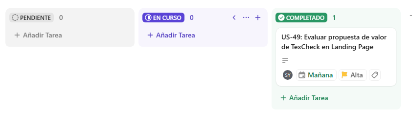

<div align="center">

# Universidad Peruana de Ciencias Aplicadas


## Ingeniería de Software

</div>

<div align="center">

**Ciclo:** 2026 - 01  
**Curso:** Desarrollo de Aplicaciones Open Source  
**NRC:** 20262  
**Docente:** Angel Augusto Velasquez Nuñez 

**Startup:** CodeUp  
**Producto:** TexCheck

| Código      | Nombre                           |
|-------------|----------------------------------|
|  u20241a195 | Diaz Yurivilca, Sofia          |
| U202219199  | Acosta Elera Abraam Bernabe        |
| U202411349  | Diaz Nuñez, Mauricio             |
| U202410421  | Diaz De La Cruz, Sebastian Gabriel |
| U202412462  | Cabrera Sotelo, Camila Celeste     |


**Abril - 2026**

  
</div>

---
# Registro de Versiones del Informe

<div align="center">

| Versión  | Fecha          | Autor                 | Descripción de modificación |
| :------: | :------------: | :-------------------: | :-------------------------: |
| AV1      | 02 / 04 / 2026 | Todos los integrantes | Primera versión             |

</div>

# Project Report Collaboration Insights

[](https://github.com/1ASI0729-2610-20262-CodeUp/TexCheck)

---

## **Project Report Online**

### [Capítulo I: Introducción]()
- [1.1. Startup Profile]()
    - [1.1.1 Descripción de la Startup]()
    - [1.1.2 Perfiles de integrantes del equipo]()
- [1.2 Solution Profile]()
    - [1.2.1 Antecedentes y problemática]()
    - [1.2.2 Lean UX Process]()
        - [1.2.2.1. Lean UX Problem Statements]()
        - [1.2.2.2. Lean UX Assumptions]()
        - [1.2.2.3. Lean UX Hypothesis Statements]()
        - [1.2.2.4. Lean UX Canvas]()
- [1.3. Segmentos objetivo]()

### [Capítulo II: Requirements Elicitation & Analysis]()
- [2.1. Competidores]()
    - [2.1.1. Análisis competitivo]()
    - [2.1.2. Estrategias y tácticas frente a competidores]()
- [2.2. Entrevistas]()
    - [2.2.1. Diseño de entrevistas]()
    - [2.2.2. Registro de entrevistas]()
    - [2.2.3. Análisis de entrevistas]()
- [2.3. Needfinding]()
    - [2.3.1. User Personas]()
    - [2.3.2. User Task Matrix]()
    - [2.3.3. User Journey Mapping]()
    - [2.3.4. Empathy Mapping]()
- [2.4. Big Picture Event Storming.]()
- [2.5. Ubiquitous Language]()

### [Capítulo III: Requirements Specification]()
- [3.1. User Stories]()
- [3.2. Impact Mapping]()
- [3.3. Product Backlog]()

### [Capítulo IV: Product Design]()
- [4.1. Style Guidelines]()
    - [4.1.1. General Style Guidelines]()
    - [4.1.2. Web Style Guidelines]()
- [4.2. Information Architecture]()
    - [4.2.1. Organization Systems]()
    - [4.2.2. Labeling Systems]()
    - [4.2.3. SEO Tags and Meta Tags]()
    - [4.2.4. Searching Systems]()
    - [4.2.5. Navigation Systems]()
- [4.3. Landing Page UI Design]()
    - [4.3.1. Landing Page Wireframe]()
    - [4.3.2. Landing Page Mock-up]()
- [4.4. Web Applications UX/UI Design]()
    - [4.4.1. Web Applications Wireframes]()
    - [4.4.2. Web Applications Wireflow Diagrams]()
    - [4.4.3. Web Applications Mock-ups]()
    - [4.4.4. Web Applications User Flow Diagrams]()
- [4.5. Web Applications Prototyping]()
- [4.6. Domain-Driven Software Architecture]()
    - [4.6.1. Design-Level Event Storming]()
    - [4.6.2. Software Architecture Context Diagram]()
    - [4.6.3. Software Architecture Container Diagrams]()
    - [4.6.4. Software Architecture Components Diagrams]()
- [4.7. Software Object-Oriented Design]()
    - [4.7.1. Class Diagrams]()
- [4.8. Database Design]()
    - [4.8.1. Database Diagram]()

### [Capítulo V: Product Implementation, Validation & Deployment]()
- [5.1. Software Configuration Management]()
    - [5.1.1. Software Development Environment Configuration]()
    - [5.1.2. Source Code Management]()
    - [5.1.3. Source Code Style Guide & Conventions]()
    - [5.1.4. Software Deployment Configuration]()
- [5.2. Landing Page, Services & Applications Implementation]()
    - [5.2.1. Sprint 1]()
        - [5.2.1.1. Sprint Planning 1]()
        - [5.2.1.2. Sprint Backlog 1]()
        - [5.2.1.3. Development Evidence for Sprint Review]()
        - [5.2.1.4. Testing Suite Evidence for Sprint Review]()
        - [5.2.1.5. Execution Evidence for Sprint Review]()
        - [5.2.1.6. Services Documentation Evidence for Sprint Review]()
        - [5.2.1.7. Software Deployment Evidence for Sprint Review]()
        - [5.2.1.8. Team Collaboration Insights during Sprint]()

- [Conclusiones y recomendaciones](docs/conclusiones.md)
- [Video About-the-Team](docs/video-about-the-team.md)
- [Bibliografía](docs/bibliografia.md)
- [Anexos](docs/anexos.md)

--- 
# Student Outcome

En esta sección se detallan las actividades realizadas en el trabajo final y el sustento de cómo estas han ayudado a desarrollar las dimensiones del Student Outcome 3 (ABET – EAC), el cual se define como la capacidad de comunicarse efectivamente con un rango de audiencias. La información se presenta a través del siguiente cuadro, donde se especifican las dimensiones de la competencia, las acciones realizadas por cada integrante y las conclusiones generales del equipo.

<table>
  <thead>
    <tr>
      <th>Criterio específico</th>
      <th>Acciones realizadas</th>
      <th>Conclusiones</th>
    </tr>
  </thead>
  <tbody>
    <tr>
      <td>Comunica oralmente con efectividad a diferentes rangos de audiencia.</td>
      <td>
        Acciones realizadas de cada uno aqui...
      </td>
      <td>Conclusiónes aquí...</td>
    </tr>
    <tr>
      <td>Comunica por escrito con efectividad a diferentes rangos de audiencia.</td>
      <td>
        Acciones realizadas de cada uno aqui...
      </td>
      <td>Conclusiónes aquí...</td>
    </tr>
  </tbody>
</table>

---

# Capítulo I: Introducción
## 1.1. Startup Profile
### 1.1.1. Descripción de la Startup
### 1.1.2. Perfiles de integrantes del equipo
## 1.2. Solution Profile
### 1.2.1 Antecedentes y problemática
### 1.2.2 Lean UX Process.
#### 1.2.2.1. Lean UX Problem Statements.
#### 1.2.2.2. Lean UX Assumptions.
#### 1.2.2.3. Lean UX Hypothesis Statements.
#### 1.2.2.4. Lean UX Canvas.
## 1.3. Segmentos objetivo.

---

# Capítulo II: Requirements Elicitation & Analysis
## 2.1. Competidores.
### 2.1.1. Análisis competitivo.
### 2.1.2. Estrategias y tácticas frente a competidores.
## 2.2. Entrevistas.
### 2.2.1. Diseño de entrevistas.
### 2.2.2. Registro de entrevistas.
### 2.2.3. Análisis de entrevistas.
## 2.3. Needfinding.
### 2.3.1. User Personas.
### 2.3.2. User Task Matrix.
### 2.3.3. User Journey Mapping.
### 2.3.4. Empathy Mapping.
## 2.4. Big Picture Event Storming.
## 2.5. Ubiquitous Language.

---

# Capítulo III: Requirements Specification
## 3.1. User Stories.
## 3.2. Impact Mapping
## 3.3. Product Backlog.

---

# Capítulo IV: Product Design
## 4.1. Style Guidelines.
### 4.1.1. General Style Guidelines.
### 4.1.2. Web Style Guidelines.
## 4.2. Information Architecture.
### 4.2.1. Organization Systems.
### 4.2.2. Labeling Systems.
### 4.2.3. SEO Tags and Meta Tags
### 4.2.4. Searching Systems.
### 4.2.5. Navigation Systems.
## 4.3. Landing Page UI Design.
### 4.3.1. Landing Page Wireframe.
### 4.3.2. Landing Page Mock-up.
## 4.4. Web Applications UX/UI Design.
### 4.4.1. Web Applications Wireframes.
### 4.4.2. Web Applications Wireflow Diagrams.
### 4.4.2. Web Applications Mock-ups.
### 4.4.3. Web Applications User Flow Diagrams.
## 4.5. Web Applications Prototyping.
## 4.6. Domain-Driven Software Architecture.
### 4.6.1. Design-Level Event Storming.
### 4.6.2. Software Architecture Context Diagram.
### 4.6.3. Software Architecture Container Diagrams.
### 4.6.4. Software Architecture Components Diagrams.
## 4.7. Software Object-Oriented Design.
### 4.7.1. Class Diagrams.
## 4.8. Database Design.
### 4.8.1. Database Diagrams.

--- 

# Capítulo V: Product Implementation, Validation & Deployment.
## 5.1. Software Configuration Management.
### 5.1.1. Software Development Environment Configuration.

En esta sección se describen las herramientas, frameworks y plataformas utilizadas por el equipo para el desarrollo del proyecto TexCheck. Estas herramientas permiten gestionar el proyecto, diseñar la solución, desarrollar el software, documentarlo y desplegarlo en un entorno real.

---

## 🟦 Project Management

| Producto | Propósito de uso | Enlace |
|----------|----------------|--------|
| Jira | Gestión del proyecto, seguimiento de tareas y organización de Sprints bajo metodología ágil. | https://www.atlassian.com/software/jira |

---

## 🟦 Requirements Management

| Producto | Propósito de uso | Enlace |
|----------|----------------|--------|
| UXPressia | Creación de User Personas, Empathy Maps e Impact Mapping para análisis de requerimientos. | https://uxpressia.com/ |

---

## 🟦 Product UX/UI Design

| Producto | Propósito de uso | Enlace |
|----------|----------------|--------|
| Figma | Diseño de wireframes, mockups y prototipos de la aplicación. | https://www.figma.com/ |
| Miro | Modelado del dominio mediante Event Storming. | https://miro.com/ |

---

## 🟦 Software Development

| Producto | Propósito de uso | Enlace |
|----------|----------------|--------|
| Visual Studio Code | IDE principal para desarrollo frontend y backend. | https://code.visualstudio.com/ |
| GitHub Desktop | Control de versiones y trabajo colaborativo con Git. | https://desktop.github.com/ |
| Node.js | Entorno de ejecución para frontend y gestión de dependencias. | https://nodejs.org/ |
| React / TypeScript | Desarrollo de la aplicación frontend. | https://react.dev/ |
| Spring Boot / Java | Desarrollo del backend y APIs REST. | https://spring.io/projects/spring-boot |
| MySQL Workbench | Diseño y gestión de base de datos. | https://www.mysql.com/products/workbench/ |

---

## 🟦 Software Documentation

| Producto | Propósito de uso | Enlace |
|----------|----------------|--------|
| Swagger / OpenAPI | Documentación y pruebas de APIs REST. | https://swagger.io/ |
| Markdown | Documentación del proyecto en GitHub. | https://www.markdownguide.org/ |

---

## 🟦 Software Deployment

| Producto | Propósito de uso | Enlace |
|----------|----------------|--------|
| Google Cloud Platform | Despliegue del backend y servicios en la nube. | https://cloud.google.com/ |
| GitHub Pages | Hosting de la landing page del proyecto. | https://pages.github.com/ |


### 5.1.2. Source Code Management.

Para el desarrollo del proyecto **BioTrack**, se utilizó **GitHub** como plataforma principal de control de versiones y colaboración entre los integrantes del equipo. Esta herramienta permitió gestionar de manera eficiente el código fuente, mantener un historial de cambios claro y facilitar el trabajo en equipo bajo buenas prácticas de desarrollo.

---

### 🔗 Organización del proyecto

**URL de la organización:**  
https://github.com/1ASI0729-2610-20262-CodeUp
---

### 📁 Repositorios del proyecto

- **Project Report:**
  https://github.com/1ASI0729-2610-20262-CodeUp/report

- **Landing Page:**
  https://github.com/1ASI0729-2610-20262-CodeUp/TexCheck-landing

- **Web Application:**
  https://github.com/1ASI0729-2610-20262-CodeUp/TexCheck-webapp

---

### 🔄 GitFlow Workflow

Para la gestión de ramas se adoptó el modelo **GitFlow**, el cual permite organizar el desarrollo del proyecto de manera estructurada:

Las ramas utilizadas fueron:

- **main:**
  Rama principal que contiene la versión final, estable y lista para entrega del proyecto.

- **develop:**
  Rama de integración donde se consolidan todos los avances antes de ser incorporados a la rama principal.

- **chapter1, chapter2, chapter3, chapter4, chapter5:**
  Ramas de desarrollo específicas para cada capítulo del proyecto, permitiendo trabajar de forma paralela y organizada sin afectar la estabilidad del repositorio.

### 🔁 Flujo de integración de código

El equipo adoptó un flujo de integración progresiva basado en tres niveles de ramas:

1. Las ramas de desarrollo (`chapterX`) se utilizan para trabajar de manera independiente en cada sección del proyecto.
2. Los cambios desarrollados en estas ramas son integrados en la rama **develop**, la cual actúa como punto de consolidación del trabajo del equipo.
3. Finalmente, la rama **develop** es integrada en la rama **main**, que representa la versión final, estable y lista para entrega del proyecto.

Este flujo permite validar los cambios antes de su publicación final, reduciendo errores y asegurando la consistencia del producto.

---

### 📝 Convención de commits

Durante el desarrollo del proyecto se utilizó parcialmente la convención de **Conventional Commits** para estructurar los mensajes de commit y facilitar la comprensión del historial de cambios.

Se emplearon principalmente los siguientes tipos:

- **docs:** Cambios en documentación
- **feat:** Incorporación de nuevos elementos, como imágenes, gráficas y contenido

---

### 💡 Beneficios de la estrategia

El uso de GitHub junto con GitFlow y Conventional Commits permitió:

- Mantener un control organizado del desarrollo
- Facilitar la colaboración entre los miembros del equipo
- Reducir errores en la integración de código
- Tener trazabilidad clara de los cambios realizados

### 5.1.3. Source Code Style Guide & Conventions.
En esta sección se establecen las guías de estilo y convenciones de codificación adoptadas por el equipo de TexCheck para el desarrollo de los productos digitales que conforman la solución. El objetivo es garantizar que el código fuente y la documentación sean legibles, mantenibles y coherentes entre todos los miembros del equipo, independientemente del componente o sección del proyecto en la que se trabaje. Como regla general, toda la nomenclatura utilizada en el proyecto se redacta en inglés, incluyendo nombres de variables, archivos, componentes y estructuras técnicas.

Las referencias adoptadas para cada lenguaje y tecnología utilizada en la solución se detallan a continuación.

---

### HTML

Para el desarrollo de la Landing Page de TexCheck, el equipo adopta como referencia principal la *HTML Style Guide and Coding Conventions* de W3Schools y la *Google HTML/CSS Style Guide*.

Las convenciones aplicadas son las siguientes:

- Se utiliza HTML5 como estándar de marcado, declarando siempre el DOCTYPE al inicio del documento: `<!DOCTYPE html>`.
- Los nombres de los elementos y atributos se escriben en minúsculas.
- Los atributos se encierran entre comillas dobles.
- Se incluye el atributo `lang` en la etiqueta `<html>` para indicar el idioma de la página.
- Todas las imágenes incluyen el atributo `alt` con una descripción significativa, como parte del enfoque de accesibilidad.
- Se utiliza indentación de 2 espacios para mantener la legibilidad del código.
- Se evita el uso de estilos en línea, delegando el diseño visual a hojas de estilo externas.
- Se emplean comentarios para delimitar secciones principales del documento.

---

### CSS

Para el diseño visual de la Landing Page, el equipo adopta la *Google HTML/CSS Style Guide* como referencia.

Las convenciones aplicadas son las siguientes:

- Los nombres de clases se escriben en kebab-case (por ejemplo: `.hero-section`, `.nav-bar`).
- Se evita el uso de selectores de ID para estilos, priorizando clases reutilizables.
- Se utiliza indentación de 2 espacios.
- Se evita el uso de `!important`.
- Se emplean unidades relativas como `rem` y `em` para mejorar la accesibilidad.
- Los estilos se organizan por componente o sección para mantener claridad y orden.

---

### JavaScript

Para la implementación de comportamientos dinámicos en la Landing Page de TexCheck, el equipo adopta las siguientes convenciones:

- Se utiliza `const` y `let`, evitando el uso de `var`.
- Los nombres de variables y funciones se escriben en camelCase.
- Se utilizan funciones simples con una única responsabilidad.
- Se emplean *template literals* cuando se requiere interpolación.
- Se incluyen comentarios en funciones no triviales para explicar su propósito.

---

### Control de versiones (Git)

Para la gestión del código fuente se adoptaron las siguientes convenciones:

- Uso de ramas por capítulo (`chapter1`, `chapter2`, etc.).
- Uso de la rama `develop` para la integración de cambios.
- Uso de la rama `main` para la versión final del proyecto.
- Aplicación parcial de *Conventional Commits*, principalmente utilizando los tipos `docs` y `feat`.

---

### Gherkin (Acceptance Criteria)

Para la redacción de criterios de aceptación de las User Stories, el equipo adopta las siguientes convenciones:

- Uso de la estructura Given – When – Then.
- Redacción en inglés, en tiempo presente.
- Definición de escenarios claros y específicos.
- Cada escenario cubre un único flujo (éxito o error).

Ejemplo de escenario:

Scenario: User registers maintenance successfully  
Given the user is on the maintenance registration page  
When the user enters valid data  
Then the system saves the maintenance record successfully

---

### Consideraciones finales

El uso de estas convenciones permitió mantener consistencia en el desarrollo del proyecto TexCheck y facilitar la colaboración entre los integrantes del equipo. No obstante, se identifica como oportunidad de mejora la aplicación más estricta y uniforme de estas prácticas en todos los commits y componentes del sistema.


### 5.1.4. Software Deployment Configuration

En esta sección se especifica la configuración de despliegue definida por el equipo de TexCheck para el Landing Page del proyecto. El objetivo es establecer los pasos, herramientas y automatizaciones necesarias para lograr la publicación continua del sistema a partir del repositorio de código fuente.

---

### Landing Page

El Landing Page de TexCheck está desarrollado con HTML5, CSS3 y JavaScript, y se despliega mediante **GitHub Pages**, aprovechando el soporte nativo de esta plataforma para sitios web estáticos.

Para automatizar el proceso de despliegue, se utiliza **GitHub Actions**, de modo que cada integración en la rama `main` desencadena automáticamente la publicación de la nueva versión del sitio web.

---

### Configuración del despliegue

Los pasos para configurar y ejecutar el despliegue son los siguientes:

1. Asegurarse de que el repositorio del Landing Page esté publicado en GitHub y configurado como público.

2. Ingresar a la configuración del repositorio:
    - Ir a **Settings > Pages**.
    - Seleccionar la rama `main` como fuente de despliegue.
    - Elegir la carpeta raíz (`/`) como directorio de publicación.

3. Crear el workflow de GitHub Actions para automatizar el despliegue:

Ruta del archivo:

.github/workflows/deploy.yml

Contenido del workflow:

```yaml
name: Deploy Landing Page

on:
  push:
    branches:
      - main

jobs:
  deploy:
    runs-on: ubuntu-latest

    steps:
      - name: Checkout repository
        uses: actions/checkout@v4

      - name: Setup Pages
        uses: actions/configure-pages@v4

      - name: Upload artifact
        uses: actions/upload-pages-artifact@v3
        with:
          path: '.'

      - name: Deploy to GitHub Pages
        uses: actions/deploy-pages@v4

```
4. Guardar el archivo y realizar un commit en la rama `main`.

5. GitHub Actions ejecutará automáticamente el workflow y publicará el sitio en GitHub Pages.

### Automatización del proceso

Cada vez que se realiza un **push a la rama `main`**, el workflow de GitHub Actions se ejecuta automáticamente y realiza las siguientes acciones:

- Descarga el código del repositorio
- Prepara los archivos del sitio web
- Publica el contenido en GitHub Pages

Esto permite mantener el sitio siempre actualizado sin intervención manual.

---

### Validación del despliegue

Para validar que el despliegue se realizó correctamente, se deben realizar las siguientes acciones:

- Acceder a la URL generada por GitHub Pages
- Verificar que los cambios recientes se reflejen en el sitio
- Confirmar que los recursos (imágenes, estilos y scripts) cargan correctamente

---

### Consideraciones finales

El uso de GitHub Pages junto con GitHub Actions permitió implementar un proceso de despliegue automatizado, eficiente y alineado con prácticas modernas de integración continua (CI/CD).

Esta configuración facilita la publicación continua del Landing Page de TexCheck, asegurando que cada actualización del repositorio se refleje automáticamente en la versión pública del sistema.


## 5.2. Landing Page, Services & Applications Implementation.
### 5.2.1. Sprint 1
#### 5.2.1.1. Sprint Planning 1.

Para este primer Sprint, el equipo estableció como objetivo principal la implementación y despliegue de la primera versión del Landing Page de TexCheck. La reunión de planificación se llevó a cabo de manera virtual, donde se definieron las User Stories a abordar, el Sprint Goal y la distribución de responsabilidades entre los miembros del equipo.

<table border="1" cellpadding="8" cellspacing="0" style="border-collapse: collapse; width: 100%;">
  <tbody>
    <tr>
      <td colspan="2"><strong>Sprint 1</strong></td>
    </tr>
    <tr>
      <td colspan="2"><strong>Sprint Planning Background</strong></td>
    </tr>
    <tr>
      <td><strong>Date</strong></td>
      <td>2026-04-18</td>
    </tr>
    <tr>
      <td><strong>Time</strong></td>
      <td>09:00 AM</td>
    </tr>
    <tr>
      <td><strong>Location</strong></td>
      <td>Reunión virtual vía Discord</td>
    </tr>
    <tr>
      <td><strong>Prepared By</strong></td>
      <td>Diaz Yurivilca, Sofia</td>
    </tr>
    <tr>
      <td><strong>Attendees (to planning meeting)</strong></td>
      <td>
        Diaz Yurivilca, Sofia / 
        Acosta Elera Abraam Bernabe / 
        Diaz Nuñez, Mauricio / 
        Diaz De La Cruz, Sebastian Gabriel / 
        Cabrera Sotelo, Camila Celeste
      </td>
    </tr>
    <tr>
      <td><strong>Sprint 1 – 1 Review Summary</strong></td>
      <td>Al ser el primer Sprint del proyecto, no existe un Sprint anterior que revisar. Se da inicio al desarrollo del Landing Page de TexCheck como primer entregable funcional.</td>
    </tr>
    <tr>
      <td><strong>Sprint 1 – 1 Retrospective Summary</strong></td>
      <td>Al ser el primer Sprint del proyecto, no existe retrospectiva previa. El equipo acordó mantener comunicación constante mediante Discord y coordinar la entrega de avances de forma organizada para cumplir con los objetivos establecidos.</td>
    </tr>
    <tr>
      <td colspan="2"><strong>Sprint Goal &amp; User Stories</strong></td>
    </tr>
    <tr>
      <td><strong>Sprint 1 Goal</strong></td>
      <td>
        Our focus is on presenting TexCheck's value proposition to potential users through a functional and deployed Landing Page. We believe it delivers a clear first impression of the product and motivates users to understand how TexCheck improves maintenance management. This will be confirmed when the Landing Page is publicly accessible, includes key sections (hero, features, benefits and call-to-action), and provides clear information about the system.
      </td>
    </tr>
    <tr>
      <td><strong>Sprint 1 Velocity</strong></td>
      <td>8</td>
    </tr>
    <tr>
      <td><strong>Sum of Story Points</strong></td>
      <td>8</td>
    </tr>
  </tbody>
</table>

---

#### 5.2.1.2. Aspect Leaders and Collaborators.

En este primer Sprint, el equipo organizó su trabajo en torno a cuatro aspectos principales: la configuración inicial del repositorio y entorno de despliegue, el desarrollo de la estructura base del Landing Page, la implementación de funcionalidades interactivas (como navegación, botones y secciones dinámicas), y la revisión y corrección del contenido textual. A continuación, se presenta la matriz de liderazgo y colaboración (LACX):

<table border="1" cellpadding="8" cellspacing="0" style="border-collapse: collapse; width: 100%;">
  <thead>
    <tr>
      <th>Team Member (Last Name, First Name)</th>
      <th>GitHub Username</th>
      <th>Configuración del Repositorio y CI/CD<br>Leader (L) / Collaborator (C)</th>
      <th>Estructura Base del Landing Page<br>Leader (L) / Collaborator (C)</th>
      <th>Funcionalidades Interactivas<br>Leader (L) / Collaborator (C)</th>
      <th>Corrección de Contenido<br>Leader (L) / Collaborator (C)</th>
    </tr>
  </thead>
  <tbody>
    <tr>
      <td>Diaz Yurivilca, Sofia</td>
      <td>u20241a195-cmd</td>
      <td>L</td>
      <td>C</td>
      <td>C</td>
      <td>L</td>
    </tr>
    <tr>
      <td>Acosta Elera Abraam Bernabe</td>
      <td>AbraamAcostae</td>
      <td>C</td>
      <td>C</td>
      <td>L</td>
      <td>C</td>
    </tr>
    <tr>
      <td>Diaz Nuñez, Mauricio</td>
      <td>Mauridex</td>
      <td>C</td>
      <td>C</td>
      <td>C</td>
      <td>L</td>
    </tr>
    <tr>
      <td>Diaz De La Cruz, Sebastian Gabriel</td>
      <td>tipaso07</td>
      <td>C</td>
      <td>L</td>
      <td>C</td>
      <td>L</td>
    </tr>
    <tr>
      <td>Cabrera Sotelo, Camila Celeste</td>
      <td>whcamm</td>
      <td>C</td>
      <td>C</td>
      <td>C</td>
      <td>L</td>
    </tr>
  </tbody>
</table>

#### 5.2.1.3. Sprint Backlog 1.

El objetivo principal de este Sprint fue diseñar, desarrollar y desplegar la primera versión funcional del Landing Page de TexCheck, alineado con la User Story **US-01: Comprender la propuesta de valor del sistema TexCheck**. Esta historia busca que los usuarios potenciales puedan identificar claramente cómo la solución optimiza la gestión del mantenimiento de maquinaria, a través de una presentación estructurada de sus beneficios, funcionalidades clave y propuesta diferencial. A continuación, se presenta el tablero del Sprint y el detalle de los Work-items asociados.


<table border="1" cellpadding="8" cellspacing="0" style="border-collapse: collapse; width: 100%;">
  <thead>
    <tr>
      <th colspan="8">Sprint # Sprint 1</th>
    </tr>
    <tr>
      <th colspan="2">User Story</th>
      <th colspan="6">Work-Item / Task</th>
    </tr>
    <tr>
      <th>Id</th>
      <th>Title</th>
      <th>Id</th>
      <th>Title</th>
      <th>Description</th>
      <th>Estimation (Hours)</th>
      <th>Assigned To</th>
      <th>Status</th>
    </tr>
  </thead>
  <tbody>
    <tr>
      <td>US-01</td>
      <td>Visualizar propuesta de valor de TexCheck</td>
      <td>T-01</td>
      <td>Configuración inicial del repositorio</td>
      <td>Crear el repositorio del proyecto, inicializar estructura base con HTML, CSS y JavaScript, y configurar el control de versiones.</td>
      <td>2</td>
      <td>Diaz Yurivilca, Sofia</td>
      <td>Done</td>
    </tr>
    <tr>
      <td>US-01</td>
      <td>Visualizar propuesta de valor de TexCheck</td>
      <td>T-02</td>
      <td>Configurar pipeline de despliegue (GitHub Actions)</td>
      <td>Crear y configurar el workflow de GitHub Actions para el despliegue automático en GitHub Pages.</td>
      <td>3</td>
      <td>Diaz Yurivilca, Sofia</td>
      <td>Done</td>
    </tr>
    <tr>
      <td>US-01</td>
      <td>Visualizar propuesta de valor de TexCheck</td>
      <td>T-03</td>
      <td>Desarrollar estructura base del Landing Page</td>
      <td>Implementar las secciones principales del Landing Page: hero, beneficios, funcionalidades y footer.</td>
      <td>4</td>
      <td>Acosta Elera Abraam Bernabe / Diaz De La Cruz, Sebastian Gabriel</td>
      <td>Done</td>
    </tr>
    <tr>
      <td>US-01</td>
      <td>Visualizar propuesta de valor de TexCheck</td>
      <td>T-04</td>
      <td>Implementar interacciones y CTAs</td>
      <td>Agregar botones de acción, navegación entre secciones y mejoras en la interacción del usuario.</td>
      <td>3</td>
      <td>Acosta Elera Abraam Bernabe</td>
      <td>Done</td>
    </tr>
    <tr>
      <td>US-01</td>
      <td>Visualizar propuesta de valor de TexCheck</td>
      <td>T-05</td>
      <td>Agregar animaciones y estilos visuales</td>
      <td>Implementar animaciones básicas y mejorar la presentación visual del Landing Page.</td>
      <td>2</td>
      <td>Diaz De La Cruz, Sebastian Gabriel</td>
      <td>Done</td>
    </tr>
    <tr>
      <td>US-01</td>
      <td>Visualizar propuesta de valor de TexCheck</td>
      <td>T-06</td>
      <td>Revisión y corrección de contenido textual</td>
      <td>Revisar ortografía, redacción y coherencia del contenido del Landing Page.</td>
      <td>2</td>
      <td>Diaz Nuñez, Mauricio / Cabrera Sotelo, Camila Celeste</td>
      <td>Done</td>
    </tr>
  </tbody>
</table>

#### 5.2.1.4. Development Evidence for Sprint Review.

Durante el Sprint 1, el equipo se centró exclusivamente en el repositorio del Landing Page de TexCheck. Se realizaron múltiples commits distribuidos entre el 18 y el 20 de abril de 2026, cubriendo desde la configuración inicial del proyecto hasta correcciones de contenido y el despliegue automatizado mediante GitHub Actions. A continuación, se presenta el registro de commits más relevantes del Sprint :contentReference[oaicite:0]{index=0}:

<table border="1" cellpadding="8" cellspacing="0" style="border-collapse: collapse; width: 100%;">
  <thead>
    <tr>
      <th>Repository</th>
      <th>Branch</th>
      <th>Commit Id</th>
      <th>Commit Message</th>
      <th>Commit Message Body</th>
      <th>Committed on (Date)</th>
    </tr>
  </thead>
  <tbody>
    <tr>
      <td>TexCheck/landing-page</td>
      <td>main</td>
      <td>init001</td>
      <td>Initial commit</td>
      <td>Creación inicial del repositorio con estructura base del proyecto.</td>
      <td>2026-04-18</td>
    </tr>
    <tr>
      <td>TexCheck/landing-page</td>
      <td>develop</td>
      <td>conf002</td>
      <td>chore(config): initialize .gitignore</td>
      <td>Se configura el archivo .gitignore para excluir dependencias y archivos innecesarios.</td>
      <td>2026-04-18</td>
    </tr>
    <tr>
      <td>TexCheck/landing-page</td>
      <td>develop</td>
      <td>docs003</td>
      <td>docs: update README</td>
      <td>Se documenta la estructura inicial del proyecto y configuración básica.</td>
      <td>2026-04-18</td>
    </tr>
    <tr>
      <td>TexCheck/landing-page</td>
      <td>main</td>
      <td>merge004</td>
      <td>Merge develop into main</td>
      <td>Integración inicial de la estructura base del proyecto.</td>
      <td>2026-04-18</td>
    </tr>
    <tr>
      <td>TexCheck/landing-page</td>
      <td>main</td>
      <td>deploy005</td>
      <td>feat: configure GitHub Pages</td>
      <td>Configuración inicial del despliegue en GitHub Pages.</td>
      <td>2026-04-18</td>
    </tr>
    <tr>
      <td>TexCheck/landing-page</td>
      <td>main</td>
      <td>ci006</td>
      <td>ci: setup GitHub Actions</td>
      <td>Se implementa pipeline de despliegue automático mediante GitHub Actions.</td>
      <td>2026-04-18</td>
    </tr>
    <tr>
      <td>TexCheck/landing-page</td>
      <td>develop</td>
      <td>feat007</td>
      <td>feat: implement landing structure</td>
      <td>Se implementan secciones principales del Landing Page.</td>
      <td>2026-04-19</td>
    </tr>
    <tr>
      <td>TexCheck/landing-page</td>
      <td>main</td>
      <td>merge008</td>
      <td>Merge develop into main</td>
      <td>Integración de estructura del Landing Page.</td>
      <td>2026-04-19</td>
    </tr>
    <tr>
      <td>TexCheck/landing-page</td>
      <td>develop</td>
      <td>fix010</td>
      <td>fix: content corrections</td>
      <td>Corrección de errores ortográficos y de contenido.</td>
      <td>2026-04-19</td>
    </tr>
    <tr>
      <td>TexCheck/landing-page</td>
      <td>main</td>
      <td>merge011</td>
      <td>Merge develop into main</td>
      <td>Integración de mejoras finales del Landing Page.</td>
      <td>2026-04-20</td>
    </tr>
  </tbody>
</table>

#### 5.2.1.5. Execution Evidence for Sprint Review.
#### 5.2.1.6. Services Documentation Evidence for Sprint Review.
#### 5.2.1.7. Software Deployment Evidence for Sprint Review.
#### 5.2.1.8. Team Collaboration Insights during Sprint.

# Conclusiones

---

# Bibliografía

---

# Anexos