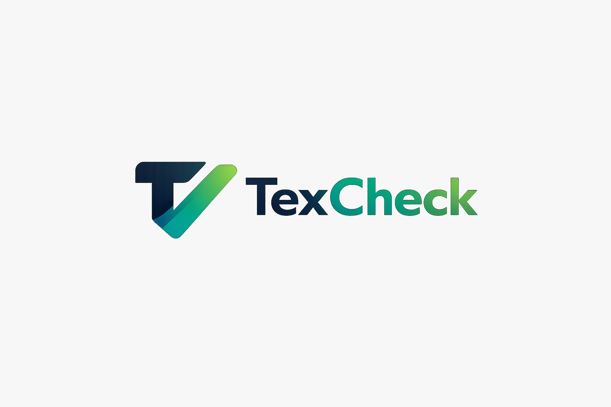
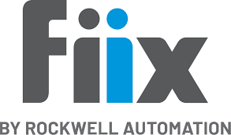
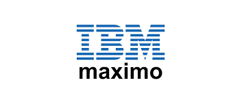
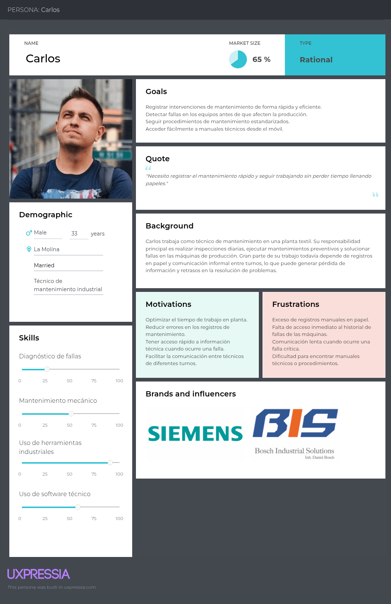
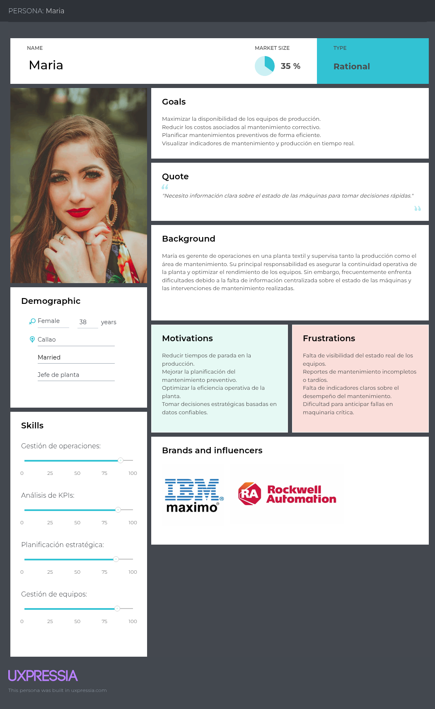
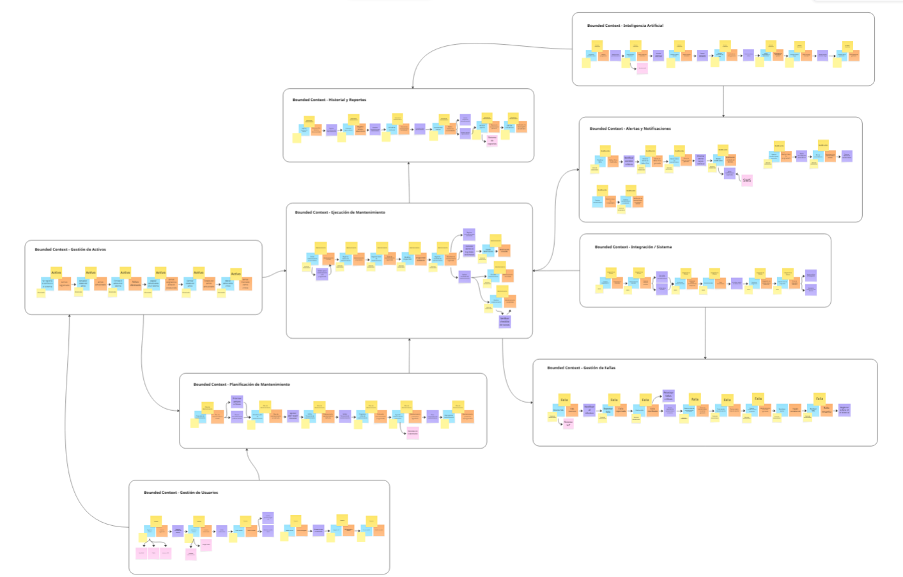

# Universidad Peruana de Ciencias Aplicadas

## Ingeniería de Software

**Ciclo:** 2026 - 01  
**Curso:** Desarrollo de Aplicaciones Open Source  ƒP
**NRC:** 20262  
**Docente:** Angel Augusto Velasquez Nuñez 

**Startup:** CodeUp  
**Producto:** TexCheck

| Código      | Nombre                           |
|-------------|----------------------------------|
|  u20241a195 | Diaz Yurivilca, Sofia          |
| U202219199  | Acosta Elera Abraam Bernabe        |
| U202411349  | Diaz Nuñez, Mauricio             |
| U202410421  | Diaz De La Cruz, Sebastian Gabriel |
| U202412462  | Cabrera Sotelo, Camila Celeste     |

**Abril - 2026**

  

---
# Registro de Versiones del Informe

| Versión  | Fecha          | Autor                 | Descripción de modificación |
| :------: | :------------: | :-------------------: | :-------------------------: |
| AV1      | 02 / 04 / 2026 | Todos los integrantes | Primera versión             |

# Project Report Collaboration Insights

---

## **Project Report Online**

### [Capítulo I: Introducción]()
- [1.1. Startup Profile]()
    - [1.1.1 Descripción de la Startup]()
    - [1.1.2 Perfiles de integrantes del equipo]()
- [1.2 Solution Profile]()
    - [1.2.1 Antecedentes y problemática]()
    - [1.2.2 Lean UX Process]()
        - [1.2.2.1. Lean UX Problem Statements]()
        - [1.2.2.2. Lean UX Assumptions]()
        - [1.2.2.3. Lean UX Hypothesis Statements]()
        - [1.2.2.4. Lean UX Canvas]()
- [1.3. Segmentos objetivo]()

### [Capítulo II: Requirements Elicitation & Analysis]()
- [2.1. Competidores]()
    - [2.1.1. Análisis competitivo]()
    - [2.1.2. Estrategias y tácticas frente a competidores]()
- [2.2. Entrevistas]()
    - [2.2.1. Diseño de entrevistas]()
    - [2.2.2. Registro de entrevistas]()
    - [2.2.3. Análisis de entrevistas]()
- [2.3. Needfinding]()
    - [2.3.1. User Personas]()
    - [2.3.2. User Task Matrix]()
    - [2.3.3. User Journey Mapping]()
    - [2.3.4. Empathy Mapping]()
- [2.4. Big Picture Event Storming.]()
- [2.5. Ubiquitous Language]()

### [Capítulo III: Requirements Specification]()
- [3.1. User Stories]()
- [3.2. Impact Mapping]()
- [3.3. Product Backlog]()

### [Capítulo IV: Product Design]()
- [4.1. Style Guidelines]()
    - [4.1.1. General Style Guidelines]()
    - [4.1.2. Web Style Guidelines]()
- [4.2. Information Architecture]()
    - [4.2.1. Organization Systems]()
    - [4.2.2. Labeling Systems]()
    - [4.2.3. SEO Tags and Meta Tags]()
    - [4.2.4. Searching Systems]()
    - [4.2.5. Navigation Systems]()
- [4.3. Landing Page UI Design]()
    - [4.3.1. Landing Page Wireframe]()
    - [4.3.2. Landing Page Mock-up]()
- [4.4. Web Applications UX/UI Design]()
    - [4.4.1. Web Applications Wireframes]()
    - [4.4.2. Web Applications Wireflow Diagrams]()
    - [4.4.3. Web Applications Mock-ups]()
    - [4.4.4. Web Applications User Flow Diagrams]()
- [4.5. Web Applications Prototyping]()
- [4.6. Domain-Driven Software Architecture]()
    - [4.6.1. Design-Level Event Storming]()
    - [4.6.2. Software Architecture Context Diagram]()
    - [4.6.3. Software Architecture Container Diagrams]()
    - [4.6.4. Software Architecture Components Diagrams]()
- [4.7. Software Object-Oriented Design]()
    - [4.7.1. Class Diagrams]()
- [4.8. Database Design]()
    - [4.8.1. Database Diagram]()

### [Capítulo V: Product Implementation, Validation & Deployment]()
- [5.1. Software Configuration Management]()
    - [5.1.1. Software Development Environment Configuration]()
    - [5.1.2. Source Code Management]()
    - [5.1.3. Source Code Style Guide & Conventions]()
    - [5.1.4. Software Deployment Configuration]()
- [5.2. Landing Page, Services & Applications Implementation]()
    - [5.2.1. Sprint 1]()
        - [5.2.1.1. Sprint Planning 1]()
        - [5.2.1.2. Sprint Backlog 1]()
        - [5.2.1.3. Development Evidence for Sprint Review]()
        - [5.2.1.4. Testing Suite Evidence for Sprint Review]()
        - [5.2.1.5. Execution Evidence for Sprint Review]()
        - [5.2.1.6. Services Documentation Evidence for Sprint Review]()
        - [5.2.1.7. Software Deployment Evidence for Sprint Review]()
        - [5.2.1.8. Team Collaboration Insights during Sprint]()

- [Conclusiones y recomendaciones](docs/conclusiones.md)
- [Video About-the-Team](docs/video-about-the-team.md)
- [Bibliografía](docs/bibliografia.md)
- [Anexos](docs/anexos.md)

--- 
# Student Outcome

En esta sección se detallan las actividades realizadas en el trabajo final y el sustento de cómo estas han ayudado a desarrollar las dimensiones del Student Outcome 3 (ABET – EAC), el cual se define como la capacidad de comunicarse efectivamente con un rango de audiencias. La información se presenta a través del siguiente cuadro, donde se especifican las dimensiones de la competencia, las acciones realizadas por cada integrante y las conclusiones generales del equipo.

<table>
  <thead>
    <tr>
      <th>Criterio específico</th>
      <th>Acciones realizadas</th>
      <th>Conclusiones</th>
    </tr>
  </thead>
  <tbody>
    <tr>
      <td>Comunica oralmente con efectividad a diferentes rangos de audiencia.</td>
      <td>
        Acciones realizadas de cada uno aqui...
      </td>
      <td>Conclusiónes aquí...</td>
    </tr>
    <tr>
      <td>Comunica por escrito con efectividad a diferentes rangos de audiencia.</td>
      <td>
        Acciones realizadas de cada uno aqui...
      </td>
      <td>Conclusiónes aquí...</td>
    </tr>
  </tbody>
</table>

---

# Capítulo I: Introducción
## 1.1. Startup Profile
### 1.1.1. Descripción de la Startup
### 1.1.2. Perfiles de integrantes del equipo
## 1.2. Solution Profile
### 1.2.1 Antecedentes y problemática
### 1.2.2 Lean UX Process.
#### 1.2.2.1. Lean UX Problem Statements.
#### 1.2.2.2. Lean UX Assumptions.
#### 1.2.2.3. Lean UX Hypothesis Statements.
#### 1.2.2.4. Lean UX Canvas.
## 1.3. Segmentos objetivo.

---

# Capítulo II: Requirements Elicitation & Analysis
## 2.1. Competidores.
## 2.1.1. Análisis competitivo.

| Elemento | TexCheck  | Fiix CMMS  | UpKeep  | IBM Maximo Application Suite  |
|---|---|---|---|---|
| **¿Por qué llevar a cabo este análisis?** | El análisis se realiza para determinar cómo TexCheck puede diferenciarse dentro del mercado de soluciones de mantenimiento industrial, considerando que existen plataformas CMMS consolidadas, pero muchas de ellas están orientadas a empresas grandes, poseen costos elevados o no están especializadas en el sector textil peruano. La pregunta principal es: **¿cómo puede TexCheck posicionarse como una alternativa accesible, especializada e intuitiva para pequeñas y medianas empresas textiles que necesitan digitalizar su mantenimiento industrial sin asumir la complejidad de plataformas empresariales globales?** | Se analiza Fiix porque es una plataforma CMMS reconocida internacionalmente, enfocada en ayudar a las empresas a planificar, rastrear y optimizar el mantenimiento mediante gestión de activos, órdenes de trabajo, reportes, integraciones y herramientas basadas en IA. Su presencia permite comparar a TexCheck frente a una solución madura, de enfoque general y orientada a múltiples industrias. | Se analiza UpKeep porque es una plataforma CMMS mobile-first orientada a equipos de mantenimiento que necesitan crear órdenes de trabajo, automatizar mantenimientos preventivos, usar checklists y acceder a información desde cualquier dispositivo. Su enfoque móvil la convierte en un competidor importante frente a TexCheck, especialmente para técnicos que trabajan directamente en planta. | Se analiza IBM Maximo porque es una suite EAM/CMMS empresarial de alto nivel, orientada a la gestión avanzada de activos, mantenimiento preventivo, predictivo, inspecciones, inventario, analítica e integración con tecnologías empresariales. Representa la competencia más robusta y compleja dentro del mercado de gestión de activos industriales. |
| **Perfil — Overview** | TexCheck es una startup tecnológica orientada a la digitalización de la gestión del mantenimiento industrial en el sector manufacturero textil. Su propósito es ofrecer una plataforma Web y Mobile que permita registrar activos, programar mantenimientos preventivos, reportar fallas, consultar historial técnico, generar alertas y visualizar indicadores operativos. Su enfoque nace de una problemática identificada en empresas textiles: fallas inesperadas en maquinaria crítica, dependencia de registros manuales, uso de Excel, comunicación por WhatsApp y falta de trazabilidad técnica. | Fiix CMMS es una plataforma de mantenimiento basada en la nube que permite planificar, rastrear y optimizar operaciones de mantenimiento. Ofrece gestión de activos, órdenes de trabajo, mantenimiento preventivo, inventario, reportes, integraciones y herramientas de IA. Su propuesta está orientada a empresas que buscan centralizar sus operaciones de mantenimiento y mejorar el rendimiento de sus activos. | UpKeep es una plataforma CMMS impulsada por IA y diseñada con enfoque mobile-first. Su propuesta busca que los equipos de mantenimiento completen órdenes de trabajo desde cualquier dispositivo, agreguen fotos, utilicen checklists, actualicen información en tiempo real y automaticen tareas preventivas. La empresa indica que su plataforma busca pasar de operaciones reactivas a operaciones proactivas. | IBM Maximo Application Suite es una plataforma empresarial de gestión de activos que integra mantenimiento, inspección, monitoreo, inventario, analítica, gestión de campo y capacidades de IA. IBM la presenta como una solución para mejorar el desempeño de activos, programar trabajos, completar órdenes con acceso móvil y detectar anomalías mediante imágenes, video, sensores o datos operativos. |
| **Ventaja competitiva** | La ventaja competitiva de TexCheck se basa en su **especialización en el sector textil peruano**, su enfoque en pequeñas y medianas empresas, su facilidad de uso y su modelo accesible frente a plataformas globales. A diferencia de soluciones generales, TexCheck se adapta a flujos reales de mantenimiento textil: registro de máquinas, historial técnico, planificación preventiva, fallas recurrentes, alertas, checklists y reportes pensados para líderes operativos y personal de mantenimiento. Además, su propuesta responde a un mercado donde el 99.4% de empresas textiles formales son MYPE y donde el 66% se concentra en Lima, lo cual facilita una estrategia inicial de entrada local. | Su ventaja competitiva está en ser una plataforma CMMS madura, cloud-based, con funcionalidades amplias para mantenimiento, gestión de activos, inventario, reportes e integraciones. También cuenta con herramientas de IA y una propuesta orientada a optimizar activos en distintos sectores industriales. Su fortaleza principal es la experiencia acumulada y la capacidad de cubrir procesos de mantenimiento de manera integral. | Su ventaja competitiva está en su enfoque mobile-first. UpKeep facilita que técnicos puedan crear, completar y actualizar órdenes de trabajo desde cualquier dispositivo, con fotos, checklists y actualizaciones en tiempo real. Esta orientación resulta atractiva para equipos operativos que trabajan fuera de oficina o directamente en planta. | Su ventaja competitiva está en su robustez empresarial, escalabilidad, analítica avanzada, integración con gestión de activos, inventario, inspecciones, mantenimiento predictivo y ecosistema IBM. Es una solución preparada para grandes organizaciones con procesos complejos, múltiples sedes, altos volúmenes de activos y necesidades avanzadas de confiabilidad operacional. |
| **¿Qué valor ofrece a los clientes?** | TexCheck ofrece valor al permitir que las empresas textiles reduzcan la pérdida de información técnica, mejoren la trazabilidad de las intervenciones, organicen el mantenimiento preventivo y disminuyan las interrupciones por fallas inesperadas. Para los líderes operativos, ofrece visibilidad sobre activos, fallas, mantenimientos pendientes y reportes. Para el personal de mantenimiento, ofrece una herramienta práctica para registrar intervenciones, consultar historiales, recibir alertas y coordinar tareas. Este valor es importante porque el downtime no planificado puede generar pérdidas relevantes en entornos industriales. | Fiix ofrece valor mediante la centralización de activos, órdenes de trabajo, inventario, mantenimiento preventivo y reportes. Su objetivo es que las empresas dejen de gestionar activos “a ciegas” y puedan observar, rastrear y optimizar el rendimiento de sus equipos. También permite mejorar la organización del mantenimiento y reducir tiempos administrativos. | UpKeep ofrece valor al permitir que los equipos de mantenimiento gestionen órdenes de trabajo desde cualquier lugar, automaticen tareas preventivas, usen checklists y mantengan visibilidad en tiempo real. Su propuesta se enfoca en reducir trabajo administrativo, acelerar respuestas y facilitar el trabajo del técnico en campo. | IBM Maximo ofrece valor a empresas intensivas en activos al integrar mantenimiento, gestión de activos, inspecciones, inventario, analítica, automatización y capacidades predictivas. Su valor se centra en optimizar el ciclo de vida de los activos, mejorar la confiabilidad, reducir riesgos operativos y apoyar decisiones complejas basadas en datos. |
| **Perfil de Marketing — Mercado objetivo** | TexCheck se dirige principalmente a pequeñas y medianas empresas textiles ubicadas en Lima Metropolitana y Callao, especialmente aquellas que todavía gestionan mantenimiento con Excel, registros físicos y comunicación informal. Sus usuarios principales son líderes operativos, jefes de planta, supervisores de producción, jefes de mantenimiento y técnicos. El mercado objetivo es atractivo porque PRODUCE registró más de **46 mil empresas formales** en la industria textil y confecciones en 2023, con fuerte concentración en Lima y predominio de micro y pequeñas empresas. | Fiix se dirige a empresas de múltiples sectores que necesitan profesionalizar la gestión de mantenimiento. Su mercado objetivo incluye empresas manufactureras, plantas industriales, operaciones con activos físicos, equipos de mantenimiento y organizaciones que buscan una solución CMMS en la nube. No está limitado a un sector específico. | UpKeep se dirige a equipos de mantenimiento que requieren movilidad, rapidez y gestión operativa desde campo. Su mercado objetivo incluye manufactura, facilities, servicios, logística, operaciones de campo y empresas con técnicos que necesitan actualizar órdenes de trabajo desde celulares o tablets. | IBM Maximo se dirige principalmente a grandes empresas, corporaciones y organizaciones intensivas en activos. Su mercado incluye manufactura avanzada, energía, minería, transporte, utilities, petróleo y gas, infraestructura, aeropuertos, salud y empresas con necesidades complejas de mantenimiento, confiabilidad, inventario y gestión de activos empresariales. |
| **Perfil de Marketing — Estrategias de marketing** | TexCheck debe aplicar una estrategia B2B enfocada en nicho. Sus acciones principales pueden ser: demostraciones directas a empresas textiles, visitas a plantas, pruebas piloto, casos de uso con reducción de fallas, contenido educativo sobre mantenimiento preventivo, campañas en LinkedIn, alianzas con gremios textiles, contacto con jefes de planta y mantenimiento, y mensajes centrados en “dejar Excel y papel sin complicar el trabajo diario”. También puede usar datos del sector para reforzar su propuesta: crecimiento de producción textil y confecciones de **+10.1% en 2024** y concentración empresarial en Lima. | Fiix utiliza marketing digital B2B, demostraciones de producto, contenido educativo sobre mantenimiento, casos de éxito, SEO para búsquedas relacionadas con CMMS, recursos descargables y posicionamiento como solución cloud de mantenimiento. Su mensaje se orienta a mejorar organización, uptime, gestión de activos y eficiencia del equipo. | UpKeep utiliza una estrategia basada en producto mobile-first, demostraciones, contenido educativo, comparativas de software CMMS, casos de uso y comunicación orientada a técnicos y equipos de campo. Su marketing destaca rapidez, facilidad, IA y gestión desde cualquier dispositivo. | IBM Maximo utiliza marketing empresarial, ventas consultivas, partners tecnológicos, eventos corporativos, documentación técnica, casos de éxito, integración con el ecosistema IBM y posicionamiento en transformación digital industrial. Su estrategia se dirige a tomadores de decisión de grandes organizaciones y áreas de operaciones, TI, mantenimiento y confiabilidad. |
| **Perfil de Producto — Productos & Servicios** | TexCheck ofrece una plataforma Web y Mobile con módulos de registro de activos, ficha técnica de maquinaria, historial técnico, programación de mantenimiento preventivo, checklists, alertas automáticas, gestión de fallas, asignación de responsables, reportes, dashboards e indicadores como cumplimiento preventivo, activos fuera de servicio, fallas activas y mantenimientos vencidos. También puede incluir servicios de capacitación, onboarding, soporte inicial y configuración básica para empresas textiles. | Fiix ofrece gestión de activos, órdenes de trabajo, mantenimiento preventivo, inventario, reportes, integraciones y herramientas de IA. Su plataforma permite a las empresas planificar, rastrear y optimizar tareas de mantenimiento, además de mejorar la visibilidad del rendimiento de activos. | UpKeep ofrece CMMS, gestión de órdenes de trabajo, mantenimiento preventivo, checklists, seguimiento de tiempo y costos, inventario, lecturas de medidores, códigos de barras, reportes, analítica, funcionalidades offline en planes superiores y herramientas de IA como Nova y Smart Checklist Builder. | IBM Maximo ofrece módulos de mantenimiento, gestión de activos, inspección visual, field service management, inventario MRO, monitoreo, mantenimiento predictivo, movilidad, integraciones, analítica e inteligencia artificial. IBM indica que su CMMS ayuda a automatizar órdenes de trabajo, flujos, programación laboral y gestión de materiales. |
| **Perfil de Producto — Precios & Costos** | TexCheck puede aplicar un modelo SaaS mensual accesible y escalable según número de máquinas, usuarios y funcionalidades. Una propuesta inicial podría ser: **Plan Básico** para microempresas textiles con registro de activos, historial y alertas básicas; **Plan Pro** para pequeñas empresas con mantenimiento preventivo, checklists, fallas y reportes; **Plan Enterprise** para empresas con múltiples sedes, roles avanzados, dashboards e integraciones. Su ventaja es ofrecer precios más adaptados a pymes textiles peruanas que plataformas globales con costos por usuario en dólares. | Fiix maneja planes por suscripción. Sus planes suelen ser flexibles, con suscripción mensual o anual y posibilidad de avanzar a planes superiores según el crecimiento de la operación. Referencialmente, algunas plataformas de comparación reportan precios desde aproximadamente **USD 45 por usuario al mes**, aunque estos precios pueden variar según plan, país y condiciones comerciales. | UpKeep ofrece precios por usuario y por mes. Referencialmente, algunas plataformas de comparación muestran planes desde aproximadamente **USD 45 por usuario/mes** y planes profesionales desde aproximadamente **USD 75 por usuario/mes**, aunque también existen fuentes que reportan precios de entrada menores según modalidad o plan consultado. Por ello, el costo debe considerarse referencial y sujeto a variación. | IBM Maximo no se presenta como una solución de precio simple por usuario para pymes. Su modelo se basa en paquetes client-managed o SaaS y utiliza un sistema de licenciamiento por créditos llamado **AppPoints**, que permite agregar funcionalidades y usuarios según el consumo. Esto lo vuelve flexible para grandes organizaciones, pero más complejo para pequeñas empresas que buscan costos simples y previsibles. |
| **Perfil de Producto — Canales de distribución Web y/o Móvil** | TexCheck se distribuirá mediante una plataforma Web para líderes operativos y jefes de mantenimiento, y una versión Mobile o responsive para técnicos en planta. La versión Web permitirá dashboards, reportes, programación y administración de activos. La versión móvil permitirá registrar intervenciones, subir evidencias, completar checklists, recibir alertas y consultar historial desde la zona de producción. | Fiix funciona como plataforma cloud/web y cuenta con capacidades orientadas a la gestión digital de mantenimiento. Su propuesta se centra en el acceso a información, reportes, activos y órdenes de trabajo mediante una plataforma digital integrada. | UpKeep tiene una orientación claramente mobile-first. Su plataforma permite crear y completar órdenes de trabajo desde cualquier dispositivo, agregar fotos, completar checklists y actualizar información en tiempo real. Además, su página de precios menciona funciones móviles offline en planes superiores. | IBM Maximo ofrece acceso Web y móvil. Maximo Mobile se integra con Maximo Manage para ofrecer aplicaciones de inspección, órdenes de trabajo de técnicos, activos e inventario en dispositivos Android, iOS y Windows. |
| **Análisis SWOT — Fortalezas** | Especialización en empresas textiles peruanas. Plataforma pensada para usuarios con distintos niveles de experiencia tecnológica. Enfoque en pymes, con menor complejidad que soluciones empresariales. Módulos alineados con necesidades reales: activos, historial, mantenimiento preventivo, checklists, alertas, fallas y reportes. Mayor cercanía al mercado local. Posibilidad de capacitación directa y soporte personalizado. Propuesta de valor alineada con un sector donde predominan micro y pequeñas empresas. | Marca reconocida dentro del mercado CMMS. Plataforma cloud madura. Funcionalidades amplias para mantenimiento, activos, inventario, reportes e integraciones. Presencia internacional. Herramientas de IA y enfoque en optimización de activos. | Enfoque mobile-first fuerte. Buena adaptación para técnicos en campo. Funcionalidades prácticas como fotos, checklists, órdenes de trabajo, mantenimiento preventivo y actualizaciones en tiempo real. Posicionamiento claro hacia equipos operativos. | Alta robustez empresarial. Integración con el ecosistema IBM. Capacidades avanzadas de mantenimiento predictivo, inspecciones, inventario, analítica e IA. Adecuado para organizaciones grandes y operaciones críticas. |
| **Análisis SWOT — Debilidades** | Al ser una startup, TexCheck todavía no cuenta con reconocimiento de marca, casos de éxito consolidados ni base amplia de clientes. Puede enfrentar dificultades iniciales de adopción por resistencia al cambio en empresas acostumbradas a Excel, papel o WhatsApp. También puede tener limitaciones iniciales en integraciones avanzadas, IA predictiva o conexión con sensores industriales. | Puede resultar costoso para empresas pequeñas si se cobra por usuario en dólares. Su enfoque generalista no necesariamente responde a particularidades del sector textil peruano. Puede requerir mayor configuración para adaptarse a procesos específicos. | Su costo por usuario puede crecer al aumentar el equipo. Algunas funciones avanzadas, como analítica completa, offline, dashboards personalizados o integraciones, pueden depender de planes superiores. No está especializado en textiles peruanas. | Puede ser demasiado complejo y costoso para pymes textiles. Su modelo de AppPoints puede ser difícil de comprender para empresas que buscan una solución simple. Requiere mayor inversión, capacitación, configuración e integración tecnológica. |
| **Análisis SWOT — Oportunidades** | Crecimiento del mercado CMMS a nivel global. Necesidad de digitalización en pymes industriales. Alta concentración de empresas textiles en Lima, lo que facilita pilotos y ventas B2B locales. Oportunidad de reemplazar Excel, papel y WhatsApp por una herramienta especializada. Potencial de integrar progresivamente IA, IoT o analítica predictiva. El sector textil peruano mostró recuperación en 2024, con crecimiento de **+10.1%** en producción textil y confecciones frente a 2023. | Puede expandirse a más industrias que buscan digitalizar mantenimiento. El crecimiento global del CMMS favorece su adopción. También puede aprovechar la demanda de IA, reportes y mantenimiento preventivo. | Puede crecer en empresas que priorizan movilidad y rapidez operativa. La tendencia a gestionar mantenimiento desde dispositivos móviles favorece su propuesta. La adopción de IA también puede fortalecer su posicionamiento. | Puede aprovechar la demanda de grandes empresas por mantenimiento predictivo, monitoreo avanzado, gestión de activos críticos, IA e integración empresarial. También puede beneficiarse de proyectos de transformación digital industrial. |
| **Análisis SWOT — Amenazas** | Competencia de plataformas globales con mayor presupuesto, funcionalidades avanzadas y reconocimiento. Resistencia al cambio de empresas textiles que prefieren procesos manuales. Posible dificultad para demostrar retorno de inversión en etapas iniciales. Riesgo de que competidores internacionales reduzcan precios o lancen planes para pymes. Dependencia de la conectividad y disposición tecnológica dentro de planta. | Competidores mobile-first como UpKeep pueden captar usuarios que priorizan facilidad operativa. Soluciones empresariales como IBM Maximo pueden captar empresas grandes. Startups locales podrían competir con precios más bajos o mayor adaptación regional. | Competidores con mayor profundidad empresarial pueden atraer a empresas grandes. Soluciones locales pueden ofrecer precios más bajos. También enfrenta presión por diferenciación, ya que varias plataformas CMMS ya ofrecen movilidad, checklists y órdenes de trabajo. | Soluciones más simples y económicas pueden captar pymes que no necesitan una suite empresarial completa. La complejidad del producto puede alejar a empresas medianas o pequeñas. También enfrenta competencia de plataformas CMMS más ágiles y especializadas. |

## Análisis SWOT detallado

| Startup / Competidor | Fortalezas | Debilidades | Oportunidades | Amenazas |
|---|---|---|---|---|
| **TexCheck** | TexCheck cuenta con una propuesta especializada en el sector textil peruano, lo cual le permite diseñar flujos de mantenimiento ajustados a la realidad de pequeñas y medianas empresas textiles. Su principal fortaleza es que no busca ser un CMMS genérico, sino una solución enfocada en registrar maquinaria textil, programar mantenimientos preventivos, gestionar fallas, mantener historial técnico y emitir alertas comprensibles para líderes operativos y técnicos. Además, puede ofrecer una experiencia más simple y cercana que las plataformas internacionales, con capacitación local, precios adaptados al mercado peruano y soporte directo. | Su principal debilidad es que, al ser una startup en etapa inicial, todavía no cuenta con reconocimiento de marca, historial de clientes, casos de éxito, integraciones avanzadas o capacidades predictivas consolidadas. También puede enfrentar limitaciones presupuestarias frente a competidores globales. Otra debilidad es que la adopción dependerá de la disposición de empresas textiles a abandonar registros físicos, Excel y coordinación informal. | Existe una oportunidad clara en el sector textil peruano, donde PRODUCE registró 46,693 empresas formales en 2023, con 95.4% microempresas y 4.0% pequeñas empresas. Esto muestra un mercado amplio de empresas que podrían necesitar soluciones accesibles y menos complejas que las plataformas empresariales globales. Además, el mercado global de CMMS crecería de USD 1.29 mil millones en 2024 a USD 2.41 mil millones en 2030, lo cual confirma una tendencia favorable hacia la digitalización del mantenimiento. | TexCheck enfrenta amenazas como la entrada de competidores internacionales con más recursos, la resistencia al cambio tecnológico, la baja formalización de algunos procesos industriales, la sensibilidad al precio en pymes y la posibilidad de que empresas sigan prefiriendo Excel o WhatsApp por costumbre. También puede verse afectada si competidores consolidados lanzan versiones más económicas para pequeñas empresas. |
| **Fiix CMMS** | Fiix tiene como fortaleza ser una plataforma CMMS cloud reconocida, con herramientas para gestión de activos, órdenes de trabajo, mantenimiento preventivo, inventario, reportes, integraciones e IA. Su madurez funcional le permite atender empresas de distintos sectores y tamaños. Además, su comunicación comercial está orientada a mejorar la organización del mantenimiento y optimizar el rendimiento de activos. | Su debilidad frente a TexCheck es que no está especializada en el sector textil peruano. Puede resultar más generalista y requerir configuración adicional para adaptarse a procesos específicos de plantas textiles. Además, sus precios referenciales en dólares pueden ser una barrera para pymes locales, especialmente si se calculan por usuario. | Puede aprovechar el crecimiento del mercado CMMS y la necesidad global de reducir downtime. También tiene oportunidad de fortalecer sus capacidades con IA, integraciones y reportes avanzados. El crecimiento de la digitalización industrial puede aumentar su adopción en empresas que buscan dejar procesos manuales. | Puede enfrentar presión de competidores mobile-first, soluciones más económicas, plataformas EAM empresariales y startups especializadas por industria. En mercados como Perú, una solución local con menor costo y mayor adaptación puede ser más atractiva para pymes. |
| **UpKeep** | UpKeep tiene una fortaleza clara en movilidad. Su plataforma permite que los técnicos creen y completen órdenes de trabajo desde cualquier dispositivo, adjunten fotos, usen checklists y actualicen información en tiempo real. Esta orientación mobile-first resulta muy útil para equipos de mantenimiento que trabajan en planta o en campo. Además, incorpora IA y automatización para reducir tareas administrativas. | Su debilidad es que, aunque facilita el trabajo operativo, no está enfocada específicamente en empresas textiles peruanas. Su costo por usuario puede aumentar a medida que crece el equipo. Además, funciones como reportes avanzados, modo offline, dashboards personalizados o integraciones pueden depender de planes superiores. | Tiene oportunidad de crecer en empresas que buscan soluciones móviles y rápidas para mantenimiento. La tendencia hacia trabajo operativo desde celulares y tablets fortalece su propuesta. También puede beneficiarse del interés por IA aplicada a mantenimiento y automatización. | Sus amenazas incluyen competidores con funciones similares, soluciones locales más económicas y plataformas empresariales más completas. También puede tener dificultades en mercados donde las pymes buscan precios más bajos, soporte local o adaptación sectorial específica. |
| **IBM Maximo Application Suite** | IBM Maximo tiene como fortaleza su robustez empresarial, escalabilidad y profundidad funcional. Integra mantenimiento, gestión de activos, inventario, inspecciones, field service, analítica, IA y mantenimiento predictivo. También cuenta con el respaldo de IBM y un ecosistema tecnológico amplio. Es una solución adecuada para empresas con operaciones críticas, múltiples activos, integración empresarial y necesidades avanzadas de confiabilidad. | Su principal debilidad frente a TexCheck es la complejidad. Para una pyme textil, IBM Maximo puede ser demasiado amplio, costoso y difícil de implementar. Su modelo de licenciamiento por AppPoints puede ser flexible para grandes empresas, pero menos comprensible para organizaciones que buscan una suscripción simple y accesible. | Puede aprovechar la transformación digital industrial, el crecimiento del mantenimiento predictivo y la necesidad de grandes empresas por integrar activos, datos, sensores, inspecciones y reportes en un solo ecosistema. También puede beneficiarse de la creciente preocupación por el costo del downtime, que Siemens estima en USD 1.4 billones anuales para las 500 empresas más grandes del mundo. | Sus amenazas son las soluciones CMMS más simples, económicas y rápidas de implementar. Para empresas medianas o pequeñas, plataformas como TexCheck pueden ser más atractivas por su facilidad de uso, precio accesible y adaptación local. También puede perder oportunidades en nichos donde no se requiere una suite empresarial completa. |

### 2.1.2. Estrategias y tácticas frente a competidores.

A partir del análisis competitivo realizado, TexCheck identifica como competidores indirectos a plataformas CMMS consolidadas como Fiix CMMS, UpKeep e IBM Maximo Application Suite. Estas soluciones cuentan con mayor trayectoria, reconocimiento internacional y funcionalidades avanzadas; sin embargo, también presentan limitaciones para pequeñas y medianas empresas textiles peruanas, debido a sus costos, complejidad de implementación o enfoque generalista.

Frente a este contexto, TexCheck plantea una estrategia competitiva basada en la **especialización en el sector textil peruano**, la **accesibilidad para pymes** y la **facilidad de adopción tecnológica**. La finalidad no es competir directamente con plataformas empresariales de gran escala, sino posicionarse como una alternativa práctica, cercana e intuitiva para empresas que actualmente gestionan sus mantenimientos mediante Excel, registros físicos, WhatsApp o procesos poco trazables.

### Estrategia de diferenciación especializada

TexCheck buscará diferenciarse mediante una propuesta enfocada en las necesidades reales de las empresas textiles. A diferencia de Fiix, UpKeep e IBM Maximo, que son soluciones orientadas a múltiples industrias, TexCheck se centrará en procesos propios de plantas textiles, como el registro de maquinaria, la programación de mantenimientos preventivos, la gestión de fallas recurrentes y el historial técnico de cada activo.

Como táctica, la plataforma incluirá módulos y flujos adaptados a maquinaria textil, tales como máquinas de confección, remalladoras, bordadoras, cortadoras y equipos industriales. Además, usará un lenguaje claro para líderes operativos y personal de mantenimiento, evitando una experiencia demasiado técnica o compleja.

### Estrategia de accesibilidad económica

TexCheck aprovechará la debilidad de sus competidores relacionada con costos elevados o modelos de licenciamiento complejos. Para ello, aplicará un modelo SaaS accesible y escalable, según la cantidad de usuarios, máquinas registradas y funcionalidades requeridas.

Como táctica, se plantean planes diferenciados para micro, pequeñas y medianas empresas textiles. También se podrán ofrecer demostraciones, pruebas piloto y periodos de validación para que las empresas comprueben el valor de la plataforma antes de contratar un plan completo.

### Estrategia de facilidad de uso e implementación rápida

Una amenaza importante para TexCheck es la resistencia al cambio tecnológico, ya que muchas empresas textiles aún utilizan registros manuales, hojas de cálculo o comunicación informal. Por ello, la plataforma debe ser sencilla, intuitiva y rápida de implementar.

Como táctica, TexCheck organizará su interfaz en módulos claros: activos, mantenimientos, fallas, alertas, historial y reportes. Asimismo, se incluirán tutoriales básicos, mensajes de ayuda y acompañamiento inicial para facilitar la adopción por parte de usuarios con distintos niveles de experiencia tecnológica.

### Estrategia móvil para el trabajo en planta

Frente a competidores como UpKeep, que destacan por su enfoque mobile-first, TexCheck deberá fortalecer su acceso móvil o responsive. Esto permitirá que el personal de mantenimiento registre información directamente desde la planta, sin depender de una computadora fija.

Como táctica, la versión móvil permitirá reportar fallas, completar checklists, registrar observaciones, subir evidencias, actualizar estados y cerrar intervenciones desde un celular o tablet. Se priorizarán formularios cortos, botones visibles y alertas claras para facilitar el uso durante la operación diaria.

### Estrategia de comunicación basada en valor operativo

TexCheck comunicará su propuesta no solo como un software de mantenimiento, sino como una herramienta para reducir desorden, evitar pérdida de información, mejorar la trazabilidad y anticipar fallas. Esta estrategia permitirá que los usuarios comprendan mejor el beneficio directo de adoptar la plataforma.

Como táctica, se usarán mensajes comerciales concretos como: “consulta el historial de una máquina en segundos”, “recibe alertas antes de que venza un mantenimiento” o “organiza las tareas del equipo técnico desde una sola plataforma”. Estos mensajes estarán dirigidos a jefes de planta, líderes operativos, supervisores y técnicos de mantenimiento.

### Estrategia de entrada al mercado local

TexCheck iniciará su posicionamiento en Lima Metropolitana y Callao, debido a la concentración de empresas textiles y manufactureras en estas zonas. Esta estrategia facilitará las visitas comerciales, demostraciones presenciales y validaciones iniciales con empresas reales.

Como táctica, se buscará contactar pymes textiles, realizar pilotos controlados, participar en espacios relacionados con el sector industrial y recopilar testimonios de los primeros usuarios. Esto permitirá construir confianza y diferenciar a TexCheck frente a soluciones internacionales.

### Estrategia de mejora continua

Aunque TexCheck iniciará con funcionalidades esenciales, deberá evolucionar progresivamente para reducir la brecha frente a competidores más avanzados. En una primera etapa, se priorizarán funciones como registro de activos, historial técnico, planificación preventiva, alertas y gestión de fallas.

Posteriormente, se podrán incorporar dashboards avanzados, indicadores como MTBF y MTTR, reportes descargables, roles personalizados, integración con sensores IoT y analítica predictiva básica. Esta evolución permitirá que TexCheck mantenga su simplicidad inicial, pero aumente su valor competitivo con el tiempo.

### Conclusión

En síntesis, TexCheck enfrentará a sus competidores mediante una estrategia basada en especialización, accesibilidad, simplicidad y cercanía al mercado local. La plataforma aprovechará las debilidades de las soluciones globales, como su enfoque generalista, costos elevados y complejidad, para posicionarse como una alternativa más adecuada para pequeñas y medianas empresas textiles peruanas que buscan digitalizar su gestión de mantenimiento industrial.

## 2.2. Entrevistas.
### 2.2.1. Diseño de entrevistas.

Las entrevistas fueron diseñadas con el objetivo de comprender las necesidades, problemas y expectativas de los distintos actores involucrados en la gestión del mantenimiento a través de herramientas digitales como TexCheck. Se utilizaron preguntas abiertas para obtener información detallada.

### Preguntas introductorias

Antes de comenzar, me gustaría conocer un poco más sobre ti para poder entender mejor tus respuestas dentro de tu contexto de trabajo.

- “¿Podrías indicarme tu nombre completo, edad y el distrito que resides?”
-  “¿Cuál es tu ocupación o cargo dentro de la empresa?”
- “¿Cuántos años de experiencia tienes en este rubro?”

### Segmento #1: Directores y Gerentes de Producción / Dueños (Los Decisores)

1. “¿Cómo gestionan actualmente el mantenimiento de su maquinaria?”
2. “¿Qué problemas enfrentan con las fallas inesperadas?”
3. “¿Cuánto impacto económico generan las paradas de máquina?”
4. “¿Qué herramientas o sistemas utilizan hoy para el mantenimiento?”
5. “¿Qué tan importante es para usted tener un historial de mantenimiento?”
6. “¿Ha considerado implementar un software de gestión? ¿Por qué?”
7. “¿Qué factores influyen más en su decisión de compra (precio, eficiencia y facilidad)?”
8. “¿Qué tan frecuente ocurren fallas que afectan la producción?”
9. “¿Qué nivel de control le gustaría tener sobre el mantenimiento?”
10. “¿Qué características considera indispensables en una solución como TexCheck?”

### Cierre de entrevista

- “Esto sería todo, gracias por tomarse el tiempo para esta entrevista.”

### Segmento 2: Jefes de Mantenimiento y Técnicos (Usuarios)

1. ¿Cómo registran actualmente el mantenimiento de las máquinas?
2. ¿Qué dificultades tienen al momento de hacer seguimiento a reparaciones?
3. ¿Han perdido información importante de mantenimiento?
4. ¿Qué tan fácil o difícil es coordinar tareas de mantenimiento?
5. ¿Qué herramientas usan en su trabajo diario (papel, Excel, apps)?
6. ¿Qué problemas tienen al detectar fallas a tiempo?
7. ¿Qué tan útil sería recibir alertas sobre mantenimiento?
8. ¿Qué funciones les gustaría tener en una herramienta digital?
9. ¿Qué tan cómodo se sienten usando software en su trabajo?
10. ¿Qué haría que realmente usen una herramienta como TexCheck todos los días?

### Finalización:
- “Esto sería todo, gracias por tomarte el tiempo para esta entrevista, ¡Hasta pronto! ”

### 2.2.2. Registro de entrevistas.

### Segmento #1: Directores y Gerentes de Producción / Dueños (Los Decisores)

  <!-- Encabezado -->
  

     Primera Entrevista
  

  <!-- Imagen de la captura de pantalla -->
  

    
  

  <!-- Datos en dos columnas -->
  <table style="width: 100%; border-collapse: collapse; font-size: 0.88em;">
    <tr>
      <td style="padding: 7px 14px; border: 1px solid #138dffa4; width: 50%;">
        <strong>Entrevistado:</strong> Carlos Antonio Geldres Cortés
      </td>
      <td style="padding: 7px 14px; border: 1px solid #138dffa4; width: 50%;">
        <strong>Género:</strong> Masculino
      </td>
    </tr>
    <tr>
      <td style="padding: 7px 14px; border: 1px solid #138dffa4;">
        <strong>Entrevistador(a):</strong> Sofia Diaz Yurivilca
      </td>
      <td style="padding: 7px 14px; border: 1px solid #138dffa4;">
        <strong>Edad:</strong> 30 años
      </td>
    </tr>
    <tr>
      <td style="padding: 7px 14px; border: 1px solid #138dffa4;">
        <strong>Duración:</strong> 5:21
      </td>
      <td style="padding: 7px 14px; border: 1px solid #138dffa4;">
        <strong>Lugar de Residencia:</strong> Callao
      </td>
    </tr>
  </table>

  <!-- Link -->
  <table style="width: 100%; border-collapse: collapse; font-size: 0.88em;">
    <tr>
      <td style="padding: 7px 14px; border: 1px solid #138dffa4;">
        <strong>Link de la entrevista:</strong>
        <a href="https://upcedupe-my.sharepoint.com/:v:/g/personal/u20241a649_upc_edu_pe/IQCYkT4CzK0aTI93vswRka05AXao4RtU9u95Nk0_dNoNJcs?e=XTqIwh
" style="color: #138dffa4;">https://youtu.be/4l_g1qi_1jA</a>
      </td>
    </tr>
  </table>

  <!-- Descripción -->
  <table style="width: 100%; border-collapse: collapse; font-size: 0.88em;">
    <tr>
      <td style="padding: 10px 14px; line-height: 1.6;">
        El entrevistado, gerente con 5 años de experiencia en el rubro, señaló que actualmente la gestión del mantenimiento de maquinaria se realiza mediante mantenimiento preventivo programado y correctivo. Sin embargo, indicó que aún dependen en gran medida de la reacción ante fallas inesperadas, lo que genera interrupciones en la producción, desorganización y presión sobre el equipo técnico.
        Además, destacó que las fallas ocasionan un impacto económico significativo debido a la pérdida de producción, incremento de costos operativos e incumplimiento de plazos. Actualmente, utilizan herramientas básicas como hojas de cálculo y registros manuales, las cuales no ofrecen una visión integral ni información en tiempo real.
        El entrevistado considera muy importante contar con un historial de mantenimiento para analizar patrones de fallos y mejorar la toma de decisiones. También manifestó interés en implementar un software de gestión que permita automatizar procesos, reducir errores y optimizar el seguimiento.
        Finalmente, mencionó que busca una solución eficiente, fácil de usar y con buen valor, que incluya funcionalidades como alertas automatizadas, reportes personalizados, acceso remoto, integración con otros sistemas y monitoreo en tiempo real para anticiparse a problemas.
      </td>
    </tr>
  </table>

  <!-- Encabezado -->
  

     Segunda Entrevista
  

  <!-- Imagen de la captura de pantalla -->
  

    
  

  <!-- Datos en dos columnas -->
  <table style="width: 100%; border-collapse: collapse; font-size: 0.88em;">
    <tr>
      <td style="padding: 7px 14px; border: 1px solid #138dffa4; width: 50%;">
        <strong>Entrevistado:</strong> Claudia Sánchez
      </td>
      <td style="padding: 7px 14px; border: 1px solid #138dffa4; width: 50%;">
        <strong>Género:</strong> Femenino
      </td>
    </tr>
    <tr>
      <td style="padding: 7px 14px; border: 1px solid #138dffa4;">
        <strong>Entrevistador(a):</strong> Sofia Diaz Yurivilca
      </td>
      <td style="padding: 7px 14px; border: 1px solid #138dffa4;">
        <strong>Edad:</strong> 28 años
      </td>
    </tr>
    <tr>
      <td style="padding: 7px 14px; border: 1px solid #138dffa4;">
        <strong>Duración:</strong> 6:22
      </td>
      <td style="padding: 7px 14px; border: 1px solid #138dffa4;">
        <strong>Lugar de Residencia:</strong> San Miguel
      </td>
    </tr>
  </table>

  <!-- Link -->
  <table style="width: 100%; border-collapse: collapse; font-size: 0.88em;">
    <tr>
      <td style="padding: 7px 14px; border: 1px solid #138dffa4;">
        <strong>Link de la entrevista:</strong>
        <a href="https://upcedupe-my.sharepoint.com/:v:/g/personal/u20241a649_upc_edu_pe/IQCYa-KL9X3aT7zog-URlgdVAfWCY2df825KCcm_VuoMdTE?e=qUbEr5
" style="color: #138dffa4;">https://youtu.be/EEKWHsld94o</a>
      </td>
    </tr>
  </table>

  <!-- Descripción -->
  <table style="width: 100%; border-collapse: collapse; font-size: 0.88em;">
    <tr>
      <td style="padding: 10px 14px; line-height: 1.6;">
       La entrevistada, directora y dueña con 5 años de experiencia en el rubro, indicó que actualmente la gestión del mantenimiento se realiza de forma mixta, combinando el uso de Excel para planificación básica con la experiencia del equipo técnico, quienes toman decisiones sobre las intervenciones necesarias. 
       Señaló que las fallas inesperadas generan interrupciones en toda la operación, afectando la cadena productiva, los tiempos de entrega y generando presión adicional. Además, estas paradas tienen un impacto económico significativo, ya que implican pérdida de producción, costos adicionales como horas extras y posibles incumplimientos con los clientes.
       Actualmente utilizan herramientas como Excel y coordinación directa con el equipo, pero no cuentan con un sistema centralizado especializado en mantenimiento. Destacó que contar con un historial de mantenimiento es muy importante, ya que permite tener trazabilidad, mejorar la toma de decisiones y anticiparse a problemas.
       La entrevistada ha considerado implementar un software de gestión, pero menciona que el principal reto es encontrar una solución que se adapte a su operación sin generar carga adicional. En su decisión de compra prioriza la eficiencia y la facilidad de uso sobre el precio.Finalmente, indicó que le gustaría contar con mayor control y visibilidad en tiempo real del estado de las máquinas, así como una herramienta intuitiva e interactiva que incluya alertas preventivas, reduzca la incertidumbre y permita mejorar el control y la calidad del mantenimiento.
      </td>
    </tr>
  </table>

  <!-- Encabezado -->
  

     Tercera Entrevista
  

  <!-- Imagen de la captura de pantalla -->
  

    
  

  <!-- Datos en dos columnas -->
  <table style="width: 100%; border-collapse: collapse; font-size: 0.88em;">
    <tr>
      <td style="padding: 7px 14px; border: 1px solid #138dffa4; width: 50%;">
        <strong>Entrevistado:</strong> Carolina Andrea Palma flores
      </td>
      <td style="padding: 7px 14px; border: 1px solid #138dffa4; width: 50%;">
        <strong>Género:</strong> Femenino
      </td>
    </tr>
    <tr>
      <td style="padding: 7px 14px; border: 1px solid #138dffa4;">
        <strong>Entrevistador(a):</strong> Sofia Diaz Yurivilca
      </td>
      <td style="padding: 7px 14px; border: 1px solid #138dffa4;">
        <strong>Edad:</strong> 27 años
      </td>
    </tr>
    <tr>
      <td style="padding: 7px 14px; border: 1px solid #138dffa4;">
        <strong>Duración:</strong> 5:29
      </td>
      <td style="padding: 7px 14px; border: 1px solid #138dffa4;">
        <strong>Lugar de Residencia:</strong> San Miguel
      </td>
    </tr>
  </table>

  <!-- Link -->
  <table style="width: 100%; border-collapse: collapse; font-size: 0.88em;">
    <tr>
      <td style="padding: 7px 14px; border: 1px solid #138dffa4;">
        <strong>Link de la entrevista:</strong>
        <a href="https://upcedupe-my.sharepoint.com/:v:/g/personal/u20241a649_upc_edu_pe/IQDAxURxpfPdTJN_hZCLpeuPAfostEz5mK8vOuC94QKYsHs?e=q2fdik
" style="color: #138dffa4;">https://youtu.be/YHS-4NJCxK0</a>
      </td>
    </tr>
  </table>

  <!-- Descripción -->
  <table style="width: 100%; border-collapse: collapse; font-size: 0.88em;">
    <tr>
      <td style="padding: 10px 14px; line-height: 1.6;">
      La entrevista a una gerente de operaciones del sector textil evidencia que el mantenimiento de maquinaria se gestiona de forma manual mediante Excel y registros físicos, lo que genera desorden y dependencia del personal. Las fallas ocurren con frecuencia, aproximadamente una vez por semana, provocando paradas en la producción, retrasos en pedidos y pérdidas económicas.
Ante esta situación, la empresa considera necesario implementar un software de gestión que permita mejorar el control, prevenir fallas mediante alertas, programar mantenimientos y registrar el historial de las máquinas, priorizando que sea fácil de usar y eficiente.
      </td>
    </tr>
  </table>

### Segmento 2: Jefes de Mantenimiento y Técnicos (Usuarios)

  <!-- Encabezado -->
  

     Primera Entrevista
  

  <!-- Imagen de la captura de pantalla -->
  

    
  

  <!-- Datos en dos columnas -->
  <table style="width: 100%; border-collapse: collapse; font-size: 0.88em;">
    <tr>
      <td style="padding: 7px 14px; border: 1px solid #138dffa4; width: 50%;">
        <strong>Entrevistado:</strong> Sebastián Curay
      </td>
      <td style="padding: 7px 14px; border: 1px solid #138dffa4; width: 50%;">
        <strong>Género:</strong> Masculino
      </td>
    </tr>
    <tr>
      <td style="padding: 7px 14px; border: 1px solid #138dffa4;">
        <strong>Entrevistador(a):</strong> Sofia Diaz Yurivilca
      </td>
      <td style="padding: 7px 14px; border: 1px solid #138dffa4;">
        <strong>Edad:</strong> 27 años
      </td>
    </tr>
    <tr>
      <td style="padding: 7px 14px; border: 1px solid #138dffa4;">
        <strong>Duración:</strong> 6:35
      </td>
      <td style="padding: 7px 14px; border: 1px solid #138dffa4;">
        <strong>Lugar de Residencia:</strong> San Martín de Porres
      </td>
    </tr>
  </table>

  <!-- Link -->
  <table style="width: 100%; border-collapse: collapse; font-size: 0.88em;">
    <tr>
      <td style="padding: 7px 14px; border: 1px solid #138dffa4;">
        <strong>Link de la entrevista:</strong>
        <a href="https://upcedupe-my.sharepoint.com/:v:/g/personal/u20241a649_upc_edu_pe/IQBr1j564p_XTJ2XARgapQSDAcck1Gk81ARgcZiPatHpQv4?e=jBhi6r
" style="color: #138dffa4;">https://youtu.be/vAGy0cUlMiA</a>
      </td>
    </tr>
  </table>

  <!-- Descripción -->
  <table style="width: 100%; border-collapse: collapse; font-size: 0.88em;">
    <tr>
      <td style="padding: 10px 14px; line-height: 1.6;">
        El entrevistado, jefe de mantenimiento con 7 años de experiencia, indicó que actuamente el registro del mantenimiento se realiza de forma manual mediante cuadernos y archivos en Excel, lo que genera que la información esté dispersa y poco organizada. 
        Señaló que una de las principales dificultades es la falta de un historial ordenado, lo que dificulta conocer intervenciones anteriores en las máquinas, generando retrasos y duplicación de trabajo. Asimismo, mencionó que en algunas ocasiones se ha perdido información importante debido a registros incompletos o mal gestionados.
        En cuanto a la coordinación de tareas, indicó que resulta complicada, ya que la comunicación se realiza de manera informal (verbal o mediante WhatsApp), sin una plataforma centralizada para asignar y monitorear actividades.
        También destacó que la detección de fallas no es oportuna, debido a la ausencia de monitoreo constante y alertas, lo que obliga a depender de revisiones manuales o de que ocurra una falla.
        El entrevistado considera que una herramienta digital sería muy útil si incluye funcionalidades como alertas automáticas, historial de mantenimiento por máquina, asignación de tareas, acceso desde distintos dispositivos y facilidad de uso. Finalmente, resaltó que para que una solución como TexCheck sea adoptada diariamente, debe ser intuitiva, rápida y capaz de ahorrar tiempo en lugar de complicar el trabajo.
      </td>
    </tr>
  </table>

  <!-- Encabezado -->
  

     Segunda Entrevista
  

  <!-- Imagen de la captura de pantalla -->
  

    
  

  <!-- Datos en dos columnas -->
  <table style="width: 100%; border-collapse: collapse; font-size: 0.88em;">
    <tr>
      <td style="padding: 7px 14px; border: 1px solid #138dffa4; width: 50%;">
        <strong>Entrevistado:</strong> Fernando Sebastian Villar Suarez
      </td>
      <td style="padding: 7px 14px; border: 1px solid #138dffa4; width: 50%;">
        <strong>Género:</strong> Masculino
      </td>
    </tr>
    <tr>
      <td style="padding: 7px 14px; border: 1px solid #138dffa4;">
        <strong>Entrevistador(a):</strong> Sofia Diaz Yurivilca
      </td>
      <td style="padding: 7px 14px; border: 1px solid #138dffa4;">
        <strong>Edad:</strong> 25 años
      </td>
    </tr>
    <tr>
      <td style="padding: 7px 14px; border: 1px solid #138dffa4;">
        <strong>Duración:</strong> 5:29
      </td>
      <td style="padding: 7px 14px; border: 1px solid #138dffa4;">
        <strong>Lugar de Residencia:</strong> San Miguel
      </td>
    </tr>
  </table>

  <!-- Link -->
  <table style="width: 100%; border-collapse: collapse; font-size: 0.88em;">
    <tr>
      <td style="padding: 7px 14px; border: 1px solid #138dffa4;">
        <strong>Link de la entrevista:</strong>
        <a href="https://upcedupe-my.sharepoint.com/:v:/g/personal/u20241a649_upc_edu_pe/IQDknWtBn86jRbvaFKn9OBjSAZe-V2SoeFhUzmvsWCH4hrU?e=vbC7RF
" style="color: #138dffa4;">https://youtu.be/F4Qqx1uudzY</a>
      </td>
    </tr>
  </table>

  <!-- Descripción -->
  <table style="width: 100%; border-collapse: collapse; font-size: 0.88em;">
    <tr>
      <td style="padding: 10px 14px; line-height: 1.6;">
La entrevista a Fernando Sebastián Villar Suárez, de 25 años, jefe de mantenimiento industrial con aproximadamente 5 a 6 años de experiencia, evidencia que la gestión del mantenimiento se realiza mediante Excel, registros en papel y comunicación por WhatsApp. Este método genera dispersión de la información, dificultades en el seguimiento de reparaciones y problemas de coordinación, especialmente en situaciones de urgencia o cambios de turno. 
Asimismo, se han presentado pérdidas de información importante, lo que incluso ha afectado la relación con clientes. Otro problema relevante es la falta de un enfoque preventivo, ya que no cuentan con alertas ni controles que permitan detectar fallas a tiempo. 
Frente a ello, el entrevistado considera necesaria la implementación de una herramienta digital que incluya alertas automáticas, historial de mantenimiento, reportes y gestión de tareas. Además, destaca que para garantizar su uso, el sistema debe ser sencillo, intuitivo, accesible desde distintos dispositivos y que permita ahorrar tiempo en las labores diarias, contribuyendo así a mejorar la productividad.
  
</td>
    </tr>
  </table>

  <!-- Encabezado -->
  

     Tercera Entrevista
  

  <!-- Imagen de la captura de pantalla -->
  

    
  

  <!-- Datos en dos columnas -->
  <table style="width: 100%; border-collapse: collapse; font-size: 0.88em;">
    <tr>
      <td style="padding: 7px 14px; border: 1px solid #138dffa4; width: 50%;">
        <strong>Entrevistado:</strong> Carlos Mendoza
      </td>
      <td style="padding: 7px 14px; border: 1px solid #138dffa4; width: 50%;">
        <strong>Género:</strong> Masculino
      </td>
    </tr>
    <tr>
      <td style="padding: 7px 14px; border: 1px solid #138dffa4;">
        <strong>Entrevistador(a):</strong> Sofia Diaz Yurivilca
      </td>
      <td style="padding: 7px 14px; border: 1px solid #138dffa4;">
        <strong>Edad:</strong> 26 años
      </td>
    </tr>
    <tr>
      <td style="padding: 7px 14px; border: 1px solid #138dffa4;">
        <strong>Duración:</strong> 5:35
      </td>
      <td style="padding: 7px 14px; border: 1px solid #138dffa4;">
        <strong>Lugar de Residencia:</strong> San Miguel
      </td>
    </tr>
  </table>

  <!-- Link -->
  <table style="width: 100%; border-collapse: collapse; font-size: 0.88em;">
    <tr>
      <td style="padding: 7px 14px; border: 1px solid #138dffa4;">
        <strong>Link de la entrevista:</strong>
        <a href="https://upcedupe-my.sharepoint.com/:v:/g/personal/u20241a649_upc_edu_pe/IQBwdZcKJQzrTpODSZngeRVTAWlN7lmZLehqVHTcSGHQ_B8?e=vsktM4 " style="color: #138dffa4;">https://youtu.be/lcjoVHlBCKM</a>
      </td>
    </tr>
  </table>

  <!-- Descripción -->
  <table style="width: 100%; border-collapse: collapse; font-size: 0.88em;">
    <tr>
      <td style="padding: 10px 14px; line-height: 1.6;">
La entrevista a Carlos Mendoza, jefe de mantenimiento en una empresa textil con 6 años de experiencia, evidencia que la gestión del mantenimiento se realiza de forma descentralizada mediante Excel, registros en papel y comunicación por WhatsApp. Esta falta de centralización provoca dispersión de la información, dificultades en el seguimiento de reparaciones, problemas de coordinación y pérdida de datos importantes.
Asimismo, la empresa no cuenta con un enfoque preventivo, ya que las fallas se detectan únicamente cuando ocurren, lo que afecta la eficiencia del área. Frente a ello, el entrevistado considera necesaria la implementación de una herramienta digital que permita centralizar la información, gestionar el historial de las máquinas, asignar tareas y recibir alertas preventivas.
Finalmente, resalta que para garantizar su uso, el sistema debe ser sencillo, rápido y fácil de utilizar, especialmente considerando que algunos trabajadores presentan dificultades para adaptarse a nuevas tecnologías.
      </td>
    </tr>
  </table>

### 2.2.3. Análisis de entrevistas.

# Segmento 1: Directores y Gerentes de Producción / Dueños

El primer segmento está conformado por tres entrevistados: Carlos Antonio Geldres Cortés, Claudia Sánchez y Carolina Andrea Palma Flores. Este grupo representa a los usuarios decisores, ya que ocupan roles vinculados a la dirección, gerencia, propiedad o gestión operativa dentro de empresas textiles. Sus respuestas se relacionan principalmente con la continuidad de la producción, el impacto económico de las fallas, la toma de decisiones y la necesidad de mayor control sobre el estado de la maquinaria.

## 1. Datos generales del segmento

| Característica | Resultado | Porcentaje |
|---|---:|---:|
| Total de entrevistados | 3 personas | 100% |
| Entrevistados hombres | 1 persona | 33.3% |
| Entrevistadas mujeres | 2 personas | 66.7% |
| Edad entre 27 y 30 años | 3 personas | 100% |
| Residencia en San Miguel | 2 personas | 66.7% |
| Residencia en Callao | 1 persona | 33.3% |
| Experiencia aproximada de 5 años en el rubro | 2 personas | 66.7% |
| Ocupan cargos de decisión o dirección | 3 personas | 100% |

## 2. Herramientas actuales usadas para gestionar mantenimiento

| Herramienta o método mencionado | Entrevistados que lo mencionan | Porcentaje |
|---|---:|---:|
| Uso de Excel u hojas de cálculo | 3 de 3 | 100% |
| Uso de registros físicos o manuales | 2 de 3 | 66.7% |
| Coordinación directa con el equipo técnico | 2 de 3 | 66.7% |
| Ausencia de un sistema centralizado especializado | 3 de 3 | 100% |
| Dependencia de la experiencia del equipo técnico | 2 de 3 | 66.7% |

Los resultados muestran que el **100% de los decisores entrevistados** utiliza herramientas básicas como Excel u hojas de cálculo para gestionar el mantenimiento. Esto evidencia que las empresas ya realizan algún tipo de registro, pero no cuentan con una plataforma especializada que centralice la información, permita monitoreo en tiempo real o facilite la toma de decisiones.

Además, el **66.7%** depende de registros físicos o coordinación directa con el equipo técnico, lo cual genera riesgo de pérdida de información, desorden operativo y dificultad para consultar el historial de las máquinas.

## 3. Problemas identificados en la gestión actual

| Problema identificado | Entrevistados que lo mencionan | Porcentaje |
|---|---:|---:|
| Fallas inesperadas en maquinaria | 3 de 3 | 100% |
| Interrupciones en la producción | 3 de 3 | 100% |
| Impacto económico significativo | 3 de 3 | 100% |
| Pérdida de producción | 2 de 3 | 66.7% |
| Incremento de costos operativos | 2 de 3 | 66.7% |
| Incumplimiento de plazos o retrasos en pedidos | 2 de 3 | 66.7% |
| Desorganización en la gestión del mantenimiento | 2 de 3 | 66.7% |
| Falta de información en tiempo real | 2 de 3 | 66.7% |
| Falta de visión integral del estado de las máquinas | 2 de 3 | 66.7% |

El problema más representativo de este segmento es la interrupción de la producción causada por fallas inesperadas, ya que fue mencionado por el **100% de los entrevistados**. Esto confirma que la continuidad operativa es una preocupación central para los decisores.

Asimismo, el **100%** reconoce que las fallas tienen un impacto económico significativo. Este impacto se expresa en pérdida de producción, costos adicionales, horas extras, retrasos en pedidos o incumplimientos con clientes.

## 4. Necesidades detectadas en el segmento

| Necesidad identificada | Entrevistados que la mencionan | Porcentaje |
|---|---:|---:|
| Contar con historial de mantenimiento | 3 de 3 | 100% |
| Mejorar la trazabilidad de las intervenciones | 3 de 3 | 100% |
| Implementar un software de gestión | 3 de 3 | 100% |
| Recibir alertas preventivas o automatizadas | 3 de 3 | 100% |
| Tener mayor visibilidad del estado de las máquinas | 2 de 3 | 66.7% |
| Acceder a reportes personalizados | 1 de 3 | 33.3% |
| Monitoreo en tiempo real | 2 de 3 | 66.7% |
| Acceso remoto a la información | 1 de 3 | 33.3% |
| Integración con otros sistemas | 1 de 3 | 33.3% |

El **100% de los entrevistados** considera necesario contar con un historial de mantenimiento, lo cual demuestra que la trazabilidad es una necesidad clave para este segmento. Para los decisores, el historial permite conocer intervenciones anteriores, analizar patrones de fallas y mejorar la toma de decisiones.

También se observa que el **100%** muestra interés en implementar un software de gestión. Sin embargo, este interés está condicionado a que la herramienta sea eficiente, sencilla y no genere carga adicional en la operación.

## 5. Criterios de decisión para adoptar una solución digital

| Criterio de decisión | Entrevistados que lo mencionan | Porcentaje |
|---|---:|---:|
| Facilidad de uso | 3 de 3 | 100% |
| Eficiencia operativa | 3 de 3 | 100% |
| Buen valor o relación costo-beneficio | 1 de 3 | 33.3% |
| Que no genere carga adicional | 1 de 3 | 33.3% |
| Interfaz intuitiva | 2 de 3 | 66.7% |
| Control y visibilidad en tiempo real | 2 de 3 | 66.7% |

El principal criterio de adopción es la facilidad de uso, mencionada por el **100% de los entrevistados**. Esto indica que TexCheck debe evitar una experiencia compleja, ya que los decisores buscan una plataforma que mejore el control operativo sin complicar el trabajo diario.

Además, el **100%** prioriza la eficiencia, lo que significa que la solución debe demostrar beneficios concretos: reducción de errores, mejor planificación, alertas oportunas y mayor control sobre las máquinas.

## 6. Características subjetivas del segmento

| Característica subjetiva | Evidencia en entrevistas | Porcentaje |
|---|---|---:|
| Preocupación por la continuidad operativa | Relacionan las fallas con interrupciones, retrasos y presión sobre el equipo | 100% |
| Interés en prevenir fallas | Solicitan alertas, programación y monitoreo | 100% |
| Necesidad de mayor control | Buscan visibilidad, trazabilidad y reportes | 100% |
| Búsqueda de eficiencia | Desean reducir errores, optimizar seguimiento y mejorar decisiones | 100% |
| Rechazo a soluciones complejas | Priorizan facilidad de uso y baja carga operativa | 100% |
| Preocupación por costos e impacto económico | Mencionan pérdidas, horas extras o incumplimientos | 100% |

Desde una perspectiva subjetiva, los decisores muestran una fuerte preocupación por evitar interrupciones en la producción. Para ellos, una falla de maquinaria no representa solo un problema técnico, sino una amenaza directa para la rentabilidad, los tiempos de entrega y la relación con los clientes.

Por ello, este segmento necesita una solución que transmita control, seguridad y eficiencia. TexCheck debe responder a esta expectativa mediante reportes claros, alertas preventivas, historial técnico y una interfaz que facilite la supervisión.

## 7. Síntesis estadística del segmento 1

| Aspecto clave | Resultado principal |
|---|---|
| Herramienta más usada actualmente | Excel u hojas de cálculo: 100% |
| Problema más frecuente | Fallas inesperadas e interrupciones de producción: 100% |
| Necesidad más importante | Historial de mantenimiento y trazabilidad: 100% |
| Funcionalidad más valorada | Alertas preventivas y software de gestión: 100% |
| Criterio de adopción más importante | Facilidad de uso y eficiencia: 100% |
| Mayor preocupación | Impacto económico de las fallas: 100% |

## 8. Conclusión del segmento 1

El segmento de Directores, Gerentes de Producción y Dueños se caracteriza por priorizar la continuidad operativa, el control de costos y la toma de decisiones basada en información confiable. El análisis evidencia que el **100%** de los entrevistados reconoce problemas relacionados con fallas inesperadas, interrupciones de producción, impacto económico y falta de una solución centralizada.

Por ello, este segmento representa al usuario decisor de TexCheck. Su principal expectativa es contar con una plataforma que permita mejorar la visibilidad del estado de las máquinas, consultar historiales, recibir alertas preventivas y tomar decisiones oportunas. Para lograr su adopción, TexCheck debe ser eficiente, intuitivo y demostrar valor operativo desde sus primeras funcionalidades.

--- 

### Segmento 2: Jefes de Mantenimiento y Técnicos (Usuarios)

# Segmento 2: Jefes de Mantenimiento y Técnicos

El segundo segmento está conformado por tres entrevistados: Sebastián Curay, Fernando Sebastián Villar Suárez y Carlos Mendoza. Este grupo representa a los usuarios operativos de TexCheck, ya que se encargan directamente de ejecutar, coordinar y registrar actividades de mantenimiento preventivo y correctivo en empresas textiles o industriales.

## 1. Datos generales del segmento

| Característica | Resultado | Porcentaje |
|---|---:|---:|
| Total de entrevistados | 3 personas | 100% |
| Entrevistados hombres | 3 personas | 100% |
| Edad entre 25 y 27 años | 3 personas | 100% |
| Residencia en San Miguel | 2 personas | 66.7% |
| Residencia en San Martín de Porres | 1 persona | 33.3% |
| Experiencia entre 5 y 7 años en mantenimiento | 3 personas | 100% |
| Ocupan rol de jefe de mantenimiento o técnico | 3 personas | 100% |

## 2. Herramientas actuales usadas para mantenimiento

| Herramienta o método mencionado | Entrevistados que lo mencionan | Porcentaje |
|---|---:|---:|
| Uso de Excel | 3 de 3 | 100% |
| Uso de registros en papel o cuadernos | 3 de 3 | 100% |
| Uso de WhatsApp | 3 de 3 | 100% |
| Comunicación verbal o informal | 2 de 3 | 66.7% |
| Ausencia de plataforma centralizada | 3 de 3 | 100% |

El **100% de los entrevistados** utiliza Excel, registros en papel y WhatsApp para gestionar actividades de mantenimiento. Esto evidencia que el trabajo técnico depende de herramientas dispersas, no integradas y poco adecuadas para el seguimiento de reparaciones.

La ausencia de una plataforma centralizada también fue mencionada por el **100%**, lo cual confirma que TexCheck puede resolver una necesidad concreta: unificar la información técnica en un solo entorno digital.

## 3. Problemas identificados en la gestión actual

| Problema identificado | Entrevistados que lo mencionan | Porcentaje |
|---|---:|---:|
| Información dispersa | 3 de 3 | 100% |
| Falta de historial ordenado | 3 de 3 | 100% |
| Dificultad para conocer intervenciones anteriores | 3 de 3 | 100% |
| Pérdida de información importante | 3 de 3 | 100% |
| Registros incompletos o mal gestionados | 2 de 3 | 66.7% |
| Duplicación de trabajo | 1 de 3 | 33.3% |
| Dificultades de coordinación | 3 de 3 | 100% |
| Problemas en cambios de turno o urgencias | 1 de 3 | 33.3% |
| Falta de seguimiento de reparaciones | 3 de 3 | 100% |

Los resultados muestran que el principal problema del segmento operativo es la dispersión de información, mencionada por el **100%** de los entrevistados. Esta situación afecta el seguimiento de reparaciones, la consulta de intervenciones anteriores y la organización de tareas.

Además, el **100%** señaló que existe pérdida de información importante o dificultad para acceder a datos técnicos previos. Esto representa una oportunidad directa para TexCheck, ya que el historial de mantenimiento por máquina puede reducir errores, duplicación de trabajo y tiempos de búsqueda.

## 4. Coordinación y comunicación del trabajo técnico

| Aspecto de coordinación | Entrevistados que lo mencionan | Porcentaje |
|---|---:|---:|
| Coordinación mediante WhatsApp | 3 de 3 | 100% |
| Coordinación verbal o informal | 2 de 3 | 66.7% |
| Dificultad para asignar tareas | 2 de 3 | 66.7% |
| Dificultad para monitorear actividades | 2 de 3 | 66.7% |
| Problemas por cambios de turno | 1 de 3 | 33.3% |
| Falta de una plataforma para seguimiento | 3 de 3 | 100% |

El **100% de los entrevistados** indicó que la coordinación se realiza mediante WhatsApp o canales informales. Aunque estas herramientas son rápidas, no permiten llevar un control adecuado de tareas, responsables, fechas, estados o evidencias.

Esto demuestra que TexCheck debe incluir funciones de asignación de tareas, seguimiento de estados y notificaciones, ya que estas funcionalidades responden a una necesidad operativa real del segmento.

## 5. Falta de enfoque preventivo

| Aspecto preventivo identificado | Entrevistados que lo mencionan | Porcentaje |
|---|---:|---:|
| Las fallas se detectan tarde o cuando ya ocurren | 3 de 3 | 100% |
| No cuentan con alertas automáticas | 3 de 3 | 100% |
| Dependen de revisiones manuales | 2 de 3 | 66.7% |
| Falta de monitoreo constante | 2 de 3 | 66.7% |
| Necesidad de prevenir fallas | 3 de 3 | 100% |

El **100% de los entrevistados** indicó que no cuentan con alertas automáticas ni mecanismos suficientes para detectar fallas de forma preventiva. Esta situación genera un mantenimiento principalmente reactivo, donde el equipo técnico actúa cuando la falla ya ocurrió.

Por esta razón, TexCheck debe priorizar funcionalidades como alertas preventivas, programación de mantenimientos, checklists y seguimiento del estado de las máquinas.

## 6. Funcionalidades esperadas en TexCheck

| Funcionalidad esperada | Entrevistados que la mencionan | Porcentaje |
|---|---:|---:|
| Alertas automáticas o preventivas | 3 de 3 | 100% |
| Historial de mantenimiento por máquina | 3 de 3 | 100% |
| Asignación o gestión de tareas | 3 de 3 | 100% |
| Acceso desde distintos dispositivos | 2 de 3 | 66.7% |
| Reportes de mantenimiento | 1 de 3 | 33.3% |
| Centralización de información | 3 de 3 | 100% |
| Registro de fallas | 3 de 3 | 100% |
| Seguimiento de reparaciones | 3 de 3 | 100% |

Las funcionalidades más valoradas por este segmento son las alertas automáticas, el historial de mantenimiento, la centralización de información y la gestión de tareas. Todas ellas fueron mencionadas por el **100% de los entrevistados**.

Esto confirma que TexCheck debe priorizar un MVP enfocado en resolver los problemas operativos más urgentes: registrar información, consultar historial, asignar tareas y anticipar fallas.

## 7. Condiciones para la adopción de la herramienta

| Condición para usar TexCheck diariamente | Entrevistados que la mencionan | Porcentaje |
|---|---:|---:|
| Que sea sencilla | 3 de 3 | 100% |
| Que sea intuitiva | 3 de 3 | 100% |
| Que sea rápida | 3 de 3 | 100% |
| Que permita ahorrar tiempo | 2 de 3 | 66.7% |
| Que no complique el trabajo | 2 de 3 | 66.7% |
| Que sea accesible desde varios dispositivos | 2 de 3 | 66.7% |
| Que ayude a mejorar la productividad | 1 de 3 | 33.3% |

El **100% de los entrevistados** considera que la herramienta debe ser sencilla, intuitiva y rápida. Esto demuestra que la adopción de TexCheck dependerá directamente de la experiencia de usuario.

Si la plataforma toma demasiado tiempo o resulta difícil de aprender, el personal técnico podría continuar usando Excel, papel o WhatsApp. Por ello, TexCheck debe diseñarse con formularios simples, botones claros, navegación directa y flujos rápidos.

## 8. Características subjetivas del segmento

| Característica subjetiva | Evidencia en entrevistas | Porcentaje |
|---|---|---:|
| Preocupación por la pérdida de información | Mencionan registros incompletos, dispersos o mal gestionados | 100% |
| Frustración por la falta de historial | Señalan dificultad para conocer intervenciones anteriores | 100% |
| Necesidad de ahorrar tiempo | Buscan una herramienta que no complique el trabajo | 66.7% |
| Interés en mejorar la coordinación | Requieren asignar y monitorear tareas | 100% |
| Preocupación por la adaptación tecnológica | Mencionan que algunos trabajadores pueden tener dificultad con nuevas herramientas | 33.3% |
| Valoración de la simplicidad | Solicitan una solución sencilla, rápida e intuitiva | 100% |

Desde una perspectiva subjetiva, los jefes de mantenimiento y técnicos muestran frustración por la desorganización de la información. La falta de historial, la pérdida de datos y la coordinación informal afectan directamente su trabajo diario.

Este segmento no busca una solución compleja, sino una herramienta práctica que le permita ahorrar tiempo, evitar errores y registrar información de forma más ordenada.

## 9. Síntesis estadística del segmento 2

| Aspecto clave | Resultado principal |
|---|---|
| Herramientas más usadas actualmente | Excel, papel y WhatsApp: 100% |
| Problema más frecuente | Información dispersa y falta de historial: 100% |
| Necesidad más importante | Centralización de información: 100% |
| Funcionalidades más valoradas | Alertas, historial y gestión de tareas: 100% |
| Condición de adopción más importante | Sencillez, rapidez e intuición: 100% |
| Mayor preocupación | Pérdida de información y mala coordinación: 100% |

# Comparación general entre segmentos

## 1. Comparación de características objetivas

| Característica | Segmento 1: Decisores | Segmento 2: Usuarios técnicos |
|---|---|---|
| Total de entrevistados | 3 personas | 3 personas |
| Edad predominante | 27 a 30 años | 25 a 27 años |
| Experiencia predominante | Aproximadamente 5 años | Entre 5 y 7 años |
| Rol principal | Dirección, gerencia o toma de decisiones | Ejecución y coordinación del mantenimiento |
| Zona de residencia principal | San Miguel y Callao | San Miguel y San Martín de Porres |
| Relación con TexCheck | Deciden o influyen en la compra | Usan la plataforma diariamente |

## 2. Comparación de herramientas actuales

| Herramienta o método | Segmento 1 | Segmento 2 |
|---|---:|---:|
| Excel u hojas de cálculo | 100% | 100% |
| Registros físicos o papel | 66.7% | 100% |
| WhatsApp | No se menciona como principal | 100% |
| Coordinación directa o informal | 66.7% | 100% |
| Sistema centralizado especializado | 0% | 0% |

## 3. Comparación de problemas principales

| Problema | Segmento 1 | Segmento 2 |
|---|---:|---:|
| Fallas inesperadas | 100% | 100% |
| Interrupciones en producción | 100% | 66.7% |
| Impacto económico | 100% | 33.3% |
| Información dispersa | 66.7% | 100% |
| Falta de historial ordenado | 100% | 100% |
| Pérdida de información | 66.7% | 100% |
| Problemas de coordinación | 66.7% | 100% |
| Falta de alertas preventivas | 100% | 100% |

## 4. Comparación de necesidades

| Necesidad | Segmento 1: Decisores | Segmento 2: Usuarios técnicos |
|---|---:|---:|
| Historial de mantenimiento | 100% | 100% |
| Alertas preventivas | 100% | 100% |
| Software de gestión | 100% | 100% |
| Centralización de información | 100% | 100% |
| Reportes | 33.3% | 33.3% |
| Visibilidad en tiempo real | 66.7% | 33.3% |
| Asignación de tareas | 33.3% | 100% |
| Acceso desde distintos dispositivos | 33.3% | 66.7% |

## 5. Comparación de criterios de adopción

| Criterio de adopción | Segmento 1 | Segmento 2 |
|---|---:|---:|
| Facilidad de uso | 100% | 100% |
| Rapidez | 66.7% | 100% |
| Intuitividad | 66.7% | 100% |
| Eficiencia | 100% | 66.7% |
| Que no genere carga adicional | 33.3% | 66.7% |
| Que permita ahorrar tiempo | 33.3% | 66.7% |
| Que tenga buen valor costo-beneficio | 33.3% | 33.3% |

## 6. Comparación de motivaciones

| Motivación | Segmento 1: Decisores | Segmento 2: Usuarios técnicos |
|---|---|---|
| Principal motivación | Mantener la continuidad operativa y reducir pérdidas económicas. | Ahorrar tiempo, ordenar tareas y evitar pérdida de información. |
| Enfoque del problema | Estratégico y económico. | Operativo y técnico. |
| Resultado esperado | Mayor control, reportes, visibilidad y prevención. | Registro rápido, historial claro, alertas y coordinación. |
| Mayor preocupación | Paradas de producción, costos y retrasos con clientes. | Información dispersa, mala coordinación y duplicación de trabajo. |

# Hallazgos principales del análisis

| Hallazgo | Sustento estadístico | Relación con TexCheck |
|---|---:|---|
| Las empresas aún dependen de herramientas básicas para mantenimiento. | 100% de ambos segmentos usa Excel, papel, registros físicos o WhatsApp. | TexCheck debe centralizar la información técnica en una plataforma Web y Mobile. |
| Existe una necesidad clara de historial de mantenimiento. | 100% de ambos segmentos considera importante el historial por máquina. | TexCheck debe priorizar el módulo de historial técnico de activos. |
| Las fallas inesperadas afectan la operación. | 100% de decisores y 100% de técnicos mencionan fallas o detección tardía. | TexCheck debe incluir alertas preventivas y planificación de mantenimiento. |
| La falta de centralización genera problemas. | 100% de técnicos y 66.7% de decisores evidencian información dispersa o desorganizada. | TexCheck debe funcionar como repositorio único de activos, fallas e intervenciones. |
| La facilidad de uso es una condición clave. | 100% de ambos segmentos solicita una herramienta fácil, sencilla o intuitiva. | TexCheck debe tener una interfaz simple, clara y rápida de aprender. |
| La coordinación actual es informal. | 100% de técnicos y 66.7% de decisores mencionan coordinación directa, verbal o WhatsApp. | TexCheck debe permitir asignación de tareas, estados y responsables. |
| Los usuarios valoran las alertas preventivas. | 100% de ambos segmentos solicita alertas o prevención. | TexCheck debe incluir alertas de mantenimientos próximos, vencidos y fallas críticas. |

---
# Conclusión general del análisis de entrevistas

El análisis de entrevistas evidencia que los dos segmentos objetivo comparten una problemática central: la gestión actual del mantenimiento industrial depende de herramientas manuales, archivos dispersos y comunicación informal. Sin embargo, cada segmento experimenta el problema desde una perspectiva diferente.

Los **Directores, Gerentes de Producción y Dueños** se enfocan en el impacto estratégico de las fallas. Para ellos, los principales problemas son la interrupción de la producción, las pérdidas económicas, los retrasos en pedidos y la falta de visibilidad para tomar decisiones. Por ello, necesitan reportes, historial técnico, alertas preventivas y control del estado de las máquinas.

Los **Jefes de Mantenimiento y Técnicos** se enfocan en el trabajo operativo diario. Sus principales problemas son la pérdida de información, la falta de historial ordenado, la coordinación informal, la duplicación de trabajo y la detección tardía de fallas. Por ello, necesitan una plataforma sencilla, rápida e intuitiva que les permita registrar intervenciones, consultar información y coordinar tareas desde distintos dispositivos.

En conclusión, los resultados respaldan la necesidad de desarrollar TexCheck como una plataforma digital Web y Mobile orientada a centralizar la información técnica, mejorar la trazabilidad, programar mantenimientos preventivos, generar alertas y facilitar la coordinación entre los responsables de producción y mantenimiento.

## 2.3. Needfinding

La fase de **Needfinding** tiene como objetivo comprender profundamente a los usuarios, su contexto de trabajo y los problemas reales que enfrentan al realizar sus tareas. Este proceso es fundamental dentro del enfoque de diseño centrado en el usuario, ya que permite identificar necesidades, dificultades y oportunidades de mejora antes de proponer una solución tecnológica.

Para el desarrollo de este proyecto se analizó información obtenida a partir de entrevistas, observación del contexto de trabajo y revisión de prácticas actuales relacionadas con la gestión de mantenimiento en entornos de manufactura textil. El objetivo de este análisis fue entender cómo se realizan actualmente los procesos de mantenimiento y cuáles son los principales desafíos que enfrentan los usuarios al gestionar equipos industriales.

Durante este proceso se identificaron diversos problemas, entre ellos la falta de centralización de la información sobre mantenimiento de equipos, dificultades para registrar y hacer seguimiento a fallas en las máquinas, así como una limitada visibilidad del estado de los equipos y de las actividades de mantenimiento realizadas. Estas situaciones pueden generar paradas inesperadas en la producción, problemas de coordinación entre las áreas de mantenimiento y producción, y un incremento en los costos operativos.

Con el fin de estructurar y representar los hallazgos obtenidos, se desarrollaron distintos artefactos de diseño centrado en el usuario. Estos artefactos permiten visualizar de manera clara los comportamientos de los usuarios, las tareas que realizan, su experiencia durante el proceso actual y los factores emocionales que influyen en su trabajo.

Los artefactos presentados en esta sección son los siguientes:

- **User Personas**, que representan los principales perfiles de usuarios involucrados en la gestión de mantenimiento.
- **User Task Matrix**, que identifica las tareas que los usuarios realizan para cumplir sus objetivos.
- **User Journey Mapping**, que describe el recorrido completo que realizan los usuarios en la situación actual (escenario As-Is).
- **Empathy Mapping**, que permite comprender las motivaciones, percepciones, preocupaciones y necesidades de los usuarios.

En conjunto, estos artefactos permiten obtener una visión integral del estado actual del proceso de mantenimiento en las plantas textiles. Este análisis constituye la base para identificar oportunidades de mejora que podrán ser abordadas mediante la plataforma **TexCheck**, orientada a optimizar la gestión del mantenimiento y reducir fallas inesperadas en los equipos de producción.

### 2.3.1. User Personas.
#### Personal Técnico de Mantenimiento (Perfil Operativo):
  
  
#### Jefes de Planta y Gerentes de Operaciones (Perfil Estratégico):
  

### 2.3.2 User Task Matrix

El User Task Matrix permite identificar y comparar las principales tareas que realizan los diferentes segmentos de usuarios para cumplir sus objetivos dentro del proceso de mantenimiento industrial. Es importante destacar que estas tareas representan actividades que los usuarios realizan actualmente, independientemente de la existencia de una solución de software.

Para este proyecto se consideran los dos segmentos identificados previamente:

- Técnico de Mantenimiento (perfil operativo)
- Jefe de Planta / Gerente de Operaciones (perfil estratégico)

La matriz permite analizar la frecuencia con la que cada tarea se realiza y la importancia que tiene para cada usuario. Esto ayuda a identificar cuáles son las actividades más críticas dentro del proceso actual de gestión de mantenimiento.

| Tareas | Técnico de Mantenimiento Frecuencia | Técnico de Mantenimiento Importancia | Jefe de Planta Frecuencia | Jefe de Planta Importancia |
|------|------|------|------|------|
| Realizar inspecciones de maquinaria | Alta | Alta | Media | Alta |
| Detectar y reportar fallas en equipos | Alta | Alta | Media | Alta |
| Ejecutar mantenimiento preventivo | Alta | Alta | Media | Alta |
| Ejecutar mantenimiento correctivo | Media | Alta | Baja | Alta |
| Registrar intervenciones de mantenimiento | Alta | Alta | Baja | Media |
| Consultar manuales técnicos o procedimientos | Media | Media | Baja | Baja |
| Coordinar con otros técnicos o turnos | Alta | Media | Media | Media |
| Monitorear el estado general de la maquinaria | Media | Alta | Alta | Alta |
| Analizar indicadores de mantenimiento | Baja | Media | Alta | Alta |
| Planificar ciclos de mantenimiento | Baja | Media | Alta | Alta |
| Evaluar desempeño del mantenimiento | Baja | Media | Alta | Alta |

Luego de analizar la matriz de tareas se pueden identificar algunas diferencias y coincidencias entre los segmentos.

En el caso del técnico de mantenimiento, las tareas más frecuentes están relacionadas con la ejecución directa del mantenimiento en planta, como la inspección de equipos, la detección de fallas y el registro de intervenciones. Estas actividades son fundamentales para garantizar el correcto funcionamiento de la maquinaria y evitar interrupciones en la producción.

Por otro lado, el jefe de planta o gerente de operaciones se enfoca principalmente en tareas de supervisión y gestión estratégica, como el monitoreo del estado de los equipos, el análisis de indicadores de mantenimiento y la planificación de ciclos de mantenimiento preventivo.

Ambos perfiles coinciden en la importancia de detectar fallas en equipos y asegurar el correcto funcionamiento de la maquinaria. Sin embargo, difieren en el nivel operativo y estratégico de sus responsabilidades.

Este análisis permite identificar oportunidades de mejora para la solución TexCheck, especialmente en la centralización de información de mantenimiento, la automatización de registros y la generación de indicadores que permitan una mejor toma de decisiones.

### 2.3.3. User Journey Mapping.

#### User Journey Mapping del Personal Técnico de Mantenimiento (Perfil Operativo):
  
  
#### User Journey Mapping del Jefes de Planta y Gerentes de Operaciones (Perfil Estratégico):
  
  
### 2.3.4. Empathy Mapping.

#### Empathy Mapping del Personal Técnico de Mantenimiento (Perfil Operativo):
  
  
#### Empathy Mapping del Jefes de Planta y Gerentes de Operaciones (Perfil Estratégico):
  
  
## 2.4. Big Picture Event Storming.

## 2.5. Ubiquitous Language.
## Core del negocio:
### 1. Asset (Activo)
Equipo o maquinaria utilizada en el proceso de producción textil que requiere monitoreo y mantenimiento.
### 2. Maintenance (Mantenimiento)
Conjunto de actividades realizadas para asegurar el correcto funcionamiento de un activo.
### 3. Preventive Maintenance (Mantenimiento Preventivo)
Mantenimiento planificado que se realiza periódicamente para evitar fallas en los activos.
### 4. Corrective Maintenance (Mantenimiento Correctivo)
Mantenimiento realizado después de que ocurre una falla, con el objetivo de restaurar el funcionamiento del activo.
### 5. Maintenance Schedule (Plan de Mantenimiento)
Programación de actividades de mantenimiento para un activo en un periodo determinado.
##  Ejecución y fallas
### 1. Failure (Falla)
Evento en el que un activo deja de funcionar correctamente o presenta un comportamiento anómalo.
### 2. Critical Failure (Falla Crítica)
Falla que afecta significativamente la operación y requiere atención inmediata.
### 3. Downtime (Tiempo de Inactividad)
Periodo en el que un activo no está operativo debido a mantenimiento o fallas.
### 4. Repair (Reparación)
Acción de corregir una falla para restablecer el funcionamiento del activo.
### 5. Maintenance Task (Tarea de Mantenimiento)
Actividad específica que forma parte de un mantenimiento.
## Historial y análisis
### 1. Maintenance History (Historial de Mantenimiento)
Registro de todas las intervenciones realizadas sobre un activo.
### 2. Technical Record (Registro Técnico)
Documento o dato que detalla una intervención realizada sobre un activo.
### 3. Performance Indicator (Indicador de Desempeño)
Métrica utilizada para evaluar el rendimiento y estado de los activos.
### 4. Report (Reporte)
Resumen estructurado de información sobre mantenimiento, fallas o desempeño de los activos.
## Inteligencia del negocio
### 1. Predictive Maintenance (Mantenimiento Predictivo)
Enfoque que utiliza datos históricos para anticipar posibles fallas en los activos.
### 2. Failure Prediction (Predicción de Fallas)
Estimación de la probabilidad de que ocurra una falla en un activo.
### 3. Risk Level (Nivel de Riesgo)
Medida que indica la probabilidad e impacto de una posible falla.
### 4. Recommendation (Recomendación)
Sugerencia generada para mejorar el mantenimiento o evitar fallas.
## Alertas
### 1. Alert (Alerta)
Notificación generada ante una condición relevante, como una falla o riesgo elevado.
### 2. Notification (Notificación)
Mensaje enviado a un usuario para informarle sobre un evento importante.
### 3. Reminder (Recordatorio)
Notificación programada para alertar sobre un mantenimiento próximo.
## Integración
### 1. Sensor Data (Datos de Sensores)
Información recolectada desde dispositivos que monitorean el estado de los activos.
### 2. Real-Time Monitoring (Monitoreo en Tiempo Real)
Seguimiento continuo del estado de un activo mediante datos actualizados constantemente.

### 3. Integration (Integración)
Proceso mediante el cual el sistema se conecta con fuentes externas para recibir o enviar información.

---

# Capítulo III: Requirements Specification
## 3.1. User Stories.
## 3.2. Impact Mapping
## 3.3. Product Backlog.

---

# Capítulo IV: Product Design
## 4.1. Style Guidelines.
### 4.1.1. General Style Guidelines.
### 4.1.2. Web Style Guidelines.
## 4.2. Information Architecture.
### 4.2.1. Organization Systems.
### 4.2.2. Labeling Systems.
### 4.2.3. SEO Tags and Meta Tags
### 4.2.4. Searching Systems.
### 4.2.5. Navigation Systems.
## 4.3. Landing Page UI Design.
### 4.3.1. Landing Page Wireframe.
### 4.3.2. Landing Page Mock-up.
## 4.4. Web Applications UX/UI Design.
### 4.4.1. Web Applications Wireframes.
### 4.4.2. Web Applications Wireflow Diagrams.
### 4.4.2. Web Applications Mock-ups.
### 4.4.3. Web Applications User Flow Diagrams.
## 4.5. Web Applications Prototyping.
## 4.6. Domain-Driven Software Architecture.
### 4.6.1. Design-Level Event Storming.
### 4.6.2. Software Architecture Context Diagram.
### 4.6.3. Software Architecture Container Diagrams.
### 4.6.4. Software Architecture Components Diagrams.
## 4.7. Software Object-Oriented Design.
### 4.7.1. Class Diagrams.
## 4.8. Database Design.
### 4.8.1. Database Diagrams.

--- 

# Capítulo V: Product Implementation, Validation & Deployment.
## 5.1. Software Configuration Management.
### 5.1.1. Software Development Environment Configuration.
### 5.1.2. Source Code Management.
### 5.1.3. Source Code Style Guide & Conventions.
### 5.1.4. Software Deployment Configuration.
## 5.2. Landing Page, Services & Applications Implementation.
### 5.2.1. Sprint 1
#### 5.2.1.1. Sprint Planning 1.
#### 5.2.1.2. Aspect Leaders and Collaborators.
#### 5.2.1.3. Sprint Backlog 1.
#### 5.2.1.4. Development Evidence for Sprint Review.
#### 5.2.1.5. Execution Evidence for Sprint Review.
#### 5.2.1.6. Services Documentation Evidence for Sprint Review.
#### 5.2.1.7. Software Deployment Evidence for Sprint Review.
#### 5.2.1.8. Team Collaboration Insights during Sprint.

# Conclusiones

---

# Bibliografía

---

# Anexos
