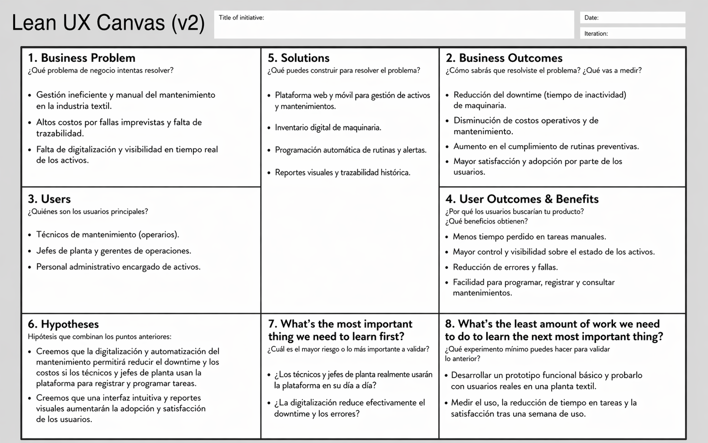

# Universidad Peruana de Ciencias Aplicadas

## Ingeniería de Software

**Ciclo:** 2026 - 01  
**Curso:** Desarrollo de Aplicaciones Open Source  
**NRC:** 20262  
**Docente:** Angel Augusto Velasquez Nuñez 

**Startup:** CodeUp  
**Producto:** TexCheck

| Código      | Nombre                           |
|-------------|----------------------------------|
|  u20241a195 | Diaz Yurivilca, Sofia          |
| U202219199  | Acosta Elera Abraam Bernabe        |
| U202411349  | Diaz Nuñez, Mauricio             |
| U202410421  | Diaz De La Cruz, Sebastian Gabriel |
| U202412462  | Cabrera Sotelo, Camila Celeste     |

**Abril - 2026**

  

---
# Registro de Versiones del Informe

| Versión  | Fecha          | Autor                 | Descripción de modificación |
| :------: | :------------: | :-------------------: | :-------------------------: |
| AV1      | 02 / 04 / 2026 | Todos los integrantes | Primera versión             |

# Project Report Collaboration Insights

---

## **Project Report Online**

### [Capítulo I: Introducción]()
- [1.1. Startup Profile]()
    - [1.1.1 Descripción de la Startup]()
    - [1.1.2 Perfiles de integrantes del equipo]()
- [1.2 Solution Profile]()
    - [1.2.1 Antecedentes y problemática]()
    - [1.2.2 Lean UX Process]()
        - [1.2.2.1. Lean UX Problem Statements]()
        - [1.2.2.2. Lean UX Assumptions]()
        - [1.2.2.3. Lean UX Hypothesis Statements]()
        - [1.2.2.4. Lean UX Canvas]()
- [1.3. Segmentos objetivo]()

### [Capítulo II: Requirements Elicitation & Analysis]()
- [2.1. Competidores]()
    - [2.1.1. Análisis competitivo]()
    - [2.1.2. Estrategias y tácticas frente a competidores]()
- [2.2. Entrevistas]()
    - [2.2.1. Diseño de entrevistas]()
    - [2.2.2. Registro de entrevistas]()
    - [2.2.3. Análisis de entrevistas]()
- [2.3. Needfinding]()
    - [2.3.1. User Personas]()
    - [2.3.2. User Task Matrix]()
    - [2.3.3. User Journey Mapping]()
    - [2.3.4. Empathy Mapping]()
- [2.4. Big Picture Event Storming.]()
- [2.5. Ubiquitous Language]()

### [Capítulo III: Requirements Specification]()
- [3.1. User Stories]()
- [3.2. Impact Mapping]()
- [3.3. Product Backlog]()

### [Capítulo IV: Product Design]()
- [4.1. Style Guidelines]()
    - [4.1.1. General Style Guidelines]()
    - [4.1.2. Web Style Guidelines]()
- [4.2. Information Architecture]()
    - [4.2.1. Organization Systems]()
    - [4.2.2. Labeling Systems]()
    - [4.2.3. SEO Tags and Meta Tags]()
    - [4.2.4. Searching Systems]()
    - [4.2.5. Navigation Systems]()
- [4.3. Landing Page UI Design]()
    - [4.3.1. Landing Page Wireframe]()
    - [4.3.2. Landing Page Mock-up]()
- [4.4. Web Applications UX/UI Design]()
    - [4.4.1. Web Applications Wireframes]()
    - [4.4.2. Web Applications Wireflow Diagrams]()
    - [4.4.3. Web Applications Mock-ups]()
    - [4.4.4. Web Applications User Flow Diagrams]()
- [4.5. Web Applications Prototyping]()
- [4.6. Domain-Driven Software Architecture]()
    - [4.6.1. Design-Level Event Storming]()
    - [4.6.2. Software Architecture Context Diagram]()
    - [4.6.3. Software Architecture Container Diagrams]()
    - [4.6.4. Software Architecture Components Diagrams]()
- [4.7. Software Object-Oriented Design]()
    - [4.7.1. Class Diagrams]()
- [4.8. Database Design]()
    - [4.8.1. Database Diagram]()

### [Capítulo V: Product Implementation, Validation & Deployment]()
- [5.1. Software Configuration Management]()
    - [5.1.1. Software Development Environment Configuration]()
    - [5.1.2. Source Code Management]()
    - [5.1.3. Source Code Style Guide & Conventions]()
    - [5.1.4. Software Deployment Configuration]()
- [5.2. Landing Page, Services & Applications Implementation]()
    - [5.2.1. Sprint 1]()
        - [5.2.1.1. Sprint Planning 1]()
        - [5.2.1.2. Sprint Backlog 1]()
        - [5.2.1.3. Development Evidence for Sprint Review]()
        - [5.2.1.4. Testing Suite Evidence for Sprint Review]()
        - [5.2.1.5. Execution Evidence for Sprint Review]()
        - [5.2.1.6. Services Documentation Evidence for Sprint Review]()
        - [5.2.1.7. Software Deployment Evidence for Sprint Review]()
        - [5.2.1.8. Team Collaboration Insights during Sprint]()

- [Conclusiones y recomendaciones](docs/conclusiones.md)
- [Video About-the-Team](docs/video-about-the-team.md)
- [Bibliografía](docs/bibliografia.md)
- [Anexos](docs/anexos.md)

--- 
# Student Outcome

En esta sección se detallan las actividades realizadas en el trabajo final y el sustento de cómo estas han ayudado a desarrollar las dimensiones del Student Outcome 3 (ABET – EAC), el cual se define como la capacidad de comunicarse efectivamente con un rango de audiencias. La información se presenta a través del siguiente cuadro, donde se especifican las dimensiones de la competencia, las acciones realizadas por cada integrante y las conclusiones generales del equipo.

<table>
  <thead>
    <tr>
      <th>Criterio específico</th>
      <th>Acciones realizadas</th>
      <th>Conclusiones</th>
    </tr>
  </thead>
  <tbody>
    <tr>
      <td>Comunica oralmente con efectividad a diferentes rangos de audiencia.</td>
      <td>
        Acciones realizadas de cada uno aqui...
      </td>
      <td>Conclusiónes aquí...</td>
    </tr>
    <tr>
      <td>Comunica por escrito con efectividad a diferentes rangos de audiencia.</td>
      <td>
        Acciones realizadas de cada uno aqui...
      </td>
      <td>Conclusiónes aquí...</td>
    </tr>
  </tbody>
</table>

---

# Capítulo I: Introducción
## 1.2 Solution Profile

### 1.2.1. Antecedentes y problemática

En la actualidad, la industria textil es uno de los pilares de la manufactura; sin embargo, la gestión de sus activos críticos sigue anclada en métodos tradicionales. Mientras la industria global avanza hacia la digitalización (Industria 4.0), muchas empresas locales aún dependen de registros manuales y procesos reactivos, lo que genera una brecha competitiva y operativa significativa.

**What (¿Qué?):**
El problema identificado es la ineficiencia en la gestión del mantenimiento de maquinaria textil. Existe una carencia de sistemas organizados que permitan programar, ejecutar y supervisar las intervenciones técnicas de forma sistemática. Esto provoca que la información técnica sea fragmentada, poco confiable y difícil de analizar para la mejora de procesos.

**When (¿Cuándo?):**
El problema se manifiesta de forma recurrente, especialmente durante los picos de producción donde la maquinaria es sometida a una carga de trabajo intensiva. La falta de mantenimiento preventivo resulta en fallas imprevistas que detienen líneas enteras de producción.

**Who (¿Quiénes?):**
Los principales afectados son los Jefes de Planta, quienes no logran cumplir con los plazos de entrega por paradas no programadas, y los Técnicos de Mantenimiento, quienes enfrentan una sobrecarga de trabajo correctivo. La empresa sufre pérdidas económicas y daños en su reputación frente a clientes.

**Why (¿Por qué?):**
La causa principal radica en la ausencia de una cultura de mantenimiento predictivo soportada por herramientas digitales. La dependencia de formatos físicos impide identificar patrones de falla, condenando a la empresa a un ciclo reactivo donde solo se actúa cuando el equipo deja de funcionar.

**How (¿Cómo?):**
La solución es TexCheck, una plataforma integral que centraliza la gestión de activos. Permite la creación de un inventario digital, la programación automatizada de tareas mediante checklists estandarizados y la generación de alertas en tiempo real.

**How Much (¿Cuánto?):**
El costo de una gestión ineficiente puede representar pérdidas de entre el 15% y 30% del tiempo de producción anual (Downtime). Una parada de planta no programada en una línea mediana puede generar pérdidas significativas en lucro cesante y costos de reparación de emergencia.

### 1.2.2. Lean UX Process

TexCheck busca transformar la gestión operativa en las plantas textiles, centrando la experiencia en el operario y el jefe de mantenimiento para garantizar que la transición del papel a lo digital sea intuitiva y eficiente. Aplicamos el marco Lean UX para validar hipótesis de diseño rápidamente, asegurando que la solución evolucione a partir de la retroalimentación real del personal técnico y gerencial del sector manufacturero.

#### 1.2.2.1 Lean UX Problem Statements

**Declaración del problema de negocio:**
Hemos observado que la falta de un sistema automatizado de mantenimiento preventivo está causando un incremento del 20% en costos de reparación y paradas imprevistas.

**Declaración del problema de usuario:**
Los técnicos de mantenimiento se ven afectados por la desorganización de órdenes de trabajo manuales, mientras que los jefes de planta carecen de visibilidad en tiempo real sobre el estado de sus activos.

**Meta:**
¿Cómo podemos optimizar la programación de tareas mediante una solución digital para reducir el downtime de las máquinas en un 15% durante los primeros seis meses?

#### 1.2.2.2. Lean UX Assumptions

**Feature: Sistema integral de gestión y monitoreo de mantenimiento textil**

* **Inventario Digital y Hoja de Vida de Activos:** Creemos que nuestros usuarios (jefes de planta y técnicos) necesitan una forma centralizada y digital de registrar la información técnica de cada máquina. Esto permitirá eliminar la dispersión de datos en papel y facilitará un seguimiento histórico preciso para cada activo.
* **Monitoreo de Rutinas mediante Checklists Digitales:** Creemos que la implementación de listas de verificación digitales en dispositivos móviles permitirá estandarizar las inspecciones preventivas. Esto facilitará que los técnicos sigan los protocolos de seguridad y mantenimiento sin omisiones, impactando positivamente en la disponibilidad de la maquinaria.
* **Alertas Automáticas y Notificaciones de Mantenimiento:** Creemos que los usuarios se beneficiarán al recibir alertas automáticas basadas en calendarios programados o uso de máquina. Esta integración permitirá realizar intervenciones oportunas antes de que ocurran fallas críticas, optimizando los tiempos de respuesta del equipo técnico.
* **Dashboard de Indicadores y Análisis de Fallas:** Creemos que disponer de un registro histórico y estadísticas de mantenimiento (KPIs como MTBF o MTTR) ayudará a la gerencia a identificar patrones de falla y cuellos de botella, promoviendo una cultura de mantenimiento predictivo.

**Business Outcomes**

* Se maximizará la continuidad operativa de la planta y se reducirán las pérdidas económicas por paradas no programadas (downtime).
* Se generarán ingresos mediante un modelo de suscripción SaaS para empresas textiles y servicios de consultoría en optimización de procesos.
* TexCheck se posicionará como la herramienta líder en digitalización para la industria manufacturera textil, mejorando la competitividad del sector.

**Users**

* **Jefes de Planta y Gerentes de Operaciones:** Buscan optimizar la rentabilidad y el control de sus activos industriales.
* **Técnicos de Mantenimiento:** Requieren herramientas móviles para agilizar sus reportes y acceder a información técnica en el campo.
* **Personal de Calidad:** Audita el cumplimiento de normativas y estándares de seguridad industrial.

**User Outcomes**

* Reducir el error humano y la carga administrativa al eliminar el llenado manual de formatos físicos.
* Acceder de forma inmediata a la "hoja de vida" y manuales de cada máquina mediante el escaneo de códigos QR.
* Visualizar métricas de rendimiento en tiempo real para facilitar la planificación semanal y mensual.

**Features**

* **Módulo de Activos:** Registro detallado de maquinaria con códigos QR únicos.
* **Checklists Digitales:** Formularios móviles para inspecciones preventivas y correctivas.
* **Sistema de Alertas:** Notificaciones push y correos para mantenimientos vencidos o críticos.
* **Panel de Control (Dashboard):** Visualización de métricas de disponibilidad y fallas recurrentes.
* **Historial Técnico:** Almacenamiento centralizado de todas las intervenciones realizadas.

#### 1.2.2.3. Lean UX Hypothesis Statements

**Hypothesis Statement 01**

* **Creemos** que la implementación de un inventario digital con códigos QR permitirá a los técnicos acceder y registrar intervenciones de forma más ágil que el sistema manual actual.
* **Sabemos** que la hipótesis se confirma cuando se observe una reducción en el tiempo promedio de registro de incidencias reportado por el personal de planta.
* **Cuando** al menos el 70% de los reportes técnicos se realicen directamente desde la aplicación móvil durante el primer mes de despliegue.

**Hypothesis Statement 02**

* **Creemos** que al ofrecer checklists estandarizados y alertas automáticas, el cumplimiento de las rutinas de mantenimiento preventivo será más estricto y efectivo.
* **Sabemos** que la hipótesis es correcta cuando el registro de tareas preventivas completadas aumente y se registre una disminución en las solicitudes de mantenimiento correctivo de emergencia.
* **Cuando** se logre un incremento del 30% en el cumplimiento del plan anual de mantenimiento preventivo en el primer semestre de uso.

**Hypothesis Statement 03**

* **Creemos** que la visualización de indicadores (KPIs) en un dashboard interactivo motivará a los jefes de planta a tomar decisiones basadas en datos para la renovación o mejora de maquinaria.
* **Sabemos** que esto es cierto cuando los gerentes utilicen activamente los reportes de TexCheck para sustentar sus planes de inversión o cambios de procesos operativos.
* **Cuando** el uso de la plataforma genere datos que permitan reducir el tiempo de inactividad de las máquinas (downtime) en un 15% anual.

---

#### 1.2.2.4. Lean UX Canvas

El Lean UX Canvas es una de las herramientas fundamentales que hemos utilizado para comprender a nuestros posibles usuarios y sus necesidades. Esta herramienta es ampliamente empleada en el campo del diseño centrado en el usuario y la metodología Lean, con la intención de desarrollar productos de forma eficiente y práctica. Asimismo, facilita la colaboración de equipos multidisciplinarios de forma ordenada dentro de un marco estructurado, asegurando que cada funcionalidad aporte valor real al negocio y al cliente.

  

## 1.3. Segmentos objetivo

### 1) Personal Técnico de Mantenimiento (Perfil Operativo)

* **Definición del segmento:** Técnicos especialistas (20–45 años) responsables de la ejecución directa del mantenimiento en planta.
* **Determinantes y motivaciones:** Eficiencia en la ejecución, reducción de errores y digitalización de reportes diarios.
* **Necesidades y tareas (JTBD):** Registrar intervenciones rápido, seguir checklists estandarizados y acceder a manuales técnicos en el móvil.
* **Fricciones:** Exceso de burocracia en papel y comunicación lenta ante fallas críticas.
* **Criterios de elección:** Interfaz intuitiva para entornos industriales y notificaciones de tareas pendientes.
* **Situaciones de uso:** Inspecciones diarias, detección de anomalías y cambios de turno.
* **Mensajes clave:** "Digitaliza tu mantenimiento y optimiza tu tiempo en planta."

### 2) Jefes de Planta y Gerentes de Operaciones (Perfil Estratégico)

* **Definición del segmento:** Ingenieros y gestores (30–55 años) responsables de la rentabilidad y planificación de la producción.
* **Determinantes y motivaciones:** Maximizar la vida útil de maquinaria y reducción de costos operativos.
* **Necesidades y tareas (JTBD):** Programar ciclos preventivos automáticamente y visualizar indicadores (KPIs) en tiempo real.
* **Fricciones:** Incertidumbre sobre el estado de activos y falta de trazabilidad en las intervenciones.
* **Criterios de elección:** Dashboard centralizado, escalabilidad de la plataforma y reportes automáticos.
* **Situaciones de uso:** Planificación semanal, auditorías de calidad y análisis de resultados.
* **Mensajes clave:** "Toma el control estratégico de tu planta con datos en tiempo real."

## 1.3. Segmentos objetivo.

---

# Capítulo II: Requirements Elicitation & Analysis
## 2.1. Competidores.
### 2.1.1. Análisis competitivo.
### 2.1.2. Estrategias y tácticas frente a competidores.
## 2.2. Entrevistas.
### 2.2.1. Diseño de entrevistas.
### 2.2.2. Registro de entrevistas.
### 2.2.3. Análisis de entrevistas.
## 2.3. Needfinding.
### 2.3.1. User Personas.
### 2.3.2. User Task Matrix.
### 2.3.3. User Journey Mapping.
### 2.3.4. Empathy Mapping.
## 2.4. Big Picture Event Storming.
## 2.5. Ubiquitous Language.

---

# Capítulo III: Requirements Specification
## 3.1. User Stories.
## 3.2. Impact Mapping
## 3.3. Product Backlog.

---

# Capítulo IV: Product Design
## 4.1. Style Guidelines.
### 4.1.1. General Style Guidelines.
### 4.1.2. Web Style Guidelines.
## 4.2. Information Architecture.
### 4.2.1. Organization Systems.
### 4.2.2. Labeling Systems.
### 4.2.3. SEO Tags and Meta Tags
### 4.2.4. Searching Systems.
### 4.2.5. Navigation Systems.
## 4.3. Landing Page UI Design.
### 4.3.1. Landing Page Wireframe.
### 4.3.2. Landing Page Mock-up.
## 4.4. Web Applications UX/UI Design.
### 4.4.1. Web Applications Wireframes.
### 4.4.2. Web Applications Wireflow Diagrams.
### 4.4.2. Web Applications Mock-ups.
### 4.4.3. Web Applications User Flow Diagrams.
## 4.5. Web Applications Prototyping.
## 4.6. Domain-Driven Software Architecture.
### 4.6.1. Design-Level Event Storming.
### 4.6.2. Software Architecture Context Diagram.
### 4.6.3. Software Architecture Container Diagrams.
### 4.6.4. Software Architecture Components Diagrams.
## 4.7. Software Object-Oriented Design.
### 4.7.1. Class Diagrams.
## 4.8. Database Design.
### 4.8.1. Database Diagrams.

--- 

# Capítulo V: Product Implementation, Validation & Deployment.
## 5.1. Software Configuration Management.
### 5.1.1. Software Development Environment Configuration.
### 5.1.2. Source Code Management.
### 5.1.3. Source Code Style Guide & Conventions.
### 5.1.4. Software Deployment Configuration.
## 5.2. Landing Page, Services & Applications Implementation.
### 5.2.1. Sprint 1
#### 5.2.1.1. Sprint Planning 1.
#### 5.2.1.2. Aspect Leaders and Collaborators.
#### 5.2.1.3. Sprint Backlog 1.
#### 5.2.1.4. Development Evidence for Sprint Review.
#### 5.2.1.5. Execution Evidence for Sprint Review.
#### 5.2.1.6. Services Documentation Evidence for Sprint Review.
#### 5.2.1.7. Software Deployment Evidence for Sprint Review.
#### 5.2.1.8. Team Collaboration Insights during Sprint.

# Conclusiones

---

# Bibliografía

---

# Anexos
